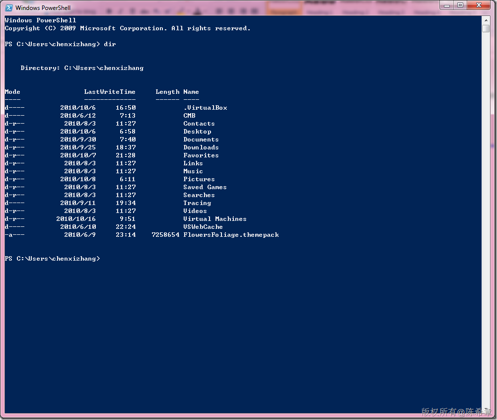
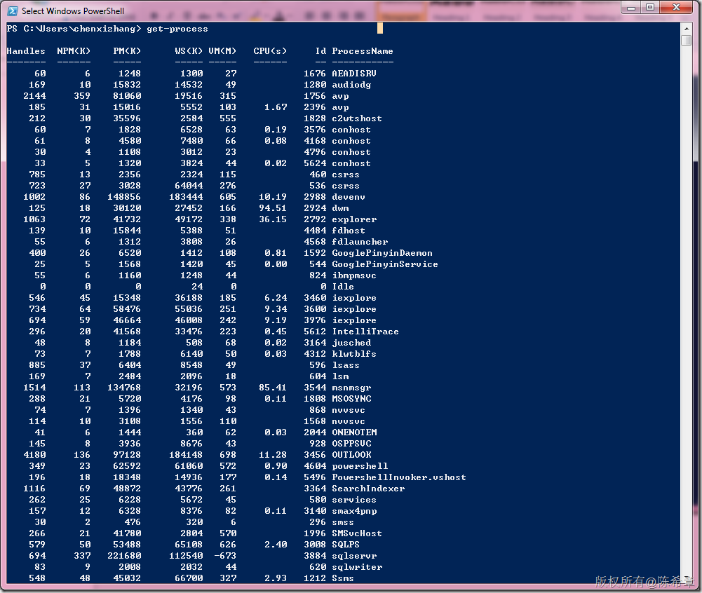
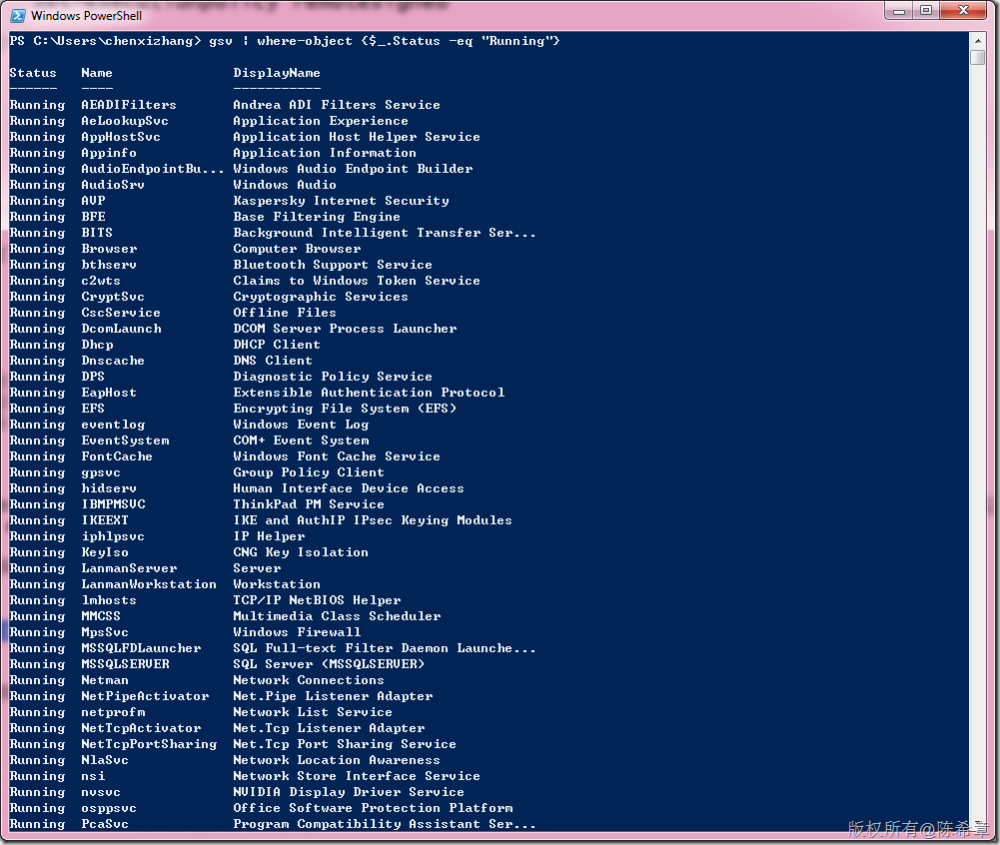
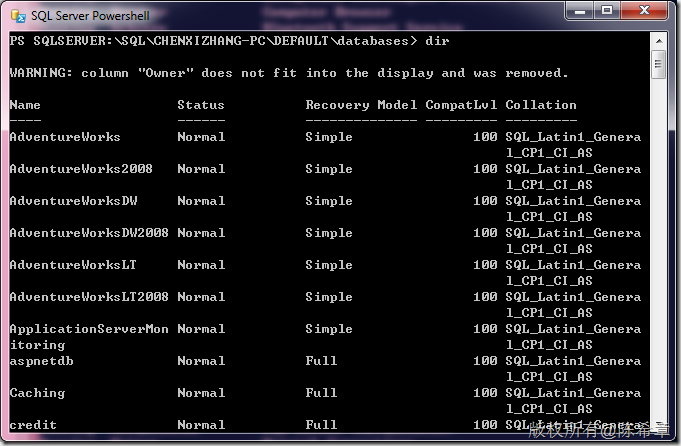
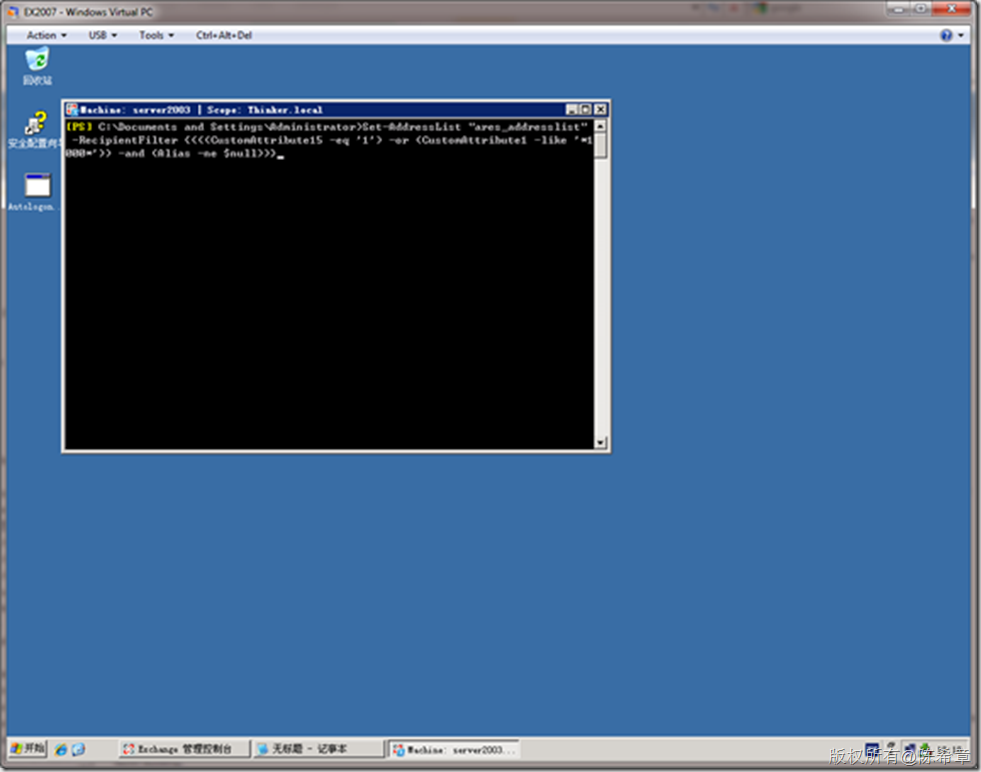
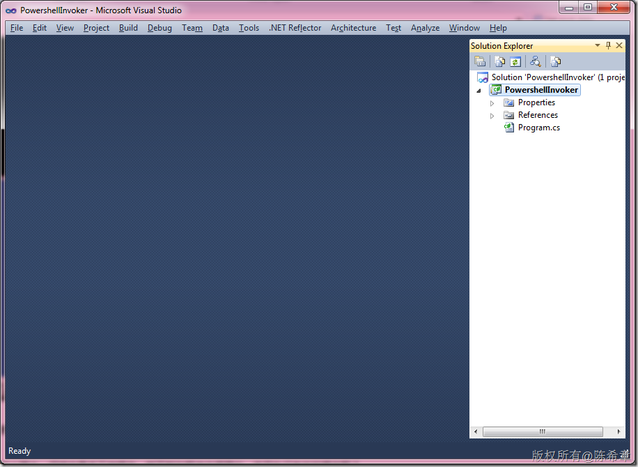
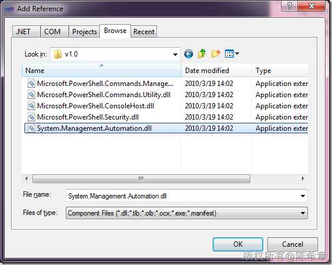
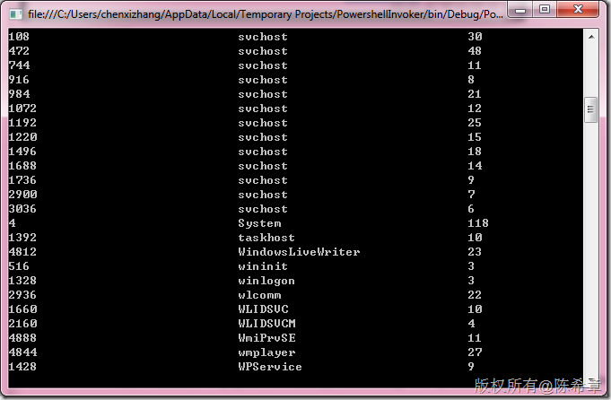

# Powershell简介及其编程访问 
> 原文发表于 2010-10-16, 地址: http://www.cnblogs.com/chenxizhang/archive/2010/10/16/1852961.html 


Powershell是下一代的命令行外壳程序，较之于它的前身（cmd.exe)，它的功能更加强大，也更加易用。最根本的区别在于它是基于对象的操作（基于.NET Framework)，而不是基于字符串的操作。

 这个工具可以单独使用，完全可以取代cmd.exe。例如如下

 [](http://images.cnblogs.com/cnblogs_com/chenxizhang/Windows-Live-Writer/CPowershell_9A8B/image_2.png)

  

 但它的功能远不止于此，例如我们可以很容易地获取所有的进程名称

 [](http://images.cnblogs.com/cnblogs_com/chenxizhang/Windows-Live-Writer/CPowershell_9A8B/image_8.png)

  

 再来看一个，下面这个例子是获取当前正在运行的服务列表。（可以用条件很方便地筛选）

 [](http://images.cnblogs.com/cnblogs_com/chenxizhang/Windows-Live-Writer/CPowershell_9A8B/image_10.png)

  

 除此之外，Powershell还支持定制，例如微软很多产品都提供了专门的Powershell插件（典型的有：SQL Server，SharePoint Server, Exchange Server等）

 通过这些特殊的外壳，可以实现对服务器的管理。功能非常强大。例如下面的SQLPS，可以像查看文件夹那样查看数据库

 [](http://images.cnblogs.com/cnblogs_com/chenxizhang/Windows-Live-Writer/CPowershell_9A8B/image_12.png)

  

 再例如下图的EMS(Exchange Managment Shell)，可以对一个地址列表进行修改

 [](http://images.cnblogs.com/cnblogs_com/chenxizhang/Windows-Live-Writer/CPowershell_9A8B/image_14.png)

  

 看起来还不错吧，关于Powershell的更多细节，大家有兴趣的话，可以参考微软有关的文档。

  

 接下来谈另外一个话题，Powershell这么强大，但终究是手工地操作，能不能在程序中调用它，并且执行有关的操作呢？

 答案是：可以的。

  

 下面我们来看一个小的例子

 [](http://images.cnblogs.com/cnblogs_com/chenxizhang/Windows-Live-Writer/CPowershell_9A8B/image_16.png)

 添加一个引用。这个程序集在C:\Program Files (x86)\Reference Assemblies\Microsoft\WindowsPowerShell\v1.0目录中

 [](http://images.cnblogs.com/cnblogs_com/chenxizhang/Windows-Live-Writer/CPowershell_9A8B/image_18.png)

 编写如下简单的代码


```
using System;
using System.Collections.Generic;
using System.Linq;
using System.Text;

using System.Management.Automation;
using System.Management.Automation.Runspaces;
using System.Diagnostics;

namespace PowershellInvoker
{
    class Program
    {
        static void Main(string[] args)
        {
            var runspace = RunspaceFactory.CreateRunspace();
            runspace.Open();

            var piple = runspace.CreatePipeline("Get-Process");
            var result = piple.Invoke().Select(p => p.BaseObject).Cast<Process>();

            foreach (var item in result)
            {
                Console.WriteLine("{0}\t{1}\t{2}",
                    item.Id.ToString().PadRight(30),
                    item.ProcessName.PadRight(30),
                    item.Threads.Count);


            }

            Console.Read();
        }
    }
}

```

.csharpcode, .csharpcode pre
{
 font-size: small;
 color: black;
 font-family: consolas, "Courier New", courier, monospace;
 background-color: #ffffff;
 /*white-space: pre;*/
}
.csharpcode pre { margin: 0em; }
.csharpcode .rem { color: #008000; }
.csharpcode .kwrd { color: #0000ff; }
.csharpcode .str { color: #006080; }
.csharpcode .op { color: #0000c0; }
.csharpcode .preproc { color: #cc6633; }
.csharpcode .asp { background-color: #ffff00; }
.csharpcode .html { color: #800000; }
.csharpcode .attr { color: #ff0000; }
.csharpcode .alt 
{
 background-color: #f4f4f4;
 width: 100%;
 margin: 0em;
}
.csharpcode .lnum { color: #606060; }

[](http://images.cnblogs.com/cnblogs_com/chenxizhang/Windows-Live-Writer/CPowershell_9A8B/image_20.png)


是的，Powershell据是基于.NET Framework的对象操作


 


**so， what are you think about that?**

