# 【SSAS】Model-First Cube 设计的最佳实践 
> 原文发表于 2011-06-09, 地址: http://www.cnblogs.com/chenxizhang/archive/2011/06/09/2076718.html 

【备注】这是最近在一个讲座中的例子，整理出来给大家参考

  

 相关名词解释

 SSAS: SQL Server Analysis Service。
==================================

 这是微软SQL Server BI（商务智能）平台的一个核心组件，它可以基于UDM（统一维度模型）构建多维数据集和挖掘模型，支持OLAP（在线分析）和Data Mining(数据挖掘）

 [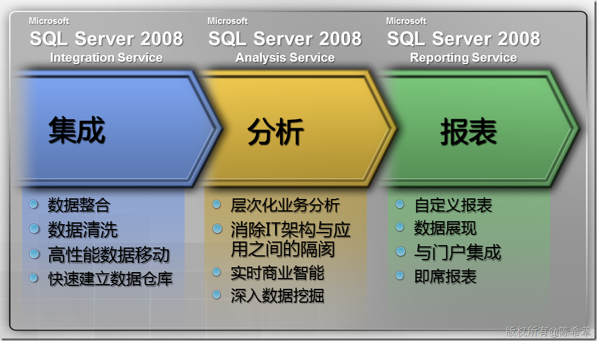](http://images.cnblogs.com/cnblogs_com/chenxizhang/201106/201106091810389103.png)

 Cube: 多维数据集
===========

 这是SSAS项目设计的一个核心目的，创建多维数据集，以便支持OLAP分析。对于Cube而言，不再有行和列的概念，取而代之的是，维度和度量值（以及度量值组）

  

 Model-First： 模型先行
=================

 这是SSAS从2005这个版本开始支持的一个新特性，也可以说是一个设计Cube的策略。Model-First指的是，在没有数据仓库的情况下，先设计模型（维度和度量值，以及他们之间的关系），然后可以根据这个模型，反向生成数据仓库。

 与该策略对应的另外一个策略是：Database-First（数据库先行），也就是说，在设计Cube之前，现有一个完整的数据仓库，该策略是指根据数据仓库的结构生成Cube。

 这两种策略各有优缺点。Database-first较为简单，能够很快生成Cube，快速验证和开始工作。而Model-First则更加适合于现实的工作中，因为很多时候，我们在做BI项目的时候，可能数据仓库是并不存在的。而且过早地关注数据仓库的物理设计，也不是一个非常好的方案。我们应该是先关注分析需求，并且将这些需求转换为我们的模型。

  

 这一篇文章用一个例子演示了如何使用Model-First策略设计Cube，并且反向工程生成数据仓库。

 1.新建一个SSAS项目
------------

 [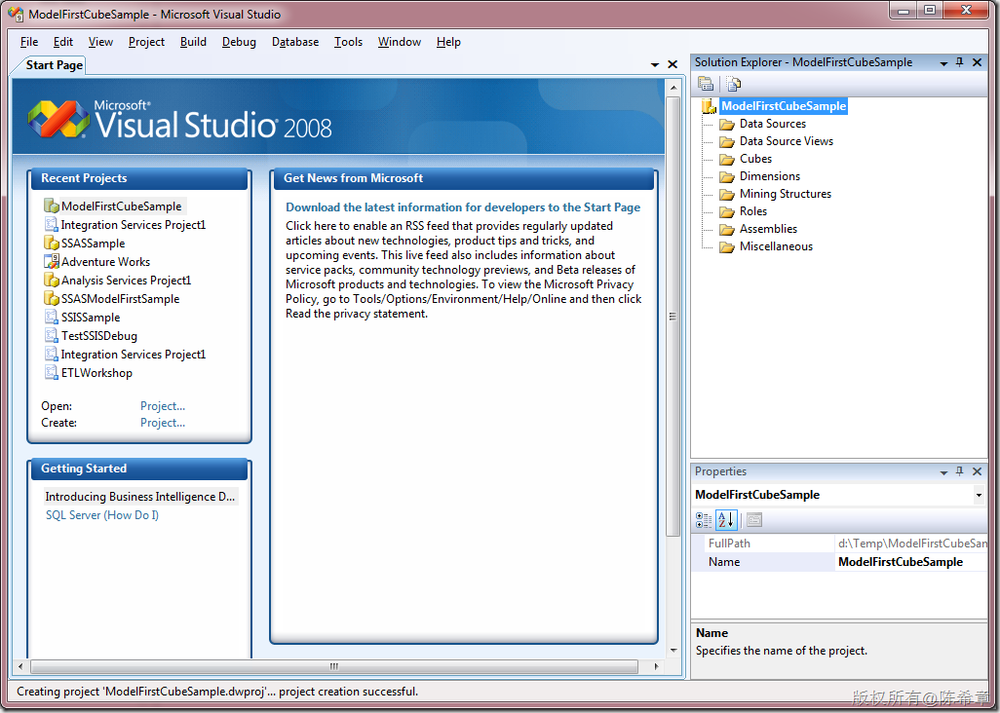](http://images.cnblogs.com/cnblogs_com/chenxizhang/201106/201106091810403204.png)

 2.启动新建Cube向导（在Cubes文件夹处，右键）
---------------------------

 [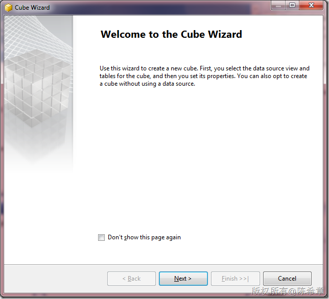](http://images.cnblogs.com/cnblogs_com/chenxizhang/201106/201106091810428909.png)

 选择Creation Method，“ Create an empty cube”。注意，这里也可以根据模板创建。这两种都属于是Model-First的方式

 [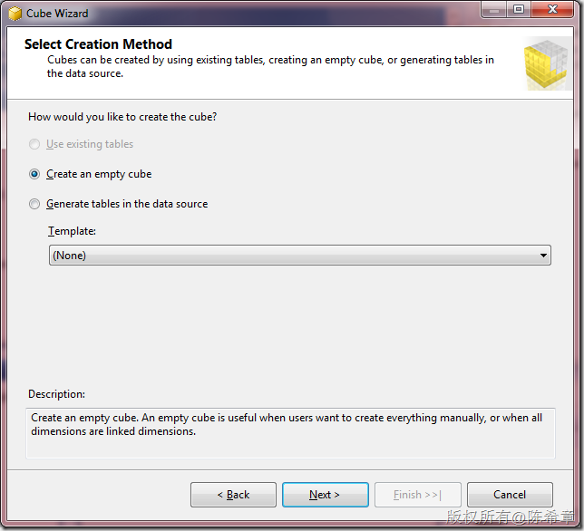](http://images.cnblogs.com/cnblogs_com/chenxizhang/201106/201106091810438452.png)

 由于目前没有数据库，所以下图中只能选择“None”

 [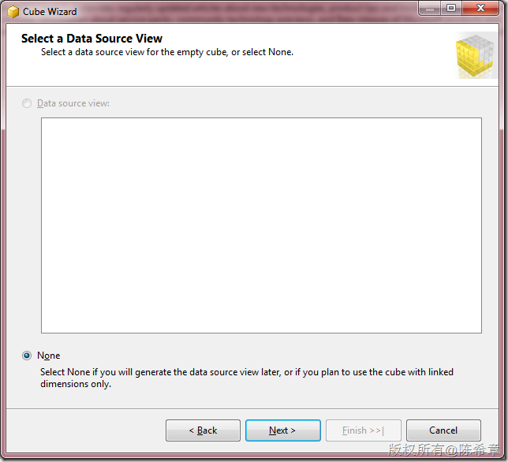](http://images.cnblogs.com/cnblogs_com/chenxizhang/201106/201106091810441059.png)

 接下来给Cube命名，完成操作

 [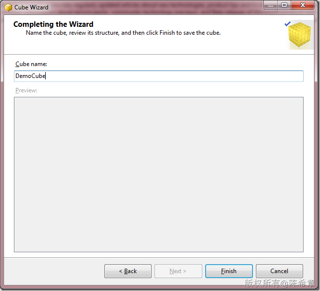](http://images.cnblogs.com/cnblogs_com/chenxizhang/201106/201106091810449730.png)

 [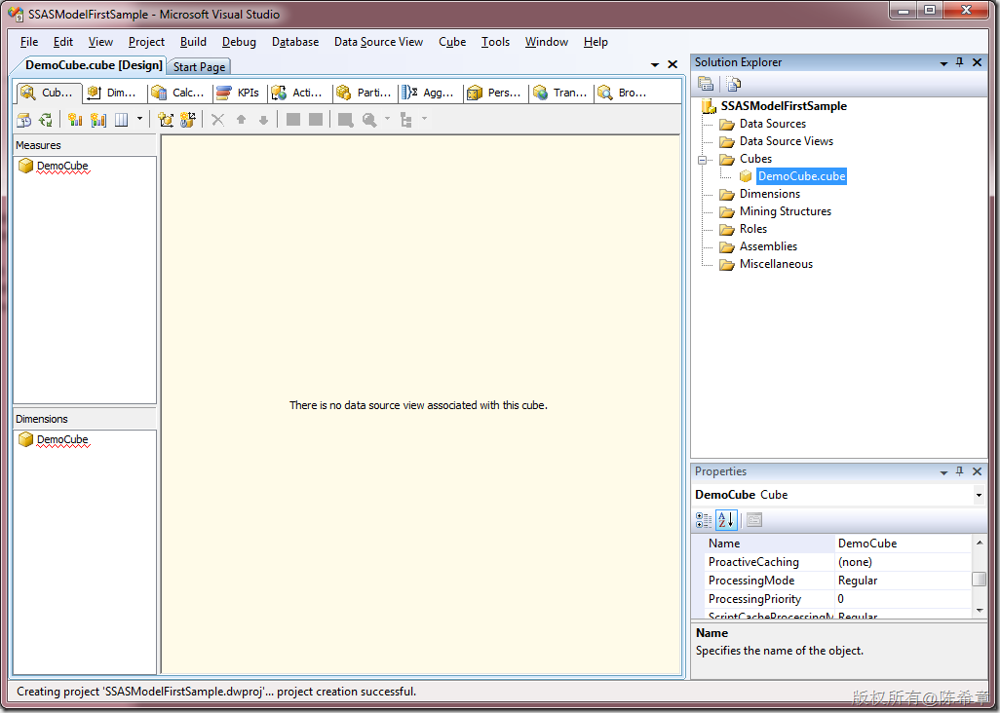](http://images.cnblogs.com/cnblogs_com/chenxizhang/201106/201106091810452861.png)

 3.创建度量值
-------

 度量值指的是我们在Cube里面需要进行分析的一些基础指标。本例中，我们假设要分析一个销售业务，有两个度量值，销售额和数量。

 首先，创建一个度量值组（Measure Group)，它是用来组织度量值的

 [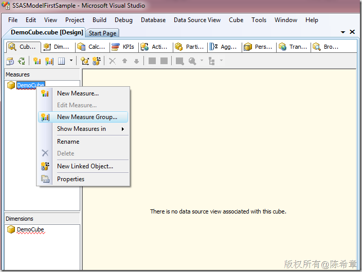](http://images.cnblogs.com/cnblogs_com/chenxizhang/201106/201106091810461847.png)

 将度量值组命名为Sales，并且继续创建两个度量值，SalesAmount和Quantity

 [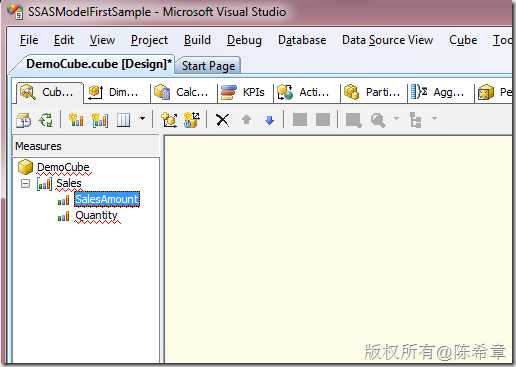](http://images.cnblogs.com/cnblogs_com/chenxizhang/201106/20110609181046277.png)

 4.创建并编辑维度
---------

 维度代表了我们在Cube中分析业务的角度。本例中，我们创建两个维度，时间维度和客户维度

 [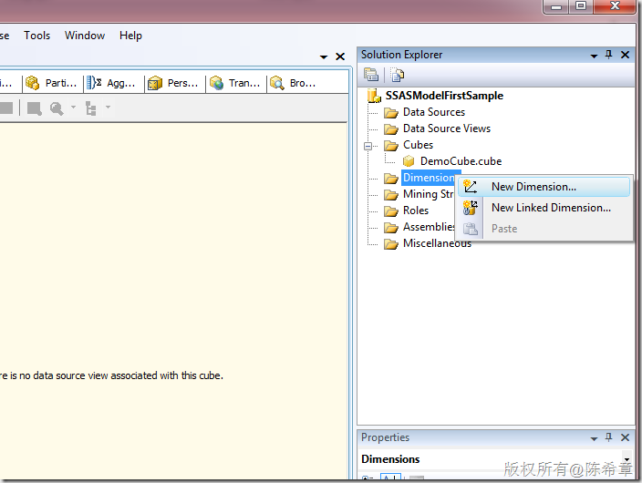](http://images.cnblogs.com/cnblogs_com/chenxizhang/201106/20110609181047343.png)

 首先，创建时间维度（注意，时间维度是一个很特殊的维度，有专门的向导）

 [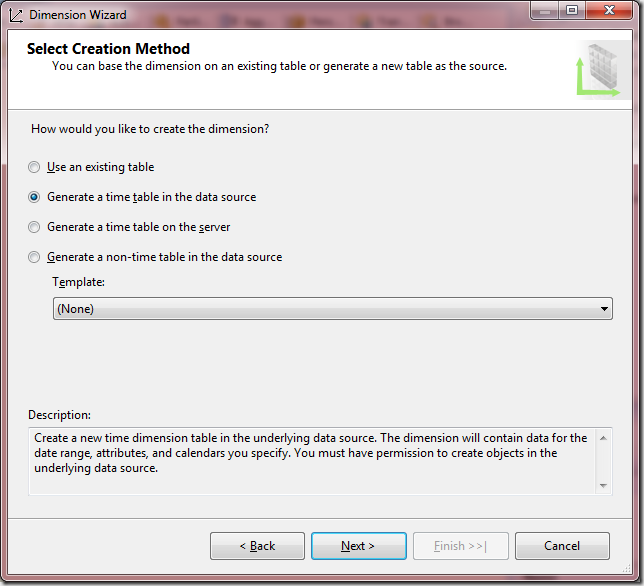](http://images.cnblogs.com/cnblogs_com/chenxizhang/201106/2011060918104893.png)

 定义时间段以及我们关注的时间信息。这个时间段将决定后续生成数据的范围。

 [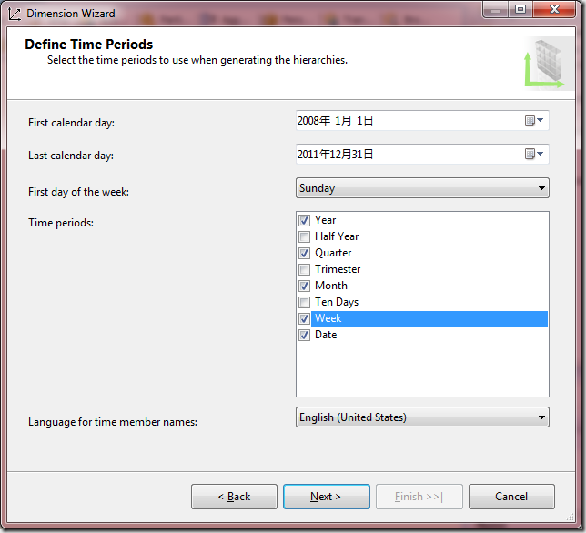](http://images.cnblogs.com/cnblogs_com/chenxizhang/201106/201106091810496048.png)

 我们甚至还可以定义多个日历

 [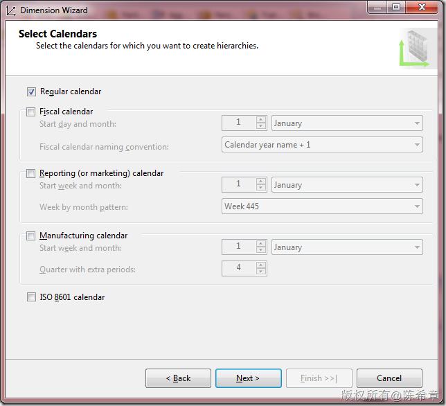](http://images.cnblogs.com/cnblogs_com/chenxizhang/201106/201106091810494718.png)

 [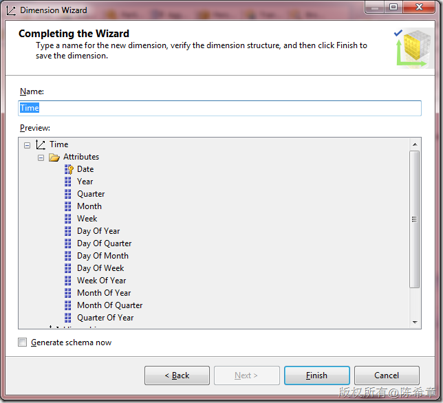](http://images.cnblogs.com/cnblogs_com/chenxizhang/201106/201106091810505341.png)

 [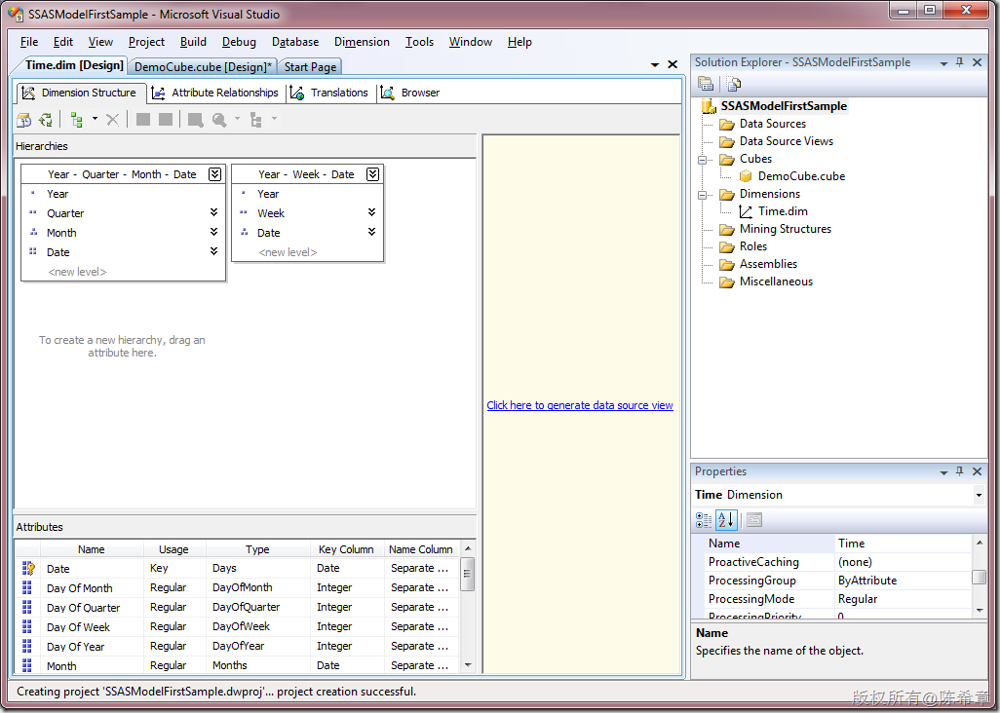](http://images.cnblogs.com/cnblogs_com/chenxizhang/201106/201106091810517392.png)

 接下来，我们创建一个客户维度.与时间维度不同的是，客户维度一般需要我们自己定义。

 [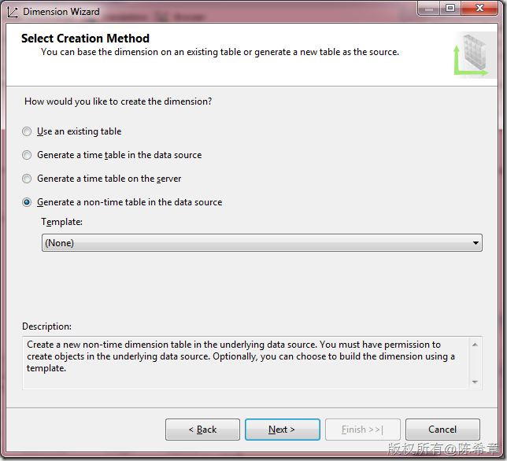](http://images.cnblogs.com/cnblogs_com/chenxizhang/201106/201106091810526967.png)

 【注意】这里也可以使用模板，但为了演示如何设计维度，我不用模板

 [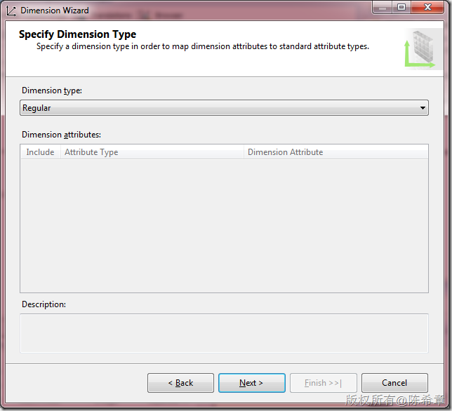](http://images.cnblogs.com/cnblogs_com/chenxizhang/201106/20110609181053621.png)

 [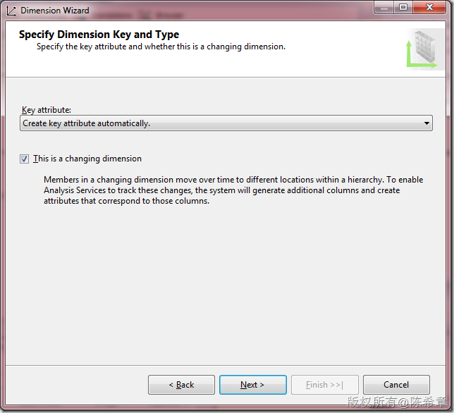](http://images.cnblogs.com/cnblogs_com/chenxizhang/201106/201106091810546576.png)

 [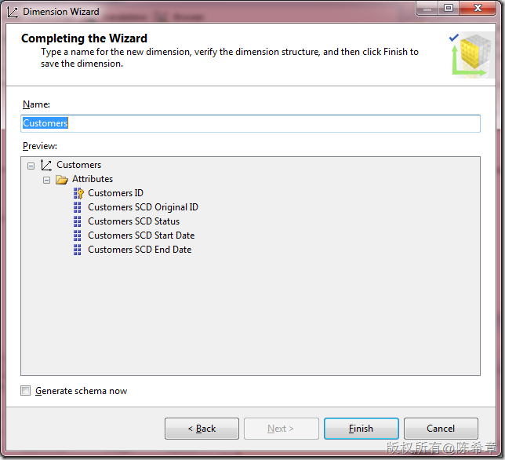](http://images.cnblogs.com/cnblogs_com/chenxizhang/201106/201106091810541102.png)

 【注意】这里所谓的SCD，指的是渐变维度。该内容的讨论超出了本文的范围，有兴趣的朋友请参考联机丛书或者我其他的文章。

 [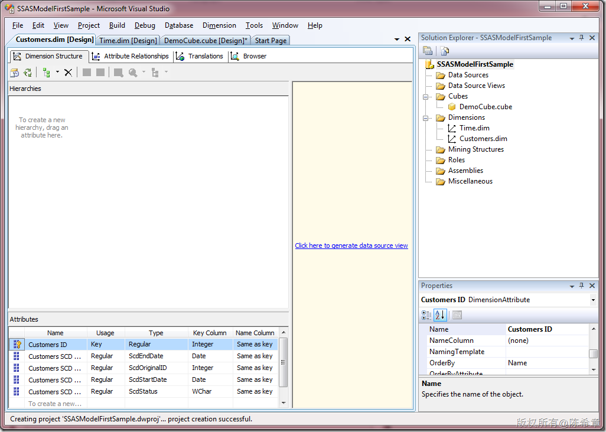](http://images.cnblogs.com/cnblogs_com/chenxizhang/201106/201106091810552837.png)

 通过上面的步骤，我们已经创建了一个维度，我们还需要为该维度添加一些属性（Attribute），例如本例中，我们添加“国家”，“地区”，“城市”，“性别”四个属性，以便利用它们进行分析。

 [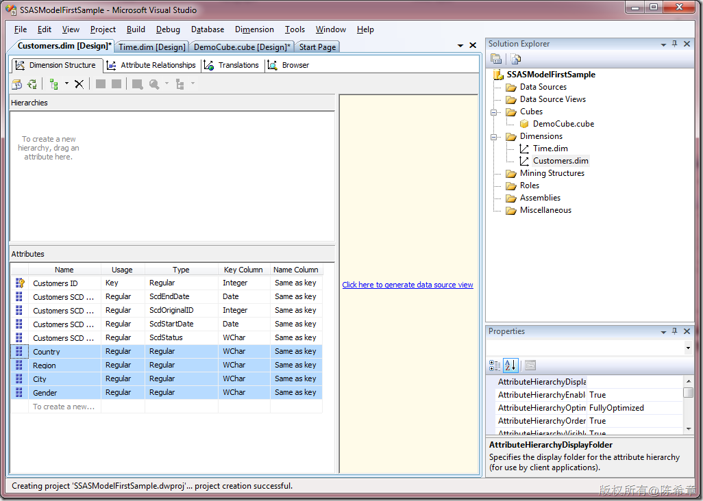](http://images.cnblogs.com/cnblogs_com/chenxizhang/201106/20110609181057527.png)

 【注意】这里应该还需要创建层次（Hierarchies)，以便提供性能。限于篇幅，本文不做这个步骤

  

 5.将维度与Cube关联
------------

 维度建立好之后，需要将它与Cube进行关联。我们可以先回到Cube Design界面

 [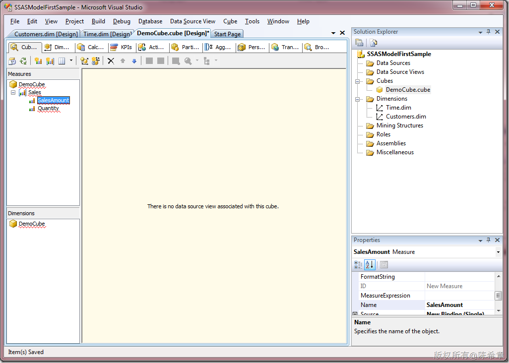](http://images.cnblogs.com/cnblogs_com/chenxizhang/201106/201106091810585119.png)

 在左下角的方块区域，可以添加维度

 [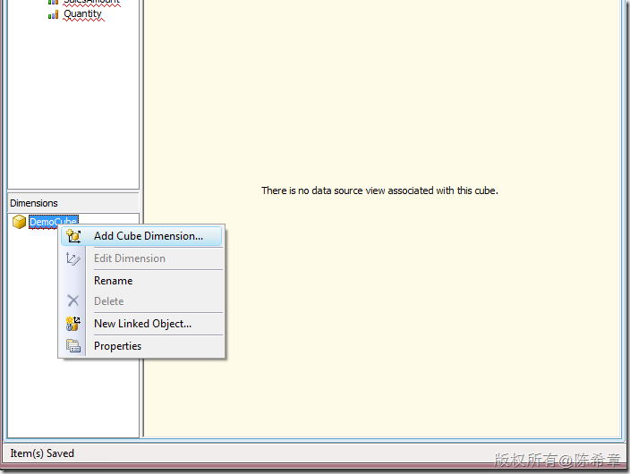](http://images.cnblogs.com/cnblogs_com/chenxizhang/201106/20110609181059235.png)

 [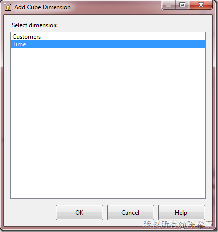](http://images.cnblogs.com/cnblogs_com/chenxizhang/201106/201106091811006713.png)

 将两个维度都添加进来

 [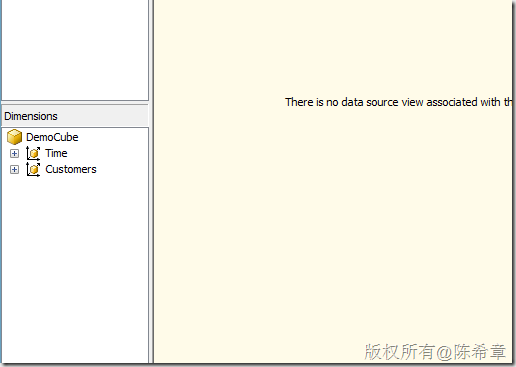](http://images.cnblogs.com/cnblogs_com/chenxizhang/201106/201106091811006746.png)

 光这样做还是不够的，我们需要设置维度与度量值的关系。切换到Dimension Usage界面

 [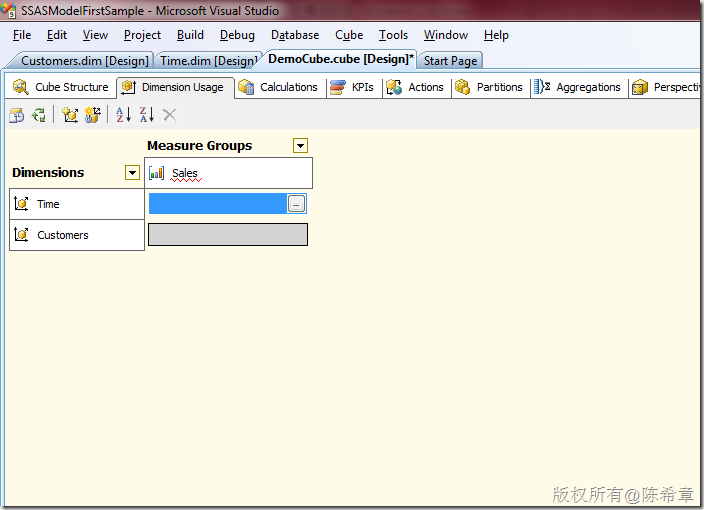](http://images.cnblogs.com/cnblogs_com/chenxizhang/201106/201106091811016463.png)

 点击每个维度右侧那个小按钮，设置关系为”Regular” ，下图是时间维度

 

 下图是客户维度

 [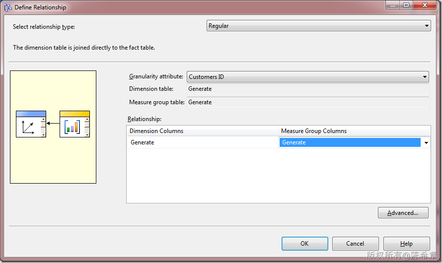](http://images.cnblogs.com/cnblogs_com/chenxizhang/201106/201106091811015973.png)

 6.生成数据库
-------

 到上面这样，我们就完成了Cube的设计(当然，我们只是做了最简单的一个范例），那么如何根据这个设计，生成我们需要的数据仓库呢

 首先，在SQL Server中创建一个空的数据库，例如

 [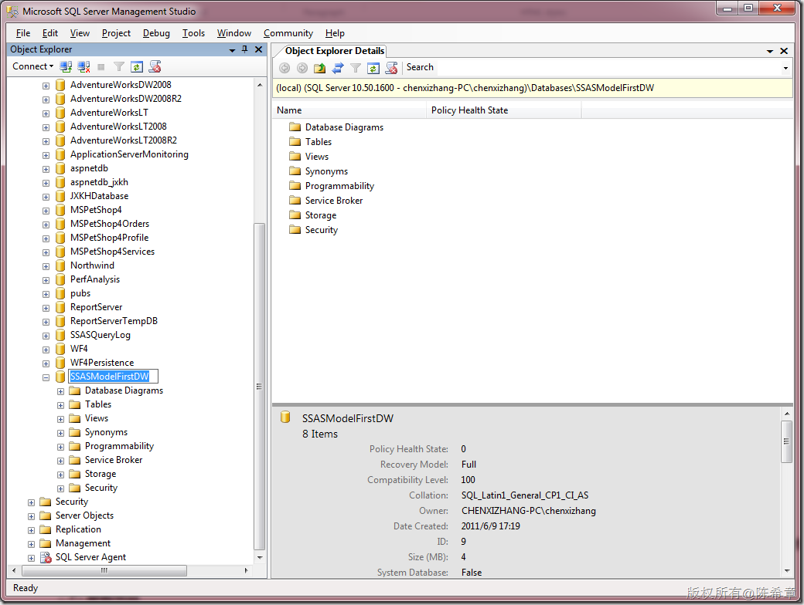](http://images.cnblogs.com/cnblogs_com/chenxizhang/201106/201106091811033663.png)

 然后，回到BI Studio中来，在顶部菜单中选择“Database”==>”Generate Relational Schema”

 [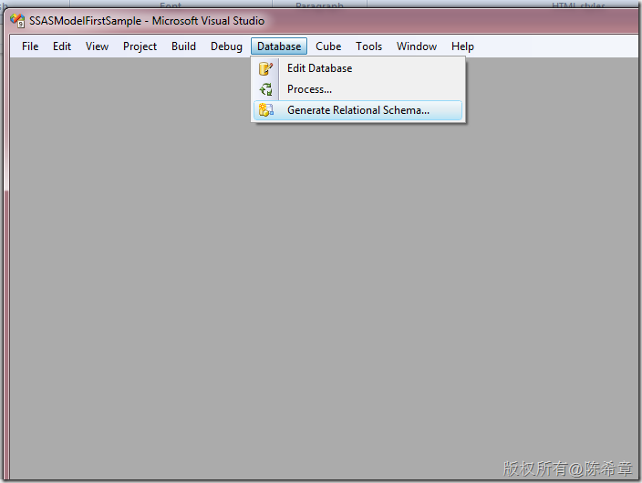](http://images.cnblogs.com/cnblogs_com/chenxizhang/201106/201106091811046270.png)

 [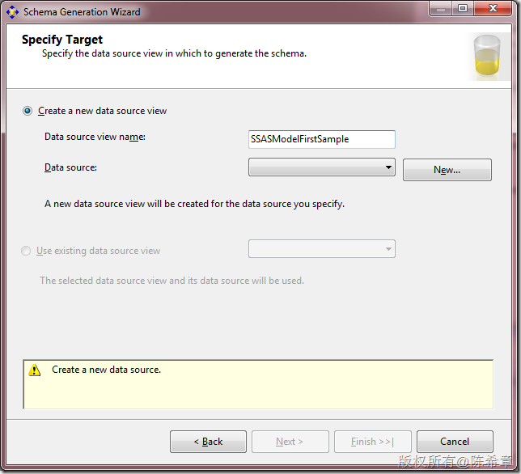](http://images.cnblogs.com/cnblogs_com/chenxizhang/201106/201106091811042715.png)

 点击“New…”来创建一个新的数据源

 [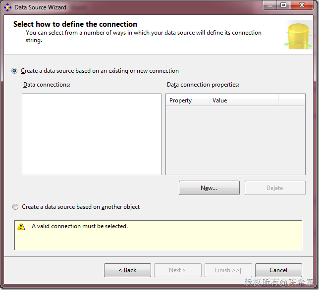](http://images.cnblogs.com/cnblogs_com/chenxizhang/201106/201106091811051942.png)

 再次点击“New…”，指定我们的服务器和数据库

 [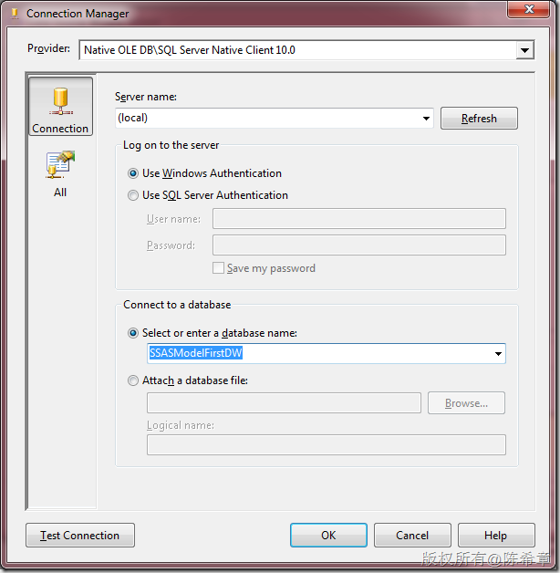](http://images.cnblogs.com/cnblogs_com/chenxizhang/201106/201106091811063993.png)

 [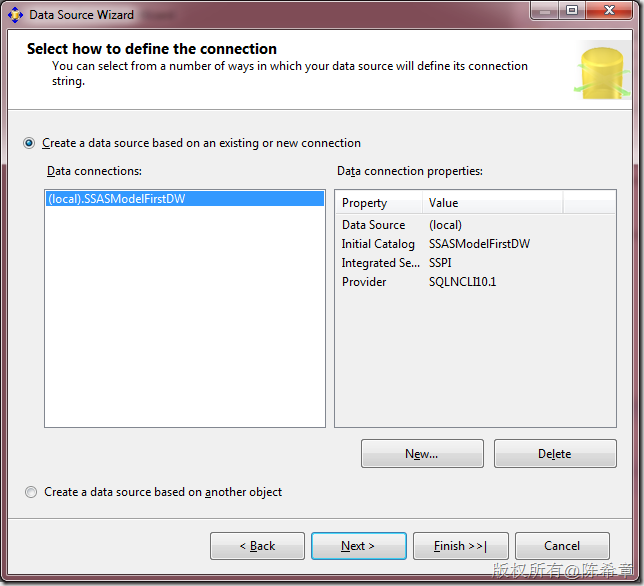](http://images.cnblogs.com/cnblogs_com/chenxizhang/201106/201106091811075521.png)

 点击“Next”

 [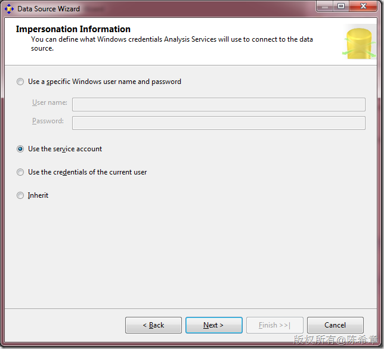](http://images.cnblogs.com/cnblogs_com/chenxizhang/201106/201106091811085030.png)

 【注意】这里选择“Use the service account”

 [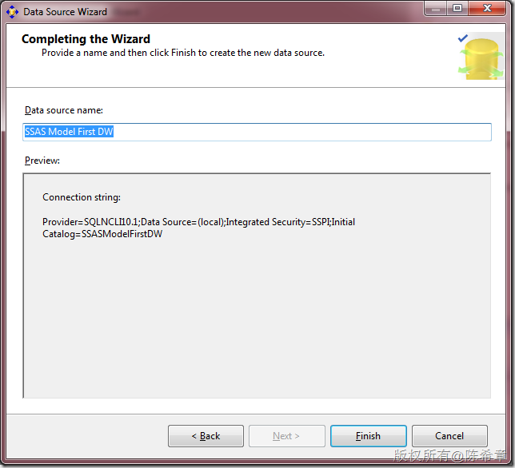](http://images.cnblogs.com/cnblogs_com/chenxizhang/201106/201106091811082588.png)

 点击“Finish”

 [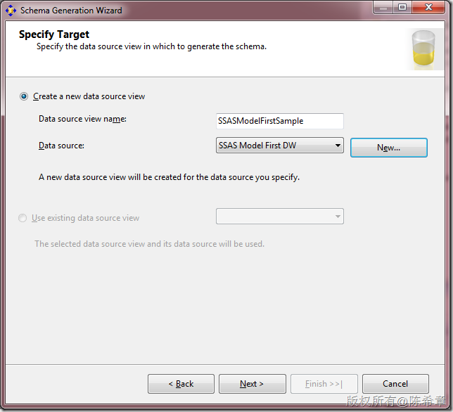](http://images.cnblogs.com/cnblogs_com/chenxizhang/201106/201106091811096799.png)

 点击“Next”

 [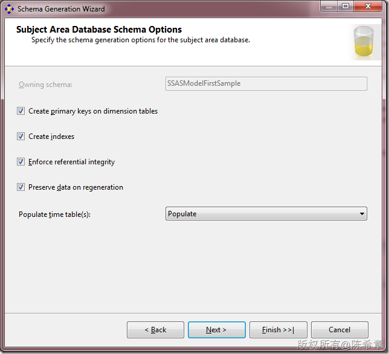](http://images.cnblogs.com/cnblogs_com/chenxizhang/201106/201106091811108260.png)

 点击“Next”

 [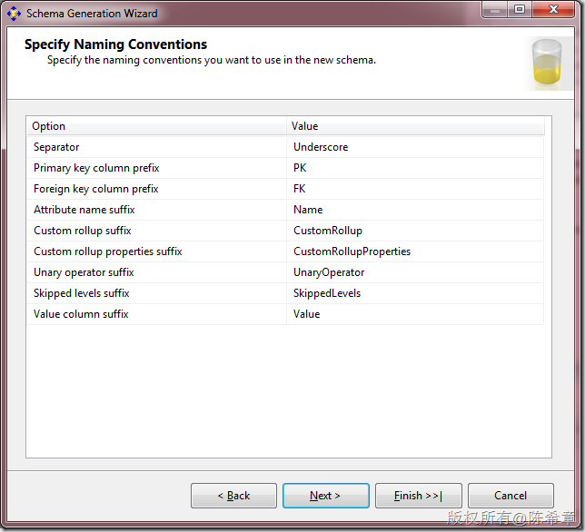](http://images.cnblogs.com/cnblogs_com/chenxizhang/201106/201106091811102471.png)

 点击“Next”

 [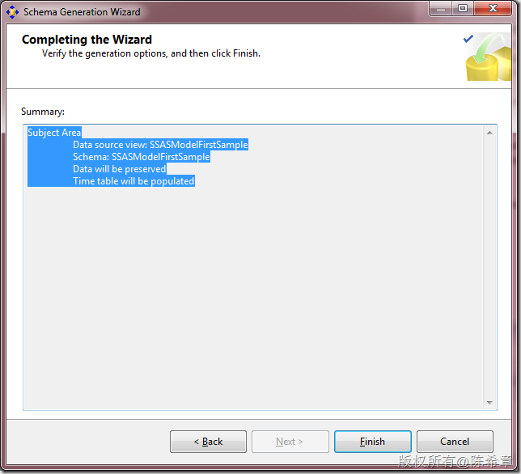](http://images.cnblogs.com/cnblogs_com/chenxizhang/201106/201106091811116997.png)

 点击“Finish”

 [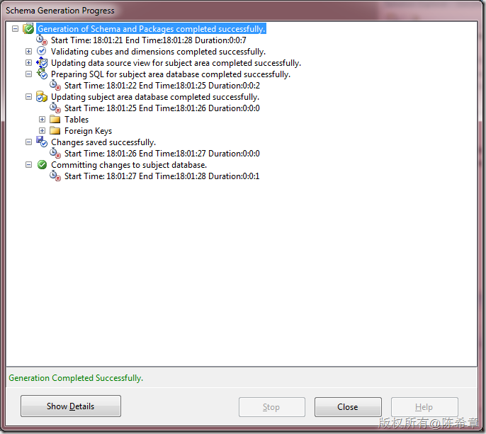](http://images.cnblogs.com/cnblogs_com/chenxizhang/201106/201106091811127935.png)

 这样就生成好了我们需要的数据库结构。我们可以在SSMS中查看得到

 [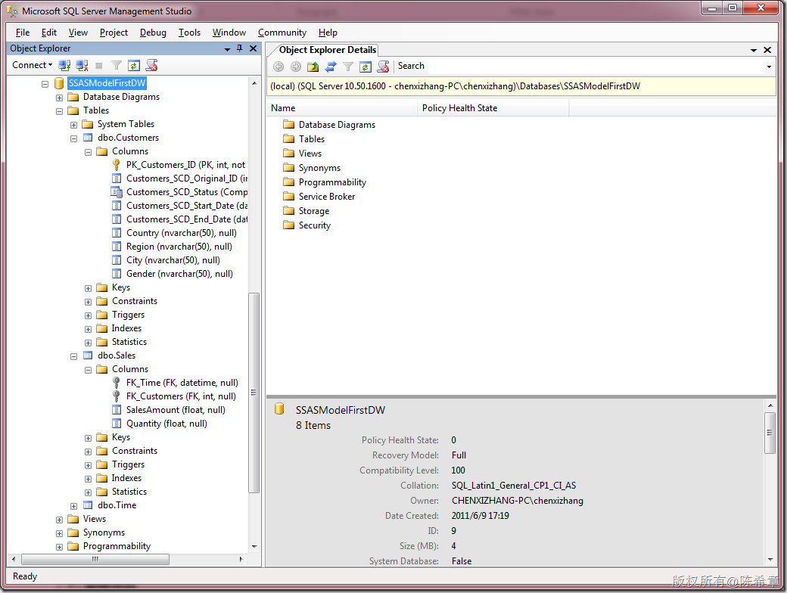](http://images.cnblogs.com/cnblogs_com/chenxizhang/201106/201106091811143706.png)

 更加特别的地方是，Time这个维度表里面还包含了数据

 [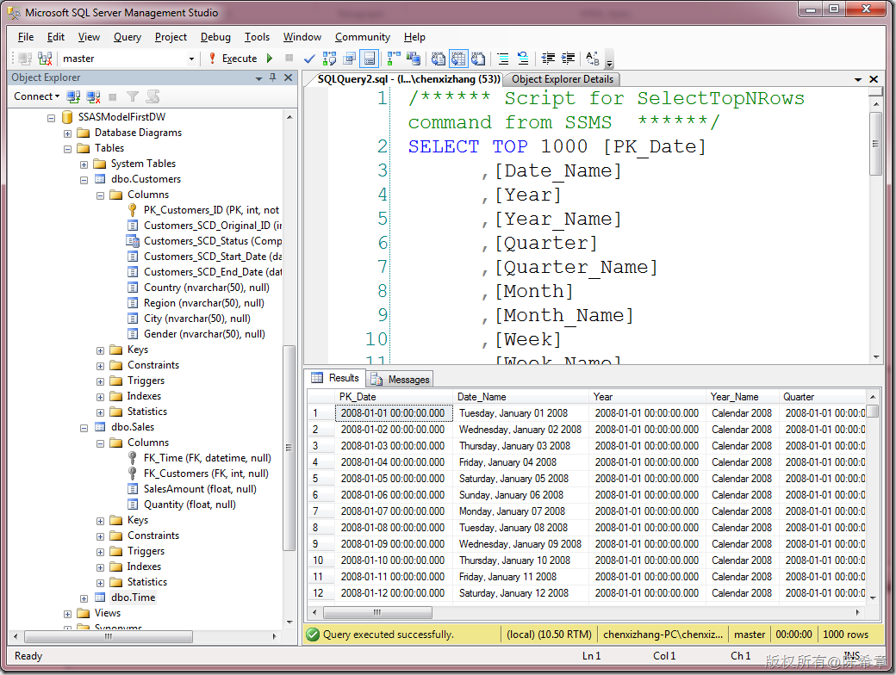](http://images.cnblogs.com/cnblogs_com/chenxizhang/201106/201106091811173513.png)

 当然，Customers表和Sales表目前是没有数据的，那就需要我们通过设计SSIS，将数据从业务数据库中抽取过来。这个内容已经超出了本文的范围。

  

 7. 部署项目
-------

 我们可以将这个设计好的SSAS项目部署起来看看效果如何

 [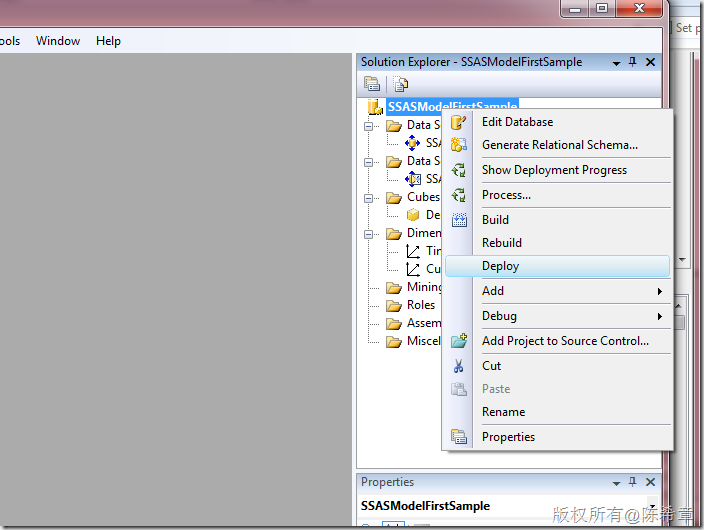](http://images.cnblogs.com/cnblogs_com/chenxizhang/201106/20110609181118613.png)

 [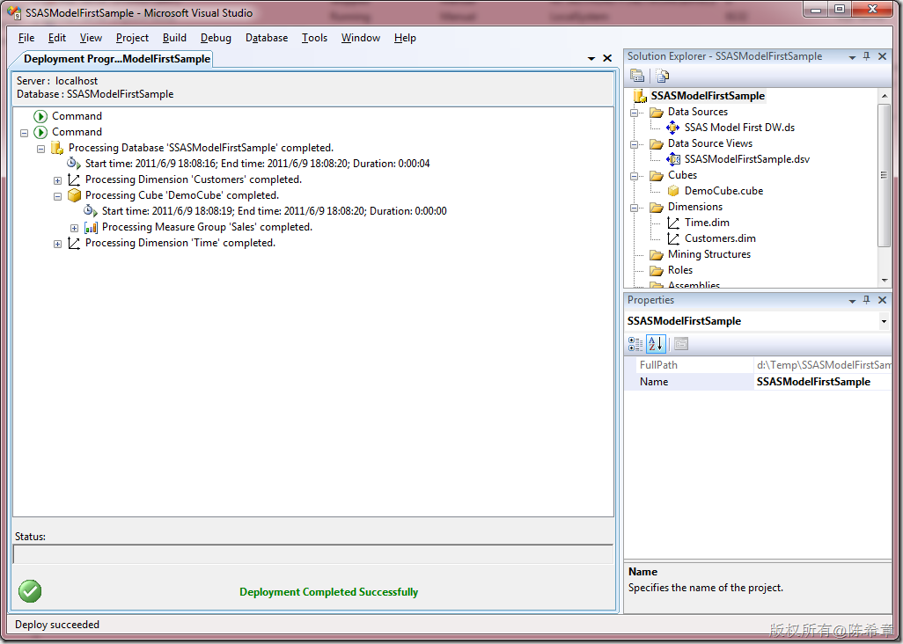](http://images.cnblogs.com/cnblogs_com/chenxizhang/201106/201106091811191235.png)

 部署成功之后，下图就可以看到我们熟悉的OLAP分析的界面了

 [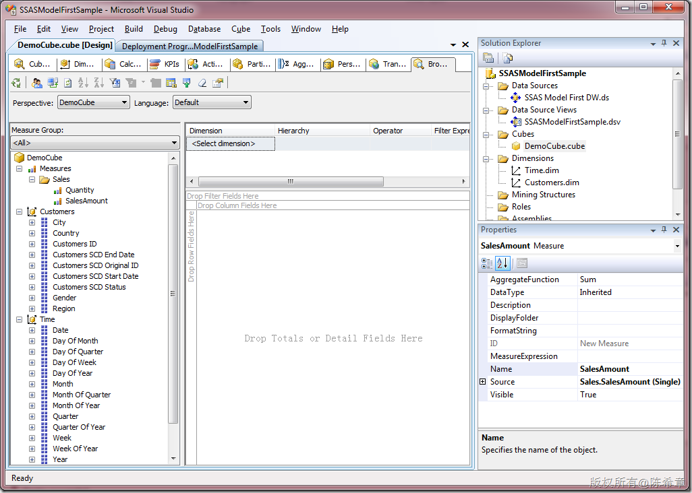](http://images.cnblogs.com/cnblogs_com/chenxizhang/201106/201106091811219449.png)

