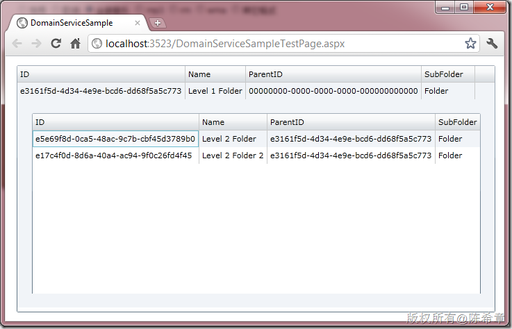

# RIA Service中对于递归实体类型处理的问题及解决方案 
> 原文发表于 2011-06-10, 地址: http://www.cnblogs.com/chenxizhang/archive/2011/06/10/2077459.html 


故事是这样开始的：

  

 我们在开发一个Silverlight应用程序的时候使用到了RIA Service，我们需要通过该服务公开一个对文件夹的查询操作。

 为此，我们建立了如下的一个实体类型


```
using System;
using System.Collections.Generic;
using System.Linq;
using System.Web;

using System.Runtime.Serialization;
using System.ComponentModel.DataAnnotations;

using System.ServiceModel.DomainServices.Server;

namespace DomainServiceSample.Web
{
    [DataContract]//必须声明类别为DataContract
    public class Folder
    {
        [DataMember]//必须声明属性为DataMember
        [Key]//一个用于DomainService的Entity必须有一个Key
        public Guid ID { get; set; }

        [DataMember]
        public string Name { get; set; }

        [DataMember]         
```

```
 public Folder[] SubFolder { get; set; }
        
    }
}
```

【注意】上面其实是有一个递归的类型，也就是Folder里面又包含Folder


.csharpcode, .csharpcode pre
{
 font-size: small;
 color: black;
 font-family: consolas, "Courier New", courier, monospace;
 background-color: #ffffff;
 /*white-space: pre;*/
}
.csharpcode pre { margin: 0em; }
.csharpcode .rem { color: #008000; }
.csharpcode .kwrd { color: #0000ff; }
.csharpcode .str { color: #006080; }
.csharpcode .op { color: #0000c0; }
.csharpcode .preproc { color: #cc6633; }
.csharpcode .asp { background-color: #ffff00; }
.csharpcode .html { color: #800000; }
.csharpcode .attr { color: #ff0000; }
.csharpcode .alt 
{
 background-color: #f4f4f4;
 width: 100%;
 margin: 0em;
}
.csharpcode .lnum { color: #606060; }


然后，我们创建了一个DomainService


```

namespace DomainServiceSample.Web
{
    using System;
    using System.Collections.Generic;
    using System.ComponentModel;
    using System.ComponentModel.DataAnnotations;
    using System.Linq;
    using System.ServiceModel.DomainServices.Hosting;
    using System.ServiceModel.DomainServices.Server;


    // TODO: Create methods containing your application logic.
    [EnableClientAccess()]
    public class SampleDomainService : DomainService
    {
        [Query]
        public IQueryable<Folder> GetFolder()
        {
            var folder = new Folder() { ID = Guid.NewGuid(), Name = "Level 1 Folder" };
            var subFolders = new[]{
                new Folder(){ID=Guid.NewGuid(),Name="Level 2 Folder"},
                new Folder(){ID=Guid.NewGuid(),Name="Level 2 Folder 2"}
            };
            folder.SubFolder = subFolders;
            return new[] { folder }.AsQueryable();
        }
    }
}


```


.csharpcode, .csharpcode pre
{
 font-size: small;
 color: black;
 font-family: consolas, "Courier New", courier, monospace;
 background-color: #ffffff;
 /*white-space: pre;*/
}
.csharpcode pre { margin: 0em; }
.csharpcode .rem { color: #008000; }
.csharpcode .kwrd { color: #0000ff; }
.csharpcode .str { color: #006080; }
.csharpcode .op { color: #0000c0; }
.csharpcode .preproc { color: #cc6633; }
.csharpcode .asp { background-color: #ffff00; }
.csharpcode .html { color: #800000; }
.csharpcode .attr { color: #ff0000; }
.csharpcode .alt 
{
 background-color: #f4f4f4;
 width: 100%;
 margin: 0em;
}
.csharpcode .lnum { color: #606060; }

这个代码没有什么特别的,我们计划向客户端发送的结果是一个Folder,但同时它包含了两个子Folder。


编写上面两个类型很顺利，然后我们生成项目，因为使用了Domain Service，所以在Silverlight应用程序中会得到一个自动生成的类型


我们打开那个文件，确实里面是有一个Folder的类型


```
    /// <summary>
    /// The 'Folder' entity class.
    /// </summary>
    [DataContract(Namespace="http://schemas.datacontract.org/2004/07/DomainServiceSample.Web")]
    public sealed partial class Folder : Entity
    {
        
        private Guid \_id;
        
        private string \_name;
        
        #region Extensibility Method Definitions

        /// <summary>
        /// This method is invoked from the constructor once initialization is complete and
        /// can be used for further object setup.
        /// </summary>
        partial void OnCreated();
        partial void OnIDChanging(Guid value);
        partial void OnIDChanged();
        partial void OnNameChanging(string value);
        partial void OnNameChanged();

        #endregion
        
        
        /// <summary>
        /// Initializes a new instance of the <see cref="Folder"/> class.
        /// </summary>
        public Folder()
        {
            this.OnCreated();
        }
        
        /// <summary>
        /// Gets or sets the 'ID' value.
        /// </summary>
        [DataMember()]
        [Editable(false, AllowInitialValue=true)]
        [Key()]
        [RoundtripOriginal()]
        public Guid ID
        {
            get
            {
                return this.\_id;
            }
            set
            {
                if ((this.\_id != value))
                {
                    this.OnIDChanging(value);
                    this.ValidateProperty("ID", value);
                    this.\_id = value;
                    this.RaisePropertyChanged("ID");
                    this.OnIDChanged();
                }
            }
        }
        
        /// <summary>
        /// Gets or sets the 'Name' value.
        /// </summary>
        [DataMember()]
        public string Name
        {
            get
            {
                return this.\_name;
            }
            set
            {
                if ((this.\_name != value))
                {
                    this.OnNameChanging(value);
                    this.RaiseDataMemberChanging("Name");
                    this.ValidateProperty("Name", value);
                    this.\_name = value;
                    this.RaiseDataMemberChanged("Name");
                    this.OnNameChanged();
                }
            }
        }
        
        /// <summary>
        /// Computes a value from the key fields that uniquely identifies this entity instance.
        /// </summary>
        /// <returns>An object instance that uniquely identifies this entity instance.</returns>
        public override object GetIdentity()
        {
            return this.\_id;
        }
    }
```


.csharpcode, .csharpcode pre
{
 font-size: small;
 color: black;
 font-family: consolas, "Courier New", courier, monospace;
 background-color: #ffffff;
 /*white-space: pre;*/
}
.csharpcode pre { margin: 0em; }
.csharpcode .rem { color: #008000; }
.csharpcode .kwrd { color: #0000ff; }
.csharpcode .str { color: #006080; }
.csharpcode .op { color: #0000c0; }
.csharpcode .preproc { color: #cc6633; }
.csharpcode .asp { background-color: #ffff00; }
.csharpcode .html { color: #800000; }
.csharpcode .attr { color: #ff0000; }
.csharpcode .alt 
{
 background-color: #f4f4f4;
 width: 100%;
 margin: 0em;
}
.csharpcode .lnum { color: #606060; }

但是，让人疑惑的是，**这个类型里面并没有包含SubFolder这个属性**


这是什么情况呢？难道RIA Service不允许传递这种包含递归类型引用的实体？确实如此。


 


我目前的解决方法是：


1. 为Folder类型添加一个ParentID属性


2. 为SubFolder设置关联，即子Folder的ParentID设置到父Folder的ID。并且定义他们的关联


3. 使用Include属性标记SubFolder是要包含进来的


 


所以，这个类型修改为下面这样


```
using System;
using System.Collections.Generic;
using System.Linq;
using System.Web;

using System.Runtime.Serialization;
using System.ComponentModel.DataAnnotations;

using System.ServiceModel.DomainServices.Server;

namespace DomainServiceSample.Web
{
    [DataContract]//必须声明类别为DataContract
    public class Folder
    {
        [DataMember]//必须声明属性为DataMember
        [Key]//一个用于DomainService的Entity必须有一个Key
        public Guid ID { get; set; }

        [DataMember]
        public string Name { get; set; }


        [DataMember]
 [Association("Test","ID","ParentID")]
 [Include]
        public Folder[] SubFolder { get; set; }


   [DataMember]
 public Guid ParentID { get; set; }
        
    }
}
```

.csharpcode, .csharpcode pre
{
 font-size: small;
 color: black;
 font-family: consolas, "Courier New", courier, monospace;
 background-color: #ffffff;
 /*white-space: pre;*/
}
.csharpcode pre { margin: 0em; }
.csharpcode .rem { color: #008000; }
.csharpcode .kwrd { color: #0000ff; }
.csharpcode .str { color: #006080; }
.csharpcode .op { color: #0000c0; }
.csharpcode .preproc { color: #cc6633; }
.csharpcode .asp { background-color: #ffff00; }
.csharpcode .html { color: #800000; }
.csharpcode .attr { color: #ff0000; }
.csharpcode .alt 
{
 background-color: #f4f4f4;
 width: 100%;
 margin: 0em;
}
.csharpcode .lnum { color: #606060; }

[](http://images.cnblogs.com/cnblogs_com/chenxizhang/201106/201106101132137223.png)


然后，我们再来看在Silverlight中生成的那个类型


```
   /// <summary>
    /// The 'Folder' entity class.
    /// </summary>
    [DataContract(Namespace="http://schemas.datacontract.org/2004/07/DomainServiceSample.Web")]
    public sealed partial class Folder : Entity
    {
        
        private Guid \_id;
        
        private string \_name;
        
        private Guid \_parentID;
        
        private EntityCollection<Folder> \_subFolder;
        
        #region Extensibility Method Definitions

        /// <summary>
        /// This method is invoked from the constructor once initialization is complete and
        /// can be used for further object setup.
        /// </summary>
        partial void OnCreated();
        partial void OnIDChanging(Guid value);
        partial void OnIDChanged();
        partial void OnNameChanging(string value);
        partial void OnNameChanged();
        partial void OnParentIDChanging(Guid value);
        partial void OnParentIDChanged();

        #endregion
        
        
        /// <summary>
        /// Initializes a new instance of the <see cref="Folder"/> class.
        /// </summary>
        public Folder()
        {
            this.OnCreated();
        }
        
        /// <summary>
        /// Gets or sets the 'ID' value.
        /// </summary>
        [DataMember()]
        [Editable(false, AllowInitialValue=true)]
        [Key()]
        [RoundtripOriginal()]
        public Guid ID
        {
            get
            {
                return this.\_id;
            }
            set
            {
                if ((this.\_id != value))
                {
                    this.OnIDChanging(value);
                    this.ValidateProperty("ID", value);
                    this.\_id = value;
                    this.RaisePropertyChanged("ID");
                    this.OnIDChanged();
                }
            }
        }
        
        /// <summary>
        /// Gets or sets the 'Name' value.
        /// </summary>
        [DataMember()]
        public string Name
        {
            get
            {
                return this.\_name;
            }
            set
            {
                if ((this.\_name != value))
                {
                    this.OnNameChanging(value);
                    this.RaiseDataMemberChanging("Name");
                    this.ValidateProperty("Name", value);
                    this.\_name = value;
                    this.RaiseDataMemberChanged("Name");
                    this.OnNameChanged();
                }
            }
        }
        
        /// <summary>
        /// Gets or sets the 'ParentID' value.
        /// </summary>
        [DataMember()]
        public Guid ParentID
        {
            get
            {
                return this.\_parentID;
            }
            set
            {
                if ((this.\_parentID != value))
                {
                    this.OnParentIDChanging(value);
                    this.RaiseDataMemberChanging("ParentID");
                    this.ValidateProperty("ParentID", value);
                    this.\_parentID = value;
                    this.RaiseDataMemberChanged("ParentID");
                    this.OnParentIDChanged();
                }
            }
        }
        
        /// <summary>
        /// Gets the collection of associated <see cref="Folder"/> entity instances.
        /// </summary>
        [Association("Test", "ID", "ParentID")]
        public EntityCollection<Folder> SubFolder
        {
            get
            {
                if ((this.\_subFolder == null))
                {
                    this.\_subFolder = new EntityCollection<Folder>(this, "SubFolder", this.FilterSubFolder);
                }
                return this.\_subFolder;
            }
        }
        
        private bool FilterSubFolder(Folder entity)
        {
            return (entity.ParentID == this.ID);
        }
        
        /// <summary>
        /// Computes a value from the key fields that uniquely identifies this entity instance.
        /// </summary>
        /// <returns>An object instance that uniquely identifies this entity instance.</returns>
        public override object GetIdentity()
        {
            return this.\_id;
        }
    }
```


.csharpcode, .csharpcode pre
{
 font-size: small;
 color: black;
 font-family: consolas, "Courier New", courier, monospace;
 background-color: #ffffff;
 /*white-space: pre;*/
}
.csharpcode pre { margin: 0em; }
.csharpcode .rem { color: #008000; }
.csharpcode .kwrd { color: #0000ff; }
.csharpcode .str { color: #006080; }
.csharpcode .op { color: #0000c0; }
.csharpcode .preproc { color: #cc6633; }
.csharpcode .asp { background-color: #ffff00; }
.csharpcode .html { color: #800000; }
.csharpcode .attr { color: #ff0000; }
.csharpcode .alt 
{
 background-color: #f4f4f4;
 width: 100%;
 margin: 0em;
}
.csharpcode .lnum { color: #606060; }


这时就看到SubFolder了，而且还包含了很多其他的属性。


 


最后，我做了一个界面来显示给大家看看效果


MainPage.xaml的内容如下


```
<UserControl x:Class="DomainServiceSample.MainPage"
    xmlns="http://schemas.microsoft.com/winfx/2006/xaml/presentation"
    xmlns:x="http://schemas.microsoft.com/winfx/2006/xaml"
    xmlns:d="http://schemas.microsoft.com/expression/blend/2008"
    xmlns:mc="http://schemas.openxmlformats.org/markup-compatibility/2006"
    mc:Ignorable="d"
    d:DesignHeight="300" d:DesignWidth="400" xmlns:sdk="http://schemas.microsoft.com/winfx/2006/xaml/presentation/sdk">

    <Grid x:Name="LayoutRoot" Background="White">
        <sdk:DataGrid AutoGenerateColumns="True" Margin="16,13,12,12" Name="dataGrid1" ItemsSource="{Binding}" RowDetailsVisibilityMode="Visible">
            <sdk:DataGrid.RowDetailsTemplate>
                <DataTemplate>
                    <sdk:DataGrid AutoGenerateColumns="True" Margin="20,20,20,20" Height="300" ItemsSource="{Binding SubFolder}" />
                </DataTemplate>
            </sdk:DataGrid.RowDetailsTemplate>
        </sdk:DataGrid>
    </Grid>
</UserControl>

```

.csharpcode, .csharpcode pre
{
 font-size: small;
 color: black;
 font-family: consolas, "Courier New", courier, monospace;
 background-color: #ffffff;
 /*white-space: pre;*/
}
.csharpcode pre { margin: 0em; }
.csharpcode .rem { color: #008000; }
.csharpcode .kwrd { color: #0000ff; }
.csharpcode .str { color: #006080; }
.csharpcode .op { color: #0000c0; }
.csharpcode .preproc { color: #cc6633; }
.csharpcode .asp { background-color: #ffff00; }
.csharpcode .html { color: #800000; }
.csharpcode .attr { color: #ff0000; }
.csharpcode .alt 
{
 background-color: #f4f4f4;
 width: 100%;
 margin: 0em;
}
.csharpcode .lnum { color: #606060; }

 


MainPage.xaml.cs的内容如下


 


```
using System;
using System.Collections.Generic;
using System.Linq;
using System.Net;
using System.Windows;
using System.Windows.Controls;
using System.Windows.Documents;
using System.Windows.Input;
using System.Windows.Media;
using System.Windows.Media.Animation;
using System.Windows.Shapes;

using DomainServiceSample.Web;

namespace DomainServiceSample
{
    public partial class MainPage : UserControl
    {
        public MainPage()
        {
            InitializeComponent();

            Loaded += new RoutedEventHandler(MainPage\_Loaded);
        }

        void MainPage\_Loaded(object sender, RoutedEventArgs e)
        {
            var ctx = new SampleDomainContext();
            var op = ctx.Load<Folder>(ctx.GetFolderQuery());
            dataGrid1.DataContext = op.Entities;
        }
    }
}

```

 


同时，服务端的代码我也稍作了修改


```

namespace DomainServiceSample.Web
{
    using System;
    using System.Collections.Generic;
    using System.ComponentModel;
    using System.ComponentModel.DataAnnotations;
    using System.Linq;
    using System.ServiceModel.DomainServices.Hosting;
    using System.ServiceModel.DomainServices.Server;


    // TODO: Create methods containing your application logic.
    [EnableClientAccess()]
    public class SampleDomainService : DomainService
    {
        [Query]
        public IQueryable<Folder> GetFolder()
        {
            var folder = new Folder() { ID = Guid.NewGuid(), Name = "Level 1 Folder" };
            var subFolders = new[]{
                new Folder(){ID=Guid.NewGuid(),Name="Level 2 Folder",ParentID=folder.ID},
                new Folder(){ID=Guid.NewGuid(),Name="Level 2 Folder 2",ParentID=folder.ID}
            };
            folder.SubFolder = subFolders;
            return new[] { folder }.AsQueryable();
        }
    }
}


```

.csharpcode, .csharpcode pre
{
 font-size: small;
 color: black;
 font-family: consolas, "Courier New", courier, monospace;
 background-color: #ffffff;
 /*white-space: pre;*/
}
.csharpcode pre { margin: 0em; }
.csharpcode .rem { color: #008000; }
.csharpcode .kwrd { color: #0000ff; }
.csharpcode .str { color: #006080; }
.csharpcode .op { color: #0000c0; }
.csharpcode .preproc { color: #cc6633; }
.csharpcode .asp { background-color: #ffff00; }
.csharpcode .html { color: #800000; }
.csharpcode .attr { color: #ff0000; }
.csharpcode .alt 
{
 background-color: #f4f4f4;
 width: 100%;
 margin: 0em;
}
.csharpcode .lnum { color: #606060; }

 


.csharpcode, .csharpcode pre
{
 font-size: small;
 color: black;
 font-family: consolas, "Courier New", courier, monospace;
 background-color: #ffffff;
 /*white-space: pre;*/
}
.csharpcode pre { margin: 0em; }
.csharpcode .rem { color: #008000; }
.csharpcode .kwrd { color: #0000ff; }
.csharpcode .str { color: #006080; }
.csharpcode .op { color: #0000c0; }
.csharpcode .preproc { color: #cc6633; }
.csharpcode .asp { background-color: #ffff00; }
.csharpcode .html { color: #800000; }
.csharpcode .attr { color: #ff0000; }
.csharpcode .alt 
{
 background-color: #f4f4f4;
 width: 100%;
 margin: 0em;
}
.csharpcode .lnum { color: #606060; }


调试起来看到的效果如下


[](http://images.cnblogs.com/cnblogs_com/chenxizhang/201106/201106101132149830.png)


 


虽然解决了问题，但个人感觉Domain Service这个设计值得商榷。如果各位有更好的见解和解决方案，请不吝赐教

