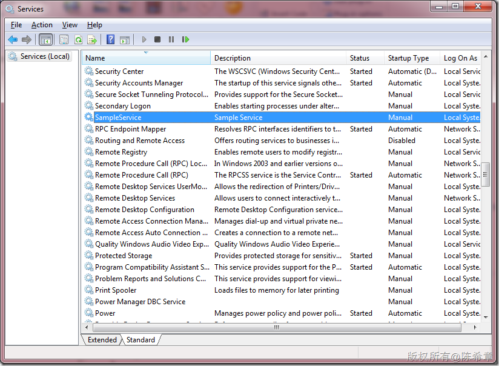
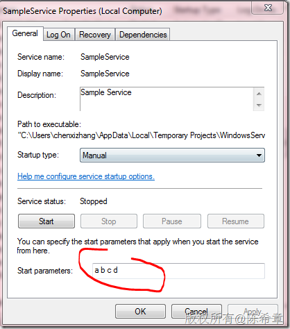
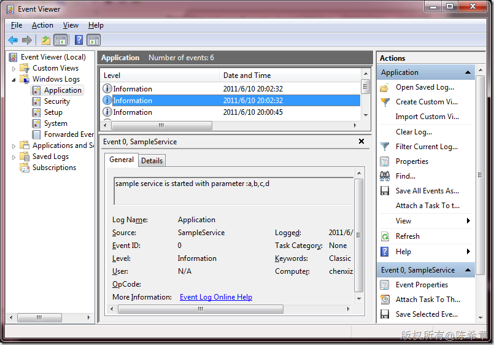
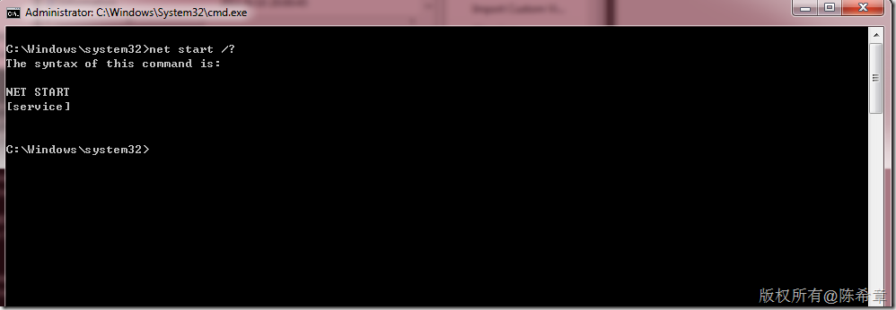
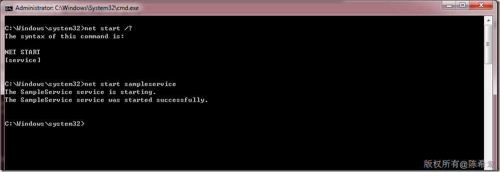
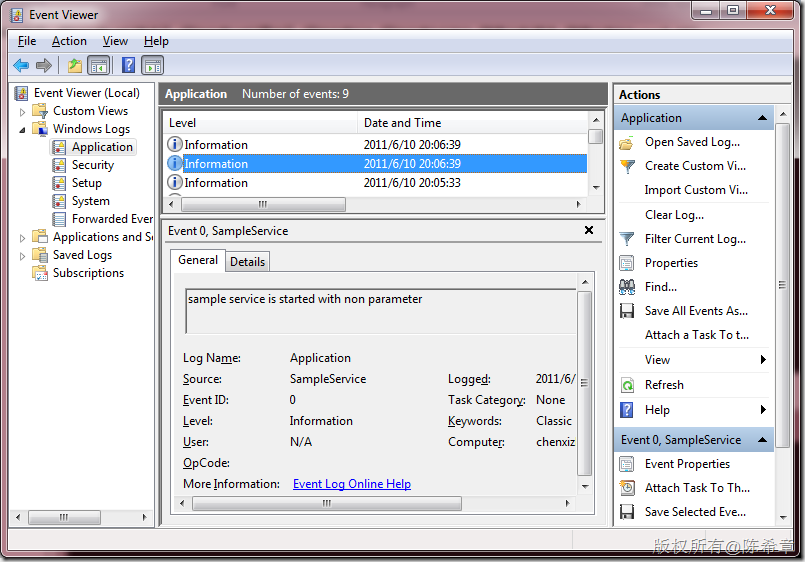
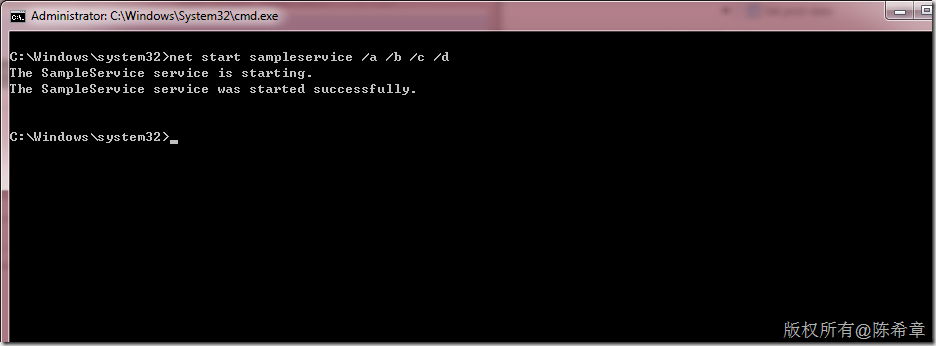
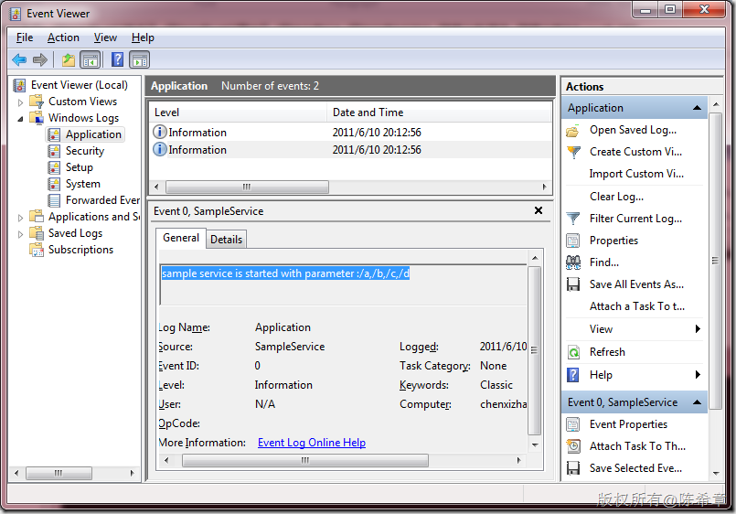
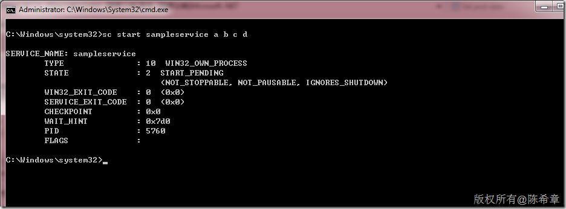
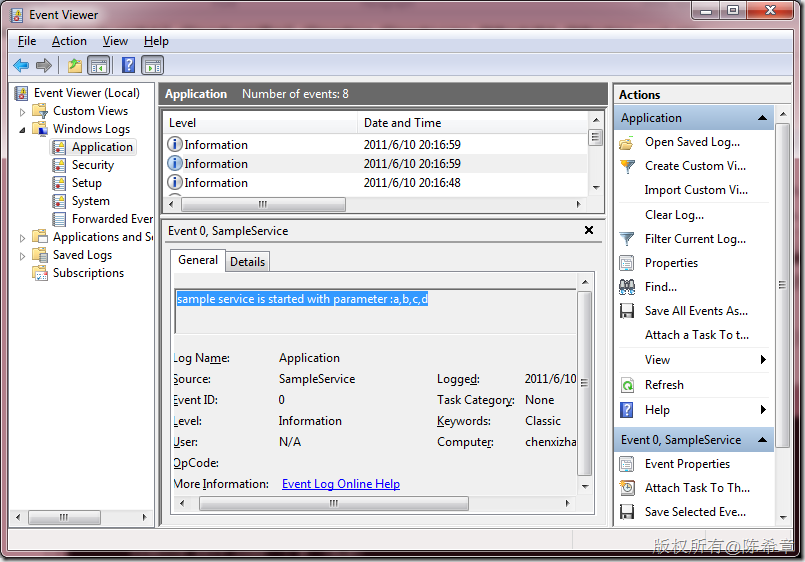

# 如何在命令行脚本中启动带参数的Windows服务 
> 原文发表于 2011-06-10, 地址: http://www.cnblogs.com/chenxizhang/archive/2011/06/10/2077931.html 


这是一个小问题：

 我们有一个自己编写的Windows服务，我们希望该服务在启动时可以根据用户输入的参数实现不同的功能。

 要实现这样的需求并不是很难，下面这个例子我用来示范如何编写该服务


```
using System;
using System.Collections.Generic;
using System.ComponentModel;
using System.Data;
using System.Diagnostics;
using System.Linq;
using System.ServiceProcess;
using System.Text;

namespace WindowsServiceSample
{
    public partial class SampleService : ServiceBase
    {
        public SampleService()
        {
            InitializeComponent();
        }

        /// <summary>
        /// 服务启动时触发
        /// </summary>
        /// <param name="args">用户可以设置的输入参数</param>
        protected override void OnStart(string[] args)
        {

            if (args.Length > 0)
            {
                EventLog.WriteEntry(string.Format("sample service is started with parameter :{0}", string.Join(",", args)));
            }
            else
            {
                EventLog.WriteEntry("sample service is started with non parameter");
            }
        }

        protected override void OnStop()
        {
        }
    }
}

```


.csharpcode, .csharpcode pre
{
 font-size: small;
 color: black;
 font-family: consolas, "Courier New", courier, monospace;
 background-color: #ffffff;
 /*white-space: pre;*/
}
.csharpcode pre { margin: 0em; }
.csharpcode .rem { color: #008000; }
.csharpcode .kwrd { color: #0000ff; }
.csharpcode .str { color: #006080; }
.csharpcode .op { color: #0000c0; }
.csharpcode .preproc { color: #cc6633; }
.csharpcode .asp { background-color: #ffff00; }
.csharpcode .html { color: #800000; }
.csharpcode .attr { color: #ff0000; }
.csharpcode .alt 
{
 background-color: #f4f4f4;
 width: 100%;
 margin: 0em;
}
.csharpcode .lnum { color: #606060; }


在上述代码中，我区分了带参数启动和不带参数启动两种情况。很显然，在带参数的那种情况下，我们可以根据参数做不同的处理。本文仅为了说明参数问题，并不真的去考虑那些实际应用。我通过写日志的方式来区分即可。


 


这个服务安装起来之后，在服务控制台中看起来是这样的


[](http://images.cnblogs.com/cnblogs_com/chenxizhang/201106/201106102034421990.png)


如果我们通过手工去启动的话，如何设置参数呢？很简单，双击该服务，在属性对话框中输入参数即可


【注意】是先输入参数，然后点击“Start”


【注意】不同的参数之间用空格隔开


[](http://images.cnblogs.com/cnblogs_com/chenxizhang/201106/201106102034422056.png)


启动成功后，我们在事件日志中可以看到一条日志


[](http://images.cnblogs.com/cnblogs_com/chenxizhang/201106/201106102034436234.png)


这说明，参数确实被捕捉到了。服务正常进行了工作。


还不错对吧？但本文的最大目的并不是解释这个，上面都是铺垫，如果我们是要通过命令行脚本的方式来启动服务，而不是手工启动服务，那么该如何设置参数呢？


 


我们都知道要在命令行中启动服务，一般都是通过net start命令。这个工具的格式如下


[](http://images.cnblogs.com/cnblogs_com/chenxizhang/201106/20110610203443170.png)


我们可以通过net start sampleservice启动服务


[](http://images.cnblogs.com/cnblogs_com/chenxizhang/201106/201106102034433791.png)


在事件日志中确实看到它是没有带参数启动的


[](http://images.cnblogs.com/cnblogs_com/chenxizhang/201106/201106102034446648.png)


好吧，那么如何传递参数过去呢？


经过研究发现，net 工具要传递参数的话，有一个很特殊的做法


net start sampleservice /a /b /c /d


[](http://images.cnblogs.com/cnblogs_com/chenxizhang/201106/201106102034443857.png)


但是这样启动之后，看日志却发现有一点点特殊


[](http://images.cnblogs.com/cnblogs_com/chenxizhang/201106/201106102034442254.png)


请主要，参数确实传递进来了。但包含了“/”。如果说在程序中识别这个特殊的符号，那么也是没有问题的。只不过，这样就未必是增加了程序的复杂性啦。


那么，有没有更加简单的做法呢？（简单的意思是说与手工操作是一样的，不需要为此去修改代码）


我想起来，除了用net start之外，还可以通过sc start命令来启动服务


[](http://images.cnblogs.com/cnblogs_com/chenxizhang/201106/201106102034453400.png)  
这样的命令就直观多了。我们马上来看一下日志文件中的结果吧


[](http://images.cnblogs.com/cnblogs_com/chenxizhang/201106/201106102034466879.png)


很好，这是我们需要的效果。也就是说用sc工具的话，可以很好地传递参数。


【备注】sc的意思是，service controller,关于该工具的详细介绍，请参考 <http://www.microsoft.com/resources/documentation/windows/xp/all/proddocs/en-us/sc.mspx?mfr=true>

