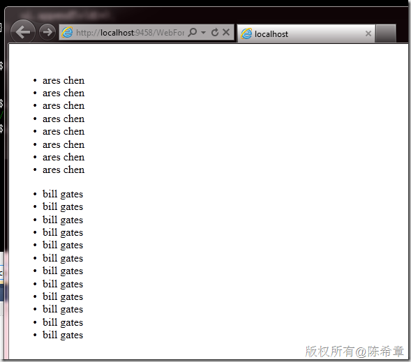

# 在jquery中处理带有命名空间的XML数据 
> 原文发表于 2011-06-12, 地址: http://www.cnblogs.com/chenxizhang/archive/2011/06/12/2078975.html 


这一篇记录一个小技巧。

 如果你在做AJAX应用，则你可能经常会用到jquery（或者其他框架）处理服务返回的数据。如果用Jquery处理Json格式，将是相当方便的。但不幸的是，很多服务返回的数据仍然是XML格式的。

 jquery对于xml这种数据的处理是内置支持的，这一点没有任何问题。但前提是返回的数据没有带任何命名空间。例如下面这份数据


```
<?xml version="1.0" encoding="utf-8" ?>
<data>
  <Employee id="1" firstName="ares" lastName="chen"></Employee>
  <Employee id="1" firstName="ares" lastName="chen"></Employee>
  <Employee id="1" firstName="ares" lastName="chen"></Employee>
  <Employee id="1" firstName="ares" lastName="chen"></Employee>
  <Employee id="1" firstName="ares" lastName="chen"></Employee>
  <Employee id="1" firstName="ares" lastName="chen"></Employee>
  <Employee id="1" firstName="ares" lastName="chen"></Employee>
  <Employee id="1" firstName="ares" lastName="chen"></Employee>
</data>
```

.csharpcode, .csharpcode pre
{
 font-size: small;
 color: black;
 font-family: consolas, "Courier New", courier, monospace;
 background-color: #ffffff;
 /*white-space: pre;*/
}
.csharpcode pre { margin: 0em; }
.csharpcode .rem { color: #008000; }
.csharpcode .kwrd { color: #0000ff; }
.csharpcode .str { color: #006080; }
.csharpcode .op { color: #0000c0; }
.csharpcode .preproc { color: #cc6633; }
.csharpcode .asp { background-color: #ffff00; }
.csharpcode .html { color: #800000; }
.csharpcode .attr { color: #ff0000; }
.csharpcode .alt 
{
 background-color: #f4f4f4;
 width: 100%;
 margin: 0em;
}
.csharpcode .lnum { color: #606060; }

要处理这样的数据，jquery代码大致如下


```
            var div = $("#placeholder");

            

            // 处理不带命名空间的xml
            $.get("data.xml", null, function (data) {
                var employees = $("Employee", data); //找到所有的Employee节点

                var ul = $("<ul />");

                employees.each(function () {
                    $("<li />").text($(this).attr("firstName") + " " + $(this).attr("lastName")).appendTo(ul);// 将每一行数据构造一个新的li标签，并且将其插入到ul中

                });

                ul.appendTo(div);
            });

```


.csharpcode, .csharpcode pre
{
 font-size: small;
 color: black;
 font-family: consolas, "Courier New", courier, monospace;
 background-color: #ffffff;
 /*white-space: pre;*/
}
.csharpcode pre { margin: 0em; }
.csharpcode .rem { color: #008000; }
.csharpcode .kwrd { color: #0000ff; }
.csharpcode .str { color: #006080; }
.csharpcode .op { color: #0000c0; }
.csharpcode .preproc { color: #cc6633; }
.csharpcode .asp { background-color: #ffff00; }
.csharpcode .html { color: #800000; }
.csharpcode .attr { color: #ff0000; }
.csharpcode .alt 
{
 background-color: #f4f4f4;
 width: 100%;
 margin: 0em;
}
.csharpcode .lnum { color: #606060; }


但如果我们的XML数据带有命名空间，则上述代码就会无效。原因是因为jquery默认处理不了命名空间


```
<?xml version="1.0" encoding="utf-8" ?>
<data xmlns:d="http://tech.xizhang.com">
  <d:Employee id="1" firstName="bill" lastName="gates"></d:Employee>
  <d:Employee id="1" firstName="bill" lastName="gates"></d:Employee>
  <d:Employee id="1" firstName="bill" lastName="gates"></d:Employee>
  <d:Employee id="1" firstName="bill" lastName="gates"></d:Employee>
  <d:Employee id="1" firstName="bill" lastName="gates"></d:Employee>
  <d:Employee id="1" firstName="bill" lastName="gates"></d:Employee>
  <d:Employee id="1" firstName="bill" lastName="gates"></d:Employee>
  <d:Employee id="1" firstName="bill" lastName="gates"></d:Employee>
  <d:Employee id="1" firstName="bill" lastName="gates"></d:Employee>
  <d:Employee id="1" firstName="bill" lastName="gates"></d:Employee>
  <d:Employee id="1" firstName="bill" lastName="gates"></d:Employee>
  <d:Employee id="1" firstName="bill" lastName="gates"></d:Employee>

</data>
```

.csharpcode, .csharpcode pre
{
 font-size: small;
 color: black;
 font-family: consolas, "Courier New", courier, monospace;
 background-color: #ffffff;
 /*white-space: pre;*/
}
.csharpcode pre { margin: 0em; }
.csharpcode .rem { color: #008000; }
.csharpcode .kwrd { color: #0000ff; }
.csharpcode .str { color: #006080; }
.csharpcode .op { color: #0000c0; }
.csharpcode .preproc { color: #cc6633; }
.csharpcode .asp { background-color: #ffff00; }
.csharpcode .html { color: #800000; }
.csharpcode .attr { color: #ff0000; }
.csharpcode .alt 
{
 background-color: #f4f4f4;
 width: 100%;
 margin: 0em;
}
.csharpcode .lnum { color: #606060; }

  
为了解决这个问题，有热心的网友，编写了一个jquery插件，叫做jquery.xmlns.js，有兴趣可以通过下面了解和下载
<http://www.rfk.id.au/blog/entry/xmlns-selectors-jquery/>


那么，我们可以用如下的方法来解决问题


```
     
            $.xmlns["d"] = "http://tech.xizhang.com";
            // 处理带命名空间的xml
            $.get("datawithnamespace.xml", null, function (data) {
                var employees = $("d|Employee", data); //找到所有的Employee节点

                var ul = $("<ul />");

                employees.each(function () {
                    $("<li />").text($(this).attr("firstName") + " " + $(this).attr("lastName")).appendTo(ul);

                });

                ul.appendTo(div);

            });

```


.csharpcode, .csharpcode pre
{
 font-size: small;
 color: black;
 font-family: consolas, "Courier New", courier, monospace;
 background-color: #ffffff;
 /*white-space: pre;*/
}
.csharpcode pre { margin: 0em; }
.csharpcode .rem { color: #008000; }
.csharpcode .kwrd { color: #0000ff; }
.csharpcode .str { color: #006080; }
.csharpcode .op { color: #0000c0; }
.csharpcode .preproc { color: #cc6633; }
.csharpcode .asp { background-color: #ffff00; }
.csharpcode .html { color: #800000; }
.csharpcode .attr { color: #ff0000; }
.csharpcode .alt 
{
 background-color: #f4f4f4;
 width: 100%;
 margin: 0em;
}
.csharpcode .lnum { color: #606060; }


不得不说，XML这个技术规范中的命名空间真是一个很不好的设计。增加了很多麻烦，胜过于它带来的好处。


 


本文的例子完整代码如下


```
<%@ Page Language="C#" AutoEventWireup="true" CodeBehind="WebForm1.aspx.cs" Inherits="WebApplication1.WebForm1" %>

<!DOCTYPE html PUBLIC "-//W3C//DTD XHTML 1.0 Transitional//EN" "http://www.w3.org/TR/xhtml1/DTD/xhtml1-transitional.dtd">

<html xmlns="http://www.w3.org/1999/xhtml">
<head runat="server">
    <title></title>
    <script src="Scripts/jquery-1.4.1.min.js" type="text/javascript"></script>
    <script src="Scripts/jquery.xmlns.js" type="text/javascript"></script>
    <script language="javascript" type="text/javascript">
        $(function () {

            var div = $("#placeholder");

            

            // 处理不带命名空间的xml
            $.get("data.xml", null, function (data) {
                var employees = $("Employee", data); //找到所有的Employee节点

                var ul = $("<ul />");

                employees.each(function () {
                    $("<li />").text($(this).attr("firstName") + " " + $(this).attr("lastName")).appendTo(ul);// 将每一行数据构造一个新的li标签，并且将其插入到ul中

                });

                ul.appendTo(div);
            });


            $("<br />").appendTo(div);

     
            $.xmlns["d"] = "http://tech.xizhang.com";
            // 处理带命名空间的xml
            $.get("datawithnamespace.xml", null, function (data) {
                var employees = $("d|Employee", data); //找到所有的Employee节点

                var ul = $("<ul />");

                employees.each(function () {
                    $("<li />").text($(this).attr("firstName") + " " + $(this).attr("lastName")).appendTo(ul);

                });

                ul.appendTo(div);

            });


        });
    </script>
</head>
<body>
    <form id="form1" runat="server">
    <div id="placeholder">
    
    </div>
    </form>
</body>
</html>

```


.csharpcode, .csharpcode pre
{
 font-size: small;
 color: black;
 font-family: consolas, "Courier New", courier, monospace;
 background-color: #ffffff;
 /*white-space: pre;*/
}
.csharpcode pre { margin: 0em; }
.csharpcode .rem { color: #008000; }
.csharpcode .kwrd { color: #0000ff; }
.csharpcode .str { color: #006080; }
.csharpcode .op { color: #0000c0; }
.csharpcode .preproc { color: #cc6633; }
.csharpcode .asp { background-color: #ffff00; }
.csharpcode .html { color: #800000; }
.csharpcode .attr { color: #ff0000; }
.csharpcode .alt 
{
 background-color: #f4f4f4;
 width: 100%;
 margin: 0em;
}
.csharpcode .lnum { color: #606060; }


最后，在浏览器中看到的效果如下。有图有真相


[](http://images.cnblogs.com/cnblogs_com/chenxizhang/201106/201106121803311987.png)

