# RIA Service 的 SOAP EndPoint 
> 原文发表于 2011-06-14, 地址: http://www.cnblogs.com/chenxizhang/archive/2011/06/14/2080887.html 


越来越多的朋友都在使用Silverlight开发应用程序，其中我们常用的还会有一个特殊的服务，就是RIA Service,具体来说，它是一个所谓的Domain Service. 关于这个服务的基本概念，如果有不清楚，请参考下面这个网址

 <http://www.silverlight.net/getstarted/riaservices/>

  

 今天这一篇是要谈谈一个问题，就是如何让RIA Service支持WPF此类客户端来访问？

 你可能会疑惑，这难道是一个问题吗？是的，RIA Service默认只能在Silverlight里面访问到。我们还是通过一个例子来讲解一下吧

  

 1. 定义一个业务实体类
------------


```

namespace WebApplication1
{
    using System.ComponentModel.DataAnnotations;
    using System.Runtime.Serialization;
    using System.ServiceModel.DomainServices.Server;


    [DataContract]
    public class Employee
    {
        [Key][DataMember]
        public int ID { get { return this.GetHashCode(); } }


        [DataMember]
        public string FirstName { get; set; }
        [DataMember]
        public string LastName { get; set; }
    }
}
```


.csharpcode, .csharpcode pre
{
 font-size: small;
 color: black;
 font-family: consolas, "Courier New", courier, monospace;
 background-color: #ffffff;
 /*white-space: pre;*/
}
.csharpcode pre { margin: 0em; }
.csharpcode .rem { color: #008000; }
.csharpcode .kwrd { color: #0000ff; }
.csharpcode .str { color: #006080; }
.csharpcode .op { color: #0000c0; }
.csharpcode .preproc { color: #cc6633; }
.csharpcode .asp { background-color: #ffff00; }
.csharpcode .html { color: #800000; }
.csharpcode .attr { color: #ff0000; }
.csharpcode .alt 
{
 background-color: #f4f4f4;
 width: 100%;
 margin: 0em;
}
.csharpcode .lnum { color: #606060; }


2. 创建一个Domain Service
---------------------


```

namespace WebApplication1
{
    using System.Linq;
    using System.ServiceModel.DomainServices.Hosting;
    using System.ServiceModel.DomainServices.Server;


    // TODO: Create methods containing your application logic.
    [EnableClientAccess()]
    public class SampleDomainService : DomainService
    {
        [Query]
        public IQueryable<Employee> GetEmployees()
        {
            return new[]{
                new Employee{FirstName="ares",LastName="chen"},
                new Employee{FirstName="mike",LastName="fei"},
                new Employee{FirstName="tom",LastName="jerry"}
            }.AsQueryable();
        }
    }
}


```

.csharpcode, .csharpcode pre
{
 font-size: small;
 color: black;
 font-family: consolas, "Courier New", courier, monospace;
 background-color: #ffffff;
 /*white-space: pre;*/
}
.csharpcode pre { margin: 0em; }
.csharpcode .rem { color: #008000; }
.csharpcode .kwrd { color: #0000ff; }
.csharpcode .str { color: #006080; }
.csharpcode .op { color: #0000c0; }
.csharpcode .preproc { color: #cc6633; }
.csharpcode .asp { background-color: #ffff00; }
.csharpcode .html { color: #800000; }
.csharpcode .attr { color: #ff0000; }
.csharpcode .alt 
{
 background-color: #f4f4f4;
 width: 100%;
 margin: 0em;
}
.csharpcode .lnum { color: #606060; }

【备注】需要注意的是，Domain Service是没有svc文件的，这与标准的WCF服务是完全不同的。


[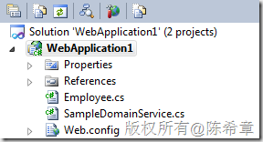](http://images.cnblogs.com/cnblogs_com/chenxizhang/201106/2011061418354835.png)


3. 在Silverlight应用程序中访问这个服务
--------------------------


作为演示，我们做了一个很简单的界面


```
<UserControl x:Class="SilverlightApplication1.MainPage"
    xmlns="http://schemas.microsoft.com/winfx/2006/xaml/presentation"
    xmlns:x="http://schemas.microsoft.com/winfx/2006/xaml"
    xmlns:d="http://schemas.microsoft.com/expression/blend/2008"
    xmlns:mc="http://schemas.openxmlformats.org/markup-compatibility/2006"
    mc:Ignorable="d"
    d:DesignHeight="300" d:DesignWidth="400" xmlns:sdk="http://schemas.microsoft.com/winfx/2006/xaml/presentation/sdk">

    <Grid x:Name="LayoutRoot" Background="White">
        <sdk:DataGrid AutoGenerateColumns="True" Margin="24,53,21,25" Name="dataGrid1" />
        <TextBlock Height="33" HorizontalAlignment="Left" Margin="25,14,0,0" Name="textBlock1" Text="Employee List" VerticalAlignment="Top" Width="219" FontSize="25"  />
    </Grid>
</UserControl>

```


.csharpcode, .csharpcode pre
{
 font-size: small;
 color: black;
 font-family: consolas, "Courier New", courier, monospace;
 background-color: #ffffff;
 /*white-space: pre;*/
}
.csharpcode pre { margin: 0em; }
.csharpcode .rem { color: #008000; }
.csharpcode .kwrd { color: #0000ff; }
.csharpcode .str { color: #006080; }
.csharpcode .op { color: #0000c0; }
.csharpcode .preproc { color: #cc6633; }
.csharpcode .asp { background-color: #ffff00; }
.csharpcode .html { color: #800000; }
.csharpcode .attr { color: #ff0000; }
.csharpcode .alt 
{
 background-color: #f4f4f4;
 width: 100%;
 margin: 0em;
}
.csharpcode .lnum { color: #606060; }


然后通过如下的代码调用数据


```
using System.Windows;
using System.Windows.Controls;

namespace SilverlightApplication1
{

    using WebApplication1;

    public partial class MainPage : UserControl
    {
        public MainPage()
        {
            InitializeComponent();

            Loaded += new RoutedEventHandler(MainPage\_Loaded);
        }

        void MainPage\_Loaded(object sender, RoutedEventArgs e)
        {
            var ctx = new SampleDomainContext();
            var op = ctx.Load<Employee>(ctx.GetEmployeesQuery());
            dataGrid1.ItemsSource = op.Entities;
        }
    }
}

```


.csharpcode, .csharpcode pre
{
 font-size: small;
 color: black;
 font-family: consolas, "Courier New", courier, monospace;
 background-color: #ffffff;
 /*white-space: pre;*/
}
.csharpcode pre { margin: 0em; }
.csharpcode .rem { color: #008000; }
.csharpcode .kwrd { color: #0000ff; }
.csharpcode .str { color: #006080; }
.csharpcode .op { color: #0000c0; }
.csharpcode .preproc { color: #cc6633; }
.csharpcode .asp { background-color: #ffff00; }
.csharpcode .html { color: #800000; }
.csharpcode .attr { color: #ff0000; }
.csharpcode .alt 
{
 background-color: #f4f4f4;
 width: 100%;
 margin: 0em;
}
.csharpcode .lnum { color: #606060; }


从上面的代码不难看出，在Silverlight调用RIA Service的时候，是相当容易的，这里不用指定路径，也无需有其他更多设置。


得到的页面效果如下


[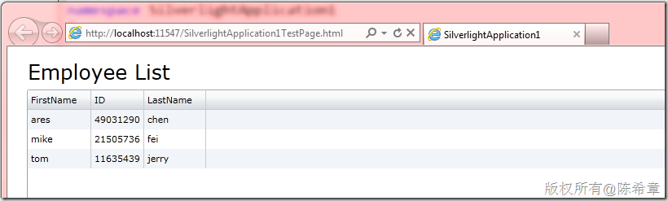](http://images.cnblogs.com/cnblogs_com/chenxizhang/201106/201106141835496720.png)


你可能会有一个疑问，那么到底是调用了什么服务呢？


我们通过IE 9自带的开发工具，可以监控一下得到一个特殊的WCF地址


[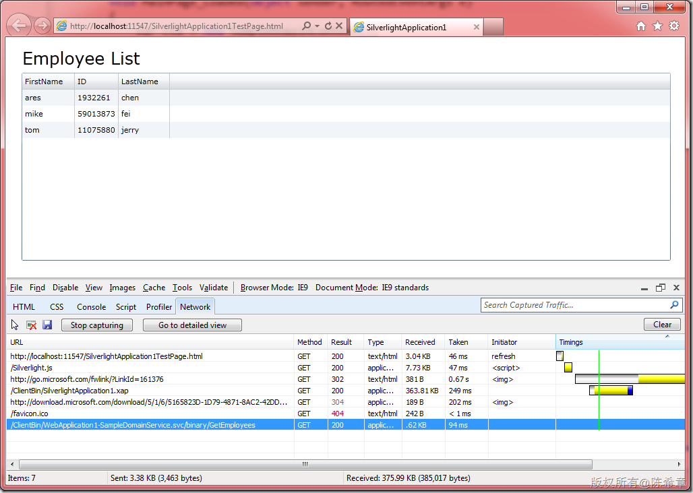](http://images.cnblogs.com/cnblogs_com/chenxizhang/201106/201106141835509295.png)


最后一行，很明显是一个WCF的调用地址，我们很好奇的是，它到底传递了什么东西过来呢？


[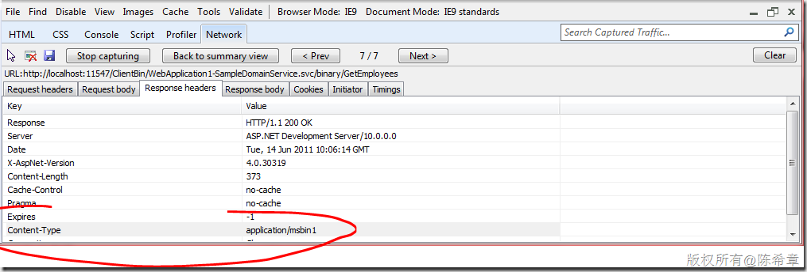](http://images.cnblogs.com/cnblogs_com/chenxizhang/201106/201106141835508248.png)


该服务返回的其实是一个二进制的包，具体内容如下


[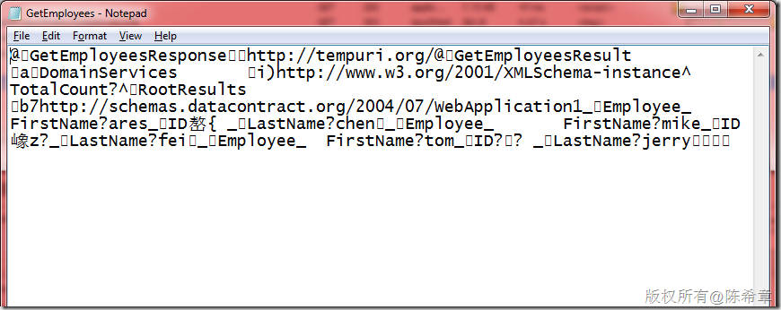](http://images.cnblogs.com/cnblogs_com/chenxizhang/201106/201106141835506886.png)


虽然不能完全看懂，但可以确定的是，这是二进制序列化的结果。


那好，我们回到刚才的话题，既然这是一个WCF服务，而且也确实有一个隐含的svc地址（注意，我说的是隐含，因为物理上并不存在该文件），那么是否可以通过该地址，发起普通的服务调用呢？


我们尝试将[http://localhost:11547/ClientBin/WebApplication1-SampleDomainService.svc](http://localhost:11547/ClientBin/WebApplication1-SampleDomainService.svc "http://localhost:11547/ClientBin/WebApplication1-SampleDomainService.svc") 这个地址输入到浏览器地址栏


[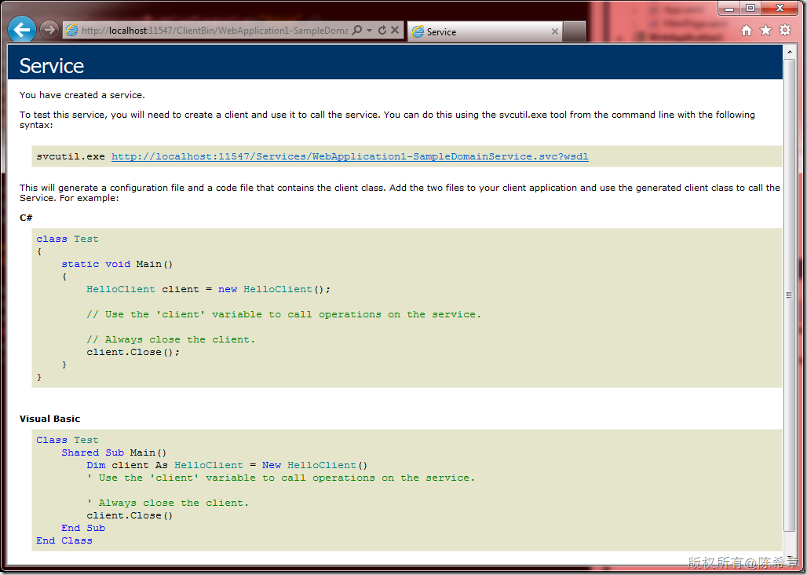](http://images.cnblogs.com/cnblogs_com/chenxizhang/201106/201106141835513330.png)


令人欣喜的是，我们看到了熟悉的WCF WSDL的界面。


那么，这是否意味着，我们可以在除了Silverlight之外的其他应用程序中调用该服务呢？


 


4. 创建WPF应用程序，添加服务引用
-------------------


很不幸的是，我们在WPF中尝试添加服务引用时，却会遇到下面的错误


[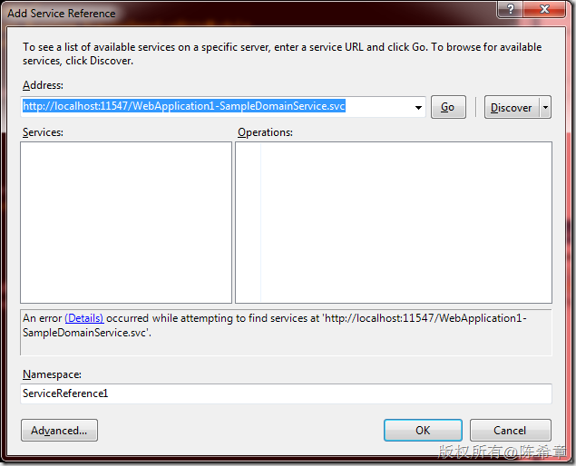](http://images.cnblogs.com/cnblogs_com/chenxizhang/201106/201106141835519460.png)


详细的错误如下，意思是说，没有找到有关的endpoint.


[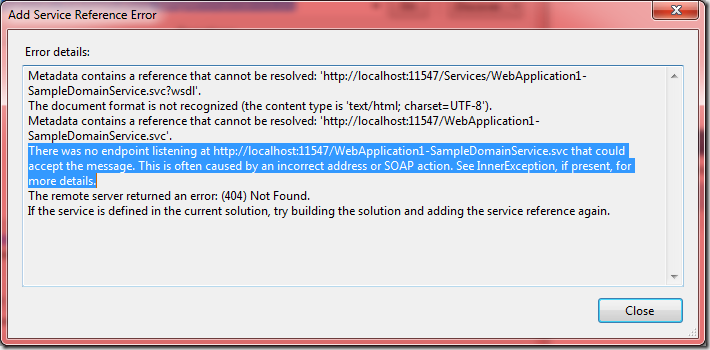](http://images.cnblogs.com/cnblogs_com/chenxizhang/201106/201106141835519493.png)


 


5. 安装RIA Service Toolkit以便添加SOAP EndPoint支持
-------------------------------------------


为了解决如上的问题，微软在4月份发布了一个Toolkit,可以为RIA Service添加SOAP EndPoint支持


请先通过下面的地址下载


<http://www.microsoft.com/download/en/details.aspx?id=2384>


具体来说，这个工具包提供了很多增强的功能


> 
> **What is available in the Toolkit?**  
> The following functionality are available in this release of the Toolkit:-  
> 1. LinqToSql DomainService  
> 2. Soap endpoint - This enables you to expose a soap endpoint for your DomainService  
> 3. JSON endpoint - This enables you to expose a JSON endpoint for your DomainService  
> 4. ASP.NET DomainDataSource - This control will enable you to create an ASP.net application that can talk to your DomainService  
> 5. WCF client proxy auto generation/updating for WCF Core Service – This enables you to get up-to-date WCF proxy and configuration each time you build your solution, when you add Silverlight-enable WCF service in your Silverlight application.  
> 6. Domain Service support for Windows Azure Table Storage. When hosting WCF RIA Services in Windows Azure, you can now easily leverage Windows Azure Table Storage as your data backend. (Requires Windows Azure SDK 1.3)  
> 7. T4 template based client code generation. The feature leverages the code generation extensibility point added to the product and provides a well factored and granular mechanism to customize client code generation logic using T4 templates.  
> 8. CollectionView to enable MVVM Patterns  
> 9. An early preview of the jQuery client for WCF RIA Services (RIA/JS)
> 
> 


  安装好之后，我们会得到一些Assembly，在如下的目录
C:\Program Files (x86)\Microsoft SDKs\RIA Services\v1.0\Toolkit\Libraries\Server
  本例中，我们将使用其中一个Microsoft.ServiceModel.DomainServices.Hosting.dll 来提供SOAP EndPoint支持，所以我们要将其添加到Web项目的引用列表中来
[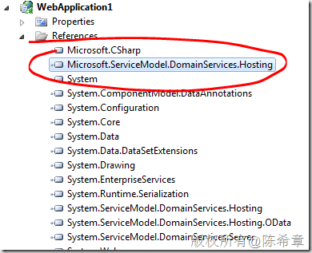](http://images.cnblogs.com/cnblogs_com/chenxizhang/201106/201106141835527018.png)
  6. 修改Web.config，添加SOAP EndPoint
-------------------------------


熟悉WCF的朋友都知道，WCF是基于配置的，无处不在的配置使得服务很灵活并且强大。本例中，我们也只需要修改配置文件，就可以完成添加SOAP EndPoint的工作。下面的粗体部分是我们添加的


```
    <system.serviceModel>
        <domainServices>
            <endpoints>
                <add name="OData" type="System.ServiceModel.DomainServices.Hosting.ODataEndpointFactory, System.ServiceModel.DomainServices.Hosting.OData, Version=4.0.0.0, Culture=neutral, PublicKeyToken=31bf3856ad364e35" />
          **<add name="Soap" type****="Microsoft.ServiceModel.DomainServices.Hosting.SoapXmlEndpointFactory, 
 Microsoft.ServiceModel.DomainServices.Hosting, Version=4.0.0.0, Culture=neutral, 
 PublicKeyToken=31bf3856ad364e35" />**
            </endpoints>
        </domainServices>
        <serviceHostingEnvironment aspNetCompatibilityEnabled="true"
            multipleSiteBindingsEnabled="true" />
    </system.serviceModel>
```

```
 
```

```
 
```

保存配置文件，我们再去浏览器中访问该服务。你有没有发现有什么不同呢？如果有，请告诉我吧


[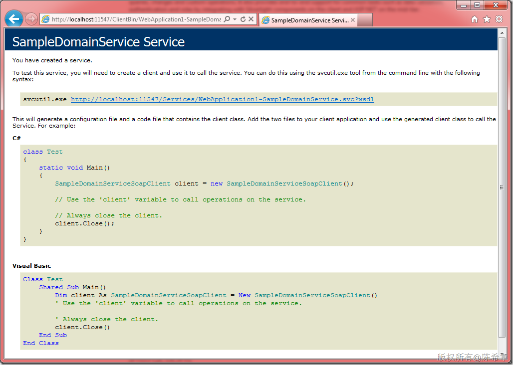](http://images.cnblogs.com/cnblogs_com/chenxizhang/201106/201106141835527051.png)


 


7. 在WPF中完成服务引用，并且使用它发起调用
------------------------


[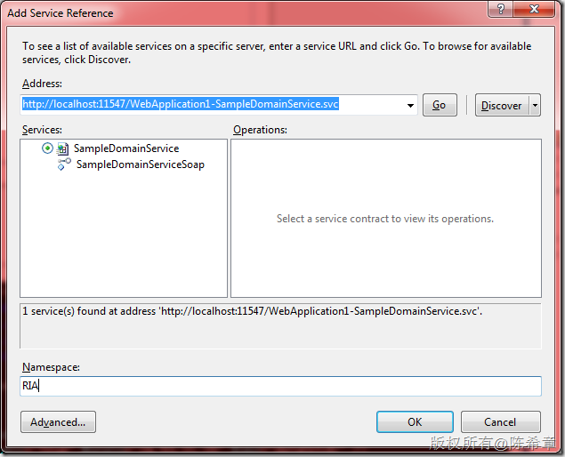](http://images.cnblogs.com/cnblogs_com/chenxizhang/201106/201106141835525447.png)


是的，你没有看错，我们找到了这个服务。


好吧，既然能够添加引用，接下来的事情你应该会做了吧？当然，不是很难，你懂的


MainWindow.xaml


```
<Window x:Class="WpfApplication1.MainWindow"
        xmlns="http://schemas.microsoft.com/winfx/2006/xaml/presentation"
        xmlns:x="http://schemas.microsoft.com/winfx/2006/xaml"
        Title="MainWindow" Height="350" Width="525">
    <Grid>
        <DataGrid AutoGenerateColumns="True" Margin="12,62,12,12" Name="dataGrid1" />
        <TextBlock Height="33" HorizontalAlignment="Left" Margin="12,23,0,0" Name="textBlock1" Text="Employee List" FontSize="25" VerticalAlignment="Top" Width="224" />
    </Grid>
</Window>

```

.csharpcode, .csharpcode pre
{
 font-size: small;
 color: black;
 font-family: consolas, "Courier New", courier, monospace;
 background-color: #ffffff;
 /*white-space: pre;*/
}
.csharpcode pre { margin: 0em; }
.csharpcode .rem { color: #008000; }
.csharpcode .kwrd { color: #0000ff; }
.csharpcode .str { color: #006080; }
.csharpcode .op { color: #0000c0; }
.csharpcode .preproc { color: #cc6633; }
.csharpcode .asp { background-color: #ffff00; }
.csharpcode .html { color: #800000; }
.csharpcode .attr { color: #ff0000; }
.csharpcode .alt 
{
 background-color: #f4f4f4;
 width: 100%;
 margin: 0em;
}
.csharpcode .lnum { color: #606060; }

.csharpcode, .csharpcode pre
{
 font-size: small;
 color: black;
 font-family: consolas, "Courier New", courier, monospace;
 background-color: #ffffff;
 /*white-space: pre;*/
}
.csharpcode pre { margin: 0em; }
.csharpcode .rem { color: #008000; }
.csharpcode .kwrd { color: #0000ff; }
.csharpcode .str { color: #006080; }
.csharpcode .op { color: #0000c0; }
.csharpcode .preproc { color: #cc6633; }
.csharpcode .asp { background-color: #ffff00; }
.csharpcode .html { color: #800000; }
.csharpcode .attr { color: #ff0000; }
.csharpcode .alt 
{
 background-color: #f4f4f4;
 width: 100%;
 margin: 0em;
}
.csharpcode .lnum { color: #606060; }

 


 


MainWindow.xaml.cs


```
using System.Windows;

namespace WpfApplication1
{
    /// <summary>
    /// Interaction logic for MainWindow.xaml
    /// </summary>
    public partial class MainWindow : Window
    {
        public MainWindow()
        {
            InitializeComponent();

            Loaded += new RoutedEventHandler(MainWindow\_Loaded);
        }

        void MainWindow\_Loaded(object sender, RoutedEventArgs e)
        {
            var proxy = new RIA.SampleDomainServiceSoapClient();
            dataGrid1.ItemsSource = proxy.GetEmployees().RootResults;
        }
    }
}

```


.csharpcode, .csharpcode pre
{
 font-size: small;
 color: black;
 font-family: consolas, "Courier New", courier, monospace;
 background-color: #ffffff;
 /*white-space: pre;*/
}
.csharpcode pre { margin: 0em; }
.csharpcode .rem { color: #008000; }
.csharpcode .kwrd { color: #0000ff; }
.csharpcode .str { color: #006080; }
.csharpcode .op { color: #0000c0; }
.csharpcode .preproc { color: #cc6633; }
.csharpcode .asp { background-color: #ffff00; }
.csharpcode .html { color: #800000; }
.csharpcode .attr { color: #ff0000; }
.csharpcode .alt 
{
 background-color: #f4f4f4;
 width: 100%;
 margin: 0em;
}
.csharpcode .lnum { color: #606060; }


[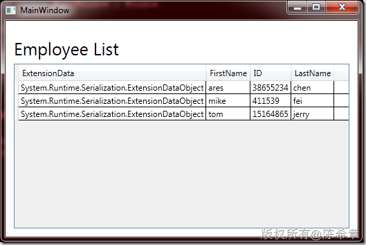](http://images.cnblogs.com/cnblogs_com/chenxizhang/201106/201106141835539625.png)


BTW:我觉得WPF的界面（例如这个DataGrid)看起来没有Silverlight那么好看，不是吗？ 当然，这个话题还是等我们以后有机会再来谈谈吧


 


总结
--


RIA Service默认只能被Silverlight访问，它确实极其方便。如果希望它能被其他客户代码访问到，则可以通过安装RIA Service Toolkit，为其添加SOAP Endpoint来实现。


