# 如何理解IIS 7的两种应用程序池的管道模式（Managed Pipeline Mode) 
> 原文发表于 2011-06-19, 地址: http://www.cnblogs.com/chenxizhang/archive/2011/06/19/2084579.html 


之前我写过一篇[博客文章](http://www.cnblogs.com/chenxizhang/archive/2010/06/02/1750236.html)，讲的是.NET 4.0的应用程序部署问题。有网友问到一个相关问题就是：如何理解IIS 7中的应用程序池的管道模式，尤其是如何理解“托管模型（integrated mode)”，今天特意再写一篇文章来介绍这个问题。

  

 IIS 7是微软最新版本的IIS版本，从Vista开始提供，目前在Vista，Windows 7，Windows Server 2008中提供。这个全新的版本中，一个突出的亮点就是，它提供了两种管道模式，来支持不同的应用程序场景。

  

 这里提到的管道模式，指的是应用程序池（Application Pool）的一个属性

 [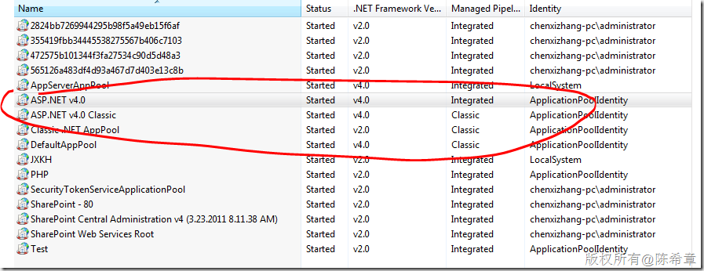](http://images.cnblogs.com/cnblogs_com/chenxizhang/201106/201106191116522902.png)  


 上图中可以看到，这两种管道模式分别为Integrated(集成）和 Classic(经典）

 那么，到底如何理解这两种模式呢？

 **Classic模式：**指的是与IIS 6或者之前版本保持兼容的一种模式，一个典型问题就是，在处理ASP.NET这种动态网站的时候，它是通过一个所谓的ISAPI程序，作为插件的方式来工作的。针对不同的动态应用程序（例如ASP,PHP等），会需要不同的ISAPI。

 例如，下面就是一个注册号的ISAPI映射

 [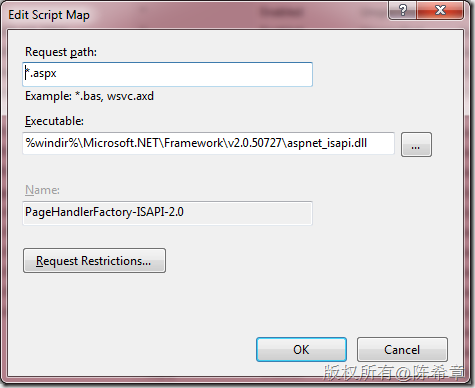](http://images.cnblogs.com/cnblogs_com/chenxizhang/201106/201106191116575905.png)

 从上图可以看出，不同的Request,指定了不同的ISAPI程序。下图是对于这种Pipeline的一个图形化说明

 [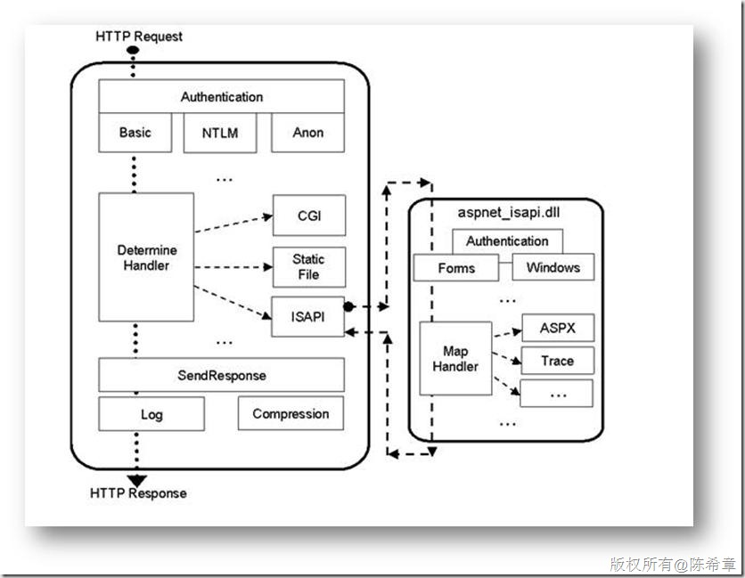](http://images.cnblogs.com/cnblogs_com/chenxizhang/201106/20110619111701205.jpg)

  

 **Integrated模式**：这种全新的模式，允许我们将ASP.NET更好地与IIS集成，甚至允许我们在ASP.NET中编写一些功能（例如Module）来改变IIS的行为（扩展）。集成的好处是，不再通过ISAPI的方式，提高了速度和稳定性。至于扩展，则可以使得我们对于IIS，以及其他类型的请求有更多的控制。（例如，我们希望静态网页也具备一些特殊的行为）

 下图解释了这一点。

 [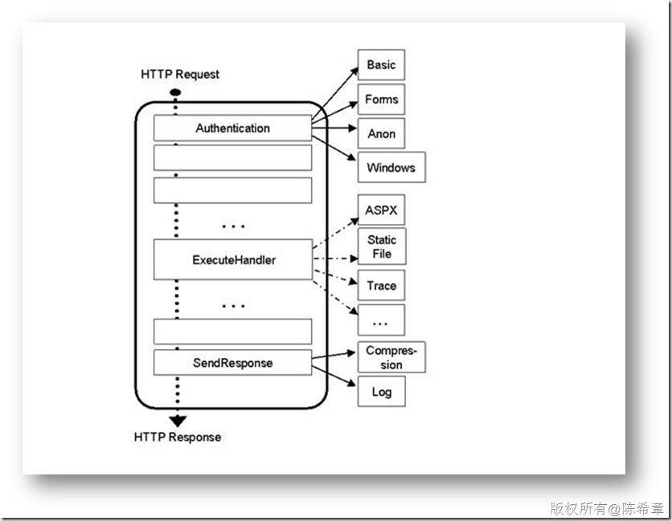](http://images.cnblogs.com/cnblogs_com/chenxizhang/201106/201106191117076405.jpg)

 以上两个图片来自与下面这个文章，并且该文章有更详细的一些理论介绍。

 <http://learn.iis.net/page.aspx/243/aspnet-integration-with-iis-7/>

  

 下面，我就通过一个例子，来帮助大家更好地了解集成模型。

 这个例子里面，我有一个特殊的需求就是，我希望对网站里面所有请求做一个日志监控，不管是动态网页，还是静态网页。

  

 1. 创建一个Web Application
----------------------

 [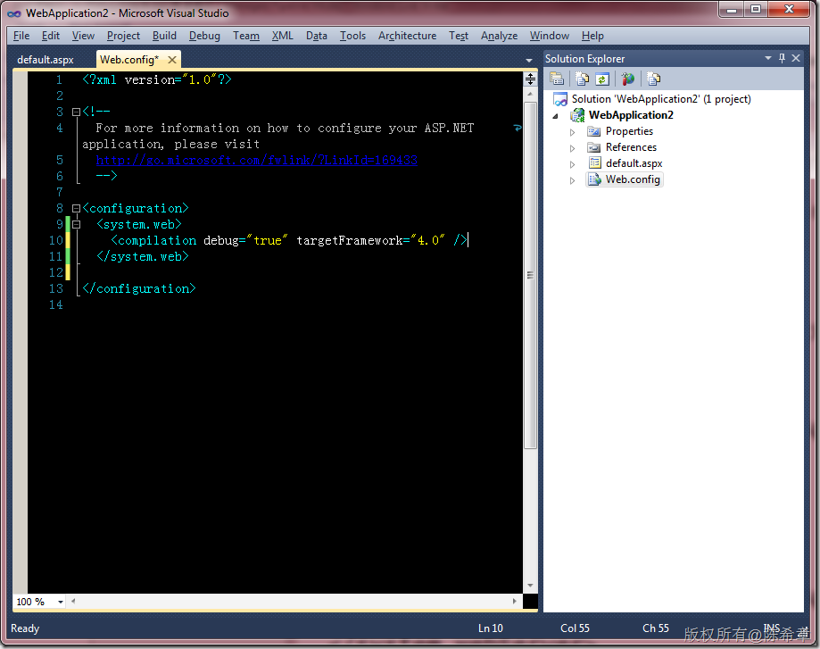](http://images.cnblogs.com/cnblogs_com/chenxizhang/201106/201106191117134873.png)

  

 2. 添加一个HttpModule
-----------------

 为了对用户请求进行监控，我们一般会编写一个HttpModule

 [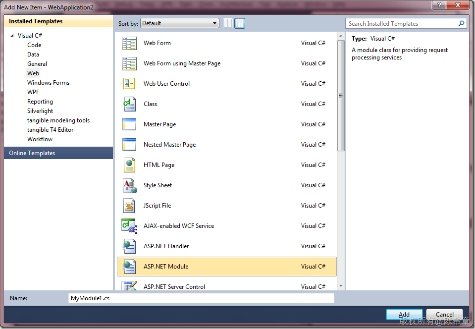](http://images.cnblogs.com/cnblogs_com/chenxizhang/201106/201106191117203157.png)

 [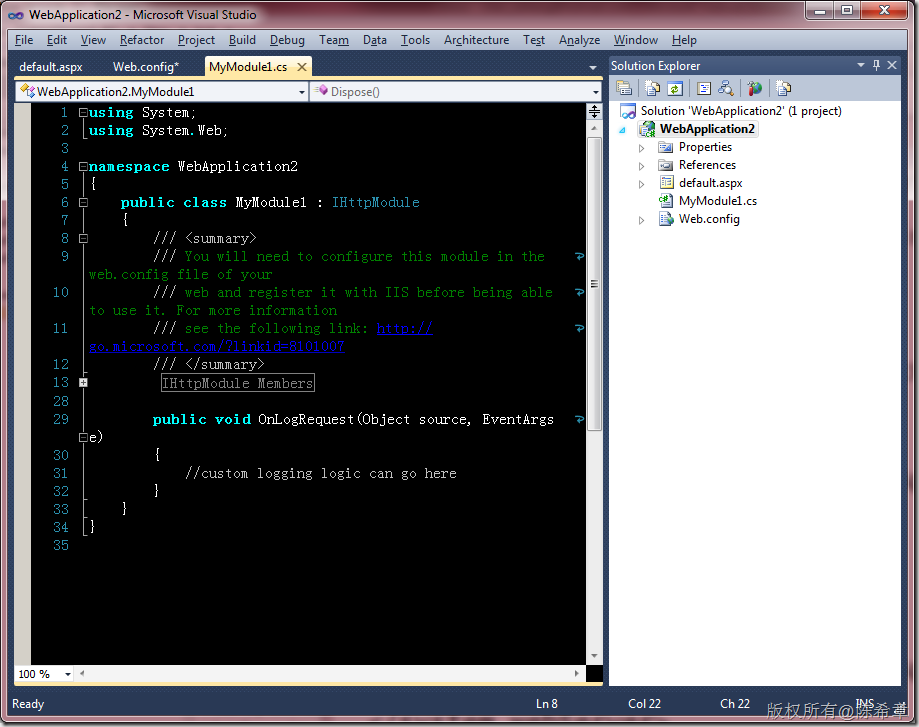](http://images.cnblogs.com/cnblogs_com/chenxizhang/201106/201106191117312885.png)

 我为该模块实现简单的功能（将用户的请求地址打印出来在页面上）


```
using System;
using System.Web;

namespace WebApplication2
{
    public class MyModule1 : IHttpModule
    {
        /// <summary>
        /// You will need to configure this module in the web.config file of your
        /// web and register it with IIS before being able to use it. For more information
        /// see the following link: http://go.microsoft.com/?linkid=8101007
        /// </summary>
        #region IHttpModule Members

        public void Dispose()
        {
            //clean-up code here.
        }

        public void Init(HttpApplication context)
        {
            // Below is an example of how you can handle LogRequest event and provide 
            // custom logging implementation for it
            context.LogRequest += new EventHandler(OnLogRequest);
        }

        #endregion

        public void OnLogRequest(Object source, EventArgs e)
        {
            //custom logging logic can go here
            var app = (HttpApplication)source;
            app.Response.Write(app.Request.Url.ToString());
        }
    }
}

```

.csharpcode, .csharpcode pre
{
 font-size: small;
 color: black;
 font-family: consolas, "Courier New", courier, monospace;
 background-color: #ffffff;
 /*white-space: pre;*/
}
.csharpcode pre { margin: 0em; }
.csharpcode .rem { color: #008000; }
.csharpcode .kwrd { color: #0000ff; }
.csharpcode .str { color: #006080; }
.csharpcode .op { color: #0000c0; }
.csharpcode .preproc { color: #cc6633; }
.csharpcode .asp { background-color: #ffff00; }
.csharpcode .html { color: #800000; }
.csharpcode .attr { color: #ff0000; }
.csharpcode .alt 
{
 background-color: #f4f4f4;
 width: 100%;
 margin: 0em;
}
.csharpcode .lnum { color: #606060; }

 


3.注册该模块
-------


模块是需要注册才能够使用的。我们一般会想到以前的做法


```
  <system.web>
    <compilation debug="true" targetFramework="4.0" />
    <httpModules>
      <add name="test" type="WebApplication2.MyModule1,WebApplication2"/>
    </httpModules>
  </system.web>

```


.csharpcode, .csharpcode pre
{
 font-size: small;
 color: black;
 font-family: consolas, "Courier New", courier, monospace;
 background-color: #ffffff;
 /*white-space: pre;*/
}
.csharpcode pre { margin: 0em; }
.csharpcode .rem { color: #008000; }
.csharpcode .kwrd { color: #0000ff; }
.csharpcode .str { color: #006080; }
.csharpcode .op { color: #0000c0; }
.csharpcode .preproc { color: #cc6633; }
.csharpcode .asp { background-color: #ffff00; }
.csharpcode .html { color: #800000; }
.csharpcode .attr { color: #ff0000; }
.csharpcode .alt 
{
 background-color: #f4f4f4;
 width: 100%;
 margin: 0em;
}
.csharpcode .lnum { color: #606060; }


但这样注册，会遇到一个错误


[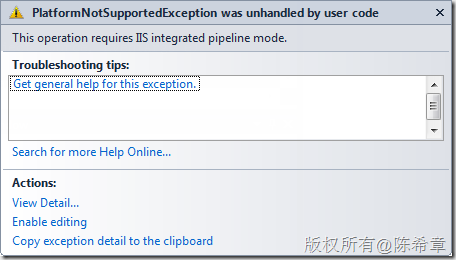](http://images.cnblogs.com/cnblogs_com/chenxizhang/201106/201106191117351395.png)


这个错误的意思是，LogRequest这个操作，是必须运行在集成模式下的。


那么，到底如何注册成集成模式的模块呢？


我们需要将配置文件修改成下面这样


```
<?xml version="1.0"?>

<!--
 For more information on how to configure your ASP.NET application, please visit
 http://go.microsoft.com/fwlink/?LinkId=169433
 -->

<configuration>
  <system.web>
    <compilation debug="true" targetFramework="4.0" />
    <!--<httpModules>
 <add name="test" type="WebApplication2.MyModule1,WebApplication2"/>
 </httpModules>-->
  </system.web>

  <system.webServer>
    <modules>
      <add name="test" type="WebApplication2.MyModule1,WebApplication2"/>
    </modules>
  </system.webServer>

</configuration>

```


.csharpcode, .csharpcode pre
{
 font-size: small;
 color: black;
 font-family: consolas, "Courier New", courier, monospace;
 background-color: #ffffff;
 /*white-space: pre;*/
}
.csharpcode pre { margin: 0em; }
.csharpcode .rem { color: #008000; }
.csharpcode .kwrd { color: #0000ff; }
.csharpcode .str { color: #006080; }
.csharpcode .op { color: #0000c0; }
.csharpcode .preproc { color: #cc6633; }
.csharpcode .asp { background-color: #ffff00; }
.csharpcode .html { color: #800000; }
.csharpcode .attr { color: #ff0000; }
.csharpcode .alt 
{
 background-color: #f4f4f4;
 width: 100%;
 margin: 0em;
}
.csharpcode .lnum { color: #606060; }


请注意，现在多了一个system.webServer的节，里面有一个modules的节，可以配置需要注册的一些HttpModule


因为是注册为system.webServer的Module，所以，在visual studio中调试是没有效果的


[](http://images.cnblogs.com/cnblogs_com/chenxizhang/201106/201106191117386709.png)


我们需要将该应用程序发布到IIS，并且设置为integrated mode。


 


4.发布到IIS
--------


有很多办法进行发布，我所推荐的是用deploy package的方式。


[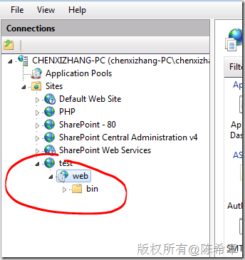](http://images.cnblogs.com/cnblogs_com/chenxizhang/201106/201106191117426582.png)


请注意，我们使用的Application Pool是integrated mode的


[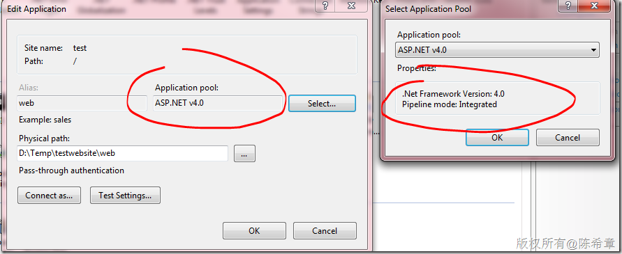](http://images.cnblogs.com/cnblogs_com/chenxizhang/201106/201106191117485540.png)


 


发布之后，我们在浏览器中浏览首页，我们会发现在底部会有一个特殊的输出，就是我们当前请求的地址信息。这说明，我们那个Module已经在工作了。


 


[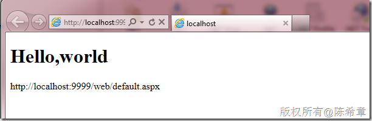](http://images.cnblogs.com/cnblogs_com/chenxizhang/201106/201106191117534673.png)


 


5.测试该模块对于静态页面的支持
----------------


如果仅仅是上面这样，我们似乎看不出这种模式到底有何优势。我们以前不也是可以实现这样的效果吗？


请你主要的是，以前的HttpModule只能影响到动态网页，例如我们的ASPX网页，而对于静态网页（例如html)，或者其他类型的动态网页（例如php等）是无能为力的。


那么，现在这种模式下情况是怎样的呢？


我们可以添加一个简单的html页面，放在网站根目录下


[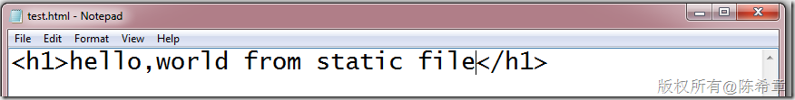](http://images.cnblogs.com/cnblogs_com/chenxizhang/201106/2011061911175619.png)


然后，我们去请求该页面


[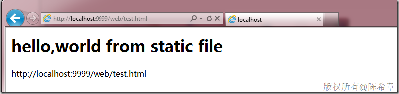](http://images.cnblogs.com/cnblogs_com/chenxizhang/201106/201106191118007351.png)


是不是很神奇呢？虽然是静态网页，但因为我们那个模块是注册在IIS里面的，它改变了IIS的行为，所以仍然会在页面底部插入一段输出。


 


6.总结
----


希望上面这样的例子可以帮助大家更好地理解Integrated mode。它是允许我们将代码插入到IIS内核中，而不再通过ISAPI的方式。这将带来更好的性能和扩展性。

