# WCF技术的不同应用场景及其实现分析 
> 原文发表于 2011-06-21, 地址: http://www.cnblogs.com/chenxizhang/archive/2011/06/21/2085979.html 


这一篇文章，是总结一下WCF技术，以及基于这个技术发展出来的几个典型应用场景，并且我将尝试对这些不同的WCF实现的原理进行一些比较分析。

 关于WCF这个技术的基本概念，如果你不是很清楚，可以参考一下有关的文档

 微软开发者中心

 <http://msdn.microsoft.com/en-us/netframework/aa663324>

  

 我的博客中先前也有很多这方面的介绍

 <http://zzk.cnblogs.com/s?w=blog%3achenxizhang+wcf&p=1>

  

 言归正传，我将先概括一下WCF技术的背景、核心要素、目前的典型应用场景。然后针对这些应用场景进一步地展开一些分析和比较，以便帮助大家更好地理解，并且知道在何时应该选用哪一种场景。（即便你没有时间去看那么多资料，通过本文也将有一个提纲挈领的认识）

  

 历史背景：
-----

 WCF，全称是Windows Communication Founcation，它作为微软新一代的通讯技术，首先正式出现在.NET Framework 3.0中，伴随着Windows Vista的发布而名噪一时。在此之前，曾经作为Winfx的一部分为人所知，其代号为indigo。

 作为Foundation（基础模块），WCF是定位在微软.NET平台上实现统一的消息服务通讯机制。它很好地吸收了之前的多种分布式开发技术的优点，并且提供了统一的编程和访问的模型，逐渐成为SOA解决方案中的主流技术，受到了广泛的关注和使用。

 [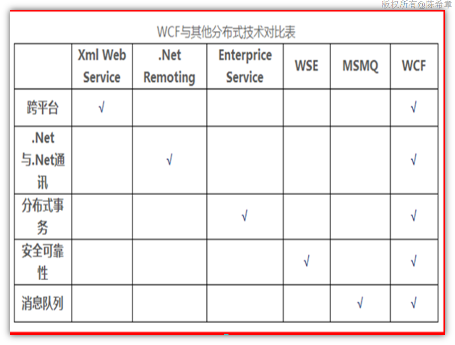](http://images.cnblogs.com/cnblogs_com/chenxizhang/201106/201106211353035673.png)  


 核心要素：
-----

 从技术层面理解WCF，可以分为三个要素（俗称WCF的ABC)

 
>  1.**A**ddress（where)：地址，是指访问服务的URI（可以是一个http地址，也可以是tcp的地址）
> 
>  2.**B**inding（how）：绑定，是指通讯所使用的协议，例如http,net.tcp,msmq等等
> 
>  3.**C**ontract（what）：合约，是指通讯的规范，例如服务的合约，数据的合约等等。
> 
> 

  

 从系统层面理解WCF,可以分为四个要素

 
>  1.Contract：合约，定义一套合约，通常是WCF开发的起点。这也是唯一需要在宿主和客户端之间共享的信息，通常是一些接口(interface)定义。
> 
>  2.Service：服务，基于合约实现的一个具体服务。通常是一些类型（class)定义，实现了业务逻辑。
> 
>  3.Host：宿主，既然服务是一个class，它自身是无法对客户端请求进行响应的。所以需要有一个宿主程序来提供持续的监听。WCF的宿主可以是任意的应用程序，非常灵活。
> 
>  4.Client：客户端，任何客户端（例如Windows Forms，WPF, Silverlight，Console Application，甚至Javascript，或者java，php等等）都可以通过自己的方式来访问WCF.
> 
> 

  

 应用场景：
-----

 WCF 从发布到现在的将近5年左右的时间，经过了多次增强和改进，从最开始单纯的SOAP Service的方式，发展出来其他多种应用场景，分别是

 
>  1. SOAP Services
> 
>  2. WebHttp Services
> 
>  3. Data Services
> 
>  4. Workflow Services
> 
>  5. RIA Services
> 
> 

  

 下面我将针对这些应用场景一一进行讲解

 【注意】我经常使用WCF技术以及一些讲座中，都会感慨WCF配置的强大。宿主和客户端都可以通过配置文件的方式定义、更改WCF服务的行为。可以这么说，在WCF中，几乎什么都可以配置。这确实很酷。所以下面的讲解，很多都是用配置文件的方式来说明问题。

  

 1. SOAP Services
----------------

 这种场景是WCF一开始就支持的，也是最完整的一个。

 为什么称为SOAP Services呢？这是因为WCF服务是基于消息的通讯机制，而它的消息是被封装为一个SOAP Envelope（SOAP 信封的）

 【备注】SOAP的全称是Simple Object Access Protocol，我们一般翻译为简单对象访问协议。

 一个典型的SOAP Request（代表了客户端发到服务器的请求）

 [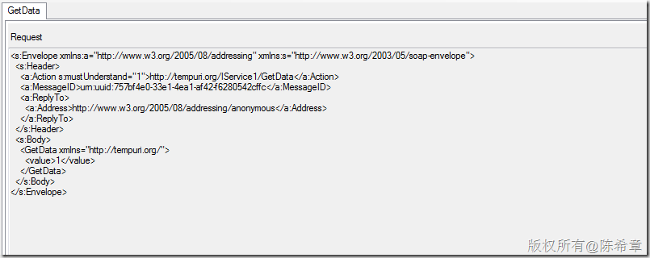](http://images.cnblogs.com/cnblogs_com/chenxizhang/201106/201106211353031071.png)

 一个典型的SOAP Response

 [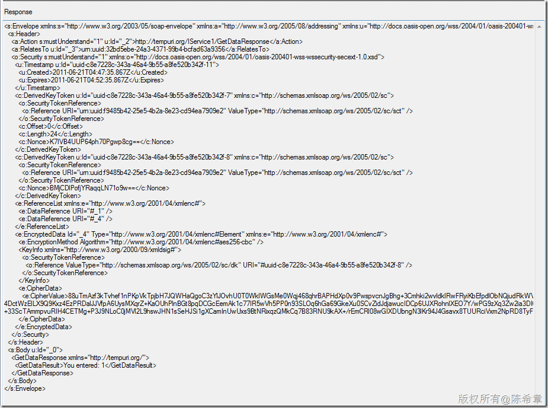](http://images.cnblogs.com/cnblogs_com/chenxizhang/201106/201106211353049152.png)

 这种服务是以操作(Operation)为中心的，也就是说，我们可以完全控制服务的所有细节，包括定义合约，实现服务，实现宿主等等。这里面有两层意思，我们将有足够的灵活性，因为所有一切都是可以控制的；同时，我们也需要具备足够的专业知识，因为所有一切都需要你自己控制。

 我们来看一个典型的WCF SOAP Service的配置文件


```
  <system.serviceModel>
    <services>
      <service name="WcfService2.Service1" behaviorConfiguration="WcfService2.Service1Behavior">
        <!-- Service Endpoints -->
        <endpoint address="" binding="wsHttpBinding" contract="WcfService2.IService1">
          <!-- 
 Upon deployment, the following identity element should be removed or replaced to reflect the 
 identity under which the deployed service runs. If removed, WCF will infer an appropriate identity 
 automatically.
 -->
          <identity>
            <dns value="localhost"/>
          </identity>
        </endpoint>
        <endpoint address="mex" binding="mexHttpBinding" contract="IMetadataExchange"/>
      </service>
    </services>
    <behaviors>
      <serviceBehaviors>
        <behavior name="WcfService2.Service1Behavior">
          <!-- To avoid disclosing metadata information, set the value below to false and remove the metadata endpoint above before deployment -->
          <serviceMetadata httpGetEnabled="true"/>
          <!-- To receive exception details in faults for debugging purposes, set the value below to true. Set to false before deployment to avoid disclosing exception information -->
          <serviceDebug includeExceptionDetailInFaults="false"/>
        </behavior>
      </serviceBehaviors>
    </behaviors>
  </system.serviceModel>

```

.csharpcode, .csharpcode pre
{
 font-size: small;
 color: black;
 font-family: consolas, "Courier New", courier, monospace;
 background-color: #ffffff;
 /*white-space: pre;*/
}
.csharpcode pre { margin: 0em; }
.csharpcode .rem { color: #008000; }
.csharpcode .kwrd { color: #0000ff; }
.csharpcode .str { color: #006080; }
.csharpcode .op { color: #0000c0; }
.csharpcode .preproc { color: #cc6633; }
.csharpcode .asp { background-color: #ffff00; }
.csharpcode .html { color: #800000; }
.csharpcode .attr { color: #ff0000; }
.csharpcode .alt 
{
 background-color: #f4f4f4;
 width: 100%;
 margin: 0em;
}
.csharpcode .lnum { color: #606060; }

 


SOAP Services是从.NET Framework 3.0一开始就提供的，在后续版本中，也有很多改进，包括对WS-*标准更好的支持，以及提供了很多默认的配置选项，简化了配置的工作。


【备注】值得一提的是，微软研发集团上海办公室这边有一个团队，直接参与了WCF的新版本的很多功能和工具的设计和开发，包括对于配置的简化设计。感谢他们的工作。


 


我们来看一个.NET Framework 4.0下面的WCF服务默认的配置文件


```
  <system.serviceModel>
    <behaviors>
      <serviceBehaviors>
        <behavior>
          <!-- To avoid disclosing metadata information, set the value below to false and remove the metadata endpoint above before deployment -->
          <serviceMetadata httpGetEnabled="true"/>
          <!-- To receive exception details in faults for debugging purposes, set the value below to true. Set to false before deployment to avoid disclosing exception information -->
          <serviceDebug includeExceptionDetailInFaults="false"/>
        </behavior>
      </serviceBehaviors>
    </behaviors>
    <serviceHostingEnvironment multipleSiteBindingsEnabled="true" />
  </system.serviceModel>
```

通过简单地比较就可以知道，在.NET Framework 4.0中，我们并没有看到端点（EndPoint）的定义，这是怎么回事呢？难道现在不需要定义端点了吗？当然不是，区别在于，.NET Framework4的ServiceHost将自动地注册几个默认的EndPoint。


【备注】如果不是为了在开发阶段调试需要而开启元数据和调试支持，上面的配置文件，甚至可以是空的，什么都不需要定义。


 


关于ServiceHost以及默认的端点的信息，有兴趣可以参考


<http://msdn.microsoft.com/en-us/library/system.servicemodel.servicehost.aspx>


 


**总结**：采用这种方式进行开发的WCF，可以根据我们的需求，使用任意的Binding，以支持不同的客户端，并且提供在不同的场合下最好的速度，还可以实现诸如缓存，队列，事务协调等高级功能。


 


2. WebHttp Services
-------------------


这种服务的出现，是基于一个比较热的概念：RESTFul。可以这么说，这是WCF Restful的一个具体实现。从.NET Framework 3.5开始提供。


所谓RESTFul的概念，有兴趣可以参考 <http://zh.wikipedia.org/wiki/REST> 以及我之前写过的一些博客文章：<http://zzk.cnblogs.com/s?w=blog%3Achenxizhang%20rest>


 


大致的意思是：


> 
> **表象化状态转变**（英文：**Representational State Transfer**，简称**REST**）是[Roy Fielding](http://zh.wikipedia.org/w/index.php?title=Roy_Fielding&action=edit&redlink=1)博士在2000年他的博士论文中提出来的一种[软件架构](http://zh.wikipedia.org/wiki/%E8%BD%AF%E4%BB%B6%E6%9E%B6%E6%9E%84)风格。
> 目前在三种主流的[Web服务](http://zh.wikipedia.org/wiki/Web%E6%9C%8D%E5%8A%A1)实现方案中，因为REST模式的[Web服务](http://zh.wikipedia.org/wiki/Web%E6%9C%8D%E5%8A%A1)与复杂的[SOAP](http://zh.wikipedia.org/wiki/SOAP)和[XML-RPC](http://zh.wikipedia.org/wiki/XML-RPC)对比来讲明显的更加简洁，越来越多的web服务开始采用REST风格设计和实现。例如，[Amazon.com](http://zh.wikipedia.org/wiki/Amazon.com)提供接近REST风格的Web服务进行图书查找；[雅虎](http://zh.wikipedia.org/wiki/%E9%9B%85%E8%99%8E)提供的Web服务也是REST风格的。
> 
> 
> 
> 


> 
> REST 从资源的角度来观察整个网络，分布在各处的资源由[URI](http://zh.wikipedia.org/wiki/URI)确定，而客户端的应用通过URI来获取资源的表形。获得这些表形致使这些应用程序转变了其状态。随着不断获取资源的表形，客户端应用不断地在转变着其状态，所谓表形化的状态转变（Representational State Transfer）。
> 
> 


今天不是专门来探讨REST的，我们主要看看WCF是如何实现对REST支持，以及如何使用这种风格的服务。
实现WCF Restful，关键在于一个新的Binding方式，也就是WebHttpBinding。所以这种服务，我这里将其称为WebHttp Services。
WebHttp Services是在传统的SOAP Services基础上的一个增强，它仍然是基于操作（Operation）的，只不过这些Operation可以直接通过Uri访问到，而无需客户去编写一个特殊的客户端。
同时，WebHttp Services提供了两种不同的消息格式，第一种是XML，第二种是Json。这将更加有利于诸如Javascript这种客户端来访问服务。
要实现WebHttp，我们首先要添加一个引用，如下
[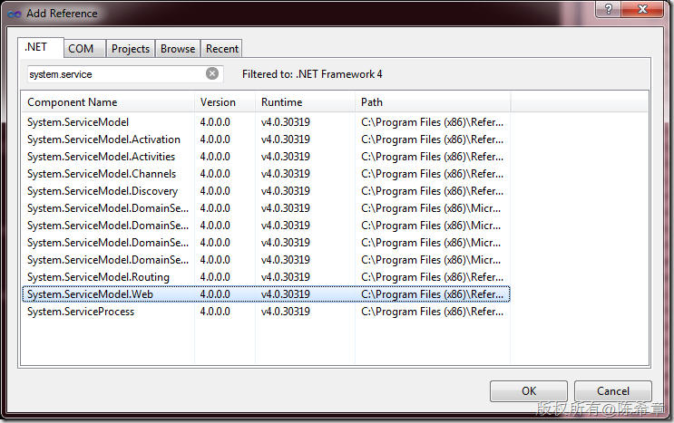](http://images.cnblogs.com/cnblogs_com/chenxizhang/201106/201106211353042250.png)
  然后 ，我们可以定义一个特殊的Operation
```

        [OperationContract]
        [WebGet]
        string HelloWorld();

```

【注意】这里通过WebGet这个Attribute，声明该操作是可以直接在Http访问中访问的


下面是该操作的实现


```
using System;
using System.ServiceModel.Activation;

namespace WcfService1
{
    // NOTE: You can use the "Rename" command on the "Refactor" menu to change the class name "Service1" in code, svc and config file together.
   **[AspNetCompatibilityRequirements(RequirementsMode= AspNetCompatibilityRequirementsMode.Required)]**
    public class Service1 : IService1
    {
        public string GetData(int value)
        {
            return string.Format("You entered: {0}", value);
        }

        public CompositeType GetDataUsingDataContract(CompositeType composite)
        {
            if (composite == null)
            {
                throw new ArgumentNullException("composite");
            }
            if (composite.BoolValue)
            {
                composite.StringValue += "Suffix";
            }
            return composite;
        }


     **public string HelloWorld()
 {
 return "Hello,world";
 }**
    }
}

```

.csharpcode, .csharpcode pre
{
 font-size: small;
 color: black;
 font-family: consolas, "Courier New", courier, monospace;
 background-color: #ffffff;
 /*white-space: pre;*/
}
.csharpcode pre { margin: 0em; }
.csharpcode .rem { color: #008000; }
.csharpcode .kwrd { color: #0000ff; }
.csharpcode .str { color: #006080; }
.csharpcode .op { color: #0000c0; }
.csharpcode .preproc { color: #cc6633; }
.csharpcode .asp { background-color: #ffff00; }
.csharpcode .html { color: #800000; }
.csharpcode .attr { color: #ff0000; }
.csharpcode .alt 
{
 background-color: #f4f4f4;
 width: 100%;
 margin: 0em;
}
.csharpcode .lnum { color: #606060; }

【备注】该服务必须声明为AspNetCompatibility


 


为了使用该服务支持WebHttpBinding,我们需要修改配置文件如下（粗体部分是我们这次添加的）


```
<?xml version="1.0"?>
<configuration>

  <system.web>
    <compilation debug="true" targetFramework="4.0" />
  </system.web>
  <system.serviceModel>
    **<services>
 <service name="WcfService1.Service1">
 <endpoint address="" behaviorConfiguration="WcfService1.Service1AspNetAjaxBehavior"
 binding="webHttpBinding" contract="WcfService1.IService1" />
 </service>
 </services>**
    <behaviors>
      **<endpointBehaviors>
 <behavior name="WcfService1.Service1AspNetAjaxBehavior">
 <enableWebScript />
 </behavior>
 </endpointBehaviors>**
      <serviceBehaviors>
        <behavior name="">
          <serviceMetadata httpGetEnabled="true" />
          <serviceDebug includeExceptionDetailInFaults="false" />
        </behavior>
      </serviceBehaviors>
    </behaviors>
    <serviceHostingEnvironment aspNetCompatibilityEnabled="true"
      multipleSiteBindingsEnabled="true" />
  </system.serviceModel>
 <system.webServer>
    <modules runAllManagedModulesForAllRequests="true"/>
  </system.webServer>
  
</configuration>

```

.csharpcode, .csharpcode pre
{
 font-size: small;
 color: black;
 font-family: consolas, "Courier New", courier, monospace;
 background-color: #ffffff;
 /*white-space: pre;*/
}
.csharpcode pre { margin: 0em; }
.csharpcode .rem { color: #008000; }
.csharpcode .kwrd { color: #0000ff; }
.csharpcode .str { color: #006080; }
.csharpcode .op { color: #0000c0; }
.csharpcode .preproc { color: #cc6633; }
.csharpcode .asp { background-color: #ffff00; }
.csharpcode .html { color: #800000; }
.csharpcode .attr { color: #ff0000; }
.csharpcode .alt 
{
 background-color: #f4f4f4;
 width: 100%;
 margin: 0em;
}
.csharpcode .lnum { color: #606060; }

.csharpcode, .csharpcode pre
{
 font-size: small;
 color: black;
 font-family: consolas, "Courier New", courier, monospace;
 background-color: #ffffff;
 /*white-space: pre;*/
}
.csharpcode pre { margin: 0em; }
.csharpcode .rem { color: #008000; }
.csharpcode .kwrd { color: #0000ff; }
.csharpcode .str { color: #006080; }
.csharpcode .op { color: #0000c0; }
.csharpcode .preproc { color: #cc6633; }
.csharpcode .asp { background-color: #ffff00; }
.csharpcode .html { color: #800000; }
.csharpcode .attr { color: #ff0000; }
.csharpcode .alt 
{
 background-color: #f4f4f4;
 width: 100%;
 margin: 0em;
}
.csharpcode .lnum { color: #606060; }

 


如果是这样的定义，那么在浏览器中我们就可以直接访问该服务及其操作


[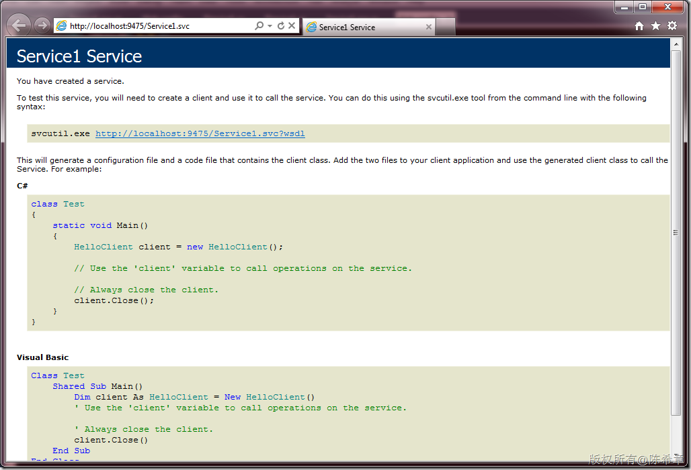](http://images.cnblogs.com/cnblogs_com/chenxizhang/201106/201106211353058728.png)


既然是RESTful，那么就可以直接在地址栏像下面这样访问


[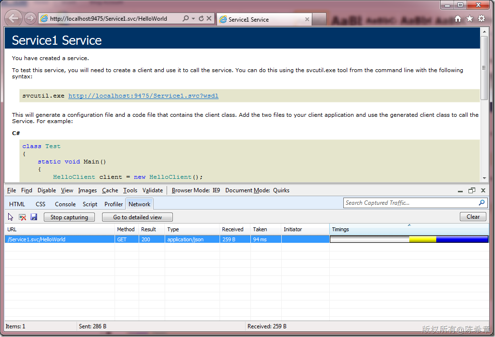](http://images.cnblogs.com/cnblogs_com/chenxizhang/201106/201106211353059317.png)


我们发现它的返回值是application/json格式的


[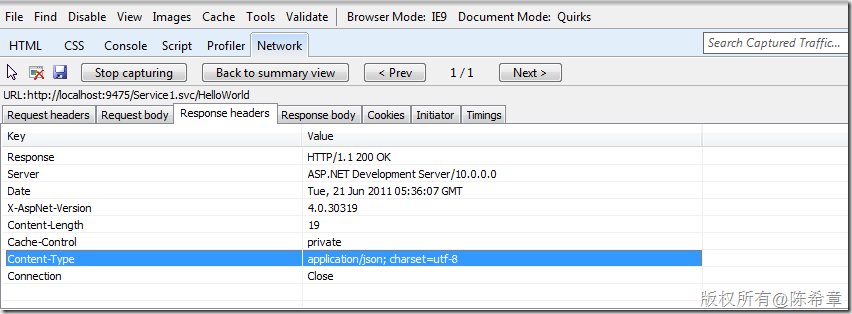](http://images.cnblogs.com/cnblogs_com/chenxizhang/201106/201106211353067398.png)


具体返回的是什么内容呢？


[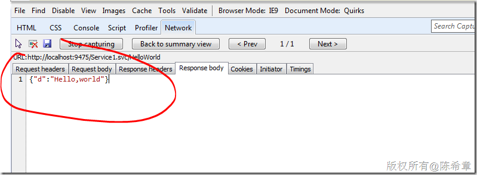](http://images.cnblogs.com/cnblogs_com/chenxizhang/201106/201106211353067431.png)


 


也就是说,WebHttp Service默认是返回json格式的数据的，这就很容易在JAVASCRIPT中使用该服务。例如


```
<%@ Page Language="C#" AutoEventWireup="true" CodeBehind="default.aspx.cs" Inherits="WcfService1.\_default" %>

<!DOCTYPE html PUBLIC "-//W3C//DTD XHTML 1.0 Transitional//EN" "http://www.w3.org/TR/xhtml1/DTD/xhtml1-transitional.dtd">

<html xmlns="http://www.w3.org/1999/xhtml">
<head runat="server">
    <title></title>
    <script src="jquery-1.4.3.min.js" type="text/javascript"></script>
    <script type="text/javascript" language="javascript">
        $(function () {
            $("#btHelloworld").click(function () {
                var uri = "Service1.svc/HelloWorld";
                $.getJSON(uri, null, function (result) {
                    alert(result.d);
                });
            });

        });
    </script>
</head>
<body>
    <form id="form1" runat="server">
    <div>
    <input type="button" id="btHelloworld"  value="call webhttp Service"/>
    </div>
    </form>
</body>
</html>

```

在页面中测试的效果如下
.csharpcode, .csharpcode pre
{
 font-size: small;
 color: black;
 font-family: consolas, "Courier New", courier, monospace;
 background-color: #ffffff;
 /*white-space: pre;*/
}
.csharpcode pre { margin: 0em; }
.csharpcode .rem { color: #008000; }
.csharpcode .kwrd { color: #0000ff; }
.csharpcode .str { color: #006080; }
.csharpcode .op { color: #0000c0; }
.csharpcode .preproc { color: #cc6633; }
.csharpcode .asp { background-color: #ffff00; }
.csharpcode .html { color: #800000; }
.csharpcode .attr { color: #ff0000; }
.csharpcode .alt 
{
 background-color: #f4f4f4;
 width: 100%;
 margin: 0em;
}
.csharpcode .lnum { color: #606060; }


[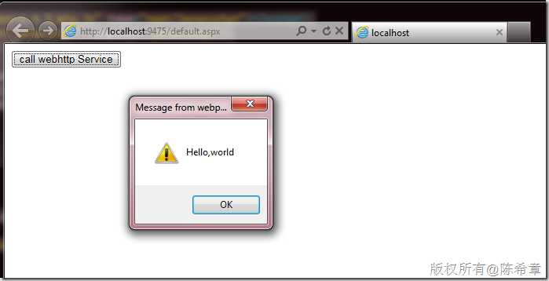](http://images.cnblogs.com/cnblogs_com/chenxizhang/201106/201106211353067464.png)


 


值得注意的是，WebHttp Service除了支持Json格式之外，也支持XML格式，我们可以通过修改WebGet这个Attribute的设置来达到目的


```

        [OperationContract]
        [WebGet(ResponseFormat=WebMessageFormat.Xml)]
        string HelloWorld();
```

.csharpcode, .csharpcode pre
{
 font-size: small;
 color: black;
 font-family: consolas, "Courier New", courier, monospace;
 background-color: #ffffff;
 /*white-space: pre;*/
}
.csharpcode pre { margin: 0em; }
.csharpcode .rem { color: #008000; }
.csharpcode .kwrd { color: #0000ff; }
.csharpcode .str { color: #006080; }
.csharpcode .op { color: #0000c0; }
.csharpcode .preproc { color: #cc6633; }
.csharpcode .asp { background-color: #ffff00; }
.csharpcode .html { color: #800000; }
.csharpcode .attr { color: #ff0000; }
.csharpcode .alt 
{
 background-color: #f4f4f4;
 width: 100%;
 margin: 0em;
}
.csharpcode .lnum { color: #606060; }

 


也可以通过配置文件的方式来设置（注意粗体部分）


```
<?xml version="1.0"?>
<configuration>

  <system.web>
    <compilation debug="true" targetFramework="4.0" />
  </system.web>
  <system.serviceModel>
    <services>
      <service name="WcfService1.Service1">
        <endpoint address="" behaviorConfiguration="WcfService1.Service1AspNetAjaxBehavior"
          binding="webHttpBinding" contract="WcfService1.IService1" />
      </service>
    </services>
    <behaviors>
      <endpointBehaviors>
        <behavior name="WcfService1.Service1AspNetAjaxBehavior">
          <enableWebScript />
          **<webHttp defaultOutgoingResponseFormat="Xml"/>**
        </behavior>
      </endpointBehaviors>
      <serviceBehaviors>
        <behavior name="">
          <serviceMetadata httpGetEnabled="true" />
          <serviceDebug includeExceptionDetailInFaults="false" />
        </behavior>
      </serviceBehaviors>
    </behaviors>
    <serviceHostingEnvironment aspNetCompatibilityEnabled="true"
      multipleSiteBindingsEnabled="true" />
  </system.serviceModel>
 <system.webServer>
    <modules runAllManagedModulesForAllRequests="true"/>
  </system.webServer>
  
</configuration>

```

.csharpcode, .csharpcode pre
{
 font-size: small;
 color: black;
 font-family: consolas, "Courier New", courier, monospace;
 background-color: #ffffff;
 /*white-space: pre;*/
}
.csharpcode pre { margin: 0em; }
.csharpcode .rem { color: #008000; }
.csharpcode .kwrd { color: #0000ff; }
.csharpcode .str { color: #006080; }
.csharpcode .op { color: #0000c0; }
.csharpcode .preproc { color: #cc6633; }
.csharpcode .asp { background-color: #ffff00; }
.csharpcode .html { color: #800000; }
.csharpcode .attr { color: #ff0000; }
.csharpcode .alt 
{
 background-color: #f4f4f4;
 width: 100%;
 margin: 0em;
}
.csharpcode .lnum { color: #606060; }

如果用XML格式的话，那么在浏览器测试的效果如下


[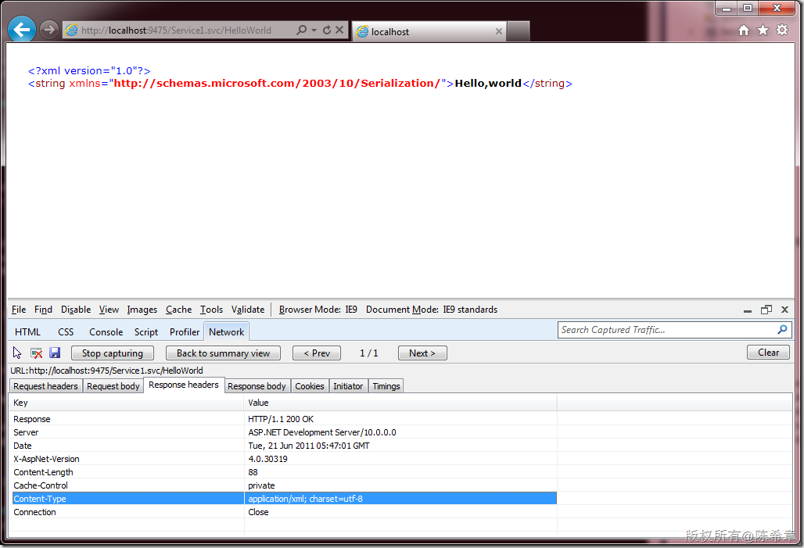](http://images.cnblogs.com/cnblogs_com/chenxizhang/201106/201106211353077530.png)


[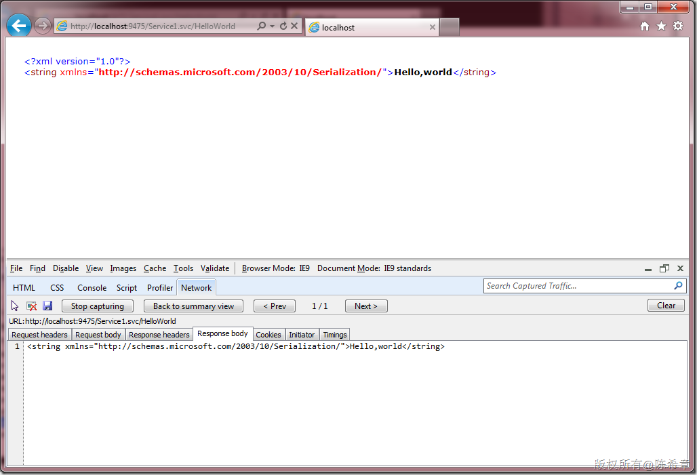](http://images.cnblogs.com/cnblogs_com/chenxizhang/201106/201106211353086583.png)


 


**总结**：WebHttp Services是在SOAP Services基础上的一个改进，它不是返回SOAP Evenlope，而是根据需要返回XML或者JSON数据。这样的设计，目的是让服务更加易于使用。同时，该服务是WCF Restful的具体实现。


 


【备注】 由于篇幅过长，另外三种服务，我将另外单独用一篇文章来分析比较，敬请期待


3. Data Services


4. Workflow Services


5. RIA Services


