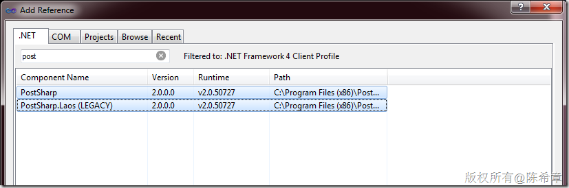
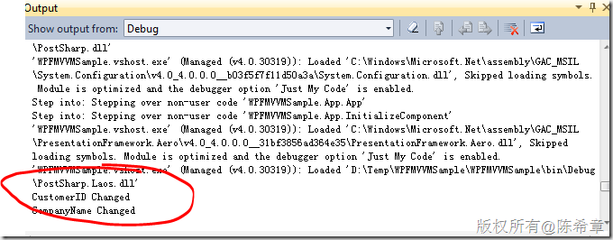

# 如何利用AOP简化MVVM中Model和ViewModel的设计 
> 原文发表于 2011-06-24, 地址: http://www.cnblogs.com/chenxizhang/archive/2011/06/24/2089392.html 


这一篇谈一个MVVM中的一个虽然小但却很实际的问题，就是如何简化Model和ViewModel的设计。这是我们在项目中总结提炼的一些做法。

 
>  【备注】关于MVVM的概念，并不是本文的重点。如果你对MVVM还不熟悉，可以参考[这里](http://msdn.microsoft.com/en-us/library/gg430857(v=pandp.40).aspx)。关于MVVM与之前的MVP，MVC设计模式的渊源和比较，还有目前主流的几个MVVM框架的大致情况，我最近可能再会抽时间另外整理一篇，有兴趣的朋友关注一下。
> 
> 

 有用过MVVM的朋友，都知道我们在项目中需要定义Model和ViewModel。Model指的是数据实体，它负责存储数据，并且提供了与外部资源（例如数据库或者远程服务）的交互。ViewModel是指View与Model之间的一个桥梁，通常情况下，View是指界面（例如WPF中的Window，或者Silverlight中的Page等等），使用MVVM的核心目的是让View的设计能够更加独立，它不应该包含太多的数据逻辑。极端情况下，它不应该有一行自定义代码。那么，你可能会问，不用代码怎么显示和更新数据呢？答案就是，View通过绑定（Binding)连接到ViewModel，在WPF和Silverlight中都可以实现双向（TwoWay）的绑定。这样就能实现数据的显示和更新。同时，ViewModel中还可以公开一些Command,以便可以让View中的特殊操作可以绑定。——**这就是MVVM的核心理论**。

  

 那么，言归正传吧，在介绍我们的问题之前，我先给大家看一个典型的Model类型


```

using System.Diagnostics;
using System.ComponentModel;

namespace WPFMVVMSample.Models
{
    public class Employee:INotifyPropertyChanged
    {

        public event PropertyChangedEventHandler PropertyChanged;

        private void OnPropertyChanged(string name)
        {
            if (PropertyChanged != null)
                PropertyChanged(this, new PropertyChangedEventArgs(name));

            //为了便于调试，我们在Output窗口输出一行信息
            Debug.WriteLine(string.Format("{0} Changed", name));
        }


        private string firstName = string.Empty;
        public string FirstName
        {
            get { return firstName; }
            set {
                if (value != firstName)
                {
                    firstName = value;
                    OnPropertyChanged("FirstName");
                }
            }
        }

        private string lastName = string.Empty;
        public string LastName
        {
            get { return lastName; }
            set
            {
                if (value != lastName)
                {
                    lastName = value;
                    OnPropertyChanged("LastName");
                }
            }
        }


        private int age = 18;
        public int Age
        {
            get { return age; }
            set {
                if (value != age)
                {
                    age = value;
                    OnPropertyChanged("Age");
                }
            }
        }
    }
}

```

.csharpcode, .csharpcode pre
{
 font-size: small;
 color: black;
 font-family: consolas, "Courier New", courier, monospace;
 background-color: #ffffff;
 /*white-space: pre;*/
}
.csharpcode pre { margin: 0em; }
.csharpcode .rem { color: #008000; }
.csharpcode .kwrd { color: #0000ff; }
.csharpcode .str { color: #006080; }
.csharpcode .op { color: #0000c0; }
.csharpcode .preproc { color: #cc6633; }
.csharpcode .asp { background-color: #ffff00; }
.csharpcode .html { color: #800000; }
.csharpcode .attr { color: #ff0000; }
.csharpcode .alt 
{
 background-color: #f4f4f4;
 width: 100%;
 margin: 0em;
}
.csharpcode .lnum { color: #606060; }

是不是很熟悉这个代码呢？这是一个表示员工信息的Model类型。


1. 为了实现双向绑定，并且在属性发生变化时接收通知，我们通常需要实现一个接口，叫INotifyPropertyChanged。
2. 这个接口只有一个事件（PropertyChanged）。通常为了触发该事件，我们会定义一个统一的方法（OnPropertyChanged）
3. 通常在每个属性中的set方法器中，我们要去调用OnPropertyChanged，发出属性已更改的通知。


也不算复杂对吧，但问题在于，如果这个Model类型有很多属性的话，那么这个类就会变得很冗长。而且很多代码其实都是同样的写法。更何况，一个项目里面可能会有很多个Model类型呢？


 


我们的问题就是：有没有什么方式来让自动完成这样的工作呢？也就是说，每个属性的Set方法执行完之后，自动地调用OnPropertyChanged这个方法。


 


例如，我们能不能还是按照下面这样定义Model类型呢？


```

namespace WPFMVVMSample.Models
{
    public class Customer
    {
        public string CustomerID { get; set; }
        public string CompanyName { get; set; }
    }
}

```

.csharpcode, .csharpcode pre
{
 font-size: small;
 color: black;
 font-family: consolas, "Courier New", courier, monospace;
 background-color: #ffffff;
 /*white-space: pre;*/
}
.csharpcode pre { margin: 0em; }
.csharpcode .rem { color: #008000; }
.csharpcode .kwrd { color: #0000ff; }
.csharpcode .str { color: #006080; }
.csharpcode .op { color: #0000c0; }
.csharpcode .preproc { color: #cc6633; }
.csharpcode .asp { background-color: #ffff00; }
.csharpcode .html { color: #800000; }
.csharpcode .attr { color: #ff0000; }
.csharpcode .alt 
{
 background-color: #f4f4f4;
 width: 100%;
 margin: 0em;
}
.csharpcode .lnum { color: #606060; }

我想，一个Model类型本应就这么简单，你不这么觉得吗？那么，就随我一步一步来做个实验吧


 


首先，考虑到可能有很多个Model类型，每个类型都去实现那个INotifyPropertyChanged接口，就显得不是那么理想。针对这个问题，我们很自然地想到将这部分实现提取到一个基类去。我们确实是这么做的。例如，下面这里我们定义一个ModelBase类型


```
using System.ComponentModel;
using System.Diagnostics;

namespace WPFMVVMSample.Models
{
    public abstract class ModelBase:INotifyPropertyChanged
    {

        public event PropertyChangedEventHandler PropertyChanged;

        protected void OnPropertyChanged(string name)
        {
            if (PropertyChanged != null)
                PropertyChanged(this, new PropertyChangedEventArgs(name));

            //为了便于调试，我们在Output窗口输出一行信息
            Debug.WriteLine(string.Format("{0} Changed", name));
        }

    }
}

```

.csharpcode, .csharpcode pre
{
 font-size: small;
 color: black;
 font-family: consolas, "Courier New", courier, monospace;
 background-color: #ffffff;
 /*white-space: pre;*/
}
.csharpcode pre { margin: 0em; }
.csharpcode .rem { color: #008000; }
.csharpcode .kwrd { color: #0000ff; }
.csharpcode .str { color: #006080; }
.csharpcode .op { color: #0000c0; }
.csharpcode .preproc { color: #cc6633; }
.csharpcode .asp { background-color: #ffff00; }
.csharpcode .html { color: #800000; }
.csharpcode .attr { color: #ff0000; }
.csharpcode .alt 
{
 background-color: #f4f4f4;
 width: 100%;
 margin: 0em;
}
.csharpcode .lnum { color: #606060; }

.csharpcode, .csharpcode pre
{
 font-size: small;
 color: black;
 font-family: consolas, "Courier New", courier, monospace;
 background-color: #ffffff;
 /*white-space: pre;*/
}
.csharpcode pre { margin: 0em; }
.csharpcode .rem { color: #008000; }
.csharpcode .kwrd { color: #0000ff; }
.csharpcode .str { color: #006080; }
.csharpcode .op { color: #0000c0; }
.csharpcode .preproc { color: #cc6633; }
.csharpcode .asp { background-color: #ffff00; }
.csharpcode .html { color: #800000; }
.csharpcode .attr { color: #ff0000; }
.csharpcode .alt 
{
 background-color: #f4f4f4;
 width: 100%;
 margin: 0em;
}
.csharpcode .lnum { color: #606060; }

 


那么，接下来，我们就要让Customer类型继承ModelBase


```

namespace WPFMVVMSample.Models
{

    public class Customer:ModelBase
    {
        public string CustomerID { get; set; }
        public string CompanyName { get; set; }
    }
}

```


.csharpcode, .csharpcode pre
{
 font-size: small;
 color: black;
 font-family: consolas, "Courier New", courier, monospace;
 background-color: #ffffff;
 /*white-space: pre;*/
}
.csharpcode pre { margin: 0em; }
.csharpcode .rem { color: #008000; }
.csharpcode .kwrd { color: #0000ff; }
.csharpcode .str { color: #006080; }
.csharpcode .op { color: #0000c0; }
.csharpcode .preproc { color: #cc6633; }
.csharpcode .asp { background-color: #ffff00; }
.csharpcode .html { color: #800000; }
.csharpcode .attr { color: #ff0000; }
.csharpcode .alt 
{
 background-color: #f4f4f4;
 width: 100%;
 margin: 0em;
}
.csharpcode .lnum { color: #606060; }


我们已经简化了实现接口的那部分工作。但是，还有一个关键点，如何让每个属性的set方法器中自动调用基类中定义好的OnPropertyChanged方法呢？也就是说，我们希望通过一个什么样的方式在每个set方法后面插入一个特殊的代码逻辑。是不是这样呢？


 


我联想到以前用过的一个所谓的AOP（面向方面的编程）的框架，当初还写过一篇文章介绍，请参考下面的链接


#### [PostSharp的AOP设计在.NET Remoting中的应用](http://www.cnblogs.com/chenxizhang/archive/2008/08/03/1259103.html)


我曾经用过一个业界比较认可的静态AOP框架，叫做Postsharp。它的官方网站在下面


#### <http://www.sharpcrafters.com/>


有了Postsharp，我们的问题就很容易可以解决了。请大家下载，安装，然后在项目中添加两个引用


[](http://images.cnblogs.com/cnblogs_com/chenxizhang/201106/201106242241352187.png)


我们可以编写下面一个特殊的Attribute


```
using System;
using PostSharp.Laos;

namespace WPFMVVMSample
{
    /// <summary>
    /// 陈希章
    /// 2011-6-24
    /// 这是一个特殊的Attribute，是postsharp中实现方法注入的一个做法
    /// </summary>
    [Serializable]
    [AttributeUsage(AttributeTargets.Class,Inherited=true,AllowMultiple=false)]
    public class NotifyPropertyChangeAttribute:OnMethodBoundaryAspect
    {
        public override void OnSuccess(MethodExecutionEventArgs eventArgs)
        {
            var methodName = eventArgs.Method.Name;
            var type = eventArgs.Instance.GetType();
            var targetMethod= type.GetMethod("OnPropertyChanged", 
                System.Reflection.BindingFlags.NonPublic| System.Reflection.BindingFlags.Instance);

            if (methodName.StartsWith("set\_") &&  targetMethod != null)//只针对这种方法器进行注入
            {
                var propertyName = methodName.Substring(4);//解析得到属性名称
                targetMethod.Invoke(eventArgs.Instance, new[] { propertyName });//执行该方法
            }
        }
    }
}

```


.csharpcode, .csharpcode pre
{
 font-size: small;
 color: black;
 font-family: consolas, "Courier New", courier, monospace;
 background-color: #ffffff;
 /*white-space: pre;*/
}
.csharpcode pre { margin: 0em; }
.csharpcode .rem { color: #008000; }
.csharpcode .kwrd { color: #0000ff; }
.csharpcode .str { color: #006080; }
.csharpcode .op { color: #0000c0; }
.csharpcode .preproc { color: #cc6633; }
.csharpcode .asp { background-color: #ffff00; }
.csharpcode .html { color: #800000; }
.csharpcode .attr { color: #ff0000; }
.csharpcode .alt 
{
 background-color: #f4f4f4;
 width: 100%;
 margin: 0em;
}
.csharpcode .lnum { color: #606060; }


那么，如何实现这个特殊的Attribute呢？我们只要在Customer这个类型上添加它就可以了。最终设计好的Customer类型如下


```

namespace WPFMVVMSample.Models
{
    [NotifyPropertyChange]
    public class Customer:ModelBase
    {
        public string CustomerID { get; set; }
        public string CompanyName { get; set; }

    }
}

```


.csharpcode, .csharpcode pre
{
 font-size: small;
 color: black;
 font-family: consolas, "Courier New", courier, monospace;
 background-color: #ffffff;
 /*white-space: pre;*/
}
.csharpcode pre { margin: 0em; }
.csharpcode .rem { color: #008000; }
.csharpcode .kwrd { color: #0000ff; }
.csharpcode .str { color: #006080; }
.csharpcode .op { color: #0000c0; }
.csharpcode .preproc { color: #cc6633; }
.csharpcode .asp { background-color: #ffff00; }
.csharpcode .html { color: #800000; }
.csharpcode .attr { color: #ff0000; }
.csharpcode .alt 
{
 background-color: #f4f4f4;
 width: 100%;
 margin: 0em;
}
.csharpcode .lnum { color: #606060; }

大家可以将这个类型与本文最开头的Employee类型比较一下，代码明显精简了很多很多。


至于ViewModel，也是同样的做法即可。


 


你可能会疑惑地说，真有这么神奇吗？上面这样做了之后，有没有真正地生效呢？


为了让你看到效果，又不免很复杂，还记得我们在ModelBase里面有下面一句代码吗？


```
            //为了便于调试，我们在Output窗口输出一行信息
            Debug.WriteLine(string.Format("{0} Changed", name));

```


.csharpcode, .csharpcode pre
{
 font-size: small;
 color: black;
 font-family: consolas, "Courier New", courier, monospace;
 background-color: #ffffff;
 /*white-space: pre;*/
}
.csharpcode pre { margin: 0em; }
.csharpcode .rem { color: #008000; }
.csharpcode .kwrd { color: #0000ff; }
.csharpcode .str { color: #006080; }
.csharpcode .op { color: #0000c0; }
.csharpcode .preproc { color: #cc6633; }
.csharpcode .asp { background-color: #ffff00; }
.csharpcode .html { color: #800000; }
.csharpcode .attr { color: #ff0000; }
.csharpcode .alt 
{
 background-color: #f4f4f4;
 width: 100%;
 margin: 0em;
}
.csharpcode .lnum { color: #606060; }

也就是说，只要属性发生了变化，就发出通知，并且在Output窗口中显示一些信息。


 


我们可以做一个简单的测试，在MainWindow中加入如下的代码


```
using System;
using System.Collections.Generic;
using System.Linq;
using System.Text;
using System.Windows;
using System.Windows.Controls;
using System.Windows.Data;
using System.Windows.Documents;
using System.Windows.Input;
using System.Windows.Media;
using System.Windows.Media.Imaging;
using System.Windows.Navigation;
using System.Windows.Shapes;

namespace WPFMVVMSample
{
    /// <summary>
    /// Interaction logic for MainWindow.xaml
    /// </summary>
    public partial class MainWindow : Window
    {
        public MainWindow()
        {
            InitializeComponent();

            Loaded += new RoutedEventHandler(MainWindow\_Loaded);
        }

        void MainWindow\_Loaded(object sender, RoutedEventArgs e)
        {
            var customer = new Models.Customer();
            customer.CustomerID = "microsoft";
            customer.CompanyName = "microsoft company";
            this.DataContext = customer;

        }
    }
}

```


.csharpcode, .csharpcode pre
{
 font-size: small;
 color: black;
 font-family: consolas, "Courier New", courier, monospace;
 background-color: #ffffff;
 /*white-space: pre;*/
}
.csharpcode pre { margin: 0em; }
.csharpcode .rem { color: #008000; }
.csharpcode .kwrd { color: #0000ff; }
.csharpcode .str { color: #006080; }
.csharpcode .op { color: #0000c0; }
.csharpcode .preproc { color: #cc6633; }
.csharpcode .asp { background-color: #ffff00; }
.csharpcode .html { color: #800000; }
.csharpcode .attr { color: #ff0000; }
.csharpcode .alt 
{
 background-color: #f4f4f4;
 width: 100%;
 margin: 0em;
}
.csharpcode .lnum { color: #606060; }

我们这里初始化了一个Customer对象，并且对它两个属性都做了更改。


按下F5进行调试，注意将Output窗口显示出来。我们会发现有下面的输出


[](http://images.cnblogs.com/cnblogs_com/chenxizhang/201106/201106242241354412.png)


这样就证明了我们刚才的假设：属性值修改之后，我们收到了通知，而且执行了OnPropertyChanged方法。

