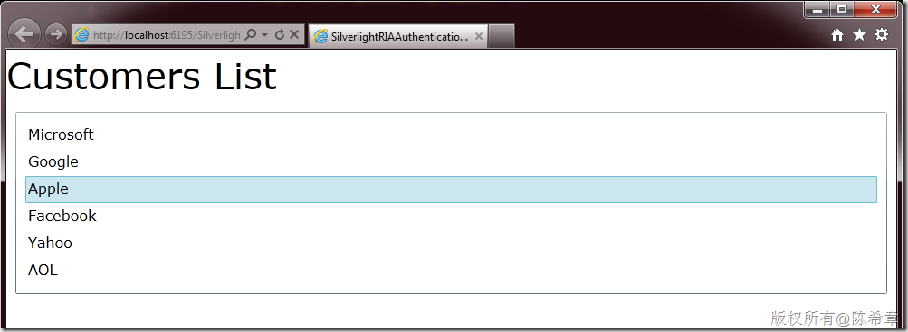

# 如何在RIA Service中启用身份验证 
> 原文发表于 2011-07-13, 地址: http://www.cnblogs.com/chenxizhang/archive/2011/07/13/2105204.html 


本文我将结合一个实例，一步一步地演示，然后在RIA Service中启用身份验证。包括在服务端的设计，和客户端的设计。

 本文实例源代码，可以通过下面地址下载

 [http://files.cnblogs.com/chenxizhang/SilverlightRIAAuthenticationSample.rar](http://files.cnblogs.com/chenxizhang/SilverlightRIAAuthenticationSample.rar "http://files.cnblogs.com/chenxizhang/SilverlightRIAAuthenticationSample.rar")

  

 1. 创建项目，并添加一个业务用的Domain Service
===============================

 作为演示，我们这里写了一个简单的方法


```
 
```

```
namespace SilverlightRIAAuthenticationSample.Web
{
    using System;
    using System.Collections.Generic;
    using System.ComponentModel;
    using System.ComponentModel.DataAnnotations;
    using System.Linq;
    using System.ServiceModel.DomainServices.Hosting;
    using System.ServiceModel.DomainServices.Server;
    using System.Runtime.Serialization;

    // TODO: Create methods containing your application logic.
    [EnableClientAccess()]
    public class HomeDomainService : DomainService
    {
        [Query]
        /// <summary>
        /// 这个方法返回一些客户名称
        /// </summary>
        /// <returns></returns>
        public IQueryable<Customer> GetCustomers()
        {
            return new[]{
                new Customer(){ID=1,Name="Microsoft"},
                new Customer(){ID=2,Name="Google"},
                new Customer(){ID=3,Name="Apple"},
                new Customer(){ID=4,Name="Facebook"},
                new Customer(){ID=5,Name="Yahoo"},
                new Customer(){ID=16,Name="AOL"}
            }.AsQueryable();
        }
    }

    [DataContract]
    public class Customer
    {
        [Key][DataMember]
        public int ID { get; set; }
        [DataMember]
        public string Name { get; set; }
    }


}


```

.csharpcode, .csharpcode pre
{
 font-size: small;
 color: black;
 font-family: consolas, "Courier New", courier, monospace;
 background-color: #ffffff;
 /*white-space: pre;*/
}
.csharpcode pre { margin: 0em; }
.csharpcode .rem { color: #008000; }
.csharpcode .kwrd { color: #0000ff; }
.csharpcode .str { color: #006080; }
.csharpcode .op { color: #0000c0; }
.csharpcode .preproc { color: #cc6633; }
.csharpcode .asp { background-color: #ffff00; }
.csharpcode .html { color: #800000; }
.csharpcode .attr { color: #ff0000; }
.csharpcode .alt 
{
 background-color: #f4f4f4;
 width: 100%;
 margin: 0em;
}
.csharpcode .lnum { color: #606060; }

.csharpcode, .csharpcode pre
{
 font-size: small;
 color: black;
 font-family: consolas, "Courier New", courier, monospace;
 background-color: #ffffff;
 /*white-space: pre;*/
}
.csharpcode pre { margin: 0em; }
.csharpcode .rem { color: #008000; }
.csharpcode .kwrd { color: #0000ff; }
.csharpcode .str { color: #006080; }
.csharpcode .op { color: #0000c0; }
.csharpcode .preproc { color: #cc6633; }
.csharpcode .asp { background-color: #ffff00; }
.csharpcode .html { color: #800000; }
.csharpcode .attr { color: #ff0000; }
.csharpcode .alt 
{
 background-color: #f4f4f4;
 width: 100%;
 margin: 0em;
}
.csharpcode .lnum { color: #606060; }

写好之后，分别编译网站项目和Silverlight项目。在Silverlight中应该可以看到一个自动生成的类型


[](http://images.cnblogs.com/cnblogs_com/chenxizhang/201107/201107131303175896.png)


2. 编写客户端代码
==========


我简单地做了一个界面，用来显示由服务器返回的客户列表


[](http://images.cnblogs.com/cnblogs_com/chenxizhang/201107/201107131303192351.png)


```
<UserControl
    x:Class="SilverlightRIAAuthenticationSample.MainPage"
    xmlns="http://schemas.microsoft.com/winfx/2006/xaml/presentation"
    xmlns:x="http://schemas.microsoft.com/winfx/2006/xaml"
    xmlns:d="http://schemas.microsoft.com/expression/blend/2008"
    xmlns:mc="http://schemas.openxmlformats.org/markup-compatibility/2006"
    mc:Ignorable="d"
    d:DesignHeight="300"
    d:DesignWidth="400">

    <Grid
        x:Name="LayoutRoot"
        Background="White">
        <StackPanel>
            <TextBlock
                Text="Customers List"
                FontSize="40"></TextBlock>

            <ListBox
                ItemsSource="{Binding}"
                Padding="10" Margin="10">
                <ListBox.ItemTemplate>
                    <DataTemplate>
                        <TextBlock
                            Text="{Binding Name}"
                            FontSize="16"></TextBlock>
                    </DataTemplate>
                </ListBox.ItemTemplate>
            </ListBox>
        </StackPanel>
    </Grid>
</UserControl>

```

.csharpcode, .csharpcode pre
{
 font-size: small;
 color: black;
 font-family: consolas, "Courier New", courier, monospace;
 background-color: #ffffff;
 /*white-space: pre;*/
}
.csharpcode pre { margin: 0em; }
.csharpcode .rem { color: #008000; }
.csharpcode .kwrd { color: #0000ff; }
.csharpcode .str { color: #006080; }
.csharpcode .op { color: #0000c0; }
.csharpcode .preproc { color: #cc6633; }
.csharpcode .asp { background-color: #ffff00; }
.csharpcode .html { color: #800000; }
.csharpcode .attr { color: #ff0000; }
.csharpcode .alt 
{
 background-color: #f4f4f4;
 width: 100%;
 margin: 0em;
}
.csharpcode .lnum { color: #606060; }


.csharpcode, .csharpcode pre
{
 font-size: small;
 color: black;
 font-family: consolas, "Courier New", courier, monospace;
 background-color: #ffffff;
 /*white-space: pre;*/
}
.csharpcode pre { margin: 0em; }
.csharpcode .rem { color: #008000; }
.csharpcode .kwrd { color: #0000ff; }
.csharpcode .str { color: #006080; }
.csharpcode .op { color: #0000c0; }
.csharpcode .preproc { color: #cc6633; }
.csharpcode .asp { background-color: #ffff00; }
.csharpcode .html { color: #800000; }
.csharpcode .attr { color: #ff0000; }
.csharpcode .alt 
{
 background-color: #f4f4f4;
 width: 100%;
 margin: 0em;
}
.csharpcode .lnum { color: #606060; }


同时，编写一些简单的后台代码（直接写在xaml.cs中）


```
using System.Windows;
using System.Windows.Controls;
using SilverlightRIAAuthenticationSample.Web;

namespace SilverlightRIAAuthenticationSample
{
    public partial class MainPage : UserControl
    {
        public MainPage()
        {
            InitializeComponent();
            Loaded += new RoutedEventHandler(MainPage\_Loaded);
        }

        void MainPage\_Loaded(object sender, RoutedEventArgs e)
        {
            var ctx = new HomeDomainContext();
            var op=ctx.Load<Customer>(ctx.GetCustomersQuery());
            this.DataContext = op.Entities; 
        }
    }
}

```

.csharpcode, .csharpcode pre
{
 font-size: small;
 color: black;
 font-family: consolas, "Courier New", courier, monospace;
 background-color: #ffffff;
 /*white-space: pre;*/
}
.csharpcode pre { margin: 0em; }
.csharpcode .rem { color: #008000; }
.csharpcode .kwrd { color: #0000ff; }
.csharpcode .str { color: #006080; }
.csharpcode .op { color: #0000c0; }
.csharpcode .preproc { color: #cc6633; }
.csharpcode .asp { background-color: #ffff00; }
.csharpcode .html { color: #800000; }
.csharpcode .attr { color: #ff0000; }
.csharpcode .alt 
{
 background-color: #f4f4f4;
 width: 100%;
 margin: 0em;
}
.csharpcode .lnum { color: #606060; }

运行起来，我们可以看到如下的一个效果


[](http://images.cnblogs.com/cnblogs_com/chenxizhang/201107/201107131303211040.png)


到这里为止，我们就已经实现了一个简单的Silverlight+RIA Service的场景。这不是本文的重点，我们下面要实现的是，在这个设计的基础上添加身份验证的功能。


例如你可以假设一下：假如这个GetCustomers方法，并不是给所有用户都可以调用的，而是需要经过身份验证的用户才可以调用的


 


3. 修改Web.config
===============


我们需要修改宿主网站的web.config,设置身份验证提供程序，可以选择Forms或者Windows，我们这里选择Forms，就是所谓的表单验证，客户端需要提供一个用户名和密码来进行验证


[](http://images.cnblogs.com/cnblogs_com/chenxizhang/201107/201107131303228465.png)


 


4. 添加一个AuthenticationDomainService
==================================


在网站项目中


[](http://images.cnblogs.com/cnblogs_com/chenxizhang/201107/201107131303244887.png)


这个Domain Service不需要做任何修改。但也可以为User类型添加一些特殊的属性（称为Profile Property）,这里先不展开了


[](http://images.cnblogs.com/cnblogs_com/chenxizhang/201107/201107131303246249.png)


但是，这里需要添加一个身份验证的提供程序。我写了一个最简单的MemberShipProvider


请注意，SimpleMembershipProvider，只实现一个方法：ValidateUser（请注意代码的底部，红色部分）


```
using System;
using System.ServiceModel.DomainServices.Hosting;
using System.ServiceModel.DomainServices.Server.ApplicationServices;

namespace SilverlightRIAAuthenticationSample.Web
{
    [EnableClientAccess]
    public class AuthenticationDomainService : AuthenticationBase<User>
    {
        // To enable Forms/Windows Authentication for the Web Application, edit the appropriate section of web.config file.
    }

    public class User : UserBase
    {
        // NOTE: Profile properties can be added here 
        // To enable profiles, edit the appropriate section of web.config file.

        // public string MyProfileProperty { get; set; }
    }

    public class SimpleMembershipProvider : System.Web.Security.MembershipProvider
    {

        public override string ApplicationName
        {
            get
            {
                throw new NotImplementedException();
            }
            set
            {
                throw new NotImplementedException();
            }
        }

        public override bool ChangePassword(string username, string oldPassword, string newPassword)
        {
            throw new NotImplementedException();
        }

        public override bool ChangePasswordQuestionAndAnswer(string username, string password, string newPasswordQuestion, string newPasswordAnswer)
        {
            throw new NotImplementedException();
        }

        public override System.Web.Security.MembershipUser CreateUser(string username, string password, string email, string passwordQuestion, string passwordAnswer, bool isApproved, object providerUserKey, out System.Web.Security.MembershipCreateStatus status)
        {
            throw new NotImplementedException();
        }

        public override bool DeleteUser(string username, bool deleteAllRelatedData)
        {
            throw new NotImplementedException();
        }

        public override bool EnablePasswordReset
        {
            get { throw new NotImplementedException(); }
        }

        public override bool EnablePasswordRetrieval
        {
            get { throw new NotImplementedException(); }
        }

        public override System.Web.Security.MembershipUserCollection FindUsersByEmail(string emailToMatch, int pageIndex, int pageSize, out int totalRecords)
        {
            throw new NotImplementedException();
        }

        public override System.Web.Security.MembershipUserCollection FindUsersByName(string usernameToMatch, int pageIndex, int pageSize, out int totalRecords)
        {
            throw new NotImplementedException();
        }

        public override System.Web.Security.MembershipUserCollection GetAllUsers(int pageIndex, int pageSize, out int totalRecords)
        {
            throw new NotImplementedException();
        }

        public override int GetNumberOfUsersOnline()
        {
            throw new NotImplementedException();
        }

        public override string GetPassword(string username, string answer)
        {
            throw new NotImplementedException();
        }

        public override System.Web.Security.MembershipUser GetUser(string username, bool userIsOnline)
        {
            throw new NotImplementedException();
        }

        public override System.Web.Security.MembershipUser GetUser(object providerUserKey, bool userIsOnline)
        {
            throw new NotImplementedException();
        }

        public override string GetUserNameByEmail(string email)
        {
            throw new NotImplementedException();
        }

        public override int MaxInvalidPasswordAttempts
        {
            get { throw new NotImplementedException(); }
        }

        public override int MinRequiredNonAlphanumericCharacters
        {
            get { throw new NotImplementedException(); }
        }

        public override int MinRequiredPasswordLength
        {
            get { throw new NotImplementedException(); }
        }

        public override int PasswordAttemptWindow
        {
            get { throw new NotImplementedException(); }
        }

        public override System.Web.Security.MembershipPasswordFormat PasswordFormat
        {
            get { throw new NotImplementedException(); }
        }

        public override string PasswordStrengthRegularExpression
        {
            get { throw new NotImplementedException(); }
        }

        public override bool RequiresQuestionAndAnswer
        {
            get { throw new NotImplementedException(); }
        }

        public override bool RequiresUniqueEmail
        {
            get { throw new NotImplementedException(); }
        }

        public override string ResetPassword(string username, string answer)
        {
            throw new NotImplementedException();
        }

        public override bool UnlockUser(string userName)
        {
            throw new NotImplementedException();
        }

        public override void UpdateUser(System.Web.Security.MembershipUser user)
        {
            throw new NotImplementedException();
        }

 **public override bool ValidateUser(string username, string password)
 {
 return username == "chenxizhang" && password == "password";
 }**
    }
}
```

.csharpcode, .csharpcode pre
{
 font-size: small;
 color: black;
 font-family: consolas, "Courier New", courier, monospace;
 background-color: #ffffff;
 /*white-space: pre;*/
}
.csharpcode pre { margin: 0em; }
.csharpcode .rem { color: #008000; }
.csharpcode .kwrd { color: #0000ff; }
.csharpcode .str { color: #006080; }
.csharpcode .op { color: #0000c0; }
.csharpcode .preproc { color: #cc6633; }
.csharpcode .asp { background-color: #ffff00; }
.csharpcode .html { color: #800000; }
.csharpcode .attr { color: #ff0000; }
.csharpcode .alt 
{
 background-color: #f4f4f4;
 width: 100%;
 margin: 0em;
}
.csharpcode .lnum { color: #606060; }

然后，我们还需要修改web.config，指定这个MembershipProvider,请注意下面的粗体部分


```
<?xml version="1.0"?>

<!--
 For more information on how to configure your ASP.NET application, please visit
 http://go.microsoft.com/fwlink/?LinkId=169433
 -->

<configuration>
  <system.webServer>
    <modules runAllManagedModulesForAllRequests="true">
      <add name="DomainServiceModule" preCondition="managedHandler"
          type="System.ServiceModel.DomainServices.Hosting.DomainServiceHttpModule, System.ServiceModel.DomainServices.Hosting, Version=4.0.0.0, Culture=neutral, PublicKeyToken=31bf3856ad364e35" />
    </modules>
    <validation validateIntegratedModeConfiguration="false" />
  </system.webServer>
  <system.web>
    <httpModules>
      <add name="DomainServiceModule" type="System.ServiceModel.DomainServices.Hosting.DomainServiceHttpModule, System.ServiceModel.DomainServices.Hosting, Version=4.0.0.0, Culture=neutral, PublicKeyToken=31bf3856ad364e35" />
    </httpModules>
    <compilation debug="true" targetFramework="4.0" />
    <authentication mode="Forms">
    </authentication>

 **<membership defaultProvider="simple">
 <providers>
 <clear/>
 <add name="simple" type="SilverlightRIAAuthenticationSample.Web.SimpleMembershipProvider"/>
 </providers>
 </membership>**
  </system.web>
  <system.serviceModel>
    <serviceHostingEnvironment aspNetCompatibilityEnabled="true"
        multipleSiteBindingsEnabled="true" />
  </system.serviceModel>
</configuration>

```

.csharpcode, .csharpcode pre
{
 font-size: small;
 color: black;
 font-family: consolas, "Courier New", courier, monospace;
 background-color: #ffffff;
 /*white-space: pre;*/
}
.csharpcode pre { margin: 0em; }
.csharpcode .rem { color: #008000; }
.csharpcode .kwrd { color: #0000ff; }
.csharpcode .str { color: #006080; }
.csharpcode .op { color: #0000c0; }
.csharpcode .preproc { color: #cc6633; }
.csharpcode .asp { background-color: #ffff00; }
.csharpcode .html { color: #800000; }
.csharpcode .attr { color: #ff0000; }
.csharpcode .alt 
{
 background-color: #f4f4f4;
 width: 100%;
 margin: 0em;
}
.csharpcode .lnum { color: #606060; }

6. 如何在服务器端启用身份验证
================


请注意下面代码的修改，在GetCustomers方法上面，我们添加一个RequiresAuthetication的Attribute。


```
namespace SilverlightRIAAuthenticationSample.Web
{
    using System.ComponentModel.DataAnnotations;
    using System.Linq;
    using System.Runtime.Serialization;
    using System.ServiceModel.DomainServices.Hosting;
    using System.ServiceModel.DomainServices.Server;

    // TODO: Create methods containing your application logic.
    [EnableClientAccess()]
    public class HomeDomainService : DomainService
    {
        [Query][**RequiresAuthentication**]
        /// <summary>
        /// 这个方法返回一些客户名称
        /// </summary>
        /// <returns></returns>
        public IQueryable<Customer> GetCustomers()
        {
            return new[]{
                new Customer(){ID=1,Name="Microsoft"},
                new Customer(){ID=2,Name="Google"},
                new Customer(){ID=3,Name="Apple"},
                new Customer(){ID=4,Name="Facebook"},
                new Customer(){ID=5,Name="Yahoo"},
                new Customer(){ID=16,Name="AOL"}
            }.AsQueryable();
        }
    }

    [DataContract]
    public class Customer
    {
        [Key][DataMember]
        public int ID { get; set; }
        [DataMember]
        public string Name { get; set; }
    }


}


```

到这里为止，服务器端的设计就完成了，我们可以将两个项目都重新生成一下


然后，按下F5,重新运行一下Silverlight程序，不出意外的话，我们会看到下面一个错误


[](http://images.cnblogs.com/cnblogs_com/chenxizhang/201107/201107131303252280.png)


如果想要看到错误消息，可以对代码稍作修改


```
using System.Windows;
using System.Windows.Controls;
using SilverlightRIAAuthenticationSample.Web;

namespace SilverlightRIAAuthenticationSample
{
    public partial class MainPage : UserControl
    {
        public MainPage()
        {
            InitializeComponent();
            Loaded += new RoutedEventHandler(MainPage\_Loaded);
        }

        void MainPage\_Loaded(object sender, RoutedEventArgs e)
        {
            var ctx = new HomeDomainContext();
            var op = ctx.Load<Customer>(ctx.GetCustomersQuery(), (result) => {
                if(result.HasError)
                {
                    MessageBox.Show(result.Error.Message);
                    result.MarkErrorAsHandled();
                }
            }, true);
            this.DataContext = op.Entities;
        }
    }
}

```


.csharpcode, .csharpcode pre
{
 font-size: small;
 color: black;
 font-family: consolas, "Courier New", courier, monospace;
 background-color: #ffffff;
 /*white-space: pre;*/
}
.csharpcode pre { margin: 0em; }
.csharpcode .rem { color: #008000; }
.csharpcode .kwrd { color: #0000ff; }
.csharpcode .str { color: #006080; }
.csharpcode .op { color: #0000c0; }
.csharpcode .preproc { color: #cc6633; }
.csharpcode .asp { background-color: #ffff00; }
.csharpcode .html { color: #800000; }
.csharpcode .attr { color: #ff0000; }
.csharpcode .alt 
{
 background-color: #f4f4f4;
 width: 100%;
 margin: 0em;
}
.csharpcode .lnum { color: #606060; }

再次运行的话，就可以看到如下的消息提供


[](http://images.cnblogs.com/cnblogs_com/chenxizhang/201107/20110713130325610.png)


事情很清楚了，因为服务端要求要做身份验证，而客户端没有提供有关的用户信息，所以就报告了如上的错误


 


7. 如何在客户端中使用身份验证
================


有很多个做法可以实现客户端的身份验证，通常是用一个窗口让用户输入用户名和密码。


为了简单起见，我先用最简单的方法来实现。我们可以修改App.xaml.cs文件


```
using System;
using System.ServiceModel.DomainServices.Client.ApplicationServices;
using System.Windows;

namespace SilverlightRIAAuthenticationSample
{
    public partial class App : Application
    {

        public App()
        {
            this.Startup += this.Application\_Startup;
            this.Exit += this.Application\_Exit;
            this.UnhandledException += this.Application\_UnhandledException;

            InitializeComponent();

 **//创建一个上下文，这是在RIA Service中的一个对象
 var webcontext = new WebContext();
 webcontext.Authentication = new FormsAuthentication();
 this.ApplicationLifetimeObjects.Add(webcontext);**


        }

        private void Application\_Startup(object sender, StartupEventArgs e)
        {

 **//直接使用硬编码的方式进行登录，注意这里是异步的
 var param = new LoginParameters("chenxizhang", "password"); 
 WebContext.Current.Authentication.Login(param, (op) =>
 {
 if(op.User != null
 && op.User.Identity.IsAuthenticated)
 this.RootVisual = new MainPage();
 else
 {
 MessageBox.Show("Login fail, please try again. ");
 }
 }, null);**
        }

        private void Application\_Exit(object sender, EventArgs e)
        {

        }

        private void Application\_UnhandledException(object sender, ApplicationUnhandledExceptionEventArgs e)
        {
            // If the app is running outside of the debugger then report the exception using
            // the browser's exception mechanism. On IE this will display it a yellow alert 
            // icon in the status bar and Firefox will display a script error.
            if(!System.Diagnostics.Debugger.IsAttached)
            {

                // NOTE: This will allow the application to continue running after an exception has been thrown
                // but not handled. 
                // For production applications this error handling should be replaced with something that will 
                // report the error to the website and stop the application.
                e.Handled = true;
                Deployment.Current.Dispatcher.BeginInvoke(delegate { ReportErrorToDOM(e); });
            }
        }

        private void ReportErrorToDOM(ApplicationUnhandledExceptionEventArgs e)
        {
            try
            {
                string errorMsg = e.ExceptionObject.Message + e.ExceptionObject.StackTrace;
                errorMsg = errorMsg.Replace('"', '\'').Replace("\r\n", @"\n");

                System.Windows.Browser.HtmlPage.Window.Eval("throw new Error(\"Unhandled Error in Silverlight Application " + errorMsg + "\");");
            }
            catch(Exception)
            {
            }
        }
    }
}

```

.csharpcode, .csharpcode pre
{
 font-size: small;
 color: black;
 font-family: consolas, "Courier New", courier, monospace;
 background-color: #ffffff;
 /*white-space: pre;*/
}
.csharpcode pre { margin: 0em; }
.csharpcode .rem { color: #008000; }
.csharpcode .kwrd { color: #0000ff; }
.csharpcode .str { color: #006080; }
.csharpcode .op { color: #0000c0; }
.csharpcode .preproc { color: #cc6633; }
.csharpcode .asp { background-color: #ffff00; }
.csharpcode .html { color: #800000; }
.csharpcode .attr { color: #ff0000; }
.csharpcode .alt 
{
 background-color: #f4f4f4;
 width: 100%;
 margin: 0em;
}
.csharpcode .lnum { color: #606060; }

然后，再运行程序，我们就可以看到查询结果了


[](http://images.cnblogs.com/cnblogs_com/chenxizhang/201107/201107131303268559.png)


这就表示，我们已经登录成功了，所有后续代码就生效了。


除了上面那种用代码方式在App类型的构造器实例化身份验证方式之外，还可以通过下面这样修改xaml来实现


【备注】关于ApplicationLifetimeObjects，这是WPF和Silverlight的一个特殊功能，可以将一个对象在整个应用程序生命周期里面都有效，相当于是全局的对象。有兴趣可以参考[这里](http://msdn.microsoft.com/zh-cn/library/system.windows.application.applicationlifetimeobjects(v=vs.95).aspx)的说明


 


```
<Application xmlns="http://schemas.microsoft.com/winfx/2006/xaml/presentation"
             xmlns:x="http://schemas.microsoft.com/winfx/2006/xaml" 
             x:Class="SilverlightRIAAuthenticationSample.App"
             xmlns:local="clr-namespace:SilverlightRIAAuthenticationSample"
             xmlns:appsvc="clr-namespace:System.ServiceModel.DomainServices.Client.ApplicationServices;assembly=System.ServiceModel.DomainServices.Client.Web"
             >
    <Application.Resources>
        
    </Application.Resources>
 **<Application.ApplicationLifetimeObjects>
 <local:WebContext>
 <local:WebContext.Authentication>
 <appsvc:FormsAuthentication></appsvc:FormsAuthentication>
 </local:WebContext.Authentication>
 </local:WebContext>
 </Application.ApplicationLifetimeObjects>**
</Application>

```

.csharpcode, .csharpcode pre
{
 font-size: small;
 color: black;
 font-family: consolas, "Courier New", courier, monospace;
 background-color: #ffffff;
 /*white-space: pre;*/
}
.csharpcode pre { margin: 0em; }
.csharpcode .rem { color: #008000; }
.csharpcode .kwrd { color: #0000ff; }
.csharpcode .str { color: #006080; }
.csharpcode .op { color: #0000c0; }
.csharpcode .preproc { color: #cc6633; }
.csharpcode .asp { background-color: #ffff00; }
.csharpcode .html { color: #800000; }
.csharpcode .attr { color: #ff0000; }
.csharpcode .alt 
{
 background-color: #f4f4f4;
 width: 100%;
 margin: 0em;
}
.csharpcode .lnum { color: #606060; }

8. 实现用户登录窗口
===========


接下来，我们实现一个简单的用户登录窗口吧。假设我们希望任何用户在使用这个程序之前，必须首先要登录


[](http://images.cnblogs.com/cnblogs_com/chenxizhang/201107/20110713130327445.png)


```
<controls:ChildWindow
    x:Class="SilverlightRIAAuthenticationSample.LoginWindow"
    xmlns="http://schemas.microsoft.com/winfx/2006/xaml/presentation"
    xmlns:x="http://schemas.microsoft.com/winfx/2006/xaml"
    xmlns:controls="clr-namespace:System.Windows.Controls;assembly=System.Windows.Controls"
    Width="445"
    Height="227"
    Title="LoginWindow">
    <Grid
        x:Name="LayoutRoot"
        Margin="2">

        <Grid.Resources>
            <Style
                TargetType="TextBlock">
                <Setter
                    Property="FontSize"
                    Value="14"></Setter>
                <Setter
                    Property="HorizontalAlignment"
                    Value="Right"></Setter>
                <Setter
                    Property="Margin"
                    Value="5"></Setter>
                <Setter
                    Property="VerticalAlignment"
                    Value="Center"></Setter>
            </Style>

            <Style
                TargetType="TextBox">
                <Setter
                    Property="VerticalAlignment"
                    Value="Center"></Setter>
                <Setter
                    Property="Margin"
                    Value="5"></Setter>
                <Setter
                    Property="Height"
                    Value="23"></Setter>
            </Style>
            <Style
                TargetType="CheckBox">
                <Setter
                    Property="Margin"
                    Value="5"></Setter>
            </Style>
        </Grid.Resources>

        <Grid.ColumnDefinitions>
            <ColumnDefinition
                Width="150*" />
            <ColumnDefinition
                Width="273*" />
        </Grid.ColumnDefinitions>
        <Grid.RowDefinitions>
            <RowDefinition
                Height="40" />
            <RowDefinition
                Height="40" />
            <RowDefinition
                Height="*" />
            <RowDefinition
                Height="Auto" />
        </Grid.RowDefinitions>

        <TextBlock
            Text="UserName"></TextBlock>
        <TextBlock
            Text="Password"
            Grid.Row="1"></TextBlock>

        <TextBox
            Grid.Column="1"
            x:Name="txtUserName"></TextBox>

        <TextBox
            Grid.Row="1"
            Grid.Column="1"
            x:Name="txtPassword"></TextBox>

        <CheckBox
            Grid.Row="2"
            Grid.Column="1"
            Content="Remember me?"
            x:Name="chkRemember"></CheckBox>


        <Button
            x:Name="CancelButton"
            Content="Cancel"
            Click="CancelButton\_Click"
            Width="75"
            Height="23"
            HorizontalAlignment="Right"
            Margin="0,12,0,0"
            Grid.Row="3"
            Grid.Column="1" />
        <Button
            x:Name="OKButton"
            Content="OK"
            Click="OKButton\_Click"
            Width="75"
            Height="23"
            HorizontalAlignment="Right"
            Margin="0,12,79,0"
            Grid.Row="3"
            Grid.Column="1" />
    </Grid>
</controls:ChildWindow>
```

后台代码如下


```
using System.ServiceModel.DomainServices.Client.ApplicationServices;
using System.Windows;
using System.Windows.Controls;

namespace SilverlightRIAAuthenticationSample
{
    public partial class LoginWindow : ChildWindow
    {
        public LoginWindow()
        {
            InitializeComponent();
        }

        private void OKButton\_Click(object sender, RoutedEventArgs e)
        {

            //直接使用硬编码的方式进行登录，注意这里是异步的
 **var param = new LoginParameters(txtUserName.Text,txtPassword.Text);
 WebContext.Current.Authentication.Login(param, (op) =>
 {
 if(op.User != null
 && op.User.Identity.IsAuthenticated)
 {
 (App.Current.RootVisual as ContentControl).Content = new MainPage();
 this.DialogResult = true;
 }
 else
 {
 MessageBox.Show("Login fail, please try again. ");
 this.DialogResult = null;
 }
 }, null);**


        }

        private void CancelButton\_Click(object sender, RoutedEventArgs e)
        {
            this.DialogResult = false;
        }
    }
}


```


.csharpcode, .csharpcode pre
{
 font-size: small;
 color: black;
 font-family: consolas, "Courier New", courier, monospace;
 background-color: #ffffff;
 /*white-space: pre;*/
}
.csharpcode pre { margin: 0em; }
.csharpcode .rem { color: #008000; }
.csharpcode .kwrd { color: #0000ff; }
.csharpcode .str { color: #006080; }
.csharpcode .op { color: #0000c0; }
.csharpcode .preproc { color: #cc6633; }
.csharpcode .asp { background-color: #ffff00; }
.csharpcode .html { color: #800000; }
.csharpcode .attr { color: #ff0000; }
.csharpcode .alt 
{
 background-color: #f4f4f4;
 width: 100%;
 margin: 0em;
}
.csharpcode .lnum { color: #606060; }


接下来，我们需要对App.xaml.cs做点修改


```
using System;
using System.ServiceModel.DomainServices.Client.ApplicationServices;
using System.Windows;
using System.Windows.Controls;

namespace SilverlightRIAAuthenticationSample
{
    public partial class App : Application
    {

        public App()
        {
            this.Startup += this.Application\_Startup;
            this.Exit += this.Application\_Exit;
            this.UnhandledException += this.Application\_UnhandledException;

            InitializeComponent();

        }

        private void Application\_Startup(object sender, StartupEventArgs e)
        {

            //使用用户登录对话框进行登录
 **var content = new ContentControl()
 {
 VerticalContentAlignment = System.Windows.VerticalAlignment.Stretch,
 HorizontalContentAlignment = System.Windows.HorizontalAlignment.Stretch
 };

 content.Content = new TextBlock()
 {
 Text = "Please login first",
 FontSize = 50
 };
 this.RootVisual = content;

 var form = new LoginWindow();
 form.Show();**


        }

        private void Application\_Exit(object sender, EventArgs e)
        {

        }

        private void Application\_UnhandledException(object sender, ApplicationUnhandledExceptionEventArgs e)
        {
            // If the app is running outside of the debugger then report the exception using
            // the browser's exception mechanism. On IE this will display it a yellow alert 
            // icon in the status bar and Firefox will display a script error.
            if(!System.Diagnostics.Debugger.IsAttached)
            {

                // NOTE: This will allow the application to continue running after an exception has been thrown
                // but not handled. 
                // For production applications this error handling should be replaced with something that will 
                // report the error to the website and stop the application.
                e.Handled = true;
                Deployment.Current.Dispatcher.BeginInvoke(delegate { ReportErrorToDOM(e); });
            }
        }

        private void ReportErrorToDOM(ApplicationUnhandledExceptionEventArgs e)
        {
            try
            {
                string errorMsg = e.ExceptionObject.Message + e.ExceptionObject.StackTrace;
                errorMsg = errorMsg.Replace('"', '\'').Replace("\r\n", @"\n");

                System.Windows.Browser.HtmlPage.Window.Eval("throw new Error(\"Unhandled Error in Silverlight Application " + errorMsg + "\");");
            }
            catch(Exception)
            {
            }
        }
    }
}

```

.csharpcode, .csharpcode pre
{
 font-size: small;
 color: black;
 font-family: consolas, "Courier New", courier, monospace;
 background-color: #ffffff;
 /*white-space: pre;*/
}
.csharpcode pre { margin: 0em; }
.csharpcode .rem { color: #008000; }
.csharpcode .kwrd { color: #0000ff; }
.csharpcode .str { color: #006080; }
.csharpcode .op { color: #0000c0; }
.csharpcode .preproc { color: #cc6633; }
.csharpcode .asp { background-color: #ffff00; }
.csharpcode .html { color: #800000; }
.csharpcode .attr { color: #ff0000; }
.csharpcode .alt 
{
 background-color: #f4f4f4;
 width: 100%;
 margin: 0em;
}
.csharpcode .lnum { color: #606060; }

这两段代码的意思是，先启动LoginWindow，然后根据用户输入的信息进行登录，成功的话，就显示主窗口，调试起来看的效果如下


[](http://images.cnblogs.com/cnblogs_com/chenxizhang/201107/201107131303274000.png)


输入用户名和密码，例如


[](http://images.cnblogs.com/cnblogs_com/chenxizhang/201107/201107131303271459.png)


然后点击“Ok”，因为我提供的用户是合法的，所以会显示MainPage


[](http://images.cnblogs.com/cnblogs_com/chenxizhang/201107/20110713130328247.png)


如果我提供的用户信息不合法呢？


[](http://images.cnblogs.com/cnblogs_com/chenxizhang/201107/201107131303296244.png)


一点都不意外，我们将收到一个提示


[](http://images.cnblogs.com/cnblogs_com/chenxizhang/201107/201107131303302557.png)


 


9.实现用户自动登录
==========


假设我们希望这个程序能够实现用户的自动登录，也就是说不要每次都输入用户名和密码，该怎么办呢？


```
        private void Application\_Startup(object sender, StartupEventArgs e)
        {
 **///用LoadUser方法可以自动将保存在本地的用户凭据去做身份验证
 WebContext.Current.Authentication.LoadUser((result) => {

 if(result.User != null && result.User.Identity.IsAuthenticated)
 {//如果成功的话，就直接显示MainPage
 this.RootVisual = new MainPage();
 }
 else
 {
 //使用用户登录对话框进行登录
 var content = new ContentControl()
 {
 VerticalContentAlignment = System.Windows.VerticalAlignment.Stretch,
 HorizontalContentAlignment = System.Windows.HorizontalAlignment.Stretch
 };

 content.Content = new TextBlock()
 {
 Text = "Please login first",
 FontSize = 50
 };
 this.RootVisual = content;

 var form = new LoginWindow();
 form.Show();

 }
 }, null);**
        }

```

```
 
```


同时，我们还需要修改LoginWindow，让他可以保存用户凭据（你是否记得我们在那个窗口上有一个复选框呢？），请注意下面红色的部分


```
       private void OKButton\_Click(object sender, RoutedEventArgs e)
        {

            //直接使用硬编码的方式进行登录，注意这里是异步的
 **var param = new LoginParameters(
 txtUserName.Text, 
 txtPassword.Text, 
 (bool)chkRemember.IsChecked, 
 string.Empty);**

            WebContext.Current.Authentication.Login(param, (op) =>
            {
                if(op.User != null
                    && op.User.Identity.IsAuthenticated)
                {
                    (App.Current.RootVisual as ContentControl).Content = new MainPage();
                    this.DialogResult = true;
                }
                else
                {
                    MessageBox.Show("Login fail, please try again. ");
                    this.DialogResult = null;
                }
            }, null);


        }
```

```
 
```

```
 
```

 


这样修改完之后，重新运行项目，第一次的时候，因为本地没有保存凭据，所以我们会被要求进行登录


[](http://images.cnblogs.com/cnblogs_com/chenxizhang/201107/201107131303319667.png)


请注意，我们选中“Remember me”，然后点击“Ok”


[](http://images.cnblogs.com/cnblogs_com/chenxizhang/201107/201107131303326013.png)


然后，我们可以关掉浏览器，重新启动程序。因为之前保存了用户凭据，所以你将直接可以看到MainPage，而无需登录


[](http://images.cnblogs.com/cnblogs_com/chenxizhang/201107/201107131303324834.png)


很不错，对吧？最后遗留了一个问题，就是如果我想用其他用户登录的话，怎么办呢？我肯定希望将原先保存好的用户凭据删除掉。如何实现这样的功能呢？


10. 实现用户注销
==========


```
            <HyperlinkButton
                Content="Logout"
                HorizontalAlignment="Right" Margin="10" x:Name="btLogout" Click="btLogout\_Click"></HyperlinkButton>

                <TextBlock
                Text="Customers List"
                FontSize="40"></TextBlock>
```


.csharpcode, .csharpcode pre
{
 font-size: small;
 color: black;
 font-family: consolas, "Courier New", courier, monospace;
 background-color: #ffffff;
 /*white-space: pre;*/
}
.csharpcode pre { margin: 0em; }
.csharpcode .rem { color: #008000; }
.csharpcode .kwrd { color: #0000ff; }
.csharpcode .str { color: #006080; }
.csharpcode .op { color: #0000c0; }
.csharpcode .preproc { color: #cc6633; }
.csharpcode .asp { background-color: #ffff00; }
.csharpcode .html { color: #800000; }
.csharpcode .attr { color: #ff0000; }
.csharpcode .alt 
{
 background-color: #f4f4f4;
 width: 100%;
 margin: 0em;
}
.csharpcode .lnum { color: #606060; }


为了实现注销，我们一般在主窗口上面，添加一个HyperLinkButton，如上所示。它的代码也很简单


```
        private void btLogout\_Click(object sender, RoutedEventArgs e)
        {
            WebContext.Current.Authentication.Logout(true);
        }
```

.csharpcode, .csharpcode pre
{
 font-size: small;
 color: black;
 font-family: consolas, "Courier New", courier, monospace;
 background-color: #ffffff;
 /*white-space: pre;*/
}
.csharpcode pre { margin: 0em; }
.csharpcode .rem { color: #008000; }
.csharpcode .kwrd { color: #0000ff; }
.csharpcode .str { color: #006080; }
.csharpcode .op { color: #0000c0; }
.csharpcode .preproc { color: #cc6633; }
.csharpcode .asp { background-color: #ffff00; }
.csharpcode .html { color: #800000; }
.csharpcode .attr { color: #ff0000; }
.csharpcode .alt 
{
 background-color: #f4f4f4;
 width: 100%;
 margin: 0em;
}
.csharpcode .lnum { color: #606060; }

 


 


11.总结
=====


本文，我用一个实例讲解了如何在RIA Service中启用身份验证。这是很实用的技术，我们使用到了Authentication Domain Service,和自定义的MembershipProvider，在客户端我们还实现了登录窗口以及自动登录。


 


本文实例源代码，可以通过下面地址下载


[http://files.cnblogs.com/chenxizhang/SilverlightRIAAuthenticationSample.rar](http://files.cnblogs.com/chenxizhang/SilverlightRIAAuthenticationSample.rar "http://files.cnblogs.com/chenxizhang/SilverlightRIAAuthenticationSample.rar")


 


 


.csharpcode, .csharpcode pre
{
 font-size: small;
 color: black;
 font-family: consolas, "Courier New", courier, monospace;
 background-color: #ffffff;
 /*white-space: pre;*/
}
.csharpcode pre { margin: 0em; }
.csharpcode .rem { color: #008000; }
.csharpcode .kwrd { color: #0000ff; }
.csharpcode .str { color: #006080; }
.csharpcode .op { color: #0000c0; }
.csharpcode .preproc { color: #cc6633; }
.csharpcode .asp { background-color: #ffff00; }
.csharpcode .html { color: #800000; }
.csharpcode .attr { color: #ff0000; }
.csharpcode .alt 
{
 background-color: #f4f4f4;
 width: 100%;
 margin: 0em;
}
.csharpcode .lnum { color: #606060; }

.csharpcode, .csharpcode pre
{
 font-size: small;
 color: black;
 font-family: consolas, "Courier New", courier, monospace;
 background-color: #ffffff;
 /*white-space: pre;*/
}
.csharpcode pre { margin: 0em; }
.csharpcode .rem { color: #008000; }
.csharpcode .kwrd { color: #0000ff; }
.csharpcode .str { color: #006080; }
.csharpcode .op { color: #0000c0; }
.csharpcode .preproc { color: #cc6633; }
.csharpcode .asp { background-color: #ffff00; }
.csharpcode .html { color: #800000; }
.csharpcode .attr { color: #ff0000; }
.csharpcode .alt 
{
 background-color: #f4f4f4;
 width: 100%;
 margin: 0em;
}
.csharpcode .lnum { color: #606060; }
