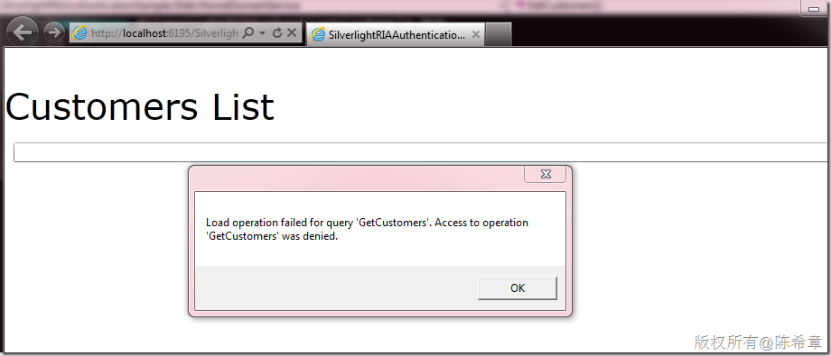
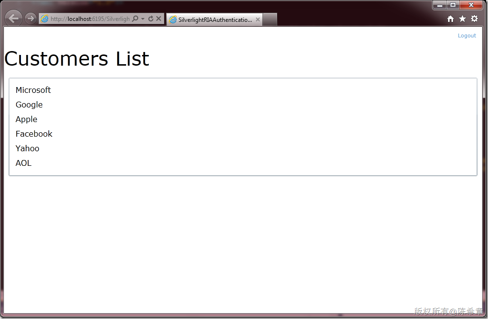

# 如何在RIA应用中实现用户授权 
> 原文发表于 2011-07-14, 地址: http://www.cnblogs.com/chenxizhang/archive/2011/07/14/2106767.html 


[上一篇](http://www.cnblogs.com/chenxizhang/archive/2011/07/13/2105204.html)我讲到了在RIA应用中的身份验证，其实在做一个应用系统的时候，身份验证只是第一步，验证是确认谁可以访问我们的系统。然后授权就是第二步，授权是确认谁可以在系统中做什么事情。

 那么，接着上面这个例子，我们现在有一个方法如下


```
        [Query][RequiresAuthentication]
        /// <summary>
        /// 这个方法返回一些客户名称
        /// </summary>
        /// <returns></returns>
        public IQueryable<Customer> GetCustomers()
        {

            return new[]{
                new Customer(){ID=1,Name="Microsoft"},
                new Customer(){ID=2,Name="Google"},
                new Customer(){ID=3,Name="Apple"},
                new Customer(){ID=4,Name="Facebook"},
                new Customer(){ID=5,Name="Yahoo"},
                new Customer(){ID=16,Name="AOL"}
            }.AsQueryable();
        }
```


.csharpcode, .csharpcode pre
{
 font-size: small;
 color: black;
 font-family: consolas, "Courier New", courier, monospace;
 background-color: #ffffff;
 /*white-space: pre;*/
}
.csharpcode pre { margin: 0em; }
.csharpcode .rem { color: #008000; }
.csharpcode .kwrd { color: #0000ff; }
.csharpcode .str { color: #006080; }
.csharpcode .op { color: #0000c0; }
.csharpcode .preproc { color: #cc6633; }
.csharpcode .asp { background-color: #ffff00; }
.csharpcode .html { color: #800000; }
.csharpcode .attr { color: #ff0000; }
.csharpcode .alt 
{
 background-color: #f4f4f4;
 width: 100%;
 margin: 0em;
}
.csharpcode .lnum { color: #606060; }


这个方法返回了一些客户名称。那么，假设我们希望这个方法的调用者必须在我们的系统里面具有某个角色，例如Sales角色。只有在这个角色里面的用户，我们才授权给他调用该方法。


接下来我就把这个例子继续做下去，添加这部分功能。


 


1. 启用授权
=======


其实要说起来，要给某个方法进行授权很简单，我们只需要在方面上面添加一个Attribute即可，请注意看下面红色的部分


```
        [Query][RequiresAuthentication]**[RequiresRole("Sales")]**
        /// <summary>
        /// 这个方法返回一些客户名称
        /// </summary>
        /// <returns></returns>
        public IQueryable<Customer> GetCustomers()
        {

            return new[]{
                new Customer(){ID=1,Name="Microsoft"},
                new Customer(){ID=2,Name="Google"},
                new Customer(){ID=3,Name="Apple"},
                new Customer(){ID=4,Name="Facebook"},
                new Customer(){ID=5,Name="Yahoo"},
                new Customer(){ID=16,Name="AOL"}
            }.AsQueryable();
        }
```

.csharpcode, .csharpcode pre
{
 font-size: small;
 color: black;
 font-family: consolas, "Courier New", courier, monospace;
 background-color: #ffffff;
 /*white-space: pre;*/
}
.csharpcode pre { margin: 0em; }
.csharpcode .rem { color: #008000; }
.csharpcode .kwrd { color: #0000ff; }
.csharpcode .str { color: #006080; }
.csharpcode .op { color: #0000c0; }
.csharpcode .preproc { color: #cc6633; }
.csharpcode .asp { background-color: #ffff00; }
.csharpcode .html { color: #800000; }
.csharpcode .attr { color: #ff0000; }
.csharpcode .alt 
{
 background-color: #f4f4f4;
 width: 100%;
 margin: 0em;
}
.csharpcode .lnum { color: #606060; }

我们可以先测试一下，现在运行起来会发生什么样的情况？一点都不意外，肯定是要报告错误的，因为我们现在的用户身份没有关联到任何的角色。如下图所示


[](http://images.cnblogs.com/cnblogs_com/chenxizhang/201107/201107142046038781.png)


 


2. 实现角色管理
=========


我们需要在服务器端实现角色管理，就是要能够根据用户身份判断他所拥有的角色信息。


为了简单起见，我添加了一个SimpleRoleProvider，而且只重写了其中的一个方法，请注意下面红色的部分


【备注】这里只是做例子，重点是给大家讲它的原理。所以直接用硬编码的方式。


 


```
  public class SimpleRoleProvider : System.Web.Security.RoleProvider
    {

        public override void AddUsersToRoles(string[] usernames, string[] roleNames)
        {
            throw new NotImplementedException();
        }

        public override string ApplicationName
        {
            get
            {
                throw new NotImplementedException();
            }
            set
            {
                throw new NotImplementedException();
            }
        }

        public override void CreateRole(string roleName)
        {
            throw new NotImplementedException();
        }

        public override bool DeleteRole(string roleName, bool throwOnPopulatedRole)
        {
            throw new NotImplementedException();
        }

        public override string[] FindUsersInRole(string roleName, string usernameToMatch)
        {
            throw new NotImplementedException();
        }

        public override string[] GetAllRoles()
        {
            throw new NotImplementedException();
        }

 **public override string[] GetRolesForUser(string username)
 {
 if(username == "chenxizhang")
 return new[] { 
 "Sales"
 };
 return null;
 }**

        public override string[] GetUsersInRole(string roleName)
        {
            throw new NotImplementedException();
        }

        public override bool IsUserInRole(string username, string roleName)
        {
            throw new NotImplementedException();
        }

        public override void RemoveUsersFromRoles(string[] usernames, string[] roleNames)
        {
            throw new NotImplementedException();
        }

        public override bool RoleExists(string roleName)
        {
            throw new NotImplementedException();
        }
    }
```

.csharpcode, .csharpcode pre
{
 font-size: small;
 color: black;
 font-family: consolas, "Courier New", courier, monospace;
 background-color: #ffffff;
 /*white-space: pre;*/
}
.csharpcode pre { margin: 0em; }
.csharpcode .rem { color: #008000; }
.csharpcode .kwrd { color: #0000ff; }
.csharpcode .str { color: #006080; }
.csharpcode .op { color: #0000c0; }
.csharpcode .preproc { color: #cc6633; }
.csharpcode .asp { background-color: #ffff00; }
.csharpcode .html { color: #800000; }
.csharpcode .attr { color: #ff0000; }
.csharpcode .alt 
{
 background-color: #f4f4f4;
 width: 100%;
 margin: 0em;
}
.csharpcode .lnum { color: #606060; }

 


如何注册使用这个Provider呢？我们需要修改web.config文件


在system.web里面添加了这么一段


```
    <roleManager enabled="true" defaultProvider="simple">
      <providers>
        <clear/>
        <add name="simple" type="SilverlightRIAAuthenticationSample.Web.SimpleRoleProvider"/>
      </providers>
    </roleManager>
```


.csharpcode, .csharpcode pre
{
 font-size: small;
 color: black;
 font-family: consolas, "Courier New", courier, monospace;
 background-color: #ffffff;
 /*white-space: pre;*/
}
.csharpcode pre { margin: 0em; }
.csharpcode .rem { color: #008000; }
.csharpcode .kwrd { color: #0000ff; }
.csharpcode .str { color: #006080; }
.csharpcode .op { color: #0000c0; }
.csharpcode .preproc { color: #cc6633; }
.csharpcode .asp { background-color: #ffff00; }
.csharpcode .html { color: #800000; }
.csharpcode .attr { color: #ff0000; }
.csharpcode .alt 
{
 background-color: #f4f4f4;
 width: 100%;
 margin: 0em;
}
.csharpcode .lnum { color: #606060; }

再次运行程序，我们会发现已经能返回数据了，为什么呢，因为chenxizhang这个用户是Sales角色的，所以他就有权限查询。


[](http://images.cnblogs.com/cnblogs_com/chenxizhang/201107/201107142046051025.png)


这就是在RIA Service中进行授权的简单例子。虽然简单，但已经能够说明问题了。


讲到这里，有很多朋友都理解了。但也许有人会对写这个SimpleRoleProvider感到疑惑，为什么要这么写呢？能不能用数据库里面的信息来授权呢？当然是可以的，在真正的系统中，我是推荐你用数据库来做身份验证和授权的。


 


下面有些参考链接


<http://msdn.microsoft.com/en-us/library/6e9y4s5t.aspx>


<http://msdn.microsoft.com/en-us/library/879kf95c.aspx>


<http://msdn.microsoft.com/en-us/library/2fx93s7w.aspx>


 


简而言之，其实从ASP.NET 2.0开始就提供了一套标准的服务来完成身份验证，授权，个性化，配置等等功能，而且有一个非常标准的数据库——传说中的“aspnetdb”.


 


3.两个相关问题
========


有网友之前问到，如何实现更加动态化的授权呢？我是这么理解的，有两个层面


* 我们有些方法，可能需要根据当前用户的身份，对数据进行过滤。也就是说，其实方法都是可以被用户调用的，只不过每个人调用的结果不一样。这也是一种特殊的授权吧。


       这个问题的关键在于，如何在方法里面获取得到当前用户的身份。请参考下面这个代码。既然能得到用户的信息，那么在查询的时候，就可以用这个作为参数传递到数据库进行过滤。这样就实现了刚才所说的需求。


> 
> ```
>             var currentUser = this.ServiceContext.User.Identity.Name;
> ```
> 


* 有的朋友可能会觉得系统自带的这个RequiresRole属性不够灵活。我之前接触过一个客户，他们的情况是，他们不想将角色名称写死在代码里面。希望能够读取配置文件的方式。这当然也不是说做不到。我下面用一个小例子来演示


首先，我可以定义一个特殊的类型，继承自AuthorizationAttribute 


 


```
using System.ComponentModel.DataAnnotations;
using System.Configuration;

namespace SilverlightRIAAuthenticationSample.Web
{
    public class DynamicRequiresRole:AuthorizationAttribute
    {
        protected override AuthorizationResult IsAuthorized(System.Security.Principal.IPrincipal principal, AuthorizationContext authorizationContext)
        {
            Role = ConfigurationManager.AppSettings[RoleNameInConfig];

            if(principal.IsInRole(Role))
                return AuthorizationResult.Allowed;
            return new AuthorizationResult("Access deny");
        }

        /// <summary>
        /// 这个属性指定在配置文件中设置角色的AppSettings的键名
        /// </summary>
        public string RoleNameInConfig { get; set; }
        /// <summary>
        /// 这是内部保存的角色信息
        /// </summary>
        private string Role { get; set; }


    }
}
```

.csharpcode, .csharpcode pre
{
 font-size: small;
 color: black;
 font-family: consolas, "Courier New", courier, monospace;
 background-color: #ffffff;
 /*white-space: pre;*/
}
.csharpcode pre { margin: 0em; }
.csharpcode .rem { color: #008000; }
.csharpcode .kwrd { color: #0000ff; }
.csharpcode .str { color: #006080; }
.csharpcode .op { color: #0000c0; }
.csharpcode .preproc { color: #cc6633; }
.csharpcode .asp { background-color: #ffff00; }
.csharpcode .html { color: #800000; }
.csharpcode .attr { color: #ff0000; }
.csharpcode .alt 
{
 background-color: #f4f4f4;
 width: 100%;
 margin: 0em;
}
.csharpcode .lnum { color: #606060; }

 


然后，我在配置文件中添加一个设置


```
  <appSettings>
    <add key="SalesRoleName" value="Sales"/>
  </appSettings>
```

.csharpcode, .csharpcode pre
{
 font-size: small;
 color: black;
 font-family: consolas, "Courier New", courier, monospace;
 background-color: #ffffff;
 /*white-space: pre;*/
}
.csharpcode pre { margin: 0em; }
.csharpcode .rem { color: #008000; }
.csharpcode .kwrd { color: #0000ff; }
.csharpcode .str { color: #006080; }
.csharpcode .op { color: #0000c0; }
.csharpcode .preproc { color: #cc6633; }
.csharpcode .asp { background-color: #ffff00; }
.csharpcode .html { color: #800000; }
.csharpcode .attr { color: #ff0000; }
.csharpcode .alt 
{
 background-color: #f4f4f4;
 width: 100%;
 margin: 0em;
}
.csharpcode .lnum { color: #606060; }

 


接下来，我就可以在方法上面使用这个Attribute了


```
        [Query][RequiresAuthentication]
        [DynamicRequiresRole(RoleNameInConfig="SalesRoleName")]
        /// <summary>
        /// 这个方法返回一些客户名称
        /// </summary>
        /// <returns></returns>
        public IQueryable<Customer> GetCustomers()
        {
            var currentUser = this.ServiceContext.User.Identity.Name;

            return new[]{
                new Customer(){ID=1,Name="Microsoft"},
                new Customer(){ID=2,Name="Google"},
                new Customer(){ID=3,Name="Apple"},
                new Customer(){ID=4,Name="Facebook"},
                new Customer(){ID=5,Name="Yahoo"},
                new Customer(){ID=16,Name="AOL"}
            }.AsQueryable();
        }
```

.csharpcode, .csharpcode pre
{
 font-size: small;
 color: black;
 font-family: consolas, "Courier New", courier, monospace;
 background-color: #ffffff;
 /*white-space: pre;*/
}
.csharpcode pre { margin: 0em; }
.csharpcode .rem { color: #008000; }
.csharpcode .kwrd { color: #0000ff; }
.csharpcode .str { color: #006080; }
.csharpcode .op { color: #0000c0; }
.csharpcode .preproc { color: #cc6633; }
.csharpcode .asp { background-color: #ffff00; }
.csharpcode .html { color: #800000; }
.csharpcode .attr { color: #ff0000; }
.csharpcode .alt 
{
 background-color: #f4f4f4;
 width: 100%;
 margin: 0em;
}
.csharpcode .lnum { color: #606060; }

 


这样就可以完成特殊的授权了。当然我上面只是一个演示，你还可以写更多的逻辑在里面


 


这个范例的完整代码，请通过下面的链接下载


[http://files.cnblogs.com/chenxizhang/SilverlightRIAAuthentication\_AuthorizationSample.rar](http://files.cnblogs.com/chenxizhang/SilverlightRIAAuthentication_AuthorizationSample.rar "http://files.cnblogs.com/chenxizhang/SilverlightRIAAuthentication_AuthorizationSample.rar")


【备注】这个代码还修正了关于OOB中不能正确进行身份验证的问题

