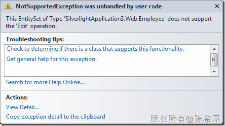
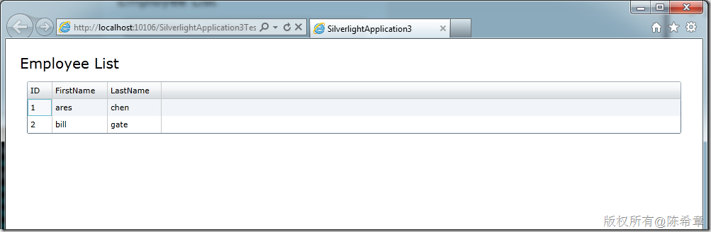
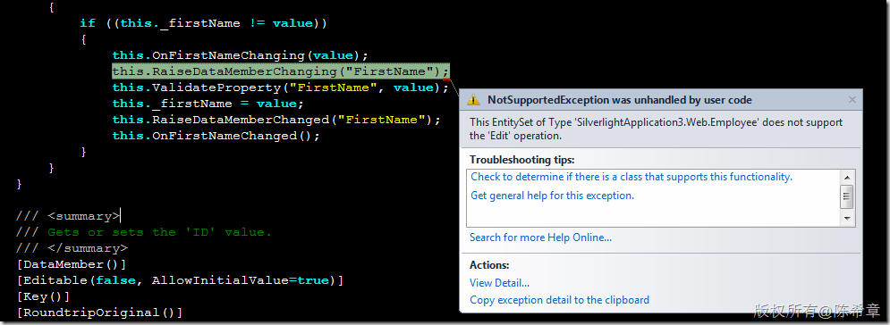
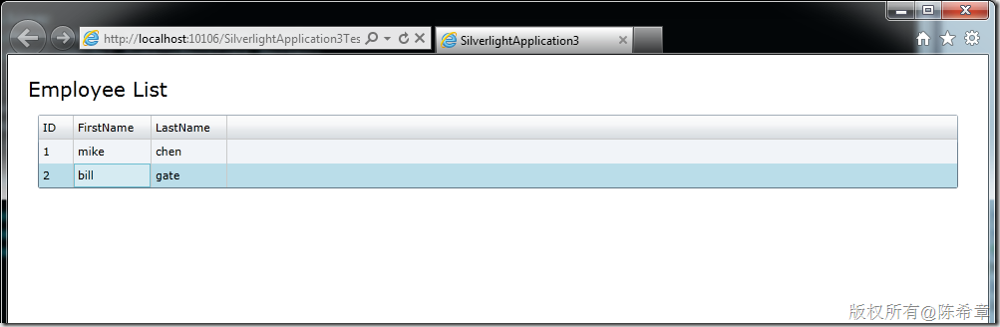
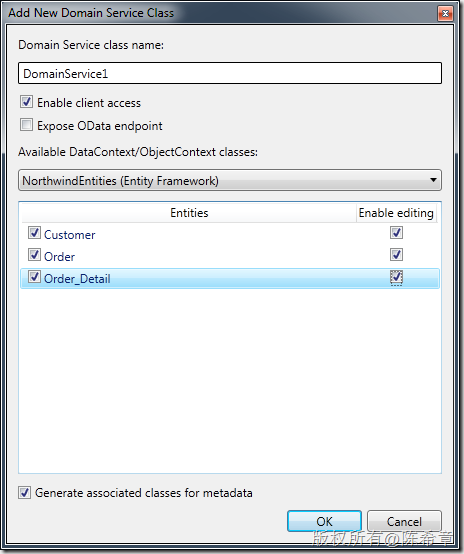

# 自定义Domain Service时遇到实体不能更新的问题及其解决方案 
> 原文发表于 2011-07-19, 地址: http://www.cnblogs.com/chenxizhang/archive/2011/07/19/2110979.html 


这是在项目中的一个小问题。我们用到了自定义的Domain Service和自定义Entity，如果仅仅是读取数据，没有任何问题。但如果需要通过双向绑定，实现更新，则可能会遇到一个错误。类似下面这样

 [](http://images.cnblogs.com/cnblogs_com/chenxizhang/201107/201107191956268170.png)

 本文将重现这个问题，并分析原因和提供解决方案。

  

 【备注】Domain Service看起来很不错，尤其是结合LINQ to Entity的话。但在使用自定义Domain Service时会遇到各种各样的问题，很多问题是让人莫名其妙的。我个人觉得这个设计模型还需要进一步完善的

  

 1. 自定义业务实体
==========

 下面这个类型会被用到服务中返回文件类型映射的信息


```
using System.ComponentModel.DataAnnotations;

namespace SilverlightApplication3.Web
{
    public class Employee
    {
        [Key]
        public int ID { get; set; }
        [Editable(true)]
        public string FirstName { get; set; }
        [Editable(true)]
        public string LastName { get; set; }
    }
}
```

.csharpcode, .csharpcode pre
{
 font-size: small;
 color: black;
 font-family: consolas, "Courier New", courier, monospace;
 background-color: #ffffff;
 /*white-space: pre;*/
}
.csharpcode pre { margin: 0em; }
.csharpcode .rem { color: #008000; }
.csharpcode .kwrd { color: #0000ff; }
.csharpcode .str { color: #006080; }
.csharpcode .op { color: #0000c0; }
.csharpcode .preproc { color: #cc6633; }
.csharpcode .asp { background-color: #ffff00; }
.csharpcode .html { color: #800000; }
.csharpcode .attr { color: #ff0000; }
.csharpcode .alt 
{
 background-color: #f4f4f4;
 width: 100%;
 margin: 0em;
}
.csharpcode .lnum { color: #606060; }

.csharpcode, .csharpcode pre
{
 font-size: small;
 color: black;
 font-family: consolas, "Courier New", courier, monospace;
 background-color: #ffffff;
 /*white-space: pre;*/
}
.csharpcode pre { margin: 0em; }
.csharpcode .rem { color: #008000; }
.csharpcode .kwrd { color: #0000ff; }
.csharpcode .str { color: #006080; }
.csharpcode .op { color: #0000c0; }
.csharpcode .preproc { color: #cc6633; }
.csharpcode .asp { background-color: #ffff00; }
.csharpcode .html { color: #800000; }
.csharpcode .attr { color: #ff0000; }
.csharpcode .alt 
{
 background-color: #f4f4f4;
 width: 100%;
 margin: 0em;
}
.csharpcode .lnum { color: #606060; }

 


 


2. 自定义Domain Service
====================


```

namespace SilverlightApplication3.Web
{
    using System.Linq;
    using System.ServiceModel.DomainServices.Hosting;
    using System.ServiceModel.DomainServices.Server;


    // TODO: Create methods containing your application logic.
    [EnableClientAccess()]
    public class SampleDomainService : DomainService
    {
        public IQueryable<Employee> GetEmployees()
        {
            return new[]{
                new Employee(){ID=1,FirstName="ares",LastName="chen"},
                new Employee(){ID=2,FirstName="bill",LastName="gate"}}.AsQueryable();

        }
    }
}


```

.csharpcode, .csharpcode pre
{
 font-size: small;
 color: black;
 font-family: consolas, "Courier New", courier, monospace;
 background-color: #ffffff;
 /*white-space: pre;*/
}
.csharpcode pre { margin: 0em; }
.csharpcode .rem { color: #008000; }
.csharpcode .kwrd { color: #0000ff; }
.csharpcode .str { color: #006080; }
.csharpcode .op { color: #0000c0; }
.csharpcode .preproc { color: #cc6633; }
.csharpcode .asp { background-color: #ffff00; }
.csharpcode .html { color: #800000; }
.csharpcode .attr { color: #ff0000; }
.csharpcode .alt 
{
 background-color: #f4f4f4;
 width: 100%;
 margin: 0em;
}
.csharpcode .lnum { color: #606060; }

.csharpcode, .csharpcode pre
{
 font-size: small;
 color: black;
 font-family: consolas, "Courier New", courier, monospace;
 background-color: #ffffff;
 /*white-space: pre;*/
}
.csharpcode pre { margin: 0em; }
.csharpcode .rem { color: #008000; }
.csharpcode .kwrd { color: #0000ff; }
.csharpcode .str { color: #006080; }
.csharpcode .op { color: #0000c0; }
.csharpcode .preproc { color: #cc6633; }
.csharpcode .asp { background-color: #ffff00; }
.csharpcode .html { color: #800000; }
.csharpcode .attr { color: #ff0000; }
.csharpcode .alt 
{
 background-color: #f4f4f4;
 width: 100%;
 margin: 0em;
}
.csharpcode .lnum { color: #606060; }

3. 客户端的ViewModel
================


```
using System.Collections.ObjectModel;
using Microsoft.Practices.Prism.ViewModel;
using SilverlightApplication3.Web;
using System.ComponentModel;

namespace SilverlightApplication3.ViewModels
{
    public class MainPageViewModel:NotificationObject
    {

        public MainPageViewModel()
        {

            if(DesignerProperties.IsInDesignTool) return;

            var ctx = new SampleDomainContext();
            ctx.Load<Employee>(ctx.GetEmployeesQuery(), (op) => {
                Employees = new ObservableCollection<Employee>(op.Entities);
            }, true);
        }


        private ObservableCollection<Employee> \_Employees;
        public ObservableCollection<Employee> Employees
        {
            get { return \_Employees; }
            set
            {
                if(\_Employees != value)
                {
                    \_Employees = value;
                    RaisePropertyChanged("Employees");
                }
            }
        }

    }
}

```

4. 页面定义
=======


```
<UserControl
    xmlns:sdk="http://schemas.microsoft.com/winfx/2006/xaml/presentation/sdk"
    x:Class="SilverlightApplication3.MainPage"
    xmlns="http://schemas.microsoft.com/winfx/2006/xaml/presentation"
    xmlns:x="http://schemas.microsoft.com/winfx/2006/xaml"
    xmlns:d="http://schemas.microsoft.com/expression/blend/2008"
    xmlns:mc="http://schemas.openxmlformats.org/markup-compatibility/2006"
    mc:Ignorable="d"
    d:DesignHeight="300"
    d:DesignWidth="400"
    xmlns:vm="clr-namespace:SilverlightApplication3.ViewModels">

    <UserControl.DataContext>
        <vm:MainPageViewModel></vm:MainPageViewModel>
    </UserControl.DataContext>
    <Grid
        x:Name="LayoutRoot"
        Background="White"
        Margin="20">
        <StackPanel>
            <TextBlock
                Text="Employee List"
                FontSize="20"></TextBlock>
            <sdk:DataGrid
                Margin="10"
                ItemsSource="{Binding Employees}"
                AutoGenerateColumns="False">
                <sdk:DataGrid.Columns>
                    <sdk:DataGridTextColumn
                        Binding="{Binding ID}"
                        Header="ID"></sdk:DataGridTextColumn>
                    <sdk:DataGridTextColumn
                        Binding="{Binding FirstName,Mode=TwoWay}"
                        Header="FirstName"></sdk:DataGridTextColumn>
                    <sdk:DataGridTextColumn
                        Binding="{Binding LastName,Mode=TwoWay}"
                        Header="LastName"></sdk:DataGridTextColumn>
                </sdk:DataGrid.Columns>
            </sdk:DataGrid>
        </StackPanel>
    </Grid>
</UserControl>

```


.csharpcode, .csharpcode pre
{
 font-size: small;
 color: black;
 font-family: consolas, "Courier New", courier, monospace;
 background-color: #ffffff;
 /*white-space: pre;*/
}
.csharpcode pre { margin: 0em; }
.csharpcode .rem { color: #008000; }
.csharpcode .kwrd { color: #0000ff; }
.csharpcode .str { color: #006080; }
.csharpcode .op { color: #0000c0; }
.csharpcode .preproc { color: #cc6633; }
.csharpcode .asp { background-color: #ffff00; }
.csharpcode .html { color: #800000; }
.csharpcode .attr { color: #ff0000; }
.csharpcode .alt 
{
 background-color: #f4f4f4;
 width: 100%;
 margin: 0em;
}
.csharpcode .lnum { color: #606060; }


5. 测试运行
=======


[](http://images.cnblogs.com/cnblogs_com/chenxizhang/201107/201107191956266501.png)


读取数据是没有问题的，但是如果我们去编辑FirstName或者LastName，就会发生如下的错误


[](http://images.cnblogs.com/cnblogs_com/chenxizhang/201107/201107191956266468.png)


这个错误确实让人看得云里雾里的。不是吗？你绝不会想到是要像下面这样解决


 


6. 添加一个Updatexxxx方法，使得Employee这个EntitySet可以被编辑
==============================================


解决方案居然是要为Employee这个类型，添加一个特殊的方法，用Update做为前缀。看下面的例子


```

namespace SilverlightApplication3.Web
{
    using System.Linq;
    using System.ServiceModel.DomainServices.Hosting;
    using System.ServiceModel.DomainServices.Server;


    // TODO: Create methods containing your application logic.
    [EnableClientAccess()]
    public class SampleDomainService : DomainService
    {
        public IQueryable<Employee> GetEmployees()
        {
            return new[]{
                new Employee(){ID=1,FirstName="ares",LastName="chen"},
                new Employee(){ID=2,FirstName="bill",LastName="gate"}}.AsQueryable();

        }

 **/// <summary>
 /// 这个方法用来更新员工
 /// </summary>
 /// <param name="e"></param>
 public void UpdateEmployee(Employee e)
 {
 }**

    }
}


```

.csharpcode, .csharpcode pre
{
 font-size: small;
 color: black;
 font-family: consolas, "Courier New", courier, monospace;
 background-color: #ffffff;
 /*white-space: pre;*/
}
.csharpcode pre { margin: 0em; }
.csharpcode .rem { color: #008000; }
.csharpcode .kwrd { color: #0000ff; }
.csharpcode .str { color: #006080; }
.csharpcode .op { color: #0000c0; }
.csharpcode .preproc { color: #cc6633; }
.csharpcode .asp { background-color: #ffff00; }
.csharpcode .html { color: #800000; }
.csharpcode .attr { color: #ff0000; }
.csharpcode .alt 
{
 background-color: #f4f4f4;
 width: 100%;
 margin: 0em;
}
.csharpcode .lnum { color: #606060; }

.csharpcode, .csharpcode pre
{
 font-size: small;
 color: black;
 font-family: consolas, "Courier New", courier, monospace;
 background-color: #ffffff;
 /*white-space: pre;*/
}
.csharpcode pre { margin: 0em; }
.csharpcode .rem { color: #008000; }
.csharpcode .kwrd { color: #0000ff; }
.csharpcode .str { color: #006080; }
.csharpcode .op { color: #0000c0; }
.csharpcode .preproc { color: #cc6633; }
.csharpcode .asp { background-color: #ffff00; }
.csharpcode .html { color: #800000; }
.csharpcode .attr { color: #ff0000; }
.csharpcode .alt 
{
 background-color: #f4f4f4;
 width: 100%;
 margin: 0em;
}
.csharpcode .lnum { color: #606060; }

当然，也可以不叫UpdateEmployee的名字，但参数必须必须是Employee类型


例如下面这样


```

namespace SilverlightApplication3.Web
{
    using System.Linq;
    using System.ServiceModel.DomainServices.Hosting;
    using System.ServiceModel.DomainServices.Server;


    // TODO: Create methods containing your application logic.
    [EnableClientAccess()]
    public class SampleDomainService : DomainService
    {
        public IQueryable<Employee> GetEmployees()
        {
            return new[]{
                new Employee(){ID=1,FirstName="ares",LastName="chen"},
                new Employee(){ID=2,FirstName="bill",LastName="gate"}}.AsQueryable();

        }


 **/// <summary>
 /// 这个方法用来更新员工
 /// </summary>
 /// <param name="e"></param>
 [Update]
 public void ModifyEmployee(Employee e)
 {
 }**
    }
}


```

7.再次运行测试（客户端代码无需任何修改）
=====================


请注意，第一行的FirstName已经被修改了（由ares改成了mike）


[](http://images.cnblogs.com/cnblogs_com/chenxizhang/201107/201107191956274483.png)


.csharpcode, .csharpcode pre
{
 font-size: small;
 color: black;
 font-family: consolas, "Courier New", courier, monospace;
 background-color: #ffffff;
 /*white-space: pre;*/
}
.csharpcode pre { margin: 0em; }
.csharpcode .rem { color: #008000; }
.csharpcode .kwrd { color: #0000ff; }
.csharpcode .str { color: #006080; }
.csharpcode .op { color: #0000c0; }
.csharpcode .preproc { color: #cc6633; }
.csharpcode .asp { background-color: #ffff00; }
.csharpcode .html { color: #800000; }
.csharpcode .attr { color: #ff0000; }
.csharpcode .alt 
{
 background-color: #f4f4f4;
 width: 100%;
 margin: 0em;
}
.csharpcode .lnum { color: #606060; }

 


8. 分析问题的根源
==========


那么，到底发生了什么呢？为什么添加了那个方法就又可以编辑了呢


我们可以打开客户端自动生成的那个文件来看一下，里面有一段代码很特殊


```
        internal sealed class SampleDomainContextEntityContainer : EntityContainer
        {
            
            public SampleDomainContextEntityContainer()
            {
                this.CreateEntitySet<Employee>(EntitySetOperations.Edit);
            }
        }
```


.csharpcode, .csharpcode pre
{
 font-size: small;
 color: black;
 font-family: consolas, "Courier New", courier, monospace;
 background-color: #ffffff;
 /*white-space: pre;*/
}
.csharpcode pre { margin: 0em; }
.csharpcode .rem { color: #008000; }
.csharpcode .kwrd { color: #0000ff; }
.csharpcode .str { color: #006080; }
.csharpcode .op { color: #0000c0; }
.csharpcode .preproc { color: #cc6633; }
.csharpcode .asp { background-color: #ffff00; }
.csharpcode .html { color: #800000; }
.csharpcode .attr { color: #ff0000; }
.csharpcode .alt 
{
 background-color: #f4f4f4;
 width: 100%;
 margin: 0em;
}
.csharpcode .lnum { color: #606060; }


是在这里，在这个内部密封的类型里面，它设置了Employee这个EntitySet是可以编辑的，而其实这个EntitySetOperation是一个枚举，具有下面可用的值


```
#region Assembly System.ServiceModel.DomainServices.Client.dll, v2.0.50727
// C:\Program Files (x86)\Microsoft SDKs\RIA Services\v1.0\Libraries\Silverlight\System.ServiceModel.DomainServices.Client.dll
#endregion

using System;

namespace System.ServiceModel.DomainServices.Client
{
    // Summary:
    // Enumeration of the types of operations permissable on an System.ServiceModel.DomainServices.Client.EntitySet.
    [Flags]
    public enum EntitySetOperations
    {
        // Summary:
        // Only read operations are permitted, no update operations are allowed.
        None = 0,
        //
        // Summary:
        // New entities may be added
        Add = 1,
        //
        // Summary:
        // Entities may be updated
        Edit = 2,
        //
        // Summary:
        // Entities may be removed
        Remove = 4,
        //
        // Summary:
        // Entities may be added, updated and removed
        All = 7,
    }
}

```

.csharpcode, .csharpcode pre
{
 font-size: small;
 color: black;
 font-family: consolas, "Courier New", courier, monospace;
 background-color: #ffffff;
 /*white-space: pre;*/
}
.csharpcode pre { margin: 0em; }
.csharpcode .rem { color: #008000; }
.csharpcode .kwrd { color: #0000ff; }
.csharpcode .str { color: #006080; }
.csharpcode .op { color: #0000c0; }
.csharpcode .preproc { color: #cc6633; }
.csharpcode .asp { background-color: #ffff00; }
.csharpcode .html { color: #800000; }
.csharpcode .attr { color: #ff0000; }
.csharpcode .alt 
{
 background-color: #f4f4f4;
 width: 100%;
 margin: 0em;
}
.csharpcode .lnum { color: #606060; }

 


9.题外话：
======


我们在使用LINQ to Entity作为Domain Service的数据模型的时候，可能就意识不到这个问题，是因为我们可以在创建Domain Service的时候设置是否允许编辑


[](http://images.cnblogs.com/cnblogs_com/chenxizhang/201107/201107191956273022.png)


然后自动生成的Domain Service里面就自动具有了Update,Delete,Insert之类的方法，这样就允许这些业务实体支持更新了。

