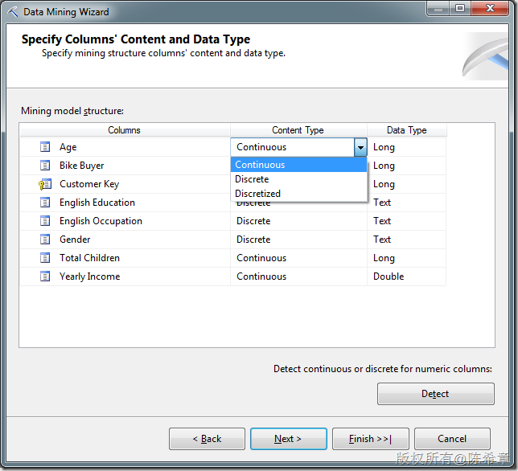
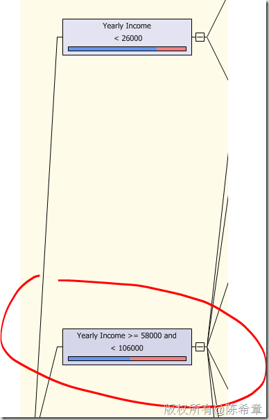
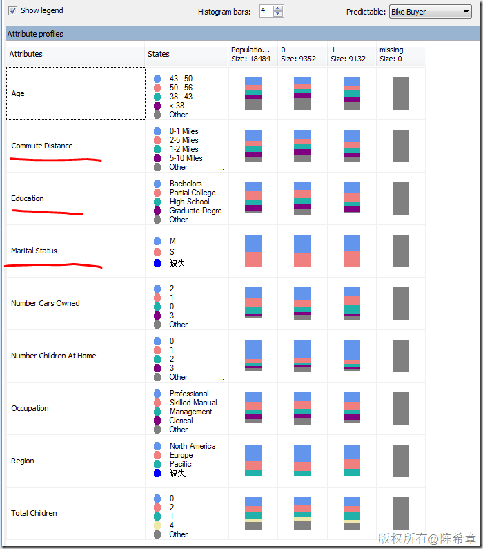
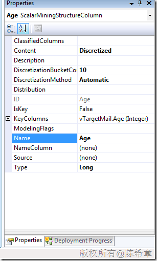

# SQL SERVER 数据挖掘中的几个问题（一）：理解内容类型 
> 原文发表于 2011-07-24, 地址: http://www.cnblogs.com/chenxizhang/archive/2011/07/24/2115281.html 

最近与一个客户的开发团队探讨和学习SQL Server的数据挖掘及其应用。有几个比较有意思的问题，整理出来

 关于数据挖掘的基本知识和学习资料，可以参考<http://msdn.microsoft.com/zh-cn/library/bb510517.aspx>

  

 1. 如何理解Continuous（连续）,Discretized（离散化）和Discreted（离散的）的区别
========================================================

 这是对于在数据挖掘结构中，对于内容类型设置的几个常用的值，如下图所示

 【备注】其实除了这三个，还有其他好多个不同的ContentType，具体的请参考<http://msdn.microsoft.com/zh-cn/library/ms174572.aspx>

 

 我的理解是这样的

 * 首先，这个ContentType是指定在挖掘模型中将如何这些属性，而并非说这个属性本身是连续的或者离散的。
* 其次，不同的挖掘算法对于ContentType的支持是不一样的。例如贝叶斯算法就不支持连续的类型。其他一些算法也或多或少会有些自己的限制等
* 如果使用“连续(Continuous)”，则表示这一列的数据，最终可以在分析的时候，按照一定的规则划分一些范围，而不是单一的某个值。典型的连续类型，例如年收入，年龄等。因为年收入的值可能是很多的，如果每一个值都作为一个分析的个体去做，那么会导致太过细枝末节。我们通常在分析的时候，习惯将收入分段，例如1000～30000之间当做一个个体。如果要实现这样的效果，那么年收入就要设置为“连续”。下图是在决策树中看到的一个效果

 

 * 那么什么是“离散（Discreted）”的内容类型呢？和“连续”正好相反，它表示将每个数据都作为单一的个体进行分析，如果数据包含有限的几个可选值，则很适合用这种类型。例如性别，职业等等。下图是在贝叶斯算法中看到的一个效果。除了第一个属性“Age”之外，其他的其实都是离散的。

 

 * 那么，什么是离散化（Discretized）的呢？其实上面这个图中看到的Age就是离散化的。为什么这么说呢？首先它肯定不是连续的，因为贝叶斯不支持连续的内容类型，其次它又不是离散的，离散的是将每个数据作为个体，而这里的Age其实是有范围的意思。那么，这样你就大致理解了为什么会有“离散化”这么一个类型了吧？就是说，在某些算法里面，既不支持连续的内容类型，而且你分析的时候，又不希望用离散的内容类型进行分析（因为个体可能很多），那么可以选择将这些数据转换为离散的，这个过程叫离散化。我们来看看是怎么做到的？

 首先，设置为Discretized，

 

 然后一定要设置另外两个属性：DiscretizationBucketCount，和DiscretizationMethod,第一个属性表示分成多少组（最多），第二个属性表示要用什么方法分组。这个Method有下面三种选择

 

  

 通过这样的比较，大家应该就能较好地理解这三种内容类型的区别了

