# SQL SERVER 数据挖掘中的几个问题（三）：理解聚类算法和顺序聚类算法 
> 原文发表于 2011-07-24, 地址: http://www.cnblogs.com/chenxizhang/archive/2011/07/24/2115331.html 

最近与一个客户的开发团队探讨和学习SQL Server的数据挖掘及其应用。有几个比较有意思的问题，整理出来 关于数据挖掘的基本知识和学习资料，可以参考<http://msdn.microsoft.com/zh-cn/library/bb510517.aspx>   上一篇： [SQL SERVER 数据挖掘中的几个问题（二）：理解列的用法（Predict和PredictOnly)](http://www.cnblogs.com/chenxizhang/archive/2011/07/24/2115304.html)   这一篇我们来探讨一下两个有时候会引起混淆的算法：聚类和顺序聚类   聚类算法是使用非常多的一种算法，它的作用是对数据进行分组，将特征相近的实体组织在一起，以便帮助我们对于目标实体分类决策。典型的情况，例如人口分析，客户分析。 聚类算法大致的效果如下（下面的分类名都可以修改，定义成我们更加容易理解的，例如“金牌客户”，“银牌客户”等等） [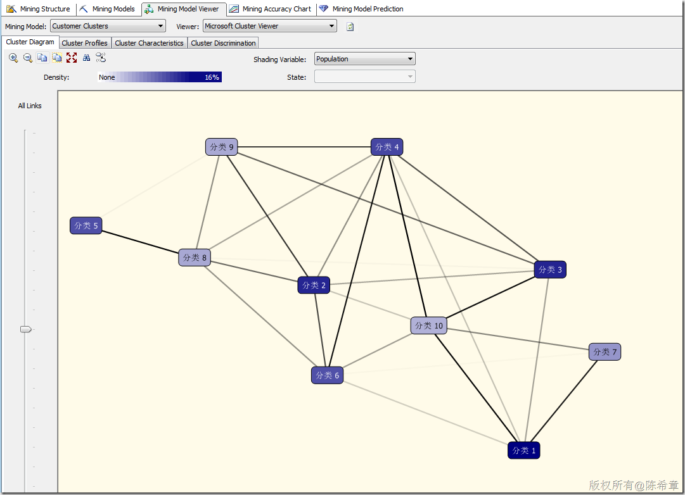](http://images.cnblogs.com/cnblogs_com/chenxizhang/201107/20110724130051197.png) [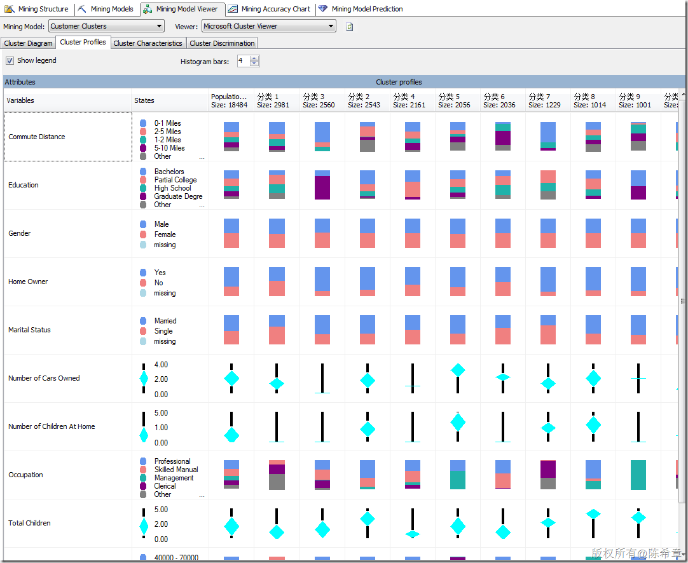](http://images.cnblogs.com/cnblogs_com/chenxizhang/201107/201107241300525115.png) [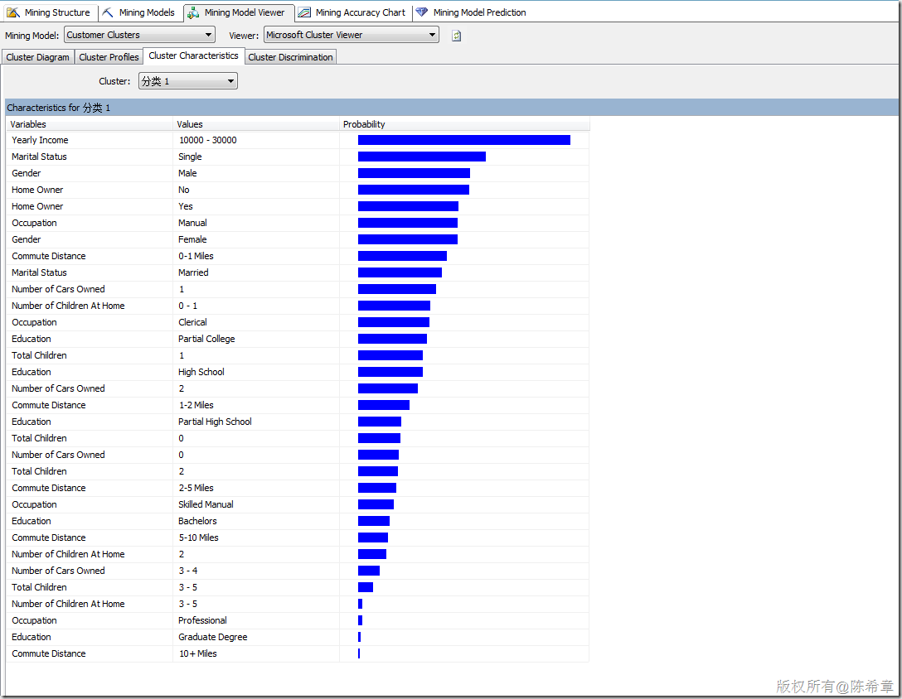](http://images.cnblogs.com/cnblogs_com/chenxizhang/201107/201107241300531701.png) [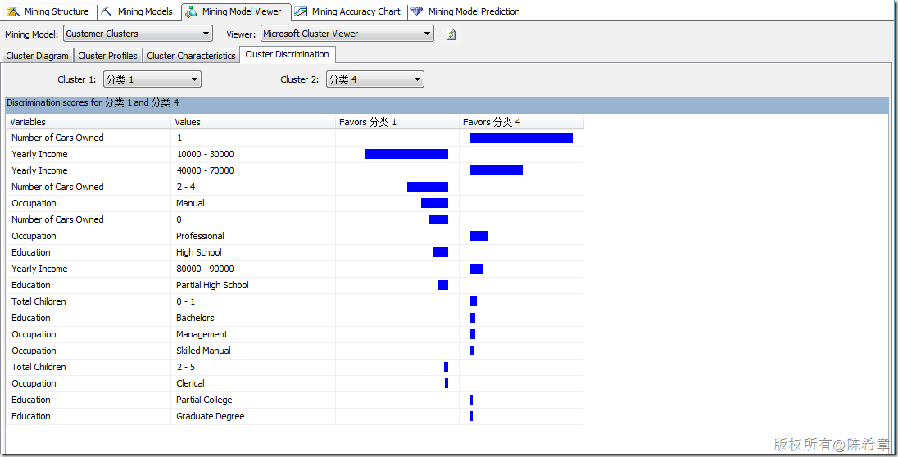](http://images.cnblogs.com/cnblogs_com/chenxizhang/201107/201107241300533587.png)

  

 有关聚类算法，有一个常见的问题就是：**同一个实体会不会出现在不同的类里面呢？也就是说是否有可能会有重叠的情况？**

 这个问题的答案是：是否有重叠的情况，取决于算法的设置，默认情况下，是可能重叠的。

 下面这个算法参数列表中，有一个CLUSTERING\_METHOD，默认为1.就是所谓的EM（Expectation Maximization）这种算法，这是允许重叠的。

 [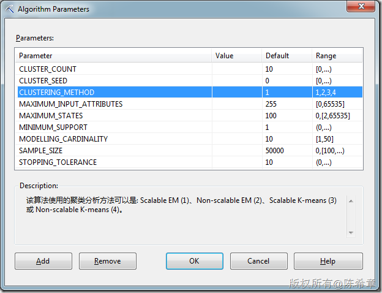](http://images.cnblogs.com/cnblogs_com/chenxizhang/201107/201107241300546062.png)

 如果设置为3或者4，则不允许重叠。至于是否可以伸缩（Scalable）表示的是该算法读取数据的规则，如果可伸缩，则表示会先读取50000条记录作为种子进行建模，如果足够，则停止读取。否则继续读取下50000个。而不可伸缩则每次都读取所有的实体。

  

 那么，什么是“顺序聚类”呢？其实它的完整名称应该是”Microsoft 顺序分析和聚类分析”，也就是结合了顺序分析和聚类分析的一种特殊的算法。

 [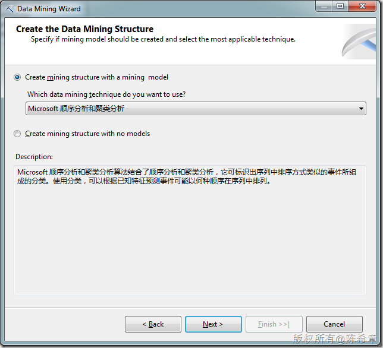](http://images.cnblogs.com/cnblogs_com/chenxizhang/201107/201107241300547425.png)

 这个算法建立模型之后，大致看到的效果是下面这样的

 [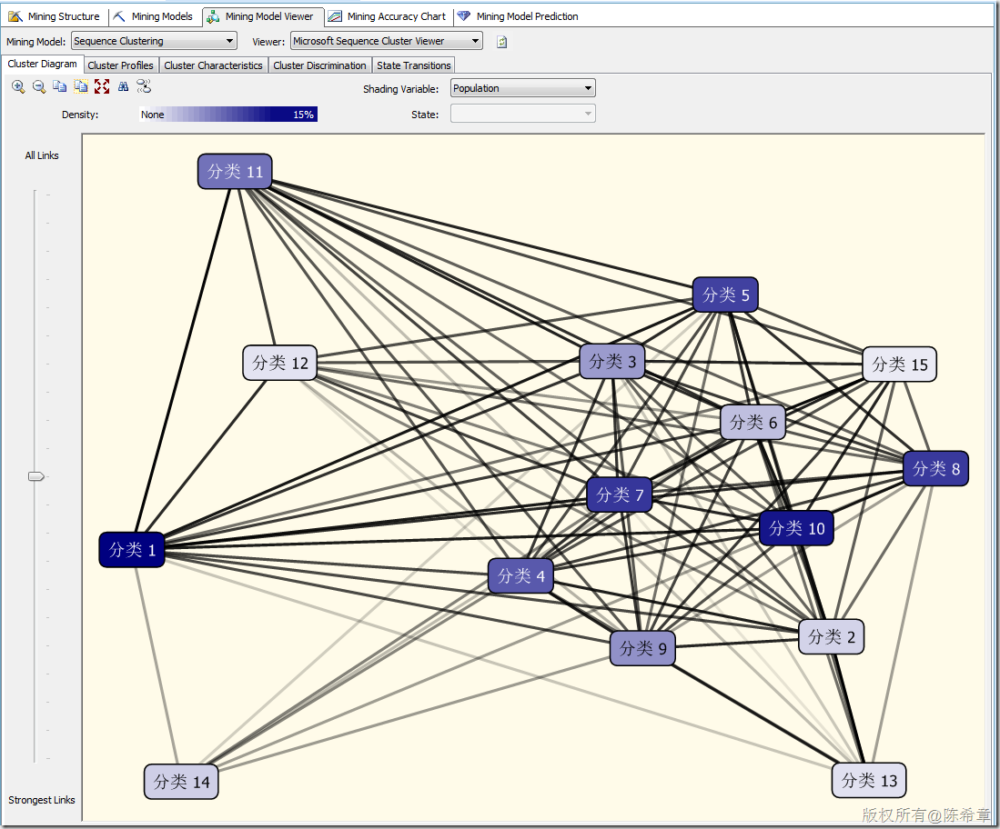](http://images.cnblogs.com/cnblogs_com/chenxizhang/201107/201107241300566322.png)

 [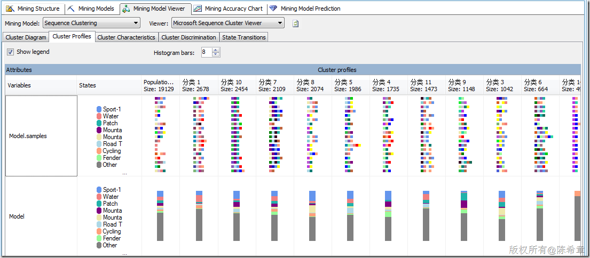](http://images.cnblogs.com/cnblogs_com/chenxizhang/201107/201107241300597453.png)

 [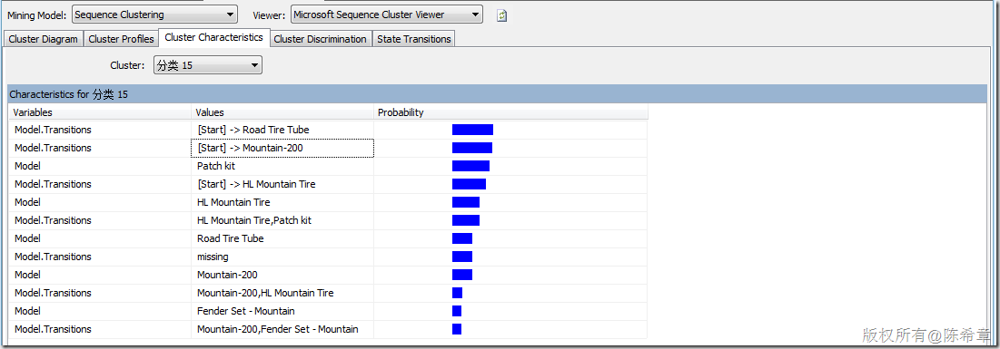](http://images.cnblogs.com/cnblogs_com/chenxizhang/201107/201107241301001290.png)

  

 [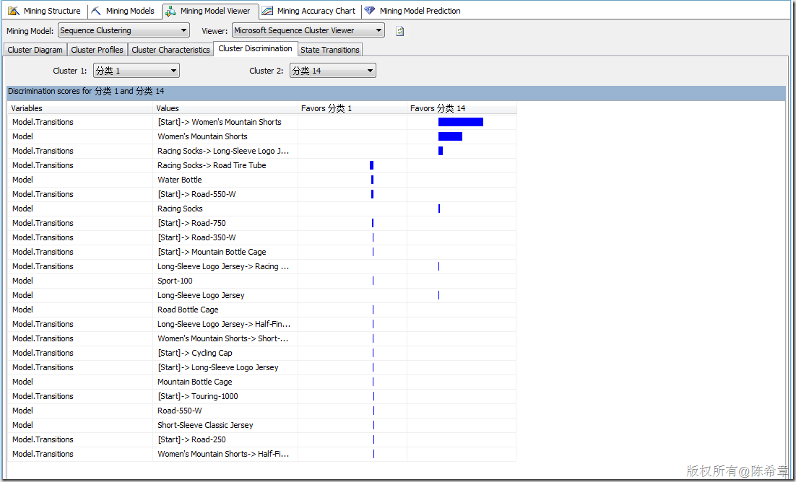](http://images.cnblogs.com/cnblogs_com/chenxizhang/201107/201107241301011682.png)

 【备注】这里一定要注意，除了标准的属性之外，顺序聚类会多出来所谓的“Transitions”，这里也就是体现了顺序的概念。并且顺序聚类算法与标准的聚类算法相比，更多出来另外一个专门的图形，请看下图

 [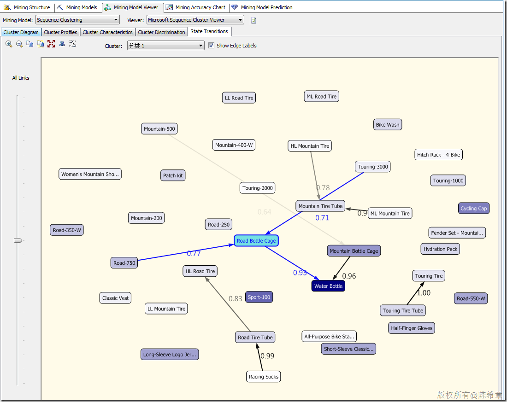](http://images.cnblogs.com/cnblogs_com/chenxizhang/201107/201107241301039565.png)

  

 关键就在于，这个图你该如何理解呢？我总结这么几点

 **1. 顺序聚类算法，首先它是一个聚类算法，他会对输入的实体进行分组。**

 **2. 之所以称为顺序聚类，是说它可以在分完组之后，针对这些组的实体的一些行为（主要是与时间有关的行为）进行分析，展示。**

 **典型的情况有：分析不同客户群体将物品放入购物篮的顺序，分析不同用户群体访问公司网页的点击顺序流。**

  

 上面这个图的举例解释就是：“分类1”的这个组，通常是买了“Road-750”这个产品后，有77%的可能性买”Road Bottle Cage”，然后又有93%的可能性买“Water Bottle”

