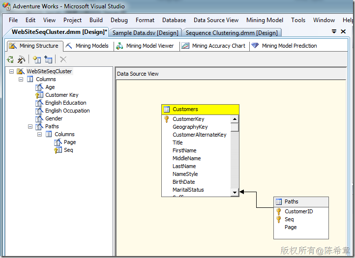

# SQL SERVER 数据挖掘中的几个问题（四）：如何实现Web 路径流挖掘 
> 原文发表于 2011-07-24, 地址: http://www.cnblogs.com/chenxizhang/archive/2011/07/24/2115643.html 

最近与一个客户的开发团队探讨和学习SQL Server的数据挖掘及其应用。有几个比较有意思的问题，整理出来 关于数据挖掘的基本知识和学习资料，可以参考<http://msdn.microsoft.com/zh-cn/library/bb510517.aspx>   上一篇：[SQL SERVER 数据挖掘中的几个问题（三）：理解聚类算法和顺序聚类算法](http://www.cnblogs.com/chenxizhang/archive/2011/07/24/2115331.html)   上一篇解释了聚类算法和顺序聚类算法，这一篇讲解一个实例，就是我们常说的Web 路径流挖掘分析。Web路径流是让我们发现用户使用网站的习惯的一种表示方式，例如我们想知道用户是先到什么页面，然后再到什么页面，由此我们可以给用户分组，并且根据他们的习惯定制更好的页面导航设计。 按照数据挖掘的基本流程，我们一步一步来做   1.定义问题：通过分析得到不同用户群使用网站的路径及其规律
=============================

 2.准备数据：
=======

 为此，我们准备两个表格，分别保存客户信息（如下）

 

 以及客户点击页面的记录表（这里作为演示，我只填写了一些范例数据）

 

 3.建立模型：
=======

 准备数据源和数据源视图

 

 创建挖掘模型。这个业务场景，我们适合用“顺序分析和聚类分析”

 

 

 

 

 

 

 

 点击“Finish”之后，检查模型的设计

 

 

 4.部署和处理
=======

 

 

 

 【备注】因为数据不多，所以看到的结果比较简单。有兴趣的朋友可以实际准备一些数据进行分析

