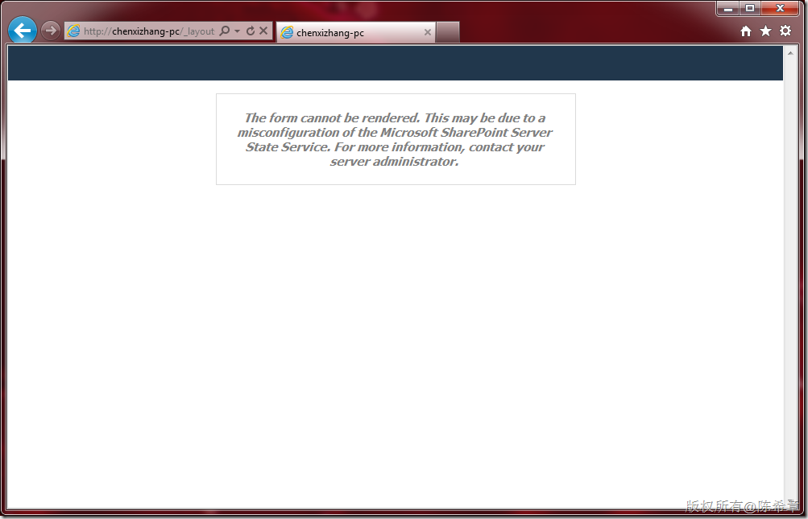
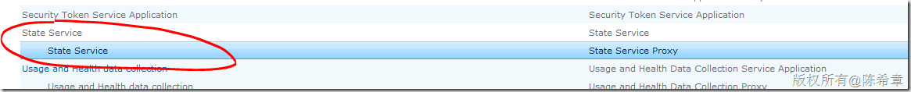

# 有关在SharePoint Server中Infopath表单无法呈现的问题及解决方案 
> 原文发表于 2011-08-06, 地址: http://www.cnblogs.com/chenxizhang/archive/2011/08/06/2129659.html 

今天在我的笔记本电脑上配置基于SharePoint 2010的Forms Service，但是遇到一些问题，就是表单模板上传之后，点击创建后却无法呈现。错误消息如下：

 

 关于这个问题，大致的意思是，可能没有启用状态服务。

  

 为了解决这个问题，我参考了下面的文章

 [http://www.nanmu.net/sharepoint2010/sharepoint-2010-english/Lists/Posts/Post.aspx?ID=20](http://www.nanmu.net/sharepoint2010/sharepoint-2010-english/Lists/Posts/Post.aspx?ID=20 "http://www.nanmu.net/sharepoint2010/sharepoint-2010-english/Lists/Posts/Post.aspx?ID=20")

  

 按照下面的红色标出的命令，依次执行之后，问题已经解决。摘录如下，给有同样问题的朋友参考

 The form cannot be rendered. This may be due to a misconfiguration of the Microsoft SharePoint Server State Service. For more information, contact your server administrator You may receive this error when trying to publish a page in SharePoint 2010 The form cannot be rendered. This may be due to a misconfiguration of the Microsoft SharePoint Server State Service. For more information, contact your server administrator. Solution:  
You would need to install the ‘State Service’ via the Configuration wizard in Central Administration or via PowerShell. To configure the State Service by using Windows PowerShell:  
1. Click Start, Administrative Tools, Windows PowerShell Modules.  
2. In Windows PowerShell, type **$serviceApp = New-SPStateServiceApplication -Name “State Service”**3. Create a State Service database and associate it with a service application, by typing **New-SPStateServiceDatabase -Name “StateServiceDatabase” -ServiceApplication $serviceApp**4. Create a State Service Application Proxy and associate it with the service application by typing **New-SPStateServiceApplicationProxy -Name “State Service” -ServiceApplication $serviceApp -DefaultProxyGroup**  
(You can use another proxy group if necessary by changing the DefaultProxyGroup parameter)

  

  

 启动之后的State Service

 

