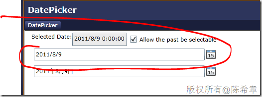
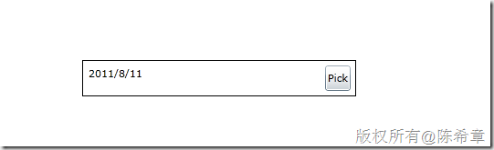

# Silverlight:通过模板定制设置日期选择器的格式 
> 原文发表于 2011-08-07, 地址: http://www.cnblogs.com/chenxizhang/archive/2011/08/07/2129869.html 


这是日前被问到的一个小问题，情况是这样的：Silverlight里面有一个DatePicker控件，它可以让用户选择或者输入日期。

 [](http://images.cnblogs.com/cnblogs_com/chenxizhang/201108/201108071117416092.png)

 这个控件其实很不错，既可选择，又可以输入。

 但问题就出在这个输入上面，有时候我们可能不希望用户去输入，而是必须选择。但是，我们在DatePicker控件上面却找不到类似于IsReadOnly这样的属性。

 其实，这样的需求，可以通过修改DatePicker控件的模板来实现。下面是一个示例


```
<UserControl
 **xmlns:sdk="http://schemas.microsoft.com/winfx/2006/xaml/presentation/sdk"**
    x:Class="SilverlightApplication3.MainPage"
    xmlns="http://schemas.microsoft.com/winfx/2006/xaml/presentation"
    xmlns:x="http://schemas.microsoft.com/winfx/2006/xaml"
    xmlns:d="http://schemas.microsoft.com/expression/blend/2008"
    xmlns:mc="http://schemas.openxmlformats.org/markup-compatibility/2006"
    mc:Ignorable="d"
    d:DesignHeight="300"
    d:DesignWidth="400"
 **xmlns:dp="clr-namespace:System.Windows.Controls.Primitives;assembly=System.Windows.Controls"**>

    <Grid
        x:Name="LayoutRoot"
        Background="White">
        <sdk:DatePicker
            Height="40"
            Width="300">
            <sdk:DatePicker.Template>
                <ControlTemplate>
                    <Border
                        BorderBrush="Black"
                        BorderThickness="1">
                        <Grid
                            x:Name="Root">
                            <Grid.ColumnDefinitions>
                                <ColumnDefinition
                                    Width="*"></ColumnDefinition>
                                <ColumnDefinition
                                    Width="Auto"></ColumnDefinition>
                            </Grid.ColumnDefinitions>
                            <dp:DatePickerTextBox
                                **IsReadOnly="True"**
                                x:Name="TextBox"
                                Margin="5"></dp:DatePickerTextBox>
                            <Button
                                Content="Pick"
                                Grid.Column="1"
                                x:Name="Button"
                                Margin="5"></Button>
                            <Popup
                                x:Name="Popup"></Popup>
                        </Grid>
                    </Border>

                </ControlTemplate>
            </sdk:DatePicker.Template>
        </sdk:DatePicker>
    </Grid>
</UserControl>

```

.csharpcode, .csharpcode pre
{
 font-size: small;
 color: black;
 font-family: consolas, "Courier New", courier, monospace;
 background-color: #ffffff;
 /*white-space: pre;*/
}
.csharpcode pre { margin: 0em; }
.csharpcode .rem { color: #008000; }
.csharpcode .kwrd { color: #0000ff; }
.csharpcode .str { color: #006080; }
.csharpcode .op { color: #0000c0; }
.csharpcode .preproc { color: #cc6633; }
.csharpcode .asp { background-color: #ffff00; }
.csharpcode .html { color: #800000; }
.csharpcode .attr { color: #ff0000; }
.csharpcode .alt 
{
 background-color: #f4f4f4;
 width: 100%;
 margin: 0em;
}
.csharpcode .lnum { color: #606060; }

 


[](http://images.cnblogs.com/cnblogs_com/chenxizhang/201108/20110807111742420.png)


 


怎么理解上面的定义呢？我们用了一个Grid,里面放了三个控件。这里的关键就在于，包括Grid在内的四个控件的名称都是有规定的，而且控件类型也是规定的。请参考下面的文档就知道了


<http://msdn.microsoft.com/en-us/library/cc278067(v=vs.95).aspx>


 


The following table lists the named parts for the [DatePicker](http://msdn.microsoft.com/en-us/library/system.windows.controls.datepicker(v=vs.95).aspx) control.


| DatePicker Part | Type | Description |
| --- | --- | --- |
| Root | [Grid](http://msdn.microsoft.com/en-us/library/system.windows.controls.grid(v=vs.95).aspx) | The root of the control. |
| Button | [Button](http://msdn.microsoft.com/en-us/library/system.windows.controls.button(v=vs.95).aspx) | The button that opens and closes the [Calendar](http://msdn.microsoft.com/en-us/library/system.windows.controls.calendar(v=vs.95).aspx). |
| TextBox | [DatePickerTextBox](http://msdn.microsoft.com/en-us/library/system.windows.controls.primitives.datepickertextbox(v=vs.95).aspx) | The text box that allows you to input a date. |
| Popup | [Popup](http://msdn.microsoft.com/en-us/library/system.windows.controls.primitives.popup(v=vs.95).aspx) | The popup for the [DatePicker](http://msdn.microsoft.com/en-us/library/system.windows.controls.datepicker(v=vs.95).aspx) control. |


 


也就是说，这个控件为了支持定制，内部是定制好了所谓的Part，这都是可以替换的，只要名称和类型一样即可。


 


从这个例子看来，其他很多控件也是可以定制的，只要参考下面的介绍即可


<http://msdn.microsoft.com/en-us/library/cc278075(v=VS.95).aspx>


 


所以说，理解模板，对于Silvelight或者WPF开发来说，是很重要的，给大家参考

