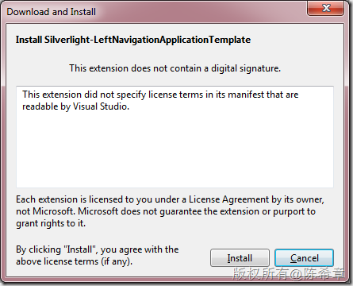

# 发布了一个新的Silverlight导航项目模板（左侧导航） 
> 原文发表于 2011-08-07, 地址: http://www.cnblogs.com/chenxizhang/archive/2011/08/07/2129935.html 

在使用Silverlight开发项目的时候，大部分程序应该是都有导航的，Visual Studio自带了一个导航的模板 ，它是将导航链接放在顶部（右上角的），通常如下图所示

 

  

 但有的时候（很多时候）我们可能希望导航菜单是放在左侧的。例如下面这样

 

  

 我自己整理过一个模板，今天上传到了微软的visualstudiogallery,有兴趣的童鞋们可以下载来使用

 <http://visualstudiogallery.msdn.microsoft.com/a8c67c90-45dc-49ea-a031-5fe4f42930ae>

 

  

 你可以直接在Visual Studio中，通过Tools==>Extension Manager…打开下面的窗口下载到

 **【注意】由于visualstudiogallery中的好东西很多，所以请选择“Online Gallery”,并且在右上角输入leftnavigation关键字进行搜索**

  

 

 点击“Download”即可，然后点击 “Install”

 

  

 然后，在 Visual Studio中就可以看到 这个模板 

 

 创建好的项目是很简单的，如下图所示 

 

 运行起来看的效果如下

 

 接下来，你只需要根据情况修改MainPage中的如下部分，添加需要的HyperlinkButton即可 

 

  

 希望对大家有点帮助吧

