# SQL Server 2008中的CDC(Change Data Capture)功能使用及释疑 
> 原文发表于 2011-08-10, 地址: http://www.cnblogs.com/chenxizhang/archive/2011/08/10/2133408.html 


CDC（Change Data Capture:[变更数据捕获](http://technet.microsoft.com/zh-cn/library/bb522489.aspx)）这个功能是SQL Server 2008企业版的功能，它提供了一种新的机制，对表格数据的更新进行跟踪，在数据仓库的建设过程中，通过这种技术，可以简化从业务数据库导入数据的复杂度。

  

 之前我有过两篇文章介绍，最近因为又在和有关客户介绍这方面的应用。发现之前的例子不是那么完整和清楚，特此再整理一篇出来，给大家参考

  

 * [SQL Server 2008 的CDC功能](http://www.cnblogs.com/chenxizhang/archive/2009/04/28/1445297.html)
* [关于CDC功能的答疑](http://www.cnblogs.com/chenxizhang/archive/2009/05/16/1458388.html)

  

 1. 准备一个数据库，里面准备一个表，Orders
=========================

 [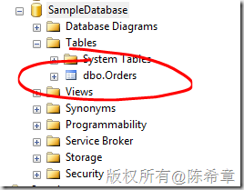](http://images.cnblogs.com/cnblogs_com/chenxizhang/201108/201108101058187912.png)

 2. 启用数据库级别的CDC选项
================


```
--在数据库级别启用CDC功能
EXEC sys.sp\_cdc\_enable\_db .csharpcode, .csharpcode pre
{
 font-size: small;
 color: black;
 font-family: consolas, "Courier New", courier, monospace;
 background-color: #ffffff;
 /*white-space: pre;*/
}
.csharpcode pre { margin: 0em; }
.csharpcode .rem { color: #008000; }
.csharpcode .kwrd { color: #0000ff; }
.csharpcode .str { color: #006080; }
.csharpcode .op { color: #0000c0; }
.csharpcode .preproc { color: #cc6633; }
.csharpcode .asp { background-color: #ffff00; }
.csharpcode .html { color: #800000; }
.csharpcode .attr { color: #ff0000; }
.csharpcode .alt 
{
 background-color: #f4f4f4;
 width: 100%;
 margin: 0em;
}
.csharpcode .lnum { color: #606060; }

```

这个命令执行完之后，会在系统表里面添加6个表格


[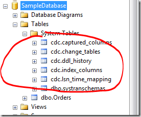](http://images.cnblogs.com/cnblogs_com/chenxizhang/201108/201108101058188195.png)


 


3.在需要做数据捕获的表上面启用CDC选项
=====================


```
EXEC sys.sp\_cdc\_enable\_table @source\_schema='dbo',@source\_name='Orders',@capture\_instance='Orders',@supports\_net\_changes=0,@role\_name=null
```

 


【备注】关于这个存储过程的具体用法和有关参数的含义，请参考
.csharpcode, .csharpcode pre
{
 font-size: small;
 color: black;
 font-family: consolas, "Courier New", courier, monospace;
 background-color: #ffffff;
 /*white-space: pre;*/
}
.csharpcode pre { margin: 0em; }
.csharpcode .rem { color: #008000; }
.csharpcode .kwrd { color: #0000ff; }
.csharpcode .str { color: #006080; }
.csharpcode .op { color: #0000c0; }
.csharpcode .preproc { color: #cc6633; }
.csharpcode .asp { background-color: #ffff00; }
.csharpcode .html { color: #800000; }
.csharpcode .attr { color: #ff0000; }
.csharpcode .alt 
{
 background-color: #f4f4f4;
 width: 100%;
 margin: 0em;
}
.csharpcode .lnum { color: #606060; }


<http://msdn.microsoft.com/en-us/library/bb522475.aspx>


 


执行之后，会有如下的输出消息


[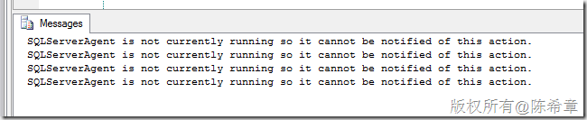](http://images.cnblogs.com/cnblogs_com/chenxizhang/201108/201108101058198718.png)


这个提示的意思是说，要启动SQL Server Agent。因为CDC功能是要通过一个两个作业来自动化完成的


[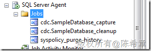](http://images.cnblogs.com/cnblogs_com/chenxizhang/201108/201108101058196733.png)


 


与此同时，执行上面的命令还将在系统表中添加一个表格


[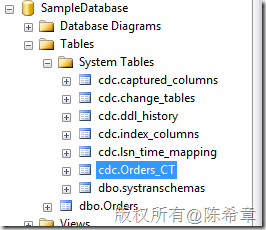](http://images.cnblogs.com/cnblogs_com/chenxizhang/201108/201108101058191717.png)


 


还会添加一个函数


[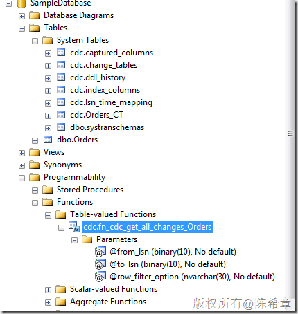](http://images.cnblogs.com/cnblogs_com/chenxizhang/201108/201108101058199732.png)


 


4.插入或者更新数据测试CDC功能
=================


```
--插入或者更新数据测试CDC功能
INSERT Orders(CustomerID) VALUES('Microsoft');
INSERT Orders(CustomerID) VALUES('Google');

UPDATE Orders SET CustomerID='Yahoo' WHERE OrderID=1
DELETE FROM Orders WHERE OrderID=2
```

这个范例插入两行数据，紧接着又对第一行更新，然后还删除了第二行，所以最终只有一行数据


[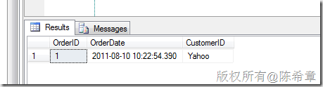](http://images.cnblogs.com/cnblogs_com/chenxizhang/201108/201108101058196667.png)
.csharpcode, .csharpcode pre
{
 font-size: small;
 color: black;
 font-family: consolas, "Courier New", courier, monospace;
 background-color: #ffffff;
 /*white-space: pre;*/
}
.csharpcode pre { margin: 0em; }
.csharpcode .rem { color: #008000; }
.csharpcode .kwrd { color: #0000ff; }
.csharpcode .str { color: #006080; }
.csharpcode .op { color: #0000c0; }
.csharpcode .preproc { color: #cc6633; }
.csharpcode .asp { background-color: #ffff00; }
.csharpcode .html { color: #800000; }
.csharpcode .attr { color: #ff0000; }
.csharpcode .alt 
{
 background-color: #f4f4f4;
 width: 100%;
 margin: 0em;
}
.csharpcode .lnum { color: #606060; }


那么，我们来看看CDC做了什么事情呢？


```
SELECT * FROM cdc.Orders\_CT
```

[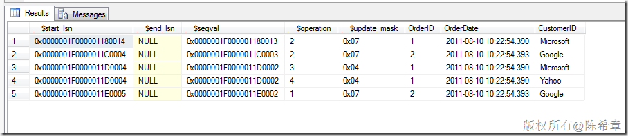](http://images.cnblogs.com/cnblogs_com/chenxizhang/201108/201108101058203602.png)


我们可以来解释一下上面结果的含义


\_\_$operation=2的情况，表示新增


\_\_$operation=3或者4，表示更新，3表示旧值，4表示新值


\_\_$operation=1的情况，表示删除


 


很好理解，不是吗？


但是，我们一般都是需要按照时间范围进行检索，对吧，所以，需要使用下面的语法进行查询


```
--按照时间范围查询CDC结果
DECLARE @from\_lsn BINARY(10),@end\_lsn BINARY(10)
DECLARE @start\_time DATETIME = '2011-8-10 00:00:00'
DECLARE @end\_time DATETIME ='2011-8-11 00:00:00'
SELECT @from\_lsn=sys.fn\_cdc\_map\_time\_to\_lsn('smallest greater than or equal',@start\_time)
SELECT @end\_lsn=sys.fn\_cdc\_map\_time\_to\_lsn(' largest less than or equal',@end\_time)
SELECT * FROM cdc.fn\_cdc\_get\_all\_changes\_Orders(@from\_lsn,@end\_lsn,'all')
```

 


关于sys.fn\_cdc\_map\_time\_to\_lsn这个函数，请参考


<http://msdn.microsoft.com/en-us/library/bb500137.aspx>
.csharpcode, .csharpcode pre
{
 font-size: small;
 color: black;
 font-family: consolas, "Courier New", courier, monospace;
 background-color: #ffffff;
 /*white-space: pre;*/
}
.csharpcode pre { margin: 0em; }
.csharpcode .rem { color: #008000; }
.csharpcode .kwrd { color: #0000ff; }
.csharpcode .str { color: #006080; }
.csharpcode .op { color: #0000c0; }
.csharpcode .preproc { color: #cc6633; }
.csharpcode .asp { background-color: #ffff00; }
.csharpcode .html { color: #800000; }
.csharpcode .attr { color: #ff0000; }
.csharpcode .alt 
{
 background-color: #f4f4f4;
 width: 100%;
 margin: 0em;
}
.csharpcode .lnum { color: #606060; }


查询的结果如下


[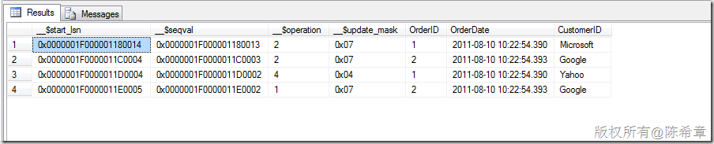](http://images.cnblogs.com/cnblogs_com/chenxizhang/201108/201108101058205521.png)
.csharpcode, .csharpcode pre
{
 font-size: small;
 color: black;
 font-family: consolas, "Courier New", courier, monospace;
 background-color: #ffffff;
 /*white-space: pre;*/
}
.csharpcode pre { margin: 0em; }
.csharpcode .rem { color: #008000; }
.csharpcode .kwrd { color: #0000ff; }
.csharpcode .str { color: #006080; }
.csharpcode .op { color: #0000c0; }
.csharpcode .preproc { color: #cc6633; }
.csharpcode .asp { background-color: #ffff00; }
.csharpcode .html { color: #800000; }
.csharpcode .attr { color: #ff0000; }
.csharpcode .alt 
{
 background-color: #f4f4f4;
 width: 100%;
 margin: 0em;
}
.csharpcode .lnum { color: #606060; }


 


如果需要包含更新操作的旧值，则可以以下的语法


```
DECLARE @from\_lsn BINARY(10),@end\_lsn BINARY(10)
DECLARE @start\_time DATETIME = '2011-8-10 00:00:00'
DECLARE @end\_time DATETIME ='2011-8-11 00:00:00'
SELECT @from\_lsn=sys.fn\_cdc\_map\_time\_to\_lsn('smallest greater than or equal',@start\_time)
SELECT @end\_lsn=sys.fn\_cdc\_map\_time\_to\_lsn(' largest less than or equal',@end\_time)
SELECT * FROM cdc.fn\_cdc\_get\_all\_changes\_Orders(@from\_lsn,@end\_lsn,'all update old')
```


.csharpcode, .csharpcode pre
{
 font-size: small;
 color: black;
 font-family: consolas, "Courier New", courier, monospace;
 background-color: #ffffff;
 /*white-space: pre;*/
}
.csharpcode pre { margin: 0em; }
.csharpcode .rem { color: #008000; }
.csharpcode .kwrd { color: #0000ff; }
.csharpcode .str { color: #006080; }
.csharpcode .op { color: #0000c0; }
.csharpcode .preproc { color: #cc6633; }
.csharpcode .asp { background-color: #ffff00; }
.csharpcode .html { color: #800000; }
.csharpcode .attr { color: #ff0000; }
.csharpcode .alt 
{
 background-color: #f4f4f4;
 width: 100%;
 margin: 0em;
}
.csharpcode .lnum { color: #606060; }


[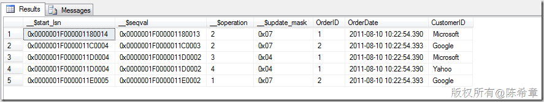](http://images.cnblogs.com/cnblogs_com/chenxizhang/201108/201108101058206045.png)


 


通常，为了方便起见，我们会将这个查询定义为一个存储过程，如下


```
--定义存储过程来进行查询
CREATE PROC GetOrdersCDCResult(@start\_time DATETIME,@end\_time DATETIME)
AS
BEGIN
    DECLARE @from\_lsn BINARY(10),@end\_lsn BINARY(10)
    SELECT @from\_lsn=sys.fn\_cdc\_map\_time\_to\_lsn('smallest greater than or equal',@start\_time)
    SELECT @end\_lsn=sys.fn\_cdc\_map\_time\_to\_lsn(' largest less than or equal',@end\_time)
    SELECT * FROM cdc.fn\_cdc\_get\_all\_changes\_Orders(@from\_lsn,@end\_lsn,'all')
END
```


.csharpcode, .csharpcode pre
{
 font-size: small;
 color: black;
 font-family: consolas, "Courier New", courier, monospace;
 background-color: #ffffff;
 /*white-space: pre;*/
}
.csharpcode pre { margin: 0em; }
.csharpcode .rem { color: #008000; }
.csharpcode .kwrd { color: #0000ff; }
.csharpcode .str { color: #006080; }
.csharpcode .op { color: #0000c0; }
.csharpcode .preproc { color: #cc6633; }
.csharpcode .asp { background-color: #ffff00; }
.csharpcode .html { color: #800000; }
.csharpcode .attr { color: #ff0000; }
.csharpcode .alt 
{
 background-color: #f4f4f4;
 width: 100%;
 margin: 0em;
}
.csharpcode .lnum { color: #606060; }


然后，每次需要用的时候，就直接调用即可


```
--执行存储过程
EXEC GetOrdersCDCResult '2011-8-10','2011-8-11'
```


.csharpcode, .csharpcode pre
{
 font-size: small;
 color: black;
 font-family: consolas, "Courier New", courier, monospace;
 background-color: #ffffff;
 /*white-space: pre;*/
}
.csharpcode pre { margin: 0em; }
.csharpcode .rem { color: #008000; }
.csharpcode .kwrd { color: #0000ff; }
.csharpcode .str { color: #006080; }
.csharpcode .op { color: #0000c0; }
.csharpcode .preproc { color: #cc6633; }
.csharpcode .asp { background-color: #ffff00; }
.csharpcode .html { color: #800000; }
.csharpcode .attr { color: #ff0000; }
.csharpcode .alt 
{
 background-color: #f4f4f4;
 width: 100%;
 margin: 0em;
}
.csharpcode .lnum { color: #606060; }


5.结合SSIS实现事实表的增量更新
==================


下面展示了一个SSIS 包的设计，这里面读取CDC的数据，先进行一些查找，然后按照\_\_$operation的值拆分成为三个操作，分别进行插入，更新和删除，这样就可以实现对事实表的增量更新


[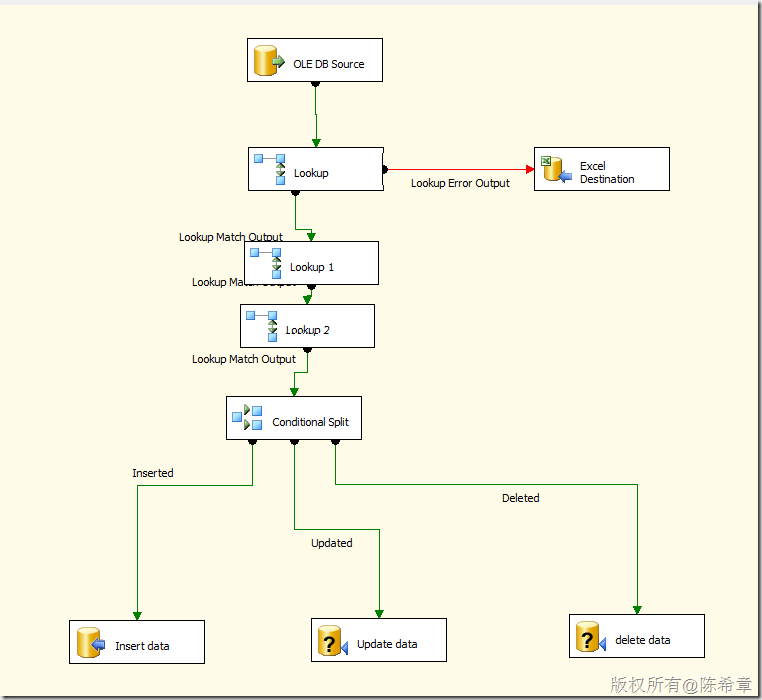](http://images.cnblogs.com/cnblogs_com/chenxizhang/201108/201108101058212631.png)


 


 


本文所有的代码如下


```
USE SampleDatabase
GO

--在数据库级别启用CDC功能
EXEC sys.sp\_cdc\_enable\_db 

--在需要做数据捕获的表格上面启用CDC功能
EXEC sys.sp\_cdc\_enable\_table @source\_schema='dbo',@source\_name='Orders',@capture\_instance='Orders',@supports\_net\_changes=0,@role\_name=null

--插入或者更新数据测试CDC功能
INSERT Orders(CustomerID) VALUES('Microsoft');
INSERT Orders(CustomerID) VALUES('Google');

UPDATE Orders SET CustomerID='Yahoo' WHERE OrderID=1
DELETE FROM Orders WHERE OrderID=2

--查询CDC的结果
SELECT * FROM cdc.Orders\_CT


--按照时间范围查询CDC结果
DECLARE @from\_lsn BINARY(10),@end\_lsn BINARY(10)
DECLARE @start\_time DATETIME = '2011-8-10 00:00:00'
DECLARE @end\_time DATETIME ='2011-8-11 00:00:00'
SELECT @from\_lsn=sys.fn\_cdc\_map\_time\_to\_lsn('smallest greater than or equal',@start\_time)
SELECT @end\_lsn=sys.fn\_cdc\_map\_time\_to\_lsn(' largest less than or equal',@end\_time)
SELECT * FROM cdc.fn\_cdc\_get\_all\_changes\_Orders(@from\_lsn,@end\_lsn,'all')

--定义存储过程来进行查询
CREATE PROC GetOrdersCDCResult(@start\_time DATETIME,@end\_time DATETIME)
AS
BEGIN
    DECLARE @from\_lsn BINARY(10),@end\_lsn BINARY(10)
    SELECT @from\_lsn=sys.fn\_cdc\_map\_time\_to\_lsn('smallest greater than or equal',@start\_time)
    SELECT @end\_lsn=sys.fn\_cdc\_map\_time\_to\_lsn(' largest less than or equal',@end\_time)
    SELECT * FROM cdc.fn\_cdc\_get\_all\_changes\_Orders(@from\_lsn,@end\_lsn,'all')
END

--执行存储过程
EXEC GetOrdersCDCResult '2011-8-10','2011-8-11'

```

.csharpcode, .csharpcode pre
{
 font-size: small;
 color: black;
 font-family: consolas, "Courier New", courier, monospace;
 background-color: #ffffff;
 /*white-space: pre;*/
}
.csharpcode pre { margin: 0em; }
.csharpcode .rem { color: #008000; }
.csharpcode .kwrd { color: #0000ff; }
.csharpcode .str { color: #006080; }
.csharpcode .op { color: #0000c0; }
.csharpcode .preproc { color: #cc6633; }
.csharpcode .asp { background-color: #ffff00; }
.csharpcode .html { color: #800000; }
.csharpcode .attr { color: #ff0000; }
.csharpcode .alt 
{
 background-color: #f4f4f4;
 width: 100%;
 margin: 0em;
}
.csharpcode .lnum { color: #606060; }
