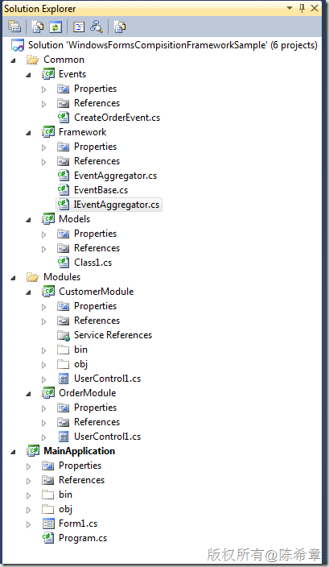
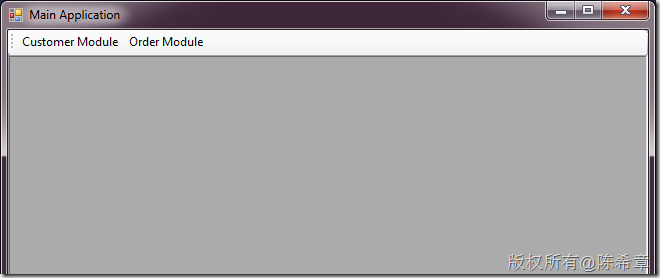
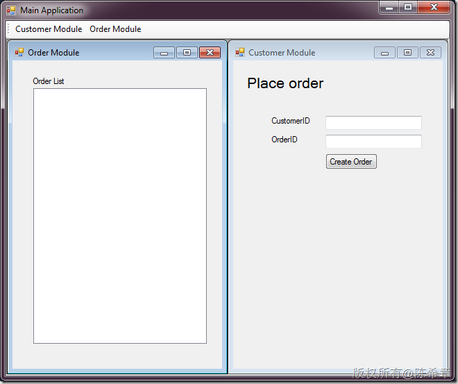
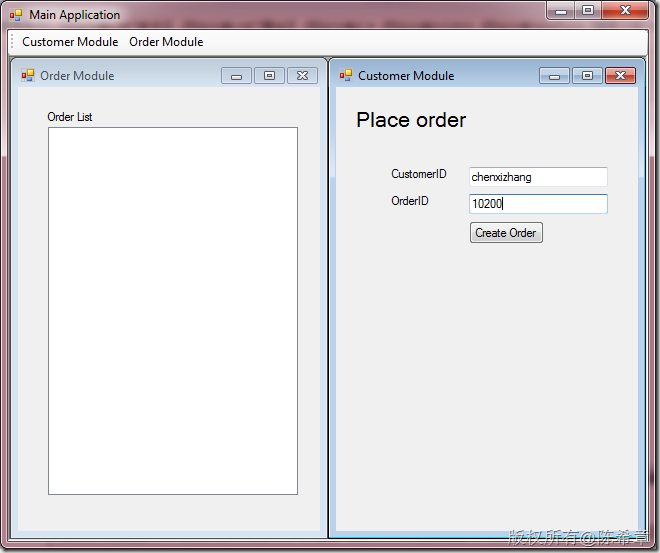
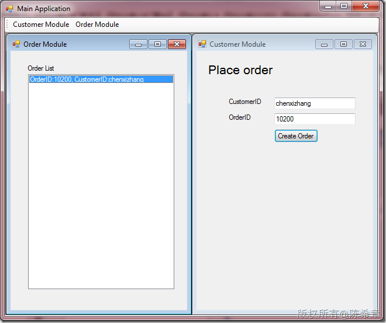
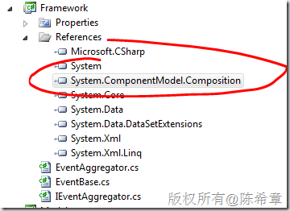
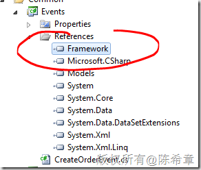
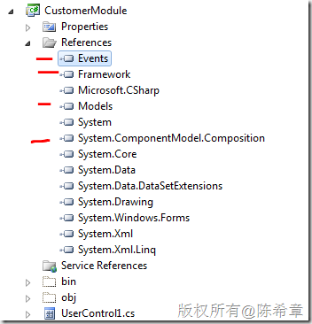
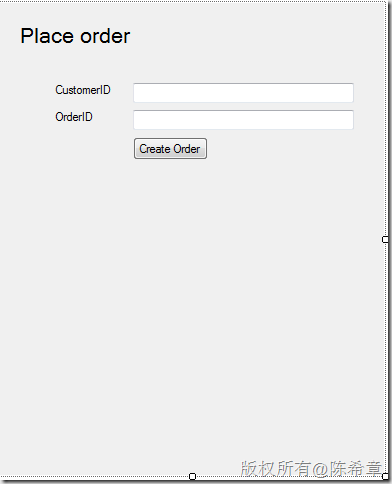

# 如何在Windows Forms应用程序中实现可组装式(Composite)的架构以及松耦合事件机制 
> 原文发表于 2011-08-15, 地址: http://www.cnblogs.com/chenxizhang/archive/2011/08/15/2139317.html 


越来越多人都逐渐了解了在WPF和Silverlight平台上的一个可组装式框架，它的正式名称是Prism，你可以在下面的地址找到很多学习资源

 <http://compositewpf.codeplex.com/>

  

 下面这里还有一套很不错的视频

 <http://www.tudou.com/playlist/id/9143859>

  

 是的，据我对Prism的了解，我觉得它的确是一个很不错的框架，非常好的想法，我不得不说，大家都应该或多或少地对其有所学习和了解。事实上，很多想法，我们或许也有过，或者在以前的项目中实践过，而这是微软官方提供的框架，至少我是从中也学到了很多东西。

  

 那么，现在有一个问题就是，既然Prism是个不错的框架，那么能不能用在Windows Forms应用程序里面呢？答案是：不可以。

 噢。。。先不要着急沮丧，也不要开始扔你桌子上的东西，这并不是什么大不了的事情，世界不会停止转动。你懂的。

  

 我这里实现了一套类似的框架，出于演示目的，我大大简化了有关的细节，但大家通过学习也可以了解，并不是那么难，而且这是你自己的Prism，是你通过学习转换为自己的知识。

  

 那么，来看看这个演示程序吧

 [](http://images.cnblogs.com/cnblogs_com/chenxizhang/201108/201108151156219185.png)

 备注：

 * Common目录中的东西是每个模块都要公用的，例如对象定义，事件定义等
* Modules目录中的东西是可以不断添加的模块，例如客户管理，订单管理等
* MainApplication是主程序

 我知道有人已经等不及了，那么我们就来看看到底这是一个什么效果吧

 首先，这是一个可以组装的程序，就是可以通过添加Module来丰富MainApplication的功能，例如下面这样

 [](http://images.cnblogs.com/cnblogs_com/chenxizhang/201108/201108151156226644.png)

 我是将每个模块，都定义一个工具栏按钮。

 点击之后，两个模块的显示效果如下

 [](http://images.cnblogs.com/cnblogs_com/chenxizhang/201108/201108151156223546.png)

  

 如果光是这样，也没有什么大不了的。虽然它也很重要，它实现了模块化开发和组装。它们不管在开发阶段，还是在使用阶段，都是没有直接依赖的。

 然后，我这个例子还实现了松耦合的事件机制，就是：虽然这些模块之间确实没有任何依赖，但是，我们可以实现类似Prism那种EventAggregator机制，也就是说，它们之间仍然可以通讯。

  

 例如，**如果这两个模块的窗口都显示出来的情况下，我可能希望在Customer Module里面下了一个订单，能立即在Order Module里面显示出来（请注意，Customer Module里面是不可能直接访问到Order Module的控件的，严格意义上说，它根本不知道是否有Order Module），我们该如何做到呢？**

  

 Good question! 哲学告诉我们，问题的答案往往就在问题本身。所以，提问题，提正确的问题，是多么重要

 答案就是：Event Aggregation。你可以通过范例代码知道这个小精灵是如何工作的。现在，还是让我们来看一下效果吧

 [](http://images.cnblogs.com/cnblogs_com/chenxizhang/201108/201108151156239053.png)

 首先，我们在右侧的界面中添加订单信息，然后点击“Create Order”按钮

 [](http://images.cnblogs.com/cnblogs_com/chenxizhang/201108/201108151156231179.png)

 我们立即就发现，在左侧的订单列表中添加了一条记录。这就是我们需要的，对吧

  

 所以，综上所述，我在这个范例中实现了两个主要功能

 1.动态组装模块

 2.模块之间的松耦合事件

  

 下面我将大致解释一下内部的原理，大家可以通过下面链接下载到源代码，并且跟我的步骤来进行学习。这些代码并不见得是最优化的，欢迎自行修改

 [http://files.cnblogs.com/chenxizhang/WindowsFormsCompisitionFrameworkSample.rar](http://files.cnblogs.com/chenxizhang/WindowsFormsCompisitionFrameworkSample.rar "http://files.cnblogs.com/chenxizhang/WindowsFormsCompisitionFrameworkSample.rar")

  

 整个架构的核心技术是：MEF,Managed Extensibility Framework 这一篇文章并不是普及MEF的基础文章，事实上，我发现有很多这方面的文章，例如 <http://zzk.cnblogs.com/s?w=MEF> MEF的官方站点是： <http://mef.codeplex.com/> 顺便说一下，Prism从4.0开始，也直接支持MEF来做为组装技术，之前它仅支持Unity Container的方式。   我依次来解释一下有关组件以及他们的关系 Framework项目
===========

 这个项目是定义了框架级别的一些接口和类型，例如事件的基类，事件聚合器及其实现。这是一个Class Library项目，需要添加一个特殊的引用：System.ComponentModel.Composition.dll

 [](http://images.cnblogs.com/cnblogs_com/chenxizhang/201108/201108151156241985.png)

  

 IEventAgregator,这是一个接口，因为我们是要实现聚合器，所以需要支持多个事件。这里我们公开了一个方法，GetEvent，可以根据事件类型获取事件的实例

  


```
using System;
using System.Collections.Generic;
using System.Linq;
using System.Text;

namespace Framework
{
    /// <summary>
    /// 事件聚合器的接口
    /// </summary>
    public interface IEventAggregator
    {
        T GetEvent<T>();
    }
}

```

EventAggregator:这是对IEventAggregator的具体实现。这里用一个列表保存了所有的事件的实例。


.csharpcode, .csharpcode pre
{
 font-size: small;
 color: black;
 font-family: consolas, "Courier New", courier, monospace;
 background-color: #ffffff;
 /*white-space: pre;*/
}
.csharpcode pre { margin: 0em; }
.csharpcode .rem { color: #008000; }
.csharpcode .kwrd { color: #0000ff; }
.csharpcode .str { color: #006080; }
.csharpcode .op { color: #0000c0; }
.csharpcode .preproc { color: #cc6633; }
.csharpcode .asp { background-color: #ffff00; }
.csharpcode .html { color: #800000; }
.csharpcode .attr { color: #ff0000; }
.csharpcode .alt 
{
 background-color: #f4f4f4;
 width: 100%;
 margin: 0em;
}
.csharpcode .lnum { color: #606060; }


```
using System;
using System.Collections.Generic;
using System.Linq;
using System.Text;
using System.ComponentModel.Composition;


namespace Framework
{
    [Export(typeof(IEventAggregator))]
    public class EventAggregator:IEventAggregator
    {

        private List<EventBase> events = new List<EventBase>();


        #region IEventAggregator Members

        public T GetEvent<T>()
        {
            //如果事件存在就返回，否则创建一个新的
            if(events.OfType<T>().FirstOrDefault() == null)
            {
                var evt = Activator.CreateInstance<T>();
                events.Add(evt as EventBase);
            }


            var result = events.OfType<T>().FirstOrDefault();

            return result;

        }

        #endregion
    }
}

```

.csharpcode, .csharpcode pre
{
 font-size: small;
 color: black;
 font-family: consolas, "Courier New", courier, monospace;
 background-color: #ffffff;
 /*white-space: pre;*/
}
.csharpcode pre { margin: 0em; }
.csharpcode .rem { color: #008000; }
.csharpcode .kwrd { color: #0000ff; }
.csharpcode .str { color: #006080; }
.csharpcode .op { color: #0000c0; }
.csharpcode .preproc { color: #cc6633; }
.csharpcode .asp { background-color: #ffff00; }
.csharpcode .html { color: #800000; }
.csharpcode .attr { color: #ff0000; }
.csharpcode .alt 
{
 background-color: #f4f4f4;
 width: 100%;
 margin: 0em;
}
.csharpcode .lnum { color: #606060; }

 


EventBase和CompositePresentationEvent，这两个是定义事件的基类。我们规定，在模块中所有的事件，必须基于ComositePresentationEvent进行实现。这个类型，我们提供了两个方法，Publish是触发某个事件，而Subscribe则是订阅某个事件。


 


```
using System;
using System.Collections.Generic;
using System.Linq;
using System.Text;

namespace Framework
{
    public class EventBase
    {
    }


    public class CompositePresentationEvent<T>:EventBase
        where T:new()
    {
        //这里保存所有的处理程序
        private List<Action<T>> handlers = new List<Action<T>>();


        public void Subscribe(Action<T> callback)
        {
            ///将处理程序添加到集合中
            handlers.Add(callback);
        }

        public void Publish(T parameter)
        {
            ///依次执行所有的处理程序
            handlers.ForEach(a => a(parameter));
        }

    }
}

```

```
 
```

 


Events项目
========


这个项目定义了在当前应用程序，所有模块之间需要公用的一些事件定义，它需要引用两个程序集：Framework,和Models


[](http://images.cnblogs.com/cnblogs_com/chenxizhang/201108/201108151156243904.png)


这里只有一个类型，定义了一个事件类别，CreateOrderEvent，它的基类是CompositePresentationEvent，需要传递的数据是Order


```
using System;
using System.Collections.Generic;
using System.Linq;
using System.Text;
using Framework;
using Models;

namespace Events
{
    public class CreateOrderEvent:CompositePresentationEvent<Order>
    {
    }
}

```

.csharpcode, .csharpcode pre
{
 font-size: small;
 color: black;
 font-family: consolas, "Courier New", courier, monospace;
 background-color: #ffffff;
 /*white-space: pre;*/
}
.csharpcode pre { margin: 0em; }
.csharpcode .rem { color: #008000; }
.csharpcode .kwrd { color: #0000ff; }
.csharpcode .str { color: #006080; }
.csharpcode .op { color: #0000c0; }
.csharpcode .preproc { color: #cc6633; }
.csharpcode .asp { background-color: #ffff00; }
.csharpcode .html { color: #800000; }
.csharpcode .attr { color: #ff0000; }
.csharpcode .alt 
{
 background-color: #f4f4f4;
 width: 100%;
 margin: 0em;
}
.csharpcode .lnum { color: #606060; }

.csharpcode, .csharpcode pre
{
 font-size: small;
 color: black;
 font-family: consolas, "Courier New", courier, monospace;
 background-color: #ffffff;
 /*white-space: pre;*/
}
.csharpcode pre { margin: 0em; }
.csharpcode .rem { color: #008000; }
.csharpcode .kwrd { color: #0000ff; }
.csharpcode .str { color: #006080; }
.csharpcode .op { color: #0000c0; }
.csharpcode .preproc { color: #cc6633; }
.csharpcode .asp { background-color: #ffff00; }
.csharpcode .html { color: #800000; }
.csharpcode .attr { color: #ff0000; }
.csharpcode .alt 
{
 background-color: #f4f4f4;
 width: 100%;
 margin: 0em;
}
.csharpcode .lnum { color: #606060; }

 


Models项目
========


这个项目定义了在所有模块之间共享的业务实体类型，例如本例中用到的Order类型，它表示一个订单信息


```
using System;
using System.Collections.Generic;
using System.Linq;
using System.Text;

namespace Models
{
    public class Order
    {
        public int OrderID { get; set; }
        public string CustomerID { get; set; }

        public override string ToString()
        {
            return string.Format("OrderID:{0}, CustomerID:{1}", OrderID, CustomerID);
        }
    }
}

```


.csharpcode, .csharpcode pre
{
 font-size: small;
 color: black;
 font-family: consolas, "Courier New", courier, monospace;
 background-color: #ffffff;
 /*white-space: pre;*/
}
.csharpcode pre { margin: 0em; }
.csharpcode .rem { color: #008000; }
.csharpcode .kwrd { color: #0000ff; }
.csharpcode .str { color: #006080; }
.csharpcode .op { color: #0000c0; }
.csharpcode .preproc { color: #cc6633; }
.csharpcode .asp { background-color: #ffff00; }
.csharpcode .html { color: #800000; }
.csharpcode .attr { color: #ff0000; }
.csharpcode .alt 
{
 background-color: #f4f4f4;
 width: 100%;
 margin: 0em;
}
.csharpcode .lnum { color: #606060; }


 


接下来，我们看看模块里面应该如何实现


本例中我已经实现了两个简单的模块，他们都是标准的Class Library项目。里面各自包含了一个控件，我让每个控件成为该模块的主界面。


CustomerModule项目
================


[](http://images.cnblogs.com/cnblogs_com/chenxizhang/201108/201108151156247459.png)


该项目，需要有四个外部引用（换句话说，任何模块都应该需要这四个引用）


[](http://images.cnblogs.com/cnblogs_com/chenxizhang/201108/201108151156252966.png)


我们提供了一个用户控件做为主界面。它看起来像是上面这样。并且它拥有下面这样的后台代码


 


```
using System;
using System.ComponentModel.Composition;
using System.Windows.Forms;
using Events;
using Framework;
using Models;


namespace CustomerModule
{
    [Export(typeof(UserControl))]
    [ExportMetadata("ModuleName","Customer Module")]
    public partial class UserControl1 : UserControl
    {
        public UserControl1()
        {
            InitializeComponent();
        }


        [Import]
        public IEventAggregator EventAggregator { get; set; }

        private void button1\_Click(object sender, EventArgs e)
        {
            if(EventAggregator != null)
            {
                EventAggregator.GetEvent<CreateOrderEvent>().Publish(new Order()
                {
                    OrderID = int.Parse(txtOrderID.Text),
                    CustomerID = txtCustomerID.Text
                });
            }
        }
        
    }
}

```

.csharpcode, .csharpcode pre
{
 font-size: small;
 color: black;
 font-family: consolas, "Courier New", courier, monospace;
 background-color: #ffffff;
 /*white-space: pre;*/
}
.csharpcode pre { margin: 0em; }
.csharpcode .rem { color: #008000; }
.csharpcode .kwrd { color: #0000ff; }
.csharpcode .str { color: #006080; }
.csharpcode .op { color: #0000c0; }
.csharpcode .preproc { color: #cc6633; }
.csharpcode .asp { background-color: #ffff00; }
.csharpcode .html { color: #800000; }
.csharpcode .attr { color: #ff0000; }
.csharpcode .alt 
{
 background-color: #f4f4f4;
 width: 100%;
 margin: 0em;
}
.csharpcode .lnum { color: #606060; }

首先，我们看到在Class上面，添加了Export和ExportMetadata两个Attribute，这是MEF的核心要素，也就是说，如果这个部件需要能够动态组合，它就必须导出(Export)。


 


然后，这里比较特殊的还有那个EventAggregator的属性，我们添加了一个Import的Attribute。这是干什么的呢？我们这里也没有看到谁对它进行赋值。其实，这个属性肯定不是在Module里面赋值的，是由主程序提供的。这也就是MEF的魔力之一：


* 某个部件需要支持动态组装，就提供Export
* 我需要用到其他一个部件，虽然我不知道谁会给我，我只要声明Import


仔细想想吧，很酷，不是吗？


我们现在是在Customer 模块里，刚才说了，我希望在这个模块里面做的一个操作，能够用某种方式通知其他模块。所以，请注意，在Button1\_Click事件中，我们Publish了一个事件，或者称之为触发了某个事件。松耦合在这里表现得淋漓尽致：**你发布事件，你不需要知道谁会响应事件，或者用什么形式响应。**


我们再来看一下订单模块吧


OrderModule项目
=============


这个项目与CustomerModule有很多相似之处，除了代码。它作为事件的消费者，在启动之后，订阅了CreateOrderEvent事件。


```
using System;
using System.ComponentModel.Composition;
using System.Windows.Forms;
using Events;
using Framework;

namespace OrderModule
{
    [Export(typeof(UserControl))]
    [ExportMetadata("ModuleName","Order Module")]
    public partial class UserControl1 : UserControl
    {
        public UserControl1()
        {
            InitializeComponent();


            Load += new EventHandler(UserControl1\_Load);
        }

        void UserControl1\_Load(object sender, EventArgs e)
        {

            EventAggregator.GetEvent<CreateOrderEvent>().Subscribe((o) =>
            {
                listBox1.Items.Add(o);
            });
        }

        [Import]
        public IEventAggregator EventAggregator { get; set; }
    }
}

```

.csharpcode, .csharpcode pre
{
 font-size: small;
 color: black;
 font-family: consolas, "Courier New", courier, monospace;
 background-color: #ffffff;
 /*white-space: pre;*/
}
.csharpcode pre { margin: 0em; }
.csharpcode .rem { color: #008000; }
.csharpcode .kwrd { color: #0000ff; }
.csharpcode .str { color: #006080; }
.csharpcode .op { color: #0000c0; }
.csharpcode .preproc { color: #cc6633; }
.csharpcode .asp { background-color: #ffff00; }
.csharpcode .html { color: #800000; }
.csharpcode .attr { color: #ff0000; }
.csharpcode .alt 
{
 background-color: #f4f4f4;
 width: 100%;
 margin: 0em;
}
.csharpcode .lnum { color: #606060; }

 


MainApplication项目
=================


这个项目，实现了动态加载模块，并且将它们绑定在工具栏上面，请参考下面代码和注释吧


 


```
using System;
using System.Collections.Generic;
using System.ComponentModel.Composition;
using System.ComponentModel.Composition.Hosting;
using System.IO;
using System.Windows.Forms;
using Framework;


namespace MainApplication
{
    public partial class Form1 : Form,IPartImportsSatisfiedNotification
    {
        public Form1()
        {
            InitializeComponent();
        }

        protected override void OnLoad(EventArgs e)
        {

            //这里一方面要加载那些模块，还要加载Framework，因为里面有一个默认实现好的EventAggregator
            var catalog = new AggregateCatalog(
                new DirectoryCatalog(Path.Combine(AppDomain.CurrentDomain.BaseDirectory, "modules")),//所有的模块必须放在应用程序根目录下面的modules目录
                new AssemblyCatalog(typeof(EventAggregator).Assembly));

            var container = new CompositionContainer(catalog);

            //立即组装这个EventAggregator部件,明确地定义
            container.ComposeExportedValue<IEventAggregator>(new EventAggregator());

            //执行导入
            container.SatisfyImportsOnce(this);


            base.OnLoad(e);

        }

        //导入多个模块，以及它们的元数据
        [ImportMany(typeof(UserControl),AllowRecomposition=true)]
        public Lazy<UserControl,Dictionary<string,object>>[] Modules { get; set; }

        #region IPartImportsSatisfiedNotification Members

        /// <summary>
        /// 当导入成功时触发该方法
        /// </summary>
        public void OnImportsSatisfied()
        {
            //循环所有模块，并且添加工具栏按钮，绑定事件
            Array.ForEach<Lazy<UserControl, Dictionary<string, object>>>(Modules, l =>
            {
                var toolItem = new ToolStripButton(l.Metadata["ModuleName"].ToString());
                toolItem.Click += (o, a) => {
                    var form = new Form();
                    form.Text = toolItem.Text;
                    l.Value.Dock = DockStyle.Fill;
                    form.Controls.Add(l.Value);
                    form.MdiParent = this;
                    form.Show();
                    this.LayoutMdi(MdiLayout.TileVertical);
                };

                toolStrip1.Items.Add(toolItem);
            });
        }

        #endregion
    }
}

```

.csharpcode, .csharpcode pre
{
 font-size: small;
 color: black;
 font-family: consolas, "Courier New", courier, monospace;
 background-color: #ffffff;
 /*white-space: pre;*/
}
.csharpcode pre { margin: 0em; }
.csharpcode .rem { color: #008000; }
.csharpcode .kwrd { color: #0000ff; }
.csharpcode .str { color: #006080; }
.csharpcode .op { color: #0000c0; }
.csharpcode .preproc { color: #cc6633; }
.csharpcode .asp { background-color: #ffff00; }
.csharpcode .html { color: #800000; }
.csharpcode .attr { color: #ff0000; }
.csharpcode .alt 
{
 background-color: #f4f4f4;
 width: 100%;
 margin: 0em;
}
.csharpcode .lnum { color: #606060; }

 


这个项目介绍到这里，有兴趣的朋友，可以研究一下，并且尝试添加一些新模块。欢迎你在这个基础上进行修改，实现真正能满足你需求的框架。


 


本文代码，请通过下面地址下载


[http://files.cnblogs.com/chenxizhang/WindowsFormsCompisitionFrameworkSample.rar](http://files.cnblogs.com/chenxizhang/WindowsFormsCompisitionFrameworkSample.rar "http://files.cnblogs.com/chenxizhang/WindowsFormsCompisitionFrameworkSample.rar")


