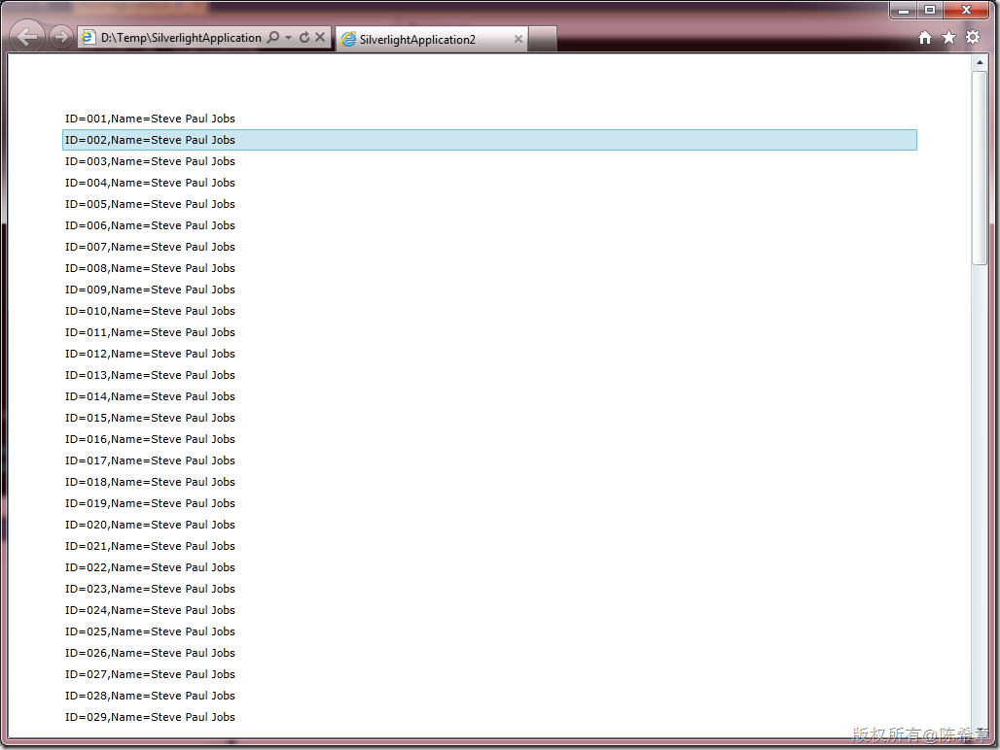
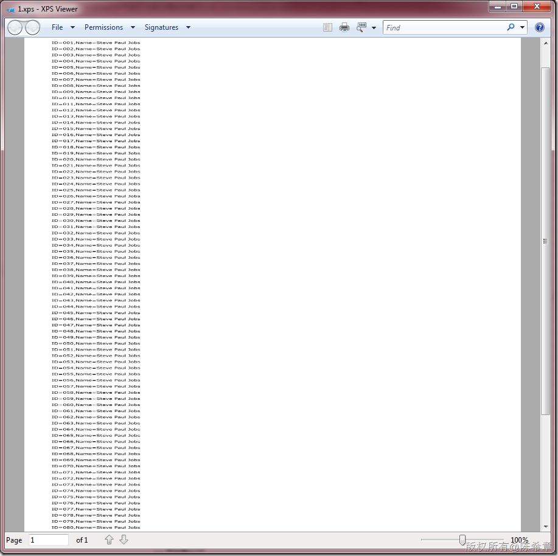
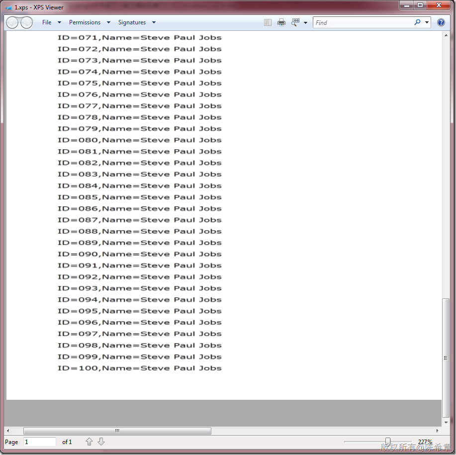

# 在Silverlight中将多页内容压缩实现单页打印 
> 原文发表于 2011-08-25, 地址: http://www.cnblogs.com/chenxizhang/archive/2011/08/25/2153519.html 


这是一个小问题，但也有些参考价值，特意整理出来。

  

 Silverlight 4开始提供打印的功能，这无疑使得它更加易于在企业级别的项目中使用，而不仅仅是做些演示和单独的一些文件上传之类的小的组件。

 【备注】在这里，我自己的体会是，Silverlight在企业级应用中还是挺受欢迎的，如果运用得当，也确实可以有所作为。当然，我并不是说它已经很完善了，事实上，它还有不少要改进的，也许下一个版本能更好一些吧。有兴趣的朋友，可以持续关注 <http://www.silverlight.net/>

  

 不扯太远了，今天的问题是，如何将多页的内容压缩到一页打印？

 Silverlight所提供的打印功能，很简单易用，但也不是那么方便。官方的介绍，请参考这里 <http://msdn.microsoft.com/zh-cn/library/ee671023(v=vs.95).aspx>

  

 一个最大的问题就是，它不知道我们提供的内容会有几页，我们必须自己去计算，然后告诉它到底有几页。网上已经有些文章，谈论多页打印的问题，例如这篇博客 ， <http://silverlightips.net/2010/03/27/multi-page-printing-in-silverlight/>

  

 我要讨论的是另外一种情况，我知道我们的内容可能会超过一页，但是我不想打印成两页或者三页。假定我们的规则就是，即便内容超过一页，我也要压缩宽度或者高度，让它能打印在一页里面。

 【备注】我讨论的是一个特定的场景，这个规则在你的公司或者项目中可能不适用。

  

 给大家看一个例子就明白了，下图是一个最简单的Silverlight程序，首页上面有一个列表，显示了100行数据。很显然，它会超过一页，按照正常的打印，大致有三页。（A4纸）

 [](http://images.cnblogs.com/cnblogs_com/chenxizhang/201108/201108251659019598.png)

 【备注】今天全世界都在关注一个新闻，乔布斯退休了，帮主的身体也确实是不行了。这个例子里面用到了他的名字，以示尊敬

  

 经过代码处理，我让这100行的数据，打印在了一页上面，大致看起来是这样的。

 [](http://images.cnblogs.com/cnblogs_com/chenxizhang/201108/201108251659051154.png)

 因为进行了缩放，所以在100%的比例下是看不清楚的，放大之后，可以看到最后一行确实是第100行。

 [](http://images.cnblogs.com/cnblogs_com/chenxizhang/201108/201108251659063530.png)

 你可能会说，字体有些变形了嘛，而且也看不清楚呢？是的，我知道。我们讨论的是，如何将多页内容缩放成一页，其中一个重要假设就是，你的内容适合于缩放。现在是从三页缩放到一页当然是这个样子的。但如果从一页多一点压缩到一页，则可能就不太明显了。

  

 那么，我们是如何做到的呢？有代码有真相，有兴趣的同学可以照着做一下

  

 页面定义
====


```
<UserControl
    xmlns:toolkit="http://schemas.microsoft.com/winfx/2006/xaml/presentation/toolkit"
    xmlns="http://schemas.microsoft.com/winfx/2006/xaml/presentation"
    xmlns:x="http://schemas.microsoft.com/winfx/2006/xaml"
    xmlns:d="http://schemas.microsoft.com/expression/blend/2008"
    xmlns:mc="http://schemas.openxmlformats.org/markup-compatibility/2006"
    xmlns:System="clr-namespace:System;assembly=mscorlib"
    x:Class="SilverlightApplication2.MainPage"
    mc:Ignorable="d"
    d:DesignHeight="300"
    d:DesignWidth="400"
    xmlns:c="clr-namespace:SilverlightApplication2">


    <Grid
        x:Name="LayoutRoot"
        Background="White">

        <ScrollViewer>
            <StackPanel>
                <ListBox
                    x:Name="lstData"
                    Padding="50"
                    BorderBrush="Transparent"
                    ItemsSource="{Binding}">
                    <!--定义这个转换器，可以对大小进行缩放，默认按照100%呈现-->
                    <ListBox.RenderTransform>
                        <ScaleTransform
                            x:Name="st"
                            ScaleX="1"
                            ScaleY="1"></ScaleTransform>
                    </ListBox.RenderTransform>

                </ListBox>

                <Button
                    Content="Print"
                    x:Name="btPrint"
                    Width="100"
                    Click="btPrint\_Click"
                    HorizontalAlignment="Left"></Button>
            </StackPanel>


        </ScrollViewer>
    </Grid>
</UserControl>

```

.csharpcode, .csharpcode pre
{
 font-size: small;
 color: black;
 font-family: consolas, "Courier New", courier, monospace;
 background-color: #ffffff;
 /*white-space: pre;*/
}
.csharpcode pre { margin: 0em; }
.csharpcode .rem { color: #008000; }
.csharpcode .kwrd { color: #0000ff; }
.csharpcode .str { color: #006080; }
.csharpcode .op { color: #0000c0; }
.csharpcode .preproc { color: #cc6633; }
.csharpcode .asp { background-color: #ffff00; }
.csharpcode .html { color: #800000; }
.csharpcode .attr { color: #ff0000; }
.csharpcode .alt 
{
 background-color: #f4f4f4;
 width: 100%;
 margin: 0em;
}
.csharpcode .lnum { color: #606060; }

 


后台代码
====


```
using System.Linq;
using System.Windows;
using System.Windows.Controls;
using System.Windows.Printing;

namespace SilverlightApplication2
{
    public partial class MainPage : UserControl
    {
        public MainPage()
        {
            InitializeComponent();

            Loaded += new RoutedEventHandler(MainPage\_Loaded);
        }

        void MainPage\_Loaded(object sender, RoutedEventArgs e)
        {
            //准备的一些测试数据。100行
            this.DataContext = Enumerable.Range(1, 100).Select(i => new Data()
            {
                ID = i,
                Name = "Steve Paul Jobs"
            });

        }

        private void btPrint\_Click(object sender, RoutedEventArgs e)
        {

            //列表的实际高度
            var ah = lstData.ActualHeight;
            //列表的实际宽度
            var aw = lstData.ActualWidth;
            //新建一个打印文档
            var doc = new PrintDocument();
            //处理打印事件
            doc.PrintPage += (o, a) =>
            {
                //用户选择打印机，最后提供的打印高度
                var h = a.PrintableArea.Height;
                //用户选择打印机，最后提供的打印宽度
                var w = a.PrintableArea.Width;
                //如果宽度不够，则要压缩宽度
                if(aw > w) st.ScaleX = w / aw;
                //如果高度不够，则要压缩高度
                if(ah > h) st.ScaleY = h / ah;
                //设置打印内容
                a.PageVisual = lstData;

            };
            //处理打印后事件
            doc.EndPrint += (o, a) =>
            {
                //将列表重新缩放到100%
                st.ScaleX = 1;
                st.ScaleY = 1;

            };
            //开始打印
            doc.Print(null);
        }
    }

    class Data
    {
        public int ID { get; set; }
        public string Name { get; set; }


        public override string ToString()
        {
            return string.Format("ID={0:000},Name={1}", ID, Name);
        }
    }
}

```

.csharpcode, .csharpcode pre
{
 font-size: small;
 color: black;
 font-family: consolas, "Courier New", courier, monospace;
 background-color: #ffffff;
 /*white-space: pre;*/
}
.csharpcode pre { margin: 0em; }
.csharpcode .rem { color: #008000; }
.csharpcode .kwrd { color: #0000ff; }
.csharpcode .str { color: #006080; }
.csharpcode .op { color: #0000c0; }
.csharpcode .preproc { color: #cc6633; }
.csharpcode .asp { background-color: #ffff00; }
.csharpcode .html { color: #800000; }
.csharpcode .attr { color: #ff0000; }
.csharpcode .alt 
{
 background-color: #f4f4f4;
 width: 100%;
 margin: 0em;
}
.csharpcode .lnum { color: #606060; }

 


这个例子实现的关键就在于，Silverlight和WPF都支持在呈现时通过不同的转换器进行转换。ScaleTransform是其中一种最简单的，可以按照比例缩放。还有可以旋转的，可以变形的等等。这些特性也是Silverlight动画设计中的核心，今天就不展开了。


 


上面的代码都有注释，我想已经很清楚了，大家一看就能明白。

