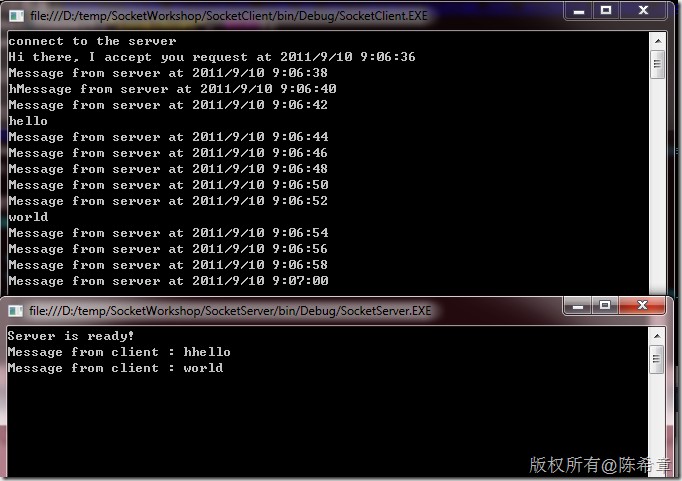

# 你得学会并且学得会的Socket编程基础知识 
> 原文发表于 2011-09-10, 地址: http://www.cnblogs.com/chenxizhang/archive/2011/09/10/2172994.html 


这一篇文章，我将图文并茂地介绍Socket编程的基础知识，我相信，如果你按照步骤做完实验，一定可以对Socket编程有更好地理解。

 本文源代码，可以通过这里下载 [http://files.cnblogs.com/chenxizhang/SocketWorkshop.rar](http://files.cnblogs.com/chenxizhang/SocketWorkshop.rar "http://files.cnblogs.com/chenxizhang/SocketWorkshop.rar")

  

 第一步：创建解决方案
==========

 [](http://images.cnblogs.com/cnblogs_com/chenxizhang/201109/201109100924291243.png)

 第二步：创建服务端程序
===========

 这里可以选择“Console Application”这个类型，比较方便调试

 [](http://images.cnblogs.com/cnblogs_com/chenxizhang/201109/201109100924294341.png)

 然后编写如下代码，实现服务器的基本功能


```
using System;
using System.Collections.Generic;
using System.Linq;
using System.Text;

//额外导入的两个命名空间
using System.Net.Sockets;
using System.Net;

namespace SocketServer
{
    class Program
    {
        /// <summary>
        /// Socket Server 演示
        /// 作者：陈希章
        /// </summary>
        /// <param name="args"></param>
        static void Main(string[] args)
        {
            //创建一个新的Socket,这里我们使用最常用的基于TCP的Stream Socket（流式套接字）
            var socket = new Socket(AddressFamily.InterNetwork, SocketType.Stream, ProtocolType.Tcp);

            //将该socket绑定到主机上面的某个端口
            //方法参考：http://msdn.microsoft.com/zh-cn/library/system.net.sockets.socket.bind.aspx
            socket.Bind(new IPEndPoint(IPAddress.Any, 4530));

            //启动监听，并且设置一个最大的队列长度
            //方法参考：http://msdn.microsoft.com/zh-cn/library/system.net.sockets.socket.listen(v=VS.100).aspx
            socket.Listen(4);


            Console.WriteLine("Server is ready!");
            Console.Read();
        }
    }
}

```

.csharpcode, .csharpcode pre
{
 font-size: small;
 color: black;
 font-family: consolas, "Courier New", courier, monospace;
 background-color: #ffffff;
 /*white-space: pre;*/
}
.csharpcode pre { margin: 0em; }
.csharpcode .rem { color: #008000; }
.csharpcode .kwrd { color: #0000ff; }
.csharpcode .str { color: #006080; }
.csharpcode .op { color: #0000c0; }
.csharpcode .preproc { color: #cc6633; }
.csharpcode .asp { background-color: #ffff00; }
.csharpcode .html { color: #800000; }
.csharpcode .attr { color: #ff0000; }
.csharpcode .alt 
{
 background-color: #f4f4f4;
 width: 100%;
 margin: 0em;
}
.csharpcode .lnum { color: #606060; }

 


现在可以启动调试一下看看效果如何，正常情况下应该会看到一个提示，因为我们需要在TCP 4530端口进行监听，所以防火墙会有提示。


[](http://images.cnblogs.com/cnblogs_com/chenxizhang/201109/201109100924301342.png)


点击“Allow access”


[](http://images.cnblogs.com/cnblogs_com/chenxizhang/201109/201109100924308900.png)


这样，我们的服务器就可以开始监听了。但是这有什么用呢？是的，没有什么用。


我们还需要为服务器添加一些功能，例如接受传入的请求，给客户端发送消息，或者从客户端接收消息等等


第三步：接受传入的请求
===========


我们需要通过Accept，或者(BeginAccept)来接受传入的请求，请注意下面代码中的红色部分


 


```
using System;
using System.Collections.Generic;
using System.Linq;
using System.Text;

//额外导入的两个命名空间
using System.Net.Sockets;
using System.Net;

namespace SocketServer
{
    class Program
    {
        /// <summary>
        /// Socket Server 演示
        /// 作者：陈希章
        /// </summary>
        /// <param name="args"></param>
        static void Main(string[] args)
        {
            //创建一个新的Socket,这里我们使用最常用的基于TCP的Stream Socket（流式套接字）
            var socket = new Socket(AddressFamily.InterNetwork, SocketType.Stream, ProtocolType.Tcp);

            //将该socket绑定到主机上面的某个端口
            //方法参考：http://msdn.microsoft.com/zh-cn/library/system.net.sockets.socket.bind.aspx
            socket.Bind(new IPEndPoint(IPAddress.Any, 4530));

            //启动监听，并且设置一个最大的队列长度
            //方法参考：http://msdn.microsoft.com/zh-cn/library/system.net.sockets.socket.listen(v=VS.100).aspx
            socket.Listen(4);

 **//开始接受客户端连接请求
 //方法参考：http://msdn.microsoft.com/zh-cn/library/system.net.sockets.socket.beginaccept.aspx
 socket.BeginAccept(new AsyncCallback((ar) =>
 {
 //这就是客户端的Socket实例，我们后续可以将其保存起来
 var client = socket.EndAccept(ar);

 //给客户端发送一个欢迎消息
 client.Send(Encoding.Unicode.GetBytes("Hi there, I accept you request at "+DateTime.Now.ToString()));
 }), null);**


            Console.WriteLine("Server is ready!");
            Console.Read();
        }
    }
}

```

.csharpcode, .csharpcode pre
{
 font-size: small;
 color: black;
 font-family: consolas, "Courier New", courier, monospace;
 background-color: #ffffff;
 /*white-space: pre;*/
}
.csharpcode pre { margin: 0em; }
.csharpcode .rem { color: #008000; }
.csharpcode .kwrd { color: #0000ff; }
.csharpcode .str { color: #006080; }
.csharpcode .op { color: #0000c0; }
.csharpcode .preproc { color: #cc6633; }
.csharpcode .asp { background-color: #ffff00; }
.csharpcode .html { color: #800000; }
.csharpcode .attr { color: #ff0000; }
.csharpcode .alt 
{
 background-color: #f4f4f4;
 width: 100%;
 margin: 0em;
}
.csharpcode .lnum { color: #606060; }

 


wow，看起来不错对吧，我们赶紧做一个客户端来测试一下吧


 


第四步：创建客户端
=========


我们还是使用一个Console Application


[](http://images.cnblogs.com/cnblogs_com/chenxizhang/201109/201109100924316981.png)


添加如下的代码，并且创建客户端连接


```
using System;
using System.Collections.Generic;
using System.Linq;
using System.Text;

//导入的命名空间
using System.Net.Sockets;

namespace SocketClient
{
    class Program
    {
        /// <summary>
        /// Socket Server 演示
        /// 作者：陈希章
        /// </summary>
        /// <param name="args"></param>
        static void Main(string[] args)
        {
            //创建一个Socket
            var socket = new Socket(AddressFamily.InterNetwork, SocketType.Stream, ProtocolType.Tcp);

            //连接到指定服务器的指定端口
            //方法参考：http://msdn.microsoft.com/zh-cn/library/system.net.sockets.socket.connect.aspx
            socket.Connect("localhost", 4530);


            Console.WriteLine("connect to the server");
            Console.Read();

        }
    }
}

```

.csharpcode, .csharpcode pre
{
 font-size: small;
 color: black;
 font-family: consolas, "Courier New", courier, monospace;
 background-color: #ffffff;
 /*white-space: pre;*/
}
.csharpcode pre { margin: 0em; }
.csharpcode .rem { color: #008000; }
.csharpcode .kwrd { color: #0000ff; }
.csharpcode .str { color: #006080; }
.csharpcode .op { color: #0000c0; }
.csharpcode .preproc { color: #cc6633; }
.csharpcode .asp { background-color: #ffff00; }
.csharpcode .html { color: #800000; }
.csharpcode .attr { color: #ff0000; }
.csharpcode .alt 
{
 background-color: #f4f4f4;
 width: 100%;
 margin: 0em;
}
.csharpcode .lnum { color: #606060; }


.csharpcode, .csharpcode pre
{
 font-size: small;
 color: black;
 font-family: consolas, "Courier New", courier, monospace;
 background-color: #ffffff;
 /*white-space: pre;*/
}
.csharpcode pre { margin: 0em; }
.csharpcode .rem { color: #008000; }
.csharpcode .kwrd { color: #0000ff; }
.csharpcode .str { color: #006080; }
.csharpcode .op { color: #0000c0; }
.csharpcode .preproc { color: #cc6633; }
.csharpcode .asp { background-color: #ffff00; }
.csharpcode .html { color: #800000; }
.csharpcode .attr { color: #ff0000; }
.csharpcode .alt 
{
 background-color: #f4f4f4;
 width: 100%;
 margin: 0em;
}
.csharpcode .lnum { color: #606060; }


依次选择SocketServer和SocketClient这两个项目，分别将其启动为调试状态（右键菜单，Debug=>Start new instance)


[](http://images.cnblogs.com/cnblogs_com/chenxizhang/201109/201109100924313110.png)


我们看到两个程序都工作正常。


但是，在客户端怎么没有收到服务器发过来的消息呢？那是因为，我们没有在客户端提供这方面的功能。


 


第五步：在客户端中实现接受消息的方法
==================


```
using System;
using System.Collections.Generic;
using System.Linq;
using System.Text;

//导入的命名空间
using System.Net.Sockets;

namespace SocketClient
{
    class Program
    {
        /// <summary>
        /// Socket Server 演示
        /// 作者：陈希章
        /// </summary>
        /// <param name="args"></param>
        static void Main(string[] args)
        {
            //创建一个Socket
            var socket = new Socket(AddressFamily.InterNetwork, SocketType.Stream, ProtocolType.Tcp);

            //连接到指定服务器的指定端口
            //方法参考：http://msdn.microsoft.com/zh-cn/library/system.net.sockets.socket.connect.aspx
            socket.Connect("localhost", 4530);

            //实现接受消息的方法

 **var buffer = new byte[1024];//设置一个缓冲区，用来保存数据
 //方法参考：http://msdn.microsoft.com/zh-cn/library/system.net.sockets.socket.beginreceive.aspx
 socket.BeginReceive(buffer, 0, buffer.Length, SocketFlags.None, new AsyncCallback((ar) =>
 {
 //方法参考：http://msdn.microsoft.com/zh-cn/library/system.net.sockets.socket.endreceive.aspx
 var length = socket.EndReceive(ar);
 //读取出来消息内容
 var message = Encoding.Unicode.GetString(buffer, 0, length);
 //显示消息
 Console.WriteLine(message);

 }), null);**

            Console.WriteLine("connect to the server");
            Console.Read();

        }
    }
}

```

.csharpcode, .csharpcode pre
{
 font-size: small;
 color: black;
 font-family: consolas, "Courier New", courier, monospace;
 background-color: #ffffff;
 /*white-space: pre;*/
}
.csharpcode pre { margin: 0em; }
.csharpcode .rem { color: #008000; }
.csharpcode .kwrd { color: #0000ff; }
.csharpcode .str { color: #006080; }
.csharpcode .op { color: #0000c0; }
.csharpcode .preproc { color: #cc6633; }
.csharpcode .asp { background-color: #ffff00; }
.csharpcode .html { color: #800000; }
.csharpcode .attr { color: #ff0000; }
.csharpcode .alt 
{
 background-color: #f4f4f4;
 width: 100%;
 margin: 0em;
}
.csharpcode .lnum { color: #606060; }

请注意以上红色的部分，我们用了BeginReceive方法进行异步的消息侦听，如果收到了，我们就打印出来


[](http://images.cnblogs.com/cnblogs_com/chenxizhang/201109/201109100924311507.png)


看起来已经实现了我们需求了：服务器给客户端发了一个消息，而客户端也已经收到了。


但是，这远远不够，因为它们之间的通讯不仅仅是一次性的，那么如果服务器要不断地给客户端发消息，例如每隔两秒钟就发送一个消息，如何实现呢？


 


第六步：实现服务器定期向客户端发消息
==================


```
using System;
using System.Collections.Generic;
using System.Linq;
using System.Text;

//额外导入的两个命名空间
using System.Net.Sockets;
using System.Net;

namespace SocketServer
{
    class Program
    {
        /// <summary>
        /// Socket Server 演示
        /// 作者：陈希章
        /// </summary>
        /// <param name="args"></param>
        static void Main(string[] args)
        {
            //创建一个新的Socket,这里我们使用最常用的基于TCP的Stream Socket（流式套接字）
            var socket = new Socket(AddressFamily.InterNetwork, SocketType.Stream, ProtocolType.Tcp);

            //将该socket绑定到主机上面的某个端口
            //方法参考：http://msdn.microsoft.com/zh-cn/library/system.net.sockets.socket.bind.aspx
            socket.Bind(new IPEndPoint(IPAddress.Any, 4530));

            //启动监听，并且设置一个最大的队列长度
            //方法参考：http://msdn.microsoft.com/zh-cn/library/system.net.sockets.socket.listen(v=VS.100).aspx
            socket.Listen(4);

            //开始接受客户端连接请求
            //方法参考：http://msdn.microsoft.com/zh-cn/library/system.net.sockets.socket.beginaccept.aspx
            socket.BeginAccept(new AsyncCallback((ar) =>
            {
                //这就是客户端的Socket实例，我们后续可以将其保存起来
                var client = socket.EndAccept(ar);

                //给客户端发送一个欢迎消息
                client.Send(Encoding.Unicode.GetBytes("Hi there, I accept you request at "+DateTime.Now.ToString()));


 **//实现每隔两秒钟给服务器发一个消息
 //这里我们使用了一个定时器
 var timer = new System.Timers.Timer();
 timer.Interval = 2000D;
 timer.Enabled = true;
 timer.Elapsed += (o, a) =>
 {
 client.Send(Encoding.Unicode.GetBytes("Message from server at " +DateTime.Now.ToString()));
 };
 timer.Start();**

            }), null);


            Console.WriteLine("Server is ready!");
            Console.Read();
        }
    }
}

```

.csharpcode, .csharpcode pre
{
 font-size: small;
 color: black;
 font-family: consolas, "Courier New", courier, monospace;
 background-color: #ffffff;
 /*white-space: pre;*/
}
.csharpcode pre { margin: 0em; }
.csharpcode .rem { color: #008000; }
.csharpcode .kwrd { color: #0000ff; }
.csharpcode .str { color: #006080; }
.csharpcode .op { color: #0000c0; }
.csharpcode .preproc { color: #cc6633; }
.csharpcode .asp { background-color: #ffff00; }
.csharpcode .html { color: #800000; }
.csharpcode .attr { color: #ff0000; }
.csharpcode .alt 
{
 background-color: #f4f4f4;
 width: 100%;
 margin: 0em;
}
.csharpcode .lnum { color: #606060; }

 


我们还要实现在客户端一直监听消息的机制，而不是一次性接收.请注意下面红色的部分


 


```
using System;
using System.Collections.Generic;
using System.Linq;
using System.Text;

//导入的命名空间
using System.Net.Sockets;

namespace SocketClient
{
    class Program
    {
        /// <summary>
        /// Socket Server 演示
        /// 作者：陈希章
        /// </summary>
        /// <param name="args"></param>
        static void Main(string[] args)
        {
            //创建一个Socket
            var socket = new Socket(AddressFamily.InterNetwork, SocketType.Stream, ProtocolType.Tcp);

            //连接到指定服务器的指定端口
            //方法参考：http://msdn.microsoft.com/zh-cn/library/system.net.sockets.socket.connect.aspx
            socket.Connect("localhost", 4530);
            Console.WriteLine("connect to the server");

            //实现接受消息的方法

            //方法参考：http://msdn.microsoft.com/zh-cn/library/system.net.sockets.socket.beginreceive.aspx
            **socket.BeginReceive(buffer, 0, buffer.Length, SocketFlags.None, new AsyncCallback(ReceiveMessage),socket);**

            Console.Read();

        }


 **static byte[] buffer = new byte[1024];

 public static void ReceiveMessage(IAsyncResult ar)
 {
 try
 {
 var socket = ar.AsyncState as Socket;

 //方法参考：http://msdn.microsoft.com/zh-cn/library/system.net.sockets.socket.endreceive.aspx
 var length = socket.EndReceive(ar);
 //读取出来消息内容
 var message = Encoding.Unicode.GetString(buffer, 0, length);
 //显示消息
 Console.WriteLine(message);

 //接收下一个消息(因为这是一个递归的调用，所以这样就可以一直接收消息了）
 socket.BeginReceive(buffer, 0, buffer.Length, SocketFlags.None, new AsyncCallback(ReceiveMessage), socket);
 }
 catch(Exception ex){
 Console.WriteLine(ex.Message);
 }
 }**
    }
}

```

.csharpcode, .csharpcode pre
{
 font-size: small;
 color: black;
 font-family: consolas, "Courier New", courier, monospace;
 background-color: #ffffff;
 /*white-space: pre;*/
}
.csharpcode pre { margin: 0em; }
.csharpcode .rem { color: #008000; }
.csharpcode .kwrd { color: #0000ff; }
.csharpcode .str { color: #006080; }
.csharpcode .op { color: #0000c0; }
.csharpcode .preproc { color: #cc6633; }
.csharpcode .asp { background-color: #ffff00; }
.csharpcode .html { color: #800000; }
.csharpcode .attr { color: #ff0000; }
.csharpcode .alt 
{
 background-color: #f4f4f4;
 width: 100%;
 margin: 0em;
}
.csharpcode .lnum { color: #606060; }

重新调试起来，看起来的效果如下图所示


[](http://images.cnblogs.com/cnblogs_com/chenxizhang/201109/201109100924321540.png)


我们继续做下面的实验，一步一步地研究Socket通讯中可能遇到的一些问题


**请先关闭掉客户端这个程序，而不要关闭服务端程序**，这时会发现一个错误


[](http://images.cnblogs.com/cnblogs_com/chenxizhang/201109/201109100924321573.png)


这个错误很容易理解，因为客户端已经关闭，也就是客户端那个Socket已经不存在了，服务器还继续向它发送消息当然会出错。所以，从可靠性方面的考虑，我们必须在发送消息之前检测Socket的活动状态


 


第七步：检测客户端的活动状态
==============


```
using System;
using System.Collections.Generic;
using System.Linq;
using System.Text;

//额外导入的两个命名空间
using System.Net.Sockets;
using System.Net;

namespace SocketServer
{
    class Program
    {
        /// <summary>
        /// Socket Server 演示
        /// 作者：陈希章
        /// </summary>
        /// <param name="args"></param>
        static void Main(string[] args)
        {
            //创建一个新的Socket,这里我们使用最常用的基于TCP的Stream Socket（流式套接字）
            var socket = new Socket(AddressFamily.InterNetwork, SocketType.Stream, ProtocolType.Tcp);

            //将该socket绑定到主机上面的某个端口
            //方法参考：http://msdn.microsoft.com/zh-cn/library/system.net.sockets.socket.bind.aspx
            socket.Bind(new IPEndPoint(IPAddress.Any, 4530));

            //启动监听，并且设置一个最大的队列长度
            //方法参考：http://msdn.microsoft.com/zh-cn/library/system.net.sockets.socket.listen(v=VS.100).aspx
            socket.Listen(4);

            //开始接受客户端连接请求
            //方法参考：http://msdn.microsoft.com/zh-cn/library/system.net.sockets.socket.beginaccept.aspx
            socket.BeginAccept(new AsyncCallback((ar) =>
            {
                //这就是客户端的Socket实例，我们后续可以将其保存起来
                var client = socket.EndAccept(ar);

                //给客户端发送一个欢迎消息
                client.Send(Encoding.Unicode.GetBytes("Hi there, I accept you request at "+DateTime.Now.ToString()));


                //实现每隔两秒钟给服务器发一个消息
                //这里我们使用了一个定时器
                var timer = new System.Timers.Timer();
                timer.Interval = 2000D;
                timer.Enabled = true;
                timer.Elapsed += (o, a) =>
                {
 **//检测客户端Socket的状态
 if(client.Connected)
 {
 try
 {
 client.Send(Encoding.Unicode.GetBytes("Message from server at " + DateTime.Now.ToString()));
 }
 catch(SocketException ex)
 {
 Console.WriteLine(ex.Message);
 }
 }
 else
 {
 timer.Stop();
 timer.Enabled = false;
 Console.WriteLine("Client is disconnected, the timer is stop.");
 }**
                };
                timer.Start();

            }), null);


            Console.WriteLine("Server is ready!");
            Console.Read();
        }
    }
}

```

.csharpcode, .csharpcode pre
{
 font-size: small;
 color: black;
 font-family: consolas, "Courier New", courier, monospace;
 background-color: #ffffff;
 /*white-space: pre;*/
}
.csharpcode pre { margin: 0em; }
.csharpcode .rem { color: #008000; }
.csharpcode .kwrd { color: #0000ff; }
.csharpcode .str { color: #006080; }
.csharpcode .op { color: #0000c0; }
.csharpcode .preproc { color: #cc6633; }
.csharpcode .asp { background-color: #ffff00; }
.csharpcode .html { color: #800000; }
.csharpcode .attr { color: #ff0000; }
.csharpcode .alt 
{
 background-color: #f4f4f4;
 width: 100%;
 margin: 0em;
}
.csharpcode .lnum { color: #606060; }

上面代码的逻辑很清楚，但有时候还是会触发那个SocketException。为什么呢？这是因为我们的Timer是每隔两秒钟检查一次，那么就很可能有一种情况，我们检查的时候，它还是连接状态，消息发出去之后，它断开了。这种情况肯定是存在的。所以要用Try..catch的结构


 


目前我们实现的场景很简单，服务器只管发消息，客户端只管收消息。但实际工作中，可能希望服务器和客户端都能收发消息。请看下一节


 


第八步：实现双向收发消息
============


先看服务端的修改


 


```
using System;
using System.Collections.Generic;
using System.Linq;
using System.Text;

//额外导入的两个命名空间
using System.Net.Sockets;
using System.Net;

namespace SocketServer
{
    class Program
    {
        /// <summary>
        /// Socket Server 演示
        /// 作者：陈希章
        /// </summary>
        /// <param name="args"></param>
        static void Main(string[] args)
        {
            //创建一个新的Socket,这里我们使用最常用的基于TCP的Stream Socket（流式套接字）
            var socket = new Socket(AddressFamily.InterNetwork, SocketType.Stream, ProtocolType.Tcp);

            //将该socket绑定到主机上面的某个端口
            //方法参考：http://msdn.microsoft.com/zh-cn/library/system.net.sockets.socket.bind.aspx
            socket.Bind(new IPEndPoint(IPAddress.Any, 4530));

            //启动监听，并且设置一个最大的队列长度
            //方法参考：http://msdn.microsoft.com/zh-cn/library/system.net.sockets.socket.listen(v=VS.100).aspx
            socket.Listen(4);

            //开始接受客户端连接请求
            //方法参考：http://msdn.microsoft.com/zh-cn/library/system.net.sockets.socket.beginaccept.aspx
            socket.BeginAccept(new AsyncCallback((ar) =>
            {
                //这就是客户端的Socket实例，我们后续可以将其保存起来
                var client = socket.EndAccept(ar);

                //给客户端发送一个欢迎消息
                client.Send(Encoding.Unicode.GetBytes("Hi there, I accept you request at "+DateTime.Now.ToString()));


                //实现每隔两秒钟给服务器发一个消息
                //这里我们使用了一个定时器
                var timer = new System.Timers.Timer();
                timer.Interval = 2000D;
                timer.Enabled = true;
                timer.Elapsed += (o, a) =>
                {
                    //检测客户端Socket的状态
                    if(client.Connected)
                    {
                        try
                        {
                            client.Send(Encoding.Unicode.GetBytes("Message from server at " + DateTime.Now.ToString()));
                        }
                        catch(SocketException ex)
                        {
                            Console.WriteLine(ex.Message);
                        }
                    }
                    else
                    {
                        timer.Stop();
                        timer.Enabled = false;
                        Console.WriteLine("Client is disconnected, the timer is stop.");
                    }
                };
                timer.Start();


   **//接收客户端的消息(这个和在客户端实现的方式是一样的）
 client.BeginReceive(buffer,0,buffer.Length,SocketFlags.None,new AsyncCallback(ReceiveMessage),client);**

            }), null);


            Console.WriteLine("Server is ready!");
            Console.Read();
        }

 **static byte[] buffer = new byte[1024];

 public static void ReceiveMessage(IAsyncResult ar)
 {
 try
 {
 var socket = ar.AsyncState as Socket;

 //方法参考：http://msdn.microsoft.com/zh-cn/library/system.net.sockets.socket.endreceive.aspx
 var length = socket.EndReceive(ar);
 //读取出来消息内容
 var message = Encoding.Unicode.GetString(buffer, 0, length);
 //显示消息
 Console.WriteLine(message);

 //接收下一个消息(因为这是一个递归的调用，所以这样就可以一直接收消息了）
 socket.BeginReceive(buffer, 0, buffer.Length, SocketFlags.None, new AsyncCallback(ReceiveMessage), socket);
 }
 catch(Exception ex){
 Console.WriteLine(ex.Message);
 }
 }**
    }
}

```

可以看出来，为了让服务器可以接受消息，其实并不需要什么特别的设计，与客户端接受消息其实可以是一样的
.csharpcode, .csharpcode pre
{
 font-size: small;
 color: black;
 font-family: consolas, "Courier New", courier, monospace;
 background-color: #ffffff;
 /*white-space: pre;*/
}
.csharpcode pre { margin: 0em; }
.csharpcode .rem { color: #008000; }
.csharpcode .kwrd { color: #0000ff; }
.csharpcode .str { color: #006080; }
.csharpcode .op { color: #0000c0; }
.csharpcode .preproc { color: #cc6633; }
.csharpcode .asp { background-color: #ffff00; }
.csharpcode .html { color: #800000; }
.csharpcode .attr { color: #ff0000; }
.csharpcode .alt 
{
 background-color: #f4f4f4;
 width: 100%;
 margin: 0em;
}
.csharpcode .lnum { color: #606060; }


 


再来看看客户端的修改


```
using System;
using System.Collections.Generic;
using System.Linq;
using System.Text;

//导入的命名空间
using System.Net.Sockets;

namespace SocketClient
{
    class Program
    {
        /// <summary>
        /// Socket Server 演示
        /// 作者：陈希章
        /// </summary>
        /// <param name="args"></param>
        static void Main(string[] args)
        {
            //创建一个Socket
            var socket = new Socket(AddressFamily.InterNetwork, SocketType.Stream, ProtocolType.Tcp);

            //连接到指定服务器的指定端口
            //方法参考：http://msdn.microsoft.com/zh-cn/library/system.net.sockets.socket.connect.aspx
            socket.Connect("localhost", 4530);
            Console.WriteLine("connect to the server");

            //实现接受消息的方法

            //方法参考：http://msdn.microsoft.com/zh-cn/library/system.net.sockets.socket.beginreceive.aspx
            socket.BeginReceive(buffer, 0, buffer.Length, SocketFlags.None, new AsyncCallback(ReceiveMessage), socket);

 **//接受用户输入，将消息发送给服务器端
 while(true)
 {
 var message = "Message from client : " + Console.ReadLine();
 var outputBuffer = Encoding.Unicode.GetBytes(message);
 socket.BeginSend(outputBuffer, 0, outputBuffer.Length, SocketFlags.None, null, null);
 }**

        }


        static byte[] buffer = new byte[1024];

        public static void ReceiveMessage(IAsyncResult ar)
        {
            try
            {
                var socket = ar.AsyncState as Socket;

                //方法参考：http://msdn.microsoft.com/zh-cn/library/system.net.sockets.socket.endreceive.aspx
                var length = socket.EndReceive(ar);
                //读取出来消息内容
                var message = Encoding.Unicode.GetString(buffer, 0, length);
                //显示消息
                Console.WriteLine(message);

                //接收下一个消息(因为这是一个递归的调用，所以这样就可以一直接收消息了）
                socket.BeginReceive(buffer, 0, buffer.Length, SocketFlags.None, new AsyncCallback(ReceiveMessage), socket);
            }
            catch(Exception ex)
            {
                Console.WriteLine(ex.Message);
            }
        }
    }
}

```

.csharpcode, .csharpcode pre
{
 font-size: small;
 color: black;
 font-family: consolas, "Courier New", courier, monospace;
 background-color: #ffffff;
 /*white-space: pre;*/
}
.csharpcode pre { margin: 0em; }
.csharpcode .rem { color: #008000; }
.csharpcode .kwrd { color: #0000ff; }
.csharpcode .str { color: #006080; }
.csharpcode .op { color: #0000c0; }
.csharpcode .preproc { color: #cc6633; }
.csharpcode .asp { background-color: #ffff00; }
.csharpcode .html { color: #800000; }
.csharpcode .attr { color: #ff0000; }
.csharpcode .alt 
{
 background-color: #f4f4f4;
 width: 100%;
 margin: 0em;
}
.csharpcode .lnum { color: #606060; }

我在这里做了一个死循环，用户可以不断地输入，这些消息会被发送给服务器。如下图所示


[](http://images.cnblogs.com/cnblogs_com/chenxizhang/201109/201109100924325194.png)


【备注】因为服务器每隔两秒钟会发送新消息过来，所以在输入的时候，动作要稍快一点啦


 


本文最后探讨一个问题，就是如何让我们的服务器可以支持多个客户端


 


第九步：支持多个客户端
===========


这个步骤只需要修改服务端程序即可


```
using System;
using System.Collections.Generic;
using System.Linq;
using System.Text;

//额外导入的两个命名空间
using System.Net.Sockets;
using System.Net;

namespace SocketServer
{
    class Program
    {
        /// <summary>
        /// Socket Server 演示
        /// 作者：陈希章
        /// </summary>
        /// <param name="args"></param>
        static void Main(string[] args)
        {
            //创建一个新的Socket,这里我们使用最常用的基于TCP的Stream Socket（流式套接字）
            var socket = new Socket(AddressFamily.InterNetwork, SocketType.Stream, ProtocolType.Tcp);

            //将该socket绑定到主机上面的某个端口
            //方法参考：http://msdn.microsoft.com/zh-cn/library/system.net.sockets.socket.bind.aspx
            socket.Bind(new IPEndPoint(IPAddress.Any, 4530));

            //启动监听，并且设置一个最大的队列长度
            //方法参考：http://msdn.microsoft.com/zh-cn/library/system.net.sockets.socket.listen(v=VS.100).aspx
            socket.Listen(4);

            //开始接受客户端连接请求
            //方法参考：http://msdn.microsoft.com/zh-cn/library/system.net.sockets.socket.beginaccept.aspx
        **socket.BeginAccept(new AsyncCallback(ClientAccepted), socket);**


            Console.WriteLine("Server is ready!");
            Console.Read();
        }


 **public static void ClientAccepted(IAsyncResult ar)
 {

 var socket = ar.AsyncState as Socket;

 //这就是客户端的Socket实例，我们后续可以将其保存起来
 var client = socket.EndAccept(ar);

 //给客户端发送一个欢迎消息
 client.Send(Encoding.Unicode.GetBytes("Hi there, I accept you request at " + DateTime.Now.ToString()));


 //实现每隔两秒钟给服务器发一个消息
 //这里我们使用了一个定时器
 var timer = new System.Timers.Timer();
 timer.Interval = 2000D;
 timer.Enabled = true;
 timer.Elapsed += (o, a) =>
 {
 //检测客户端Socket的状态
 if(client.Connected)
 {
 try
 {
 client.Send(Encoding.Unicode.GetBytes("Message from server at " + DateTime.Now.ToString()));
 }
 catch(SocketException ex)
 {
 Console.WriteLine(ex.Message);
 }
 }
 else
 {
 timer.Stop();
 timer.Enabled = false;
 Console.WriteLine("Client is disconnected, the timer is stop.");
 }
 };
 timer.Start();


 //接收客户端的消息(这个和在客户端实现的方式是一样的）
 client.BeginReceive(buffer, 0, buffer.Length, SocketFlags.None, new AsyncCallback(ReceiveMessage), client);

 //准备接受下一个客户端请求
 socket.BeginAccept(new AsyncCallback(ClientAccepted), socket);
 }**

        static byte[] buffer = new byte[1024];

        public static void ReceiveMessage(IAsyncResult ar)
        {

            try
            {
                var socket = ar.AsyncState as Socket;

                //方法参考：http://msdn.microsoft.com/zh-cn/library/system.net.sockets.socket.endreceive.aspx
                var length = socket.EndReceive(ar);
                //读取出来消息内容
                var message = Encoding.Unicode.GetString(buffer, 0, length);
                //显示消息
                Console.WriteLine(message);

                //接收下一个消息(因为这是一个递归的调用，所以这样就可以一直接收消息了）
                socket.BeginReceive(buffer, 0, buffer.Length, SocketFlags.None, new AsyncCallback(ReceiveMessage), socket);
            }
            catch(Exception ex){
                Console.WriteLine(ex.Message);
            }
        }
    }
}

```

.csharpcode, .csharpcode pre
{
 font-size: small;
 color: black;
 font-family: consolas, "Courier New", courier, monospace;
 background-color: #ffffff;
 /*white-space: pre;*/
}
.csharpcode pre { margin: 0em; }
.csharpcode .rem { color: #008000; }
.csharpcode .kwrd { color: #0000ff; }
.csharpcode .str { color: #006080; }
.csharpcode .op { color: #0000c0; }
.csharpcode .preproc { color: #cc6633; }
.csharpcode .asp { background-color: #ffff00; }
.csharpcode .html { color: #800000; }
.csharpcode .attr { color: #ff0000; }
.csharpcode .alt 
{
 background-color: #f4f4f4;
 width: 100%;
 margin: 0em;
}
.csharpcode .lnum { color: #606060; }

最后调试起来看到的效果如下图


[](http://images.cnblogs.com/cnblogs_com/chenxizhang/201109/201109100924343690.png)


 


本文源代码，可以通过这里下载 [http://files.cnblogs.com/chenxizhang/SocketWorkshop.rar](http://files.cnblogs.com/chenxizhang/SocketWorkshop.rar "http://files.cnblogs.com/chenxizhang/SocketWorkshop.rar")

