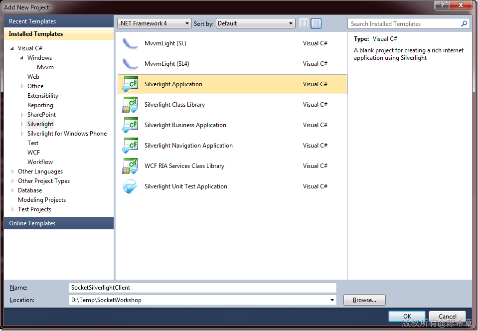
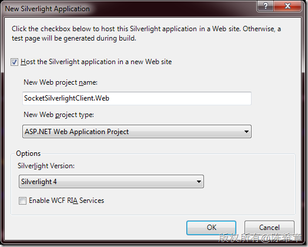
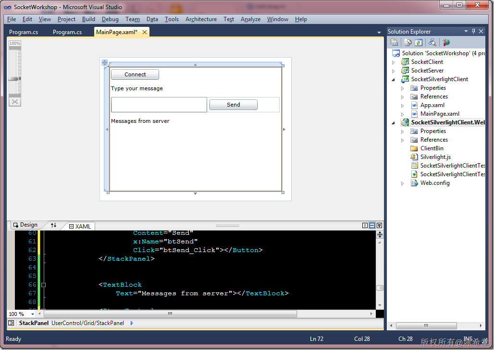
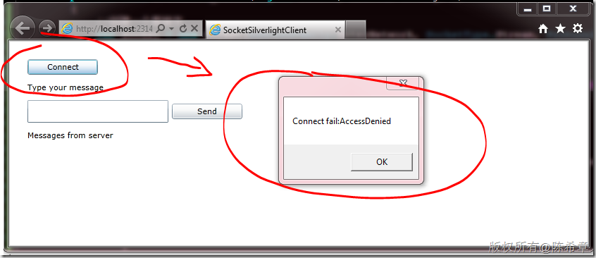
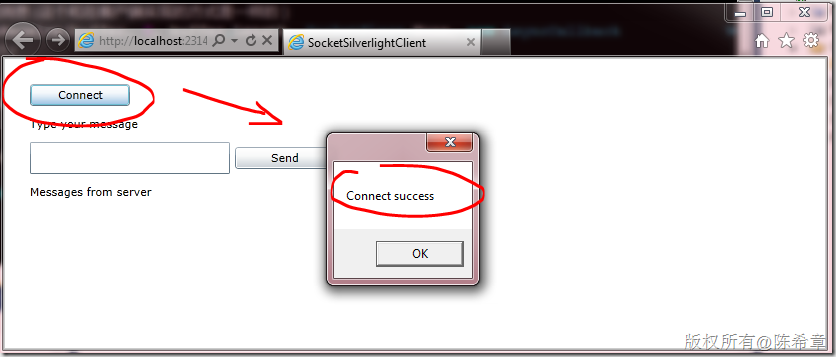
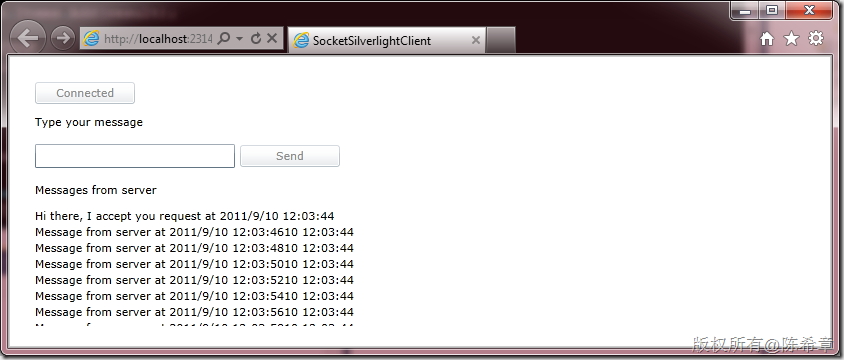
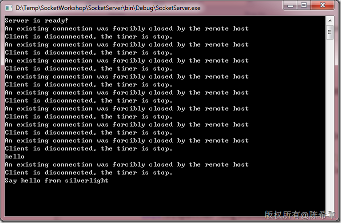

# 你得学会并且学得会的Socket编程基础知识（续）——Silverlight客户端 
> 原文发表于 2011-09-10, 地址: http://www.cnblogs.com/chenxizhang/archive/2011/09/10/2173101.html 


上一篇，我给大家讲解了关于Socket编程的基础知识

 [http://www.cnblogs.com/chenxizhang/archive/2011/09/10/2172994.html](http://www.cnblogs.com/chenxizhang/archive/2011/09/10/2172994.html "http://www.cnblogs.com/chenxizhang/archive/2011/09/10/2172994.html")

  

 本文将在这个案例的基础上，加入一个特殊场景，利用Silverlight来实现客户端。有的朋友可能会说，其实是一样的吧。请不要急于下结论，有用过Silverlight的朋友都有这种体会，很多在标准.NET Framework编程中能用的技术，到了Silverlight里面，或多或少会有些限制。不幸的是，Socket这个功能就是其中一个。这本身没有什么好不好的问题，Silverlight首先是运行在一个特殊的沙盒中，受到一些限制也是意料之中的，毕竟安全第一嘛

  

 我总结Silverlight中应用Socket的几点特殊之处

  1.所有的操作都必须的异步的，包括连接，发送和接收消息
---------------------------

 2.Silverlight只能做客户端，不能做服务器（虽然这句看起来说的有点多余，不过确实有朋友想这么做呢）
------------------------------------------------------

 3.Silverlight的Socket只能访问如下端口，4502-4530，只能用TCP。
----------------------------------------------

 4.Silverlight的Socket收到访问策略的限制，服务端必须监听，并提供ClientAccessPolicy的支持。通常是在943端口（TCP)进行监听，也可以在HTTP 80端口监听。
--------------------------------------------------------------------------------------------------

 本文完整代码如下 [http://files.cnblogs.com/chenxizhang/SocketWorkshop(with-silverlight).rar](http://files.cnblogs.com/chenxizhang/SocketWorkshop(with-silverlight).rar "http://files.cnblogs.com/chenxizhang/SocketWorkshop(with-silverlight).rar")

  

  

 那么，我们就来通过例子学习一下在Silverlight中如何使用Socket技术与服务端通讯吧

 第一步：创建Silverlight项目
===================

 [](http://images.cnblogs.com/cnblogs_com/chenxizhang/201109/20110910121029947.png)

 [](http://images.cnblogs.com/cnblogs_com/chenxizhang/201109/201109101210297632.png)  


 第二步：设计Silverlight界面
===================


```
<UserControl
    x:Class="SocketSilverlightClient.MainPage"
    xmlns="http://schemas.microsoft.com/winfx/2006/xaml/presentation"
    xmlns:x="http://schemas.microsoft.com/winfx/2006/xaml"
    xmlns:d="http://schemas.microsoft.com/expression/blend/2008"
    xmlns:mc="http://schemas.openxmlformats.org/markup-compatibility/2006"
    mc:Ignorable="d"
    d:DesignHeight="300"
    d:DesignWidth="400">

    <Grid
        x:Name="LayoutRoot"
        Background="White"
        Margin="20">

        <Grid.Resources>
            <Style
                TargetType="Button">
                <Setter
                    Property="Width"
                    Value="100"></Setter>
                <Setter
                    Property="HorizontalAlignment"
                    Value="Left"></Setter>
                <Setter
                    Property="Margin"
                    Value="5"></Setter>
            </Style>

            <Style
                TargetType="TextBlock">
                <Setter
                    Property="Margin"
                    Value="5"></Setter>
                <Setter
                    Property="HorizontalAlignment"
                    Value="Left"></Setter>
                <Setter
                    Property="TextWrapping"
                    Value="Wrap"></Setter>
            </Style>
        </Grid.Resources>

        <StackPanel>
            <Button
                Content="Connect"
                x:Name="btConnect"
                Click="btConnect\_Click"></Button>

            <TextBlock
                Text="Type your message"></TextBlock>

            <StackPanel
                Margin="5"
                Orientation="Horizontal">
                <TextBox
                    x:Name="txtInput"
                    Width="200"></TextBox>
                <Button
                    Content="Send"
                    x:Name="btSend"
                    Click="btSend\_Click"></Button>
            </StackPanel>


            <TextBlock
                Text="Messages from server"></TextBlock>

            <ItemsControl
                Margin="5"
                x:Name="icResult">
            </ItemsControl>
        </StackPanel>

    </Grid>
</UserControl>

```


.csharpcode, .csharpcode pre
{
 font-size: small;
 color: black;
 font-family: consolas, "Courier New", courier, monospace;
 background-color: #ffffff;
 /*white-space: pre;*/
}
.csharpcode pre { margin: 0em; }
.csharpcode .rem { color: #008000; }
.csharpcode .kwrd { color: #0000ff; }
.csharpcode .str { color: #006080; }
.csharpcode .op { color: #0000c0; }
.csharpcode .preproc { color: #cc6633; }
.csharpcode .asp { background-color: #ffff00; }
.csharpcode .html { color: #800000; }
.csharpcode .attr { color: #ff0000; }
.csharpcode .alt 
{
 background-color: #f4f4f4;
 width: 100%;
 margin: 0em;
}
.csharpcode .lnum { color: #606060; }


这个界面看起来像下面这样


[](http://images.cnblogs.com/cnblogs_com/chenxizhang/201109/201109101210293205.png)


 


第三步：编写基本的客户端代码
==============


```
using System;
using System.Collections.Generic;
using System.Linq;
using System.Net;
using System.Windows;
using System.Windows.Controls;
using System.Windows.Documents;
using System.Windows.Input;
using System.Windows.Media;
using System.Windows.Media.Animation;
using System.Windows.Shapes;

//导入命名空间
using System.Net.Sockets;

namespace SocketSilverlightClient
{
    /// <summary>
    /// 演示如何在Silverlight中使用Socket技术
    /// 作者：陈希章
    /// </summary>
    public partial class MainPage : UserControl
    {
        public MainPage()
        {
            InitializeComponent();
        }

        /// <summary>
        /// 尝试连接到服务器
        /// </summary>
        /// <param name="sender"></param>
        /// <param name="e"></param>
        private void btConnect\_Click(object sender, RoutedEventArgs e)
        {
            //创建一个套接字
            var socket = new Socket(AddressFamily.InterNetwork, SocketType.Stream, ProtocolType.Tcp);
            //准备一个异步参数（这是特有的）
            var args = new SocketAsyncEventArgs();
            //设置远程服务器地址，这里用DnsSafeHost，可以获取到宿主远程服务器的主机名称
            args.RemoteEndPoint = new DnsEndPoint(App.Current.Host.Source.DnsSafeHost, 4530);
            //注册Completed事件处理程序
            args.Completed += (o, a) =>
            {
                if(a.SocketError > 0)//0表示成功，其他的表示有错误
                {
                    //注意，因为Completed方法是在工作线程触发的，所以要对主线程进行访问，必须使用Dispatcher机制
                    this.Dispatcher.BeginInvoke(() =>
                    {
                        MessageBox.Show("Connect fail:" + a.SocketError.ToString());
                    });
                }
                else
                {

                    this.Dispatcher.BeginInvoke(() =>
                    {
                        MessageBox.Show("Connect success");
                    });
                }

            };

            //发起异步的连接请求
            socket.ConnectAsync(args);
        }

        private void btSend\_Click(object sender, RoutedEventArgs e)
        {

        }
    }
}

```

【注意】在Silverlight中使用Socket的代码，与一般的客户端还是不同的。最主要的区别在于异步模型。


.csharpcode, .csharpcode pre
{
 font-size: small;
 color: black;
 font-family: consolas, "Courier New", courier, monospace;
 background-color: #ffffff;
 /*white-space: pre;*/
}
.csharpcode pre { margin: 0em; }
.csharpcode .rem { color: #008000; }
.csharpcode .kwrd { color: #0000ff; }
.csharpcode .str { color: #006080; }
.csharpcode .op { color: #0000c0; }
.csharpcode .preproc { color: #cc6633; }
.csharpcode .asp { background-color: #ffff00; }
.csharpcode .html { color: #800000; }
.csharpcode .attr { color: #ff0000; }
.csharpcode .alt 
{
 background-color: #f4f4f4;
 width: 100%;
 margin: 0em;
}
.csharpcode .lnum { color: #606060; }


目前，我这里只编写了Connect的代码，是因为这里就会遇到连接问题，其他代码先不着急写出来。我们可以运行起来看看


[](http://images.cnblogs.com/cnblogs_com/chenxizhang/201109/201109101210301635.png)


点击“Connect”之后，我们发现有一个错误，是AccessDenied。这就是说，Silverlight遇到了权限问题无法直接访问到服务器。


我们都知道,Silverlight是运行在一个沙盒里面的，它要访问宿主网站之外的资源，是受到很多限制的。它会先尝试检查目标资源是否有一个ClientAccessPolicy的设置。


这里有一篇详细的介绍 <http://msdn.microsoft.com/zh-cn/library/cc197955(VS.95).aspx>


 


第四步：为服务器添加PolicyServer。
=======================


已经有不少先进同学在这方面有研究了。这个PolicyServer是负责向Silverlight发送策略信息的，也就是说，Silverlight的Socket，在连接之前，会默认去连接目标主机的943端口，请求ClientAccessPolicy的认证，只有通过了，则可以继续访问其他的Socket。


 


这个PolicyServer的设计，不是我的原创，但我稍做了修改。**请将下面的代码保存为一个独立的文件，放在SocketServer这个项目里面**


```
using System;
using System.Configuration;
using System.Diagnostics;
using System.IO;
using System.Net;
using System.Net.Sockets;
using System.Reflection;
using System.Text;

namespace SocketServerService
{
    /// <summary>
    /// This is a silverlight socket client access policy file server.
    /// 
    /// Background:
    /// When a socket connection open attempt to some server is made in Silverlight 2.0
    /// Silverlight automatically makes a request to the server in question on port 943 for a policy file
    /// The policy file served includes the valid ports and valid clients for the socket server
    /// 
    /// Outcomes:
    /// The socket request will result in success if the client access policy file served by the socket
    /// server permits access to the requested port and the client URI is in the <allow-from> element
    /// See ClientAccessPolicy.xml & http://msdn.microsoft.com/en-us/library/cc645032(VS.95).aspx for further details
    /// 
    /// The socket request will be denied if the client access policy file is not served or if the client /
    /// port is denied in the client access policy file
    /// </summary>
    class SL\_SocketPortPolicyListener
    {
        TcpListener \_Listener = null;
        TcpClient \_Client = null;
        const string \_PolicyRequestString = "<policy-file-request/>";
        int \_ReceivedLength = 0;
        byte[] \_Policy = null;
        byte[] \_ReceiveBuffer = null;
        EventLog eventLog;

        /// <summary>
        /// Initializes a new instance of the <see cref="SL\_SocketPortPolicyListener"/> class.
        /// </summary>
        /// <param name="serviceEventLog">The service event log.</param>
        public SL\_SocketPortPolicyListener(EventLog serviceEventLog)
        {
            eventLog = serviceEventLog;
            Start();
        }
 /// <summary>
 /// 增加的代码
 /// </summary>
 public SL\_SocketPortPolicyListener()
 : this(new EventLog("Application"))
 {

 }

        /// <summary>
        /// Starts this instance.
        /// </summary>
        void Start()
        {
            try
            {
                //增加的代码
 **var policyConfig =
 "<?xml version=\"1.0\" encoding =\"utf-8\"?>" +
 "<access-policy>" +
 "<cross-domain-access>" +
 "<policy>" +
 "<allow-from>" +
 "<domain uri=\"*\" />" +
 "</allow-from>" +
 "<grant-to>" +
 "<socket-resource port=\"4502-4530\" protocol=\"tcp\" />" +
 "</grant-to>" +
 "</policy>" +
 "</cross-domain-access>" +
 "</access-policy>";**

                //删除的代码
                //string executionLocation = Path.GetDirectoryName(Assembly.GetExecutingAssembly().Location);
                //string policyFile = ConfigurationManager.AppSettings["PolicyFilePath"];
                //using(FileStream fs = new FileStream(executionLocation + policyFile, FileMode.Open))
                //{
                // \_Policy = new byte[fs.Length];
                // fs.Read(\_Policy, 0, \_Policy.Length);
                //}

                //增加的代码
                **\_Policy = Encoding.Default.GetBytes(policyConfig);**


                \_ReceiveBuffer = new byte[\_PolicyRequestString.Length];

                //Using TcpListener which is a wrapper around a Socket
                //Allowed port is 943 for Silverlight sockets policy data
                \_Listener = new TcpListener(IPAddress.Any, 943);
                \_Listener.Start();
                \_Listener.BeginAcceptTcpClient(new AsyncCallback(OnBeginAccept), null);
            }
            catch(Exception exp)
            {
                LogError(exp);
            }
        }

        /// <summary>
        /// Called when [begin accept].
        /// </summary>
        /// <param name="ar">The ar.</param>
        private void OnBeginAccept(IAsyncResult ar)
        {
            \_Client = \_Listener.EndAcceptTcpClient(ar);
            \_Client.Client.BeginReceive(\_ReceiveBuffer, 0, \_PolicyRequestString.Length, SocketFlags.None,
                new AsyncCallback(OnReceiveComplete), null);
        }

        /// <summary>
        /// Called when [receive complete].
        /// </summary>
        /// <param name="ar">The ar.</param>
        private void OnReceiveComplete(IAsyncResult ar)
        {
            try
            {
                \_ReceivedLength += \_Client.Client.EndReceive(ar);
                //See if there's more data that we need to grab
                if(\_ReceivedLength < \_PolicyRequestString.Length)
                {
                    //Need to grab more data so receive remaining data
                    \_Client.Client.BeginReceive(\_ReceiveBuffer, \_ReceivedLength,
                        \_PolicyRequestString.Length - \_ReceivedLength,
                        SocketFlags.None, new AsyncCallback(OnReceiveComplete), null);
                    return;
                }

                //Check that <policy-file-request/> was sent from client
                string request = System.Text.Encoding.UTF8.GetString(\_ReceiveBuffer, 0, \_ReceivedLength);
                if(StringComparer.InvariantCultureIgnoreCase.Compare(request, \_PolicyRequestString) != 0)
                {
                    //Data received isn't valid so close
                    \_Client.Client.Close();
                    return;
                }
                //Valid request received....send policy file
                \_Client.Client.BeginSend(\_Policy, 0, \_Policy.Length, SocketFlags.None,
                    new AsyncCallback(OnSendComplete), \_Client.Client);
            }
            catch(Exception exp)
            {
                \_Client.Client.Close();
                LogError(exp);
            }
            \_ReceivedLength = 0;
            //listen for the next client
            \_Listener.BeginAcceptTcpClient(new AsyncCallback(OnBeginAccept), null);
        }

        /// <summary>
        /// Called when [send complete].
        /// </summary>
        /// <param name="ar">The ar.</param>
        private void OnSendComplete(IAsyncResult ar)
        {
            Socket socket = (Socket)ar.AsyncState;
            try
            {
                socket.EndSend(ar);
            }
            catch(Exception exp)
            {
                LogError(exp);
            }
            finally
            {
                socket.Close();
            }
        }

        /// <summary>
        /// Logs the error.
        /// </summary>
        /// <param name="exp">The exp.</param>
        private void LogError(Exception exp)
        {
            eventLog.WriteEntry(string.Format("Error in PolicySocketServer: {0} \r\n StackTrace: {1}", exp.Message, exp.StackTrace));
        }
    }
}

```

.csharpcode, .csharpcode pre
{
 font-size: small;
 color: black;
 font-family: consolas, "Courier New", courier, monospace;
 background-color: #ffffff;
 /*white-space: pre;*/
}
.csharpcode pre { margin: 0em; }
.csharpcode .rem { color: #008000; }
.csharpcode .kwrd { color: #0000ff; }
.csharpcode .str { color: #006080; }
.csharpcode .op { color: #0000c0; }
.csharpcode .preproc { color: #cc6633; }
.csharpcode .asp { background-color: #ffff00; }
.csharpcode .html { color: #800000; }
.csharpcode .attr { color: #ff0000; }
.csharpcode .alt 
{
 background-color: #f4f4f4;
 width: 100%;
 margin: 0em;
}
.csharpcode .lnum { color: #606060; }

 


然后，在SocketServer的主程序中，加入下面的代码（**只需要添加红色这一行即可**）


 


```
using System;
using System.Collections.Generic;
using System.Linq;
using System.Text;

//额外导入的两个命名空间
using System.Net.Sockets;
using System.Net;

namespace SocketServer
{
    class Program
    {
        /// <summary>
        /// Socket Server 演示
        /// 作者：陈希章
        /// </summary>
        /// <param name="args"></param>
        static void Main(string[] args)
        {

            **var policyServer = new SocketServerService.SL\_SocketPortPolicyListener();**


            //创建一个新的Socket,这里我们使用最常用的基于TCP的Stream Socket（流式套接字）
            var socket = new Socket(AddressFamily.InterNetwork, SocketType.Stream, ProtocolType.Tcp);

            //将该socket绑定到主机上面的某个端口
            //方法参考：http://msdn.microsoft.com/zh-cn/library/system.net.sockets.socket.bind.aspx
            socket.Bind(new IPEndPoint(IPAddress.Any, 4530));

            //启动监听，并且设置一个最大的队列长度
            //方法参考：http://msdn.microsoft.com/zh-cn/library/system.net.sockets.socket.listen(v=VS.100).aspx
            socket.Listen(4);

            //开始接受客户端连接请求
            //方法参考：http://msdn.microsoft.com/zh-cn/library/system.net.sockets.socket.beginaccept.aspx
            socket.BeginAccept(new AsyncCallback(ClientAccepted), socket);


            Console.WriteLine("Server is ready!");
            Console.Read();
        }


        public static void ClientAccepted(IAsyncResult ar)
        {

            var socket = ar.AsyncState as Socket;

            //这就是客户端的Socket实例，我们后续可以将其保存起来
            var client = socket.EndAccept(ar);

            //给客户端发送一个欢迎消息
            client.Send(Encoding.Unicode.GetBytes("Hi there, I accept you request at " + DateTime.Now.ToString()));


            //实现每隔两秒钟给服务器发一个消息
            //这里我们使用了一个定时器
            var timer = new System.Timers.Timer();
            timer.Interval = 2000D;
            timer.Enabled = true;
            timer.Elapsed += (o, a) =>
            {
                //检测客户端Socket的状态
                if(client.Connected)
                {
                    try
                    {
                        client.Send(Encoding.Unicode.GetBytes("Message from server at " + DateTime.Now.ToString()));
                    }
                    catch(SocketException ex)
                    {
                        Console.WriteLine(ex.Message);
                    }
                }
                else
                {
                    timer.Stop();
                    timer.Enabled = false;
                    Console.WriteLine("Client is disconnected, the timer is stop.");
                }
            };
            timer.Start();


            //接收客户端的消息(这个和在客户端实现的方式是一样的）
            client.BeginReceive(buffer, 0, buffer.Length, SocketFlags.None, new AsyncCallback(ReceiveMessage), client);

            //准备接受下一个客户端请求
            socket.BeginAccept(new AsyncCallback(ClientAccepted), socket);
        }

        static byte[] buffer = new byte[1024];

        public static void ReceiveMessage(IAsyncResult ar)
        {

            try
            {
                var socket = ar.AsyncState as Socket;

                //方法参考：http://msdn.microsoft.com/zh-cn/library/system.net.sockets.socket.endreceive.aspx
                var length = socket.EndReceive(ar);
                //读取出来消息内容
                var message = Encoding.Unicode.GetString(buffer, 0, length);
                //显示消息
                Console.WriteLine(message);

                //接收下一个消息(因为这是一个递归的调用，所以这样就可以一直接收消息了）
                socket.BeginReceive(buffer, 0, buffer.Length, SocketFlags.None, new AsyncCallback(ReceiveMessage), socket);
            }
            catch(Exception ex){
                Console.WriteLine(ex.Message);
            }
        }
    }
}

```

.csharpcode, .csharpcode pre
{
 font-size: small;
 color: black;
 font-family: consolas, "Courier New", courier, monospace;
 background-color: #ffffff;
 /*white-space: pre;*/
}
.csharpcode pre { margin: 0em; }
.csharpcode .rem { color: #008000; }
.csharpcode .kwrd { color: #0000ff; }
.csharpcode .str { color: #006080; }
.csharpcode .op { color: #0000c0; }
.csharpcode .preproc { color: #cc6633; }
.csharpcode .asp { background-color: #ffff00; }
.csharpcode .html { color: #800000; }
.csharpcode .attr { color: #ff0000; }
.csharpcode .alt 
{
 background-color: #f4f4f4;
 width: 100%;
 margin: 0em;
}
.csharpcode .lnum { color: #606060; }

再次测试，我们就发现Silverlight客户端能够连接到服务器了


[](http://images.cnblogs.com/cnblogs_com/chenxizhang/201109/201109101210303620.png)


 


既然连接上了服务器，那么就让我们来将Silverlight客户端里面其他的一些功能都实现一下吧


 


第五步：实现Silverlight客户端的消息收发
=========================


```
using System;
using System.Collections.Generic;
using System.Linq;
using System.Net;
using System.Windows;
using System.Windows.Controls;
using System.Windows.Documents;
using System.Windows.Input;
using System.Windows.Media;
using System.Windows.Media.Animation;
using System.Windows.Shapes;

//导入命名空间
using System.Net.Sockets;
using System.Text;

namespace SocketSilverlightClient
{
    /// <summary>
    /// 演示如何在Silverlight中使用Socket技术
    /// 作者：陈希章
    /// </summary>
    public partial class MainPage : UserControl
    {
        public MainPage()
        {
            InitializeComponent();
        }


        //创建一个套接字
        Socket socket = new Socket(AddressFamily.InterNetwork, SocketType.Stream, ProtocolType.Tcp);


        /// <summary>
        /// 尝试连接到服务器
        /// </summary>
        /// <param name="sender"></param>
        /// <param name="e"></param>
        private void btConnect\_Click(object sender, RoutedEventArgs e)
        {
            //准备一个异步参数（这是特有的）
            var args = new SocketAsyncEventArgs();
            //设置远程服务器地址，这里用DnsSafeHost，可以获取到宿主远程服务器的主机名称
            args.RemoteEndPoint = new DnsEndPoint(App.Current.Host.Source.DnsSafeHost, 4530);
            //注册Completed事件处理程序
            args.Completed += ConnectCompleted;

            //发起异步的连接请求
            socket.ConnectAsync(args);
        }


        /// <summary>
        /// 该事件在连接成功时发生
        /// </summary>
        /// <param name="sender"></param>
        /// <param name="args"></param>
        public void ConnectCompleted(object sender, SocketAsyncEventArgs e)
        {
            if(e.SocketError > 0)//0表示成功，其他的表示有错误
            {
                //注意，因为Completed方法是在工作线程触发的，所以要对主线程进行访问，必须使用Dispatcher机制
                this.Dispatcher.BeginInvoke(() =>
                {
                    MessageBox.Show("Connect fail:" + e.SocketError.ToString());
                });
            }
            else
            {
                this.Dispatcher.BeginInvoke(() =>
                {
                    //MessageBox.Show("Connect success");

                    //将连接按钮禁用掉
                    btConnect.Content = "Connected";
                    btConnect.IsEnabled = false;


                    var buffer = new byte[1024];
                    e.SetBuffer(buffer, 0, buffer.Length);
                    e.Completed -= ConnectCompleted;
                    e.Completed += ReceiveCompleted;
                    socket.ReceiveAsync(e);
                });
            }
        }

        /// <summary>
        /// 该事件在接收消息时发生
        /// </summary>
        /// <param name="sender"></param>
        /// <param name="args"></param>
        public void ReceiveCompleted(object sender, SocketAsyncEventArgs e)
        {
            //将消息显示在界面上
            var result = Encoding.Unicode.GetString(e.Buffer, 0, e.Count);
            this.Dispatcher.BeginInvoke(() =>
            {
                icResult.Items.Add(result);
            });
            //递归继续接收消息
            socket.ReceiveAsync(e);
        }


        private void btSend\_Click(object sender, RoutedEventArgs e)
        {
            var args = new SocketAsyncEventArgs();
            //将用户输入的文本转成字节
            var buffer = Encoding.Unicode.GetBytes(txtInput.Text);
            args.SetBuffer(buffer, 0, buffer.Length);
            //设置远程服务器地址，这里用DnsSafeHost，可以获取到宿主远程服务器的主机名称
            args.RemoteEndPoint = new DnsEndPoint(App.Current.Host.Source.DnsSafeHost, 4530);

            //发送完成的话，将控件清空，激活
            args.Completed += (o, a) => {
                this.Dispatcher.BeginInvoke(() =>
                {
                    txtInput.Text = string.Empty;
                    btSend.IsEnabled = true;
                });
            };
            //禁用按钮
            btSend.IsEnabled = false;
            //发送消息
            socket.SendAsync(args);
        }
    }
}

```

.csharpcode, .csharpcode pre
{
 font-size: small;
 color: black;
 font-family: consolas, "Courier New", courier, monospace;
 background-color: #ffffff;
 /*white-space: pre;*/
}
.csharpcode pre { margin: 0em; }
.csharpcode .rem { color: #008000; }
.csharpcode .kwrd { color: #0000ff; }
.csharpcode .str { color: #006080; }
.csharpcode .op { color: #0000c0; }
.csharpcode .preproc { color: #cc6633; }
.csharpcode .asp { background-color: #ffff00; }
.csharpcode .html { color: #800000; }
.csharpcode .attr { color: #ff0000; }
.csharpcode .alt 
{
 background-color: #f4f4f4;
 width: 100%;
 margin: 0em;
}
.csharpcode .lnum { color: #606060; }


.csharpcode, .csharpcode pre
{
 font-size: small;
 color: black;
 font-family: consolas, "Courier New", courier, monospace;
 background-color: #ffffff;
 /*white-space: pre;*/
}
.csharpcode pre { margin: 0em; }
.csharpcode .rem { color: #008000; }
.csharpcode .kwrd { color: #0000ff; }
.csharpcode .str { color: #006080; }
.csharpcode .op { color: #0000c0; }
.csharpcode .preproc { color: #cc6633; }
.csharpcode .asp { background-color: #ffff00; }
.csharpcode .html { color: #800000; }
.csharpcode .attr { color: #ff0000; }
.csharpcode .alt 
{
 background-color: #f4f4f4;
 width: 100%;
 margin: 0em;
}
.csharpcode .lnum { color: #606060; }


运行起来看看吧


[](http://images.cnblogs.com/cnblogs_com/chenxizhang/201109/201109101210313653.png)


[](http://images.cnblogs.com/cnblogs_com/chenxizhang/201109/201109101210319226.png)


 


还不错对吧，这个例子给大家演示了如何在Silverlight中使用Socket，接下来大家可以结合自己的现实工作做一些研究和扩展吧


本文完整代码如下 [http://files.cnblogs.com/chenxizhang/SocketWorkshop(with-silverlight).rar](http://files.cnblogs.com/chenxizhang/SocketWorkshop(with-silverlight).rar "http://files.cnblogs.com/chenxizhang/SocketWorkshop(with-silverlight).rar")

