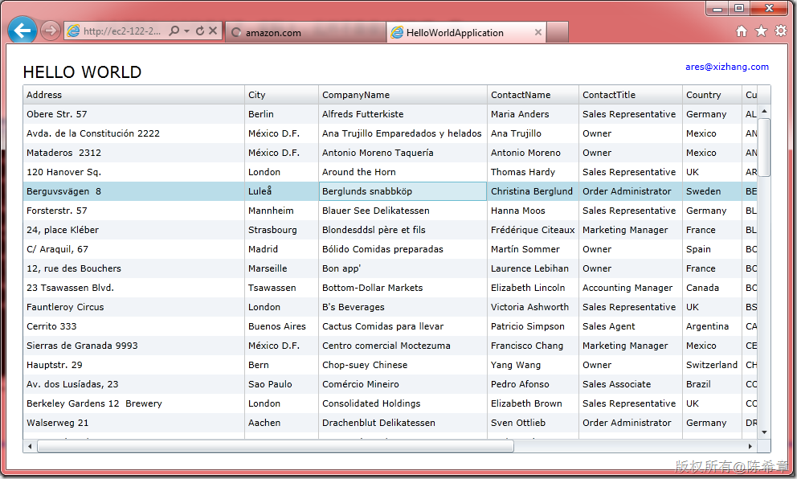
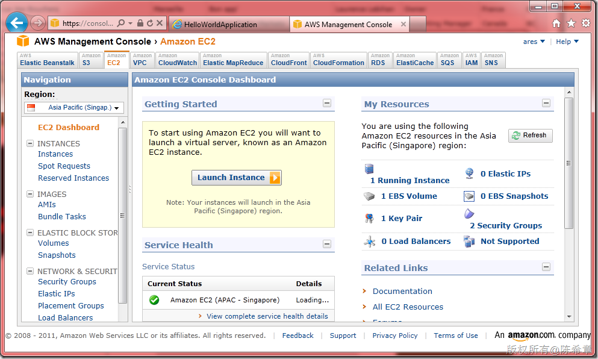
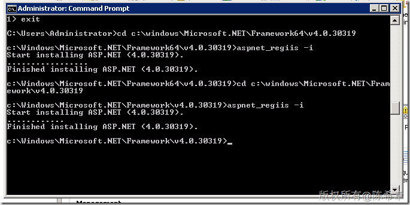
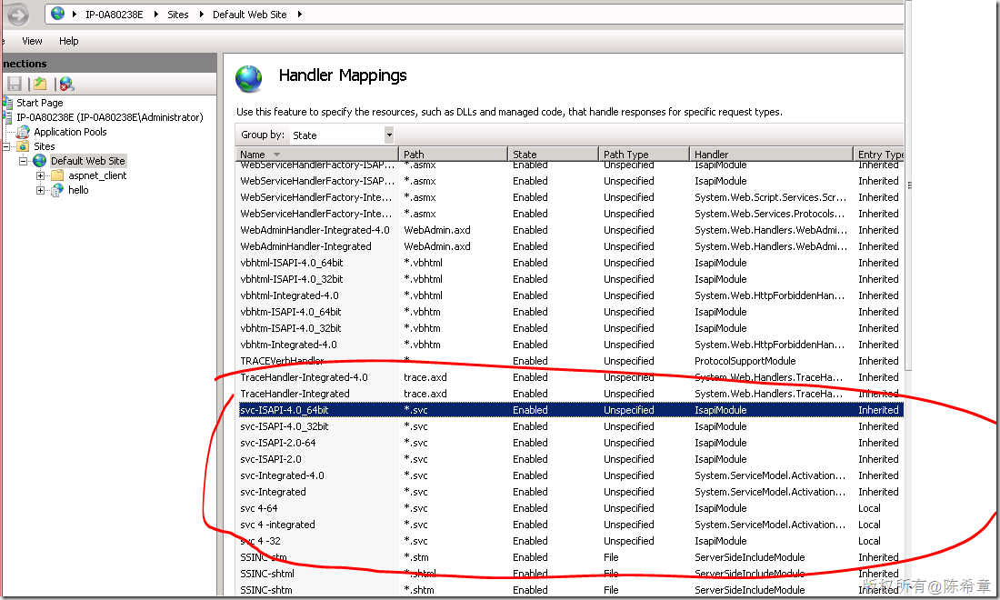

# 基于Amazon提供的EC2平台构建云端应用实践 
> 原文发表于 2011-10-22, 地址: http://www.cnblogs.com/chenxizhang/archive/2011/10/22/2221437.html 

关于云计算，云平台，云应用现在讨论的很多了，实际上，云并不是很玄的东西，我也和一些朋友早先有些交流和研究。

 我比较认可的定义是这样：**云计算的核心理念是让计算这种资源，变得像我们日常生活中使用水，电等资源那样，可以按需索取，并支付相应的费用，而不需要每个人都造一个发电机**。

 从这个意义上说，云计算是一种变革，而且绝对是好的变革。在这场游戏中，有两种主要角色：服务提供商和服务消费者。目前几个巨头都在这个领域有所作为，包括Amazon,Microsoft,Google等等。其中Amazon是大家公认的前驱者，也是目前做得相对较好的一家。

 对于这些巨头来说，云计算绝对是一笔大的生意，投入多少都不为怪。而对于服务消费者来说，我们能够在这场变革中得到什么呢？

 简单地说，**云计算和平台，让任何一个小公司甚至个人都可以做出世界级的应用（我的意思是说，有这样的条件，至于能不能做出来当然看你的能力了）**，进一步印证了世界正在变得扁平的道理，因为你的瓶颈不可能会出现在硬件或者网络方面，你也不需要预先为此做出投资，你可以关注在应用上，前期的时候，你可以购买相对少一些的资源，当你的用户量上来的时候，你可以添加更多的资源，很自然地实现扩展。

  

 Amazon的云平台是 [Amazon Elastic Compute Cloud (Amazon **EC2**)](http://aws.amazon.com/ec2/) ， 微软的云平台是<https://windows.azure.com>

 其实对windows azure，作为.NET开发人员而言，应该是更有亲切感的。但我自己目前还没有发现如何注册或者购买，好像是说我们所在的区域还不支持。而我对EC2是早有耳闻，今天花了一些时间，实践了一下，总体来说还是比较顺利的

  

 我选择了一台Windows 2008 R2的服务器，带有SQL Server。我的一个测试程序已经配置成功，这是一个使用了SQL Server，WCF Domain Service, Silverlight 等技术做的演示页面。

 

 

  

  

 如果大家有兴趣，可以到 [http://aws.amazon.com/](http://aws.amazon.com/ "http://aws.amazon.com/") 开始你的云端之旅

  

 下面是一些相关事项

 1.你需要有一个能支付美元的信用卡，**你需要自己详细阅读有关的价格和收费条款**

 2.你需要手头有电话，激活帐号的时候，会给你打一个电话（应该是机器打的），英语的

 3.Linux的服务器比Windows的服务器便宜一些，而且好像有一个免费的使用Linux服务器的期限

 4.你最好自己有域名（可以映射过去），因为他默认会生成一个很长的域名，而且那域名肯定不是永久的

  

  

 在配置的过程中，遇到一些问题，给大家也提醒一下

 1.一般给的虚拟机，都只装好ASP.NET 3.5，我们需要手工地运行下面的命令安装ASP.NET 4.0
-----------------------------------------------------

 

 2. 还需要确认WCF是否能正常工作
------------------

 

 3.如果使用RIA Service，需要单独安装Toolkit
-------------------------------

 [http://go.microsoft.com/fwlink/?LinkId=192054](http://go.microsoft.com/fwlink/?LinkId=192054 "http://go.microsoft.com/fwlink/?LinkId=192054")

  

 4.根据你的实际情况，选择SQL Server Express还是SQL Server Standard版本
------------------------------------------------------

 我目前是测试阶段，选择了Express

  

 5.访问aws.amazon.com可能速度不快
------------------------

 我家里用的网络经常要等很久才能链接上，这可能与网络有关系。

  

 可以这么说，一个新的时代已经开始，我们要做的就是迎接挑战和机遇。

