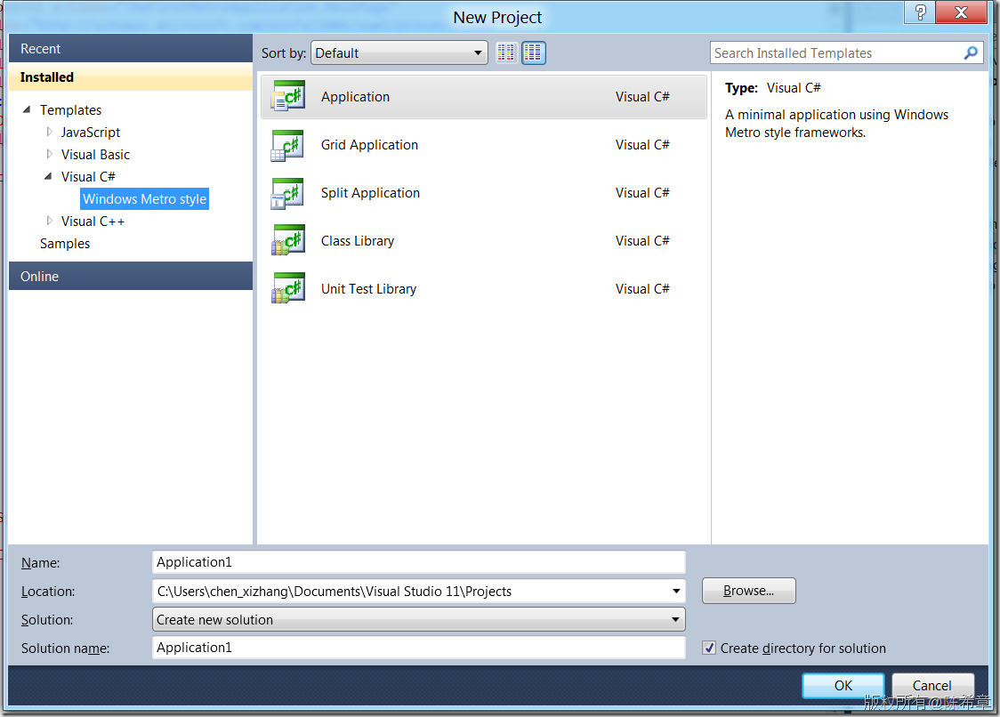

# 试水Windows 8 Metro application（xaml)及我的一些理解 
> 原文发表于 2011-10-25, 地址: http://www.cnblogs.com/chenxizhang/archive/2011/10/25/2224499.html 


前不久，微软召开了Build大会，向开发者们公布了最新版本的Windows 系统，即Windows 8的一些信息。从各方面的反应来看，总体还是比较积极的（微软这次的大会算是舍了大本了，每个参会人员都免费得到一台平板电脑呢），我最近也找到有关的视频了解学习了一下，和很多朋友一样，我从开发人员的角度，比较关注的是，新版的Windows系统，及其在界面和整个生态环境方面的一些重大改变，将给我们这个行业，或者我们自己的公司和个人带来什么切身的影响。

 带着这样的疑问，我下载了微软提供的Windows Developer Preview版本安装试用了一下，这一篇文章将结合我自己的体会，给大家一些实际的参考信息。

 关于BUILD大会的两个主题演讲，有时间的朋友，应该全部看一遍

 [http://www.buildwindows.com/](http://www.buildwindows.com/ "http://www.buildwindows.com/")

 国内也有视频网站有转载，我这里就不介绍了。

  

 如果你想尝鲜使用Windows Developer Preview,可以在这里下载

 [http://msdn.microsoft.com/en-us/windows/apps/br229516](http://msdn.microsoft.com/en-us/windows/apps/br229516 "http://msdn.microsoft.com/en-us/windows/apps/br229516") 

 我是参照下面这篇文章的介绍进行安装的，我用移动硬盘安装，还比较顺利。

 [http://www.cnblogs.com/wpf\_gd/archive/2011/09/15/2177810.html](http://www.cnblogs.com/wpf_gd/archive/2011/09/15/2177810.html "http://www.cnblogs.com/wpf_gd/archive/2011/09/15/2177810.html")

 **【备注】如果对系统安装不是特别清楚的同学，我建议你最好烧录一张DVD，然后在单独的机器安装，否则如果万一出现问题，可能会对你的工作造成影响**

 安装好之后，可以看到下面这样的界面,这就是一再被说到Metro界面风格

 [](http://images.cnblogs.com/cnblogs_com/chenxizhang/201110/201110252208421520.png)

  

 很显然，界面是第一个重大的变化。但实际上，这个界面并不是Windows 8的首创，这个界面最早是出现在Zune中，然后出现在Windows Phone 7中，现在只是将它的使用范围进一步扩大，微软的目标是希望以后的桌面电脑、平板电脑、手机都使用这种风格的界面。

 【备注】据说，前不久，Metro这种界面设计的风格正式申请了专利，而且获得了认证

 [http://appft.uspto.gov/netacgi/nph-Parser?Sect1=PTO1&Sect2=HITOFF&d=PG01&p=1&u=%2Fnetahtml%2FPTO%2Fsrchnum.html&r=1&f=G&l=50&s1=%2220110202834%22.PGNR.&OS=DN/20110202834&RS=DN/20110202834](http://appft.uspto.gov/netacgi/nph-Parser?Sect1=PTO1&Sect2=HITOFF&d=PG01&p=1&u=%2Fnetahtml%2FPTO%2Fsrchnum.html&r=1&f=G&l=50&s1=%2220110202834%22.PGNR.&OS=DN/20110202834&RS=DN/20110202834 "http://appft.uspto.gov/netacgi/nph-Parser?Sect1=PTO1&Sect2=HITOFF&d=PG01&p=1&u=%2Fnetahtml%2FPTO%2Fsrchnum.html&r=1&f=G&l=50&s1=%2220110202834%22.PGNR.&OS=DN/20110202834&RS=DN/20110202834")

  

 这种界面无疑是很适合触摸式的操作的，而触摸式是一个趋势，这无可阻挡，所以Metro的出现时势所必然。然而，之所以可以单独申请专利，是因为它又区别于iPhone或者Android 的那种界面（仍然是一排一排的按钮），我个人感觉还是不错的，Metro的这种样式，给用户的信息量会多一些。

  

 不过，话说回来，Windows 8作为第一个使用Metro的操作系统，为了保证向后兼容性，是不可能只提供Metro这种样式的界面的，它仍然保留了传统的桌面。这个界面其实跟Windows 7很像，但也是有很多改进的。这里就先不做太多赘述

 [](http://images.cnblogs.com/cnblogs_com/chenxizhang/201110/201110252208473411.png)

  

 也就是说，至少目前可以肯定的是，Windows 8将支持两种风格的应用程序

 1. 传统的应用程序，通过exe等形式发布，用户可以自己复制，或者下载，然后安装

 2. Metro应用程序，这些应用程序是必须通过Windows Store来发布，并且传播的，用户也只能通过这个Store去下载和安装

 【备注】我们很多人都知道Apple Store，微软在手机领域也有一个Windows Phone Marketplace ，以后还将有一个统一的Windows Store([http://msdn.microsoft.com/en-us/windows/apps/br216180?lcid=1033](http://msdn.microsoft.com/en-us/windows/apps/br216180?lcid=1033 "http://msdn.microsoft.com/en-us/windows/apps/br216180?lcid=1033"))

  

 从第二点来看，我觉得不会有太多人反对Windows 8以及Metro。从各方面的声音来看，大家都提到一个字：Opportunity （机会），是的，对于Windows平台的厂商（微软），最终用户，还有开发商以及开发人员，这意味着新的机会。

  

 在BUILD大会上，微软的高层除了演示了各种客户端的效果之后，其实还着重在强调云的概念。这是自然而然的，Windows 8如果想要华丽转身，成为桌面电脑+平板电脑+手机的统一的系统，绝不仅仅是客户端的事情。微软的Windows Azure以及相关配套的一些服务，在很早之前就为此在做准备了。典型的问题就是，这么多Application，其实到时候都是统一托管在Windows Azure平台上。另外，值得一说的是，Windows 8登录就直接继承了Windows Live ID,可以期待以后，只要有Windows Live ID，在不同设备上就能很自然地同步资源，或者进行一致性的操作。

  

 好的，那么回到开发人员的视角，既然Metro势在必行，那么我们有什么样的机遇和挑战呢？

  

 这次BUILD大会前后，就一直有很多朋友在议论，说微软要抛弃Silverlight等等。这个说法其实不准确。准确地说是，Silverlight无法在Metro样式的应用程序中运行，即便是Metro的IE，也是不接受Silverlight的，当然，它同时也不接受Flash。它不接受任何插件，它为HTML 5而来。

 是的，你没有听错，在Windows 8中，确实有两个IE，一个是Metro版本的，一个是桌面版本的。（实际上，微软正在开发Metro Office，我实在想看看那时怎么样一个Office）

  

 下面这个是Metro版本的IE

 [](http://images.cnblogs.com/cnblogs_com/chenxizhang/201110/201110252208542218.png)

 下面这个是桌面版的IE，与Windows 7里面的IE 9没有太大的区别，虽然这个版本叫IE 10.这个IE 里面当然是继续支持Silverlight的

 [](http://images.cnblogs.com/cnblogs_com/chenxizhang/201110/20111025220857912.png)

  

 其实这里有一句潜台词，大家可以试想一下，虽然说Windows 8是希望覆盖桌面电脑、平板电脑、手机（我相信这个目标也的确可以实现），但相比较桌面电脑而言，平板电脑和手机其实是没有桌面的概念的，所以，我可以预见，在平板电脑和手机里面，就肯定只有Metro样式的应用程序，在它们上面是不支持Silverlight的。

 其实，我自己做过基于Silverlight的项目，我的体会和很多人都相似，我没有寄太大希望它能用在internet上面，相反，Silverlight目前在一些企业内部项目中倒还是用得不错。因为，Silverlight作为一种技术，有它适用的地方，我们不能期望它能用在所有地方。

  

 但是，一个很大的好消息是，拥有Silverlight或者WPF开发经验的开发人员，将能够在Metro应用程序开发中占得先机。为什么这么说呢？因为Metro应用程序，支持三种编写方式

 1. javascript

 2. xaml + C#/VB.NET

 3. C++

  

 是的，你看到有XAML，我们对这个不是很熟悉了吗？如果是，你的经验可以得到复用。我下面就用这种方式来创建我的第一个应用程序，大家可以看看，其实也不是特别难。

 【备注】这里的XAML与WPF或者Silverlight从本质上是一样的，但是也有些不一样，本文不会做太多深入的展开。

  

 在下载得到的Windows Developer Preview这个系统中，已经预先安装好了Visual Studio 11 Express（估计正式版该叫Visual Studio 2012吧，虽然这名儿实在让人有点瘆得慌）

 目前这个版本，只有下面几个模板

 [](http://images.cnblogs.com/cnblogs_com/chenxizhang/201110/201110252208594698.png)

  

 我参照微软提供的例子，做了一个简单的应用程序，体验了一下


```
<UserControl x:Class="TheFirstMetroApplication.MainPage"
    xmlns="http://schemas.microsoft.com/winfx/2006/xaml/presentation"
    xmlns:x="http://schemas.microsoft.com/winfx/2006/xaml"
    xmlns:d="http://schemas.microsoft.com/expression/blend/2008"
    xmlns:mc="http://schemas.openxmlformats.org/markup-compatibility/2006"
    mc:Ignorable="d"
    d:DesignHeight="768" d:DesignWidth="1366"
    xmlns:local="using:TheFirstMetroApplication" >

    <ScrollViewer>
        <StackPanel>

            <TextBlock Text="{Binding Title}" FontSize="30" Margin="10"></TextBlock>

            <ItemsControl ItemsSource="{Binding Items}">
                <ItemsControl.ItemTemplate>
                    <DataTemplate>
                        <StackPanel Margin="50,0,0,10">
                            <HyperlinkButton Content="{Binding Title}" FontSize="20"></HyperlinkButton>
                            <TextBlock Text="{Binding PubDate}"></TextBlock>
                        </StackPanel>

                    </DataTemplate>
                </ItemsControl.ItemTemplate>
            </ItemsControl>

        </StackPanel>
    </ScrollViewer>

</UserControl>
```

[](http://images.cnblogs.com/cnblogs_com/chenxizhang/201110/201110252209018485.png)


大家看这样的语法，应该没有什么不好理解吧


【备注】其实还是有些细节改变了，例如HyperLinkButton，居然没有了NavigationUrl属性了，为什么呢？就是说不能直接做导航，而需要去响应事件代码。（这方面我还没有时间深入去研究每个细节点，以后再看）


后台代码的部分，也是我们属性的C#


 


```
using System;
using System.Collections.ObjectModel;
using System.Threading.Tasks;
using Windows.UI.Xaml;
using Windows.Web.Syndication;

namespace TheFirstMetroApplication
{
    partial class MainPage
    {
        public MainPage()
        {
            InitializeComponent();

            Loaded += new RoutedEventHandler(MainPage\_Loaded);
        }

        void MainPage\_Loaded(object sender, RoutedEventArgs e)
        {
            GetFeedAsync("http://www.cnblogs.com/chenxizhang/rss");
        }

        public class FeedData
        {
            public string Title { get; set; }

            // using System.Collections.ObjectModel;
            private ObservableCollection<FeedItem> \_Items = new ObservableCollection<FeedItem>();
            public ObservableCollection<FeedItem> Items
            {
                get
                {
                    return this.\_Items;
                }
            }
        }

        public class FeedItem
        {
            public string Title { get; set; }
            public string Author { get; set; }
            public string Content { get; set; }
            public DateTime PubDate { get; set; }

        }


        private async Task GetFeedAsync(string feedUriString)
        {
            // using Windows.Web.Syndication;
            SyndicationClient client = new SyndicationClient();
            Uri feedUri = new Uri(feedUriString);

            try
            {
                SyndicationFeed feed = await client.RetrieveFeedAsync(feedUri);
                FeedData feedData = new FeedData();
                feedData.Title = feed.Title.Text;

                foreach (SyndicationItem item in feed.Items)
                {
                    FeedItem feedItem = new FeedItem();
                    feedItem.Title = item.Title.Text;
                    feedItem.PubDate = item.PublishedDate.DateTime;
                    feedItem.Author = item.Authors[0].Name.ToString();
                    if (feed.SourceFormat == SyndicationFormat.Atom10)
                    {
                        feedItem.Content = item.Content.Text;
                    }
                    else if (feed.SourceFormat == SyndicationFormat.Rss20)
                    {
                        feedItem.Content = item.Summary.Text;
                    }
                    feedData.Items.Add(feedItem);
                }
                this.DataContext = feedData;
            }
            catch (Exception ex)
            {
                // Log Error.
                
            }
        }


    }

}

```

 


这段代码的意思是，在页面加载的时候，读取我的博客列表，并且绑定在当前页面上。


另外，需要注意的是，程序启动的方式与WPF和Silverlight都有些不同


[](http://images.cnblogs.com/cnblogs_com/chenxizhang/201110/201110252209031257.png)


然后，还有一个专门的appxmanifest文件，来设置与程序有关的信息


[](http://images.cnblogs.com/cnblogs_com/chenxizhang/201110/201110252209067966.png)


在当前的开发环境中，你可以选择直接部署到本机，也可以部署到模拟器，当然还可以发布到Windows Store，我下面部署到模拟器给大家看一下


[](http://images.cnblogs.com/cnblogs_com/chenxizhang/201110/201110252209077476.png)


按下F5键就可以部署调试，一个类似于平板电脑的界面打开了


[](http://images.cnblogs.com/cnblogs_com/chenxizhang/201110/201110252209081196.png)


这个程序可以在桌面上找到


[](http://images.cnblogs.com/cnblogs_com/chenxizhang/201110/201110252209112365.png)


点击右键，可以很方便地进行卸载


[](http://images.cnblogs.com/cnblogs_com/chenxizhang/201110/201110252209162403.png)


 


就这样，我们完成了第一个Metro应用程序，虽然这只是皮毛中的皮毛。但至少我们有信心去接受这个挑战和机遇，至少我是这么看的。


Metro应用程序，将很容易与Windows 系统进行无缝整合，例如我们希望在Windows 里面搜索时能够直接进入我们的应用程序中检索，得到结果，我们只需要在程序的设置中打开一个开关。它这里称为所谓的Declarations


[](http://images.cnblogs.com/cnblogs_com/chenxizhang/201110/201110252209195798.png)


然后，在EntryPoint里面实现一个方法


[](http://images.cnblogs.com/cnblogs_com/chenxizhang/201110/201110252209221046.png)


【备注】这里具体功能我没有实现，但那个参数里面是包含了用户要搜索到文字的


 


在Windows里面，如何集成搜索功能呢。请看下面的例子。


【备注】由于我没有对搜索进行定制，所以它仍然是打开了主界面


[](http://images.cnblogs.com/cnblogs_com/chenxizhang/201110/201110252209238179.png)


 


 


总结：Windows 8提出一个全新的设想，不光是界面上的。我个人觉得应该是值得期待的，本文我通过例子编写了第一个基于XAML的Metro应用程序，大家可以发现，其实也并不是很复杂，我们之前的经验可以得到复用，这无疑让我们有了更充分地理由，迎接这个机遇和挑战。
----------------------------------------------------------------------------------------------------------------------------------


 


更多动手实验，请参考Windows 8 Hand-On Labs


[http://www.buildwindows.com/Labs](http://www.buildwindows.com/Labs "http://www.buildwindows.com/Labs")

