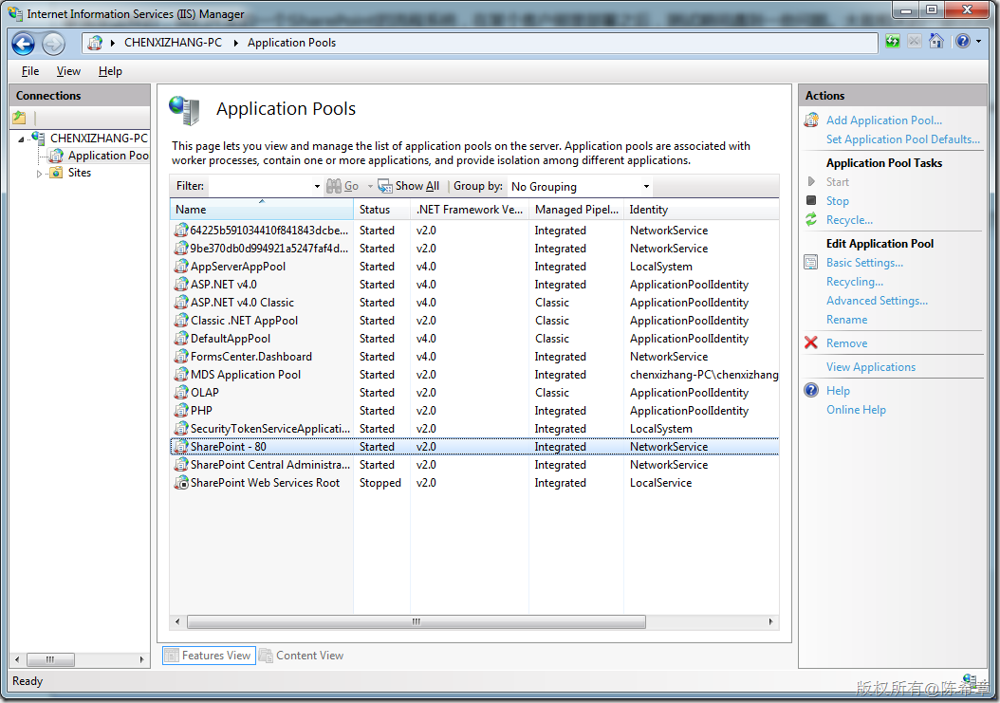
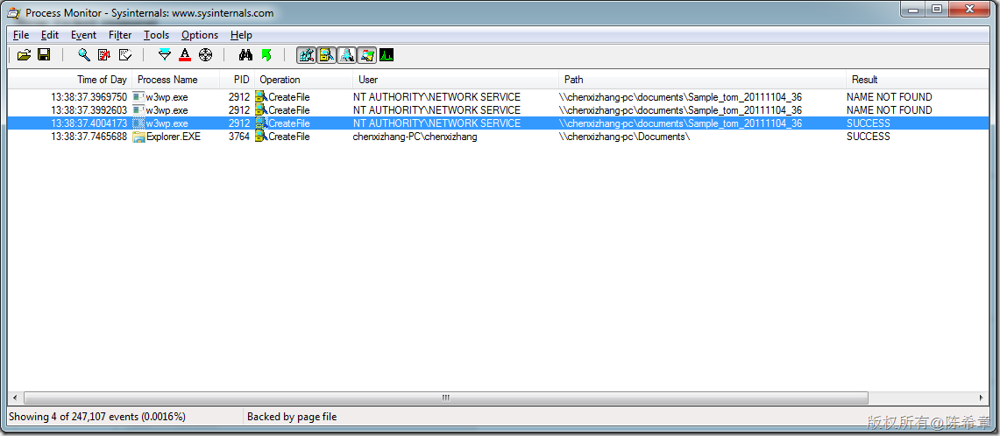

# 通过监控诊断和调试应用程序对共享目录访问可能的权限问题 
> 原文发表于 2011-11-04, 地址: http://www.cnblogs.com/chenxizhang/archive/2011/11/04/2236121.html 


事情是这样的，我们开发的一个SharePoint的流程系统，在某个客户那里部署之后，测试期间遇到一些问题。大致相关的一部分流程是这样的

 1.用户发起流程之后，会有一些附件，最开始是上传到SharePoint中的一个文档库的

 2.流程运行期间，大多是审批，签转，参与人可以对这些附件进行修改，通过SharePoint的多版本功能，可以为文档保存多个版本

 3.当流程结束之后，我们希望将与这个流程所有的文档（及所有的版本）移动到某个共享目录存档起来。（这样做的目的是减轻SharePoint的压力）

  

 这次遇到的问题是，在最后一步，将文档转移到共项目的时候，总是无法通过，报的是IOException，也就是无法写入到目录。

 那么，我们是用什么身份去写这个目录的呢？

 通常，在SharePoint的解决方案中，为了简化授权，我们在操作外部资源（例如数据库，或者文件夹）的时候，都会提升权限，如下所示


```
      [WebMethod]
        public bool CloseTicket(int ticketId)
        {
            var result = false;
            var webUrl = SPContext.Current.Web.Url;
            var DocumentLibName = "DocumentReviewTempDocumentLib";
            var Database = Global.GetDatabase();


            SPSecurity.RunWithElevatedPrivileges(delegate()
                {
                   //这里编写具体的功能
                });

            return result;
        }
```


.csharpcode, .csharpcode pre
{
 font-size: small;
 color: black;
 font-family: consolas, "Courier New", courier, monospace;
 background-color: #ffffff;
 /*white-space: pre;*/
}
.csharpcode pre { margin: 0em; }
.csharpcode .rem { color: #008000; }
.csharpcode .kwrd { color: #0000ff; }
.csharpcode .str { color: #006080; }
.csharpcode .op { color: #0000c0; }
.csharpcode .preproc { color: #cc6633; }
.csharpcode .asp { background-color: #ffff00; }
.csharpcode .html { color: #800000; }
.csharpcode .attr { color: #ff0000; }
.csharpcode .alt 
{
 background-color: #f4f4f4;
 width: 100%;
 margin: 0em;
}
.csharpcode .lnum { color: #606060; }


这里的关键是SPSecurity.RunWithElevatedPrivileges这个方法，就是所谓提升了权限。


那么到底提升到什么权限呢？它是提升到当前Web Application所依赖的那个Application Pool的运行帐号的权限。


[](http://images.cnblogs.com/cnblogs_com/chenxizhang/201111/201111041341145154.png)


我的机器上，当前使用了一个端口为80的Web Application，它的Identity是NetworkService


那么，意思就是说，如果调用了上面那个CloseTicket方法，则不管调用者是谁，只要成功调用到了，则后续工作所使用的身份，其实都是NetworkService.


 


道理是这么讲没有错，但是事实的情况就是，我们即便在客户提供的共享目录添加了这个帐号的权限，仍然是写入失败。


那么，我们如何证明，我们确实使用了这个帐号呢？


我用了一个工具来进行监控，这是微软提供的一个Procmon.exe，就是进程监控器，这个小工具属于systeminternal套件，非常好用，赞一个


[http://technet.microsoft.com/en-us/sysinternals/default.aspx](http://technet.microsoft.com/en-us/sysinternals/default.aspx "http://technet.microsoft.com/en-us/sysinternals/default.aspx")


 


通过这个工具，我们稍作设置，就可以测试一下对某个目录的读写情况


[](http://images.cnblogs.com/cnblogs_com/chenxizhang/201111/201111041341146168.png)


这是相当不错的，我们可以看到，刚才发生了CreateFile事件，而且用户是NETWORK SERVICE,进程是w3wp.exe(IIS的工作进程都是这个名字），有这种工具，有监控结果，无疑是更加形象的。


 


下午还要继续协助客户调试一下看看到底他们那边是什么情况，以上记录下来给大家也参考一下

