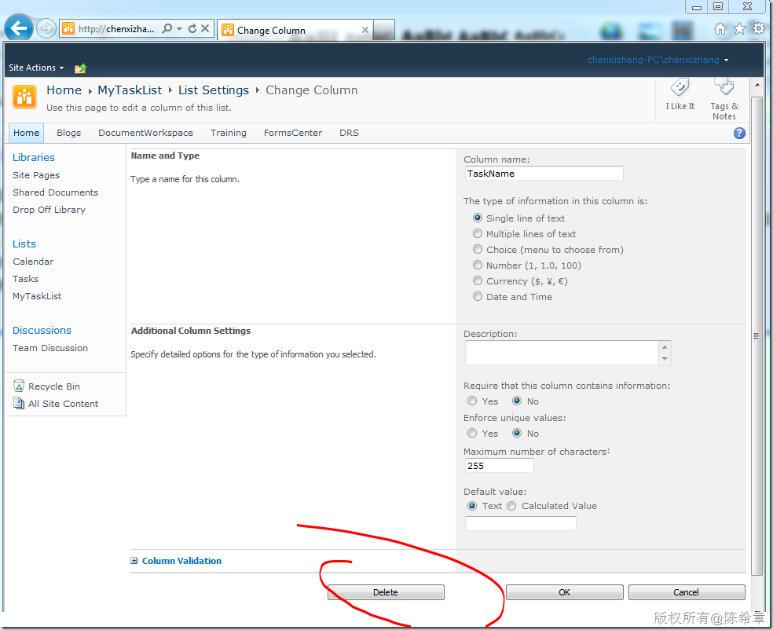
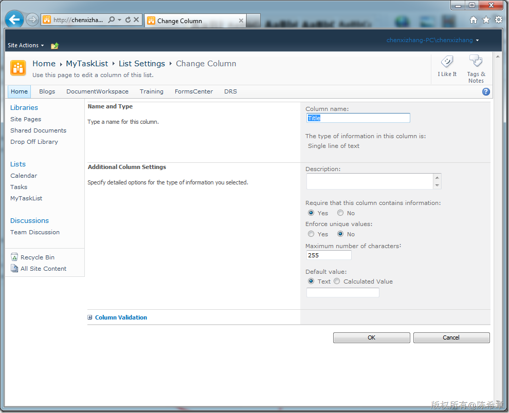
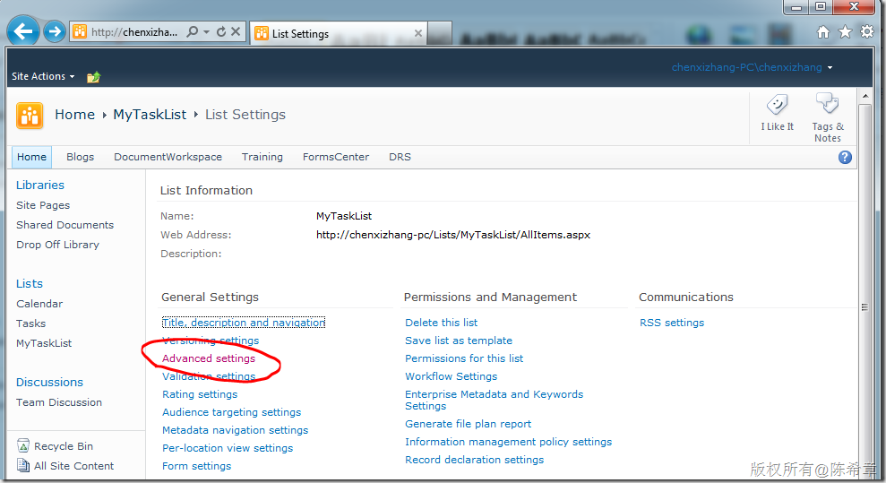
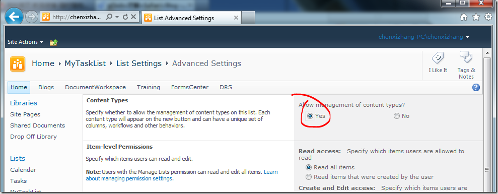
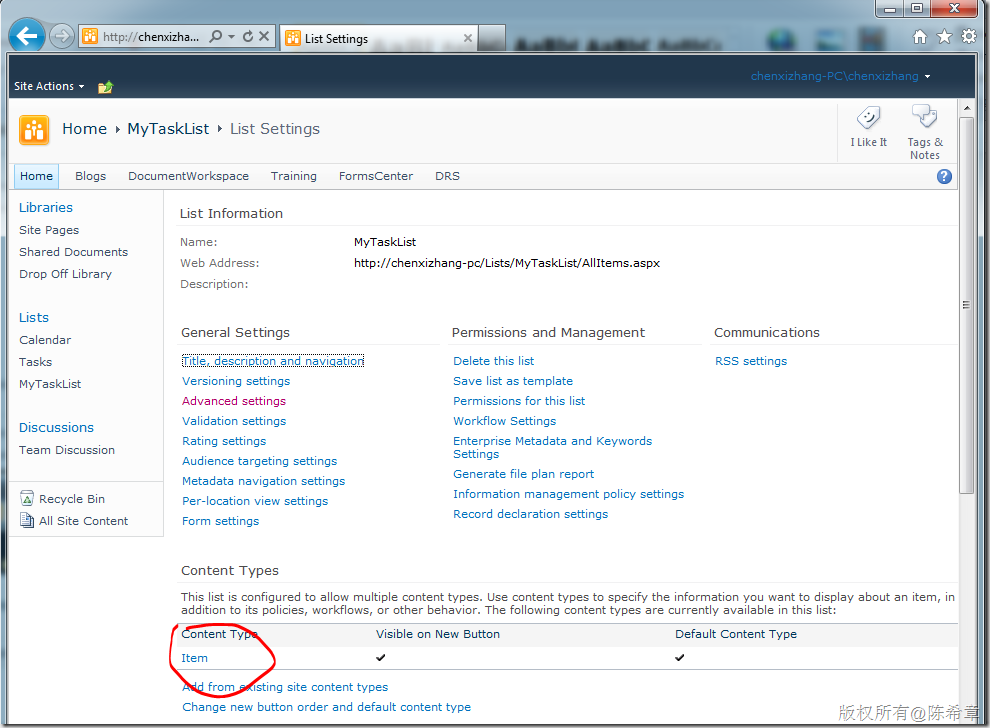
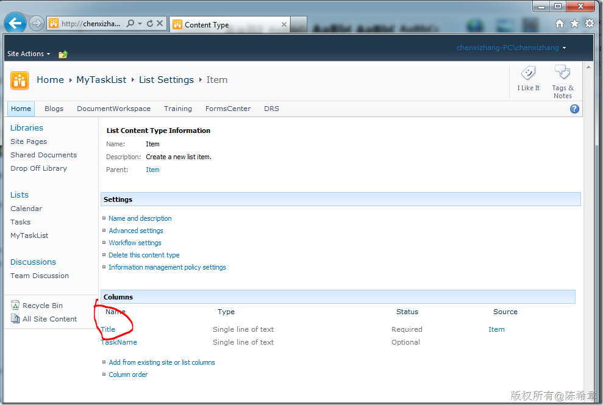
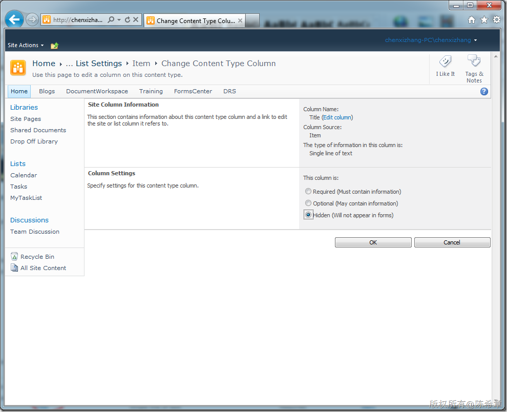
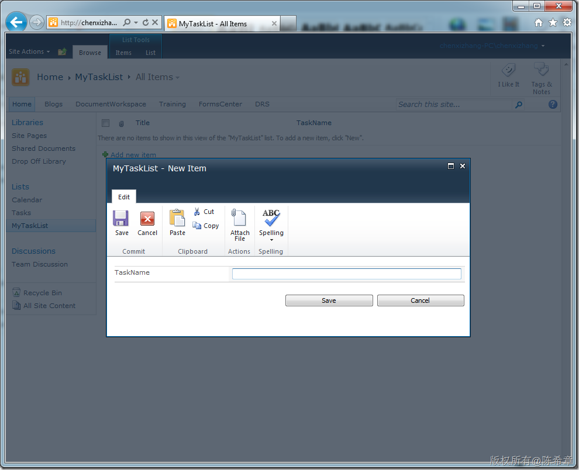

# 如何“删除”SharePoint列表的Title字段 
> 原文发表于 2011-11-06, 地址: http://www.cnblogs.com/chenxizhang/archive/2011/11/06/2238419.html 

近日网友来信问到，如何删除掉SharePoint列表的Title字段。这其实是一个经常被问到的问题，我今天给出的解决方案给大家参考一下

 首先，其实我们是无法删除这个字段的，有的朋友可能不理解，但如果你做过SharePoint的开发，那么就很好理解，因为在SPList这个对象上面，有一个Title属性，这个属性就是指向了Title字段。假如我们真的把Title字段删除掉，那么在访问SPList的时候就可能会有问题。

 我们可以简单来看一下就明白了

 1. 对于普通字段，在编辑页面中，是有删除按钮的

 

 2. 而对于Title字段，是没有删除按钮的

 

  

 那么，假设我们的列表，真的不需要这样一个字段，或者觉得Title这样的字段名不是我们希望的。那么有什么办法让用户不要看到它吗？

 下面是一个做法，给大家参考

 1. 启用列表的内容类型管理功能

 

 

  

 2. 在内容类型的高级设置里面，将Title设置为隐藏

 

 

 

  

 3.查看效果

 经过如上设置之后，在新建Item的时候，就不会再看到Title字段了，看起来就像删除了一样。

 

