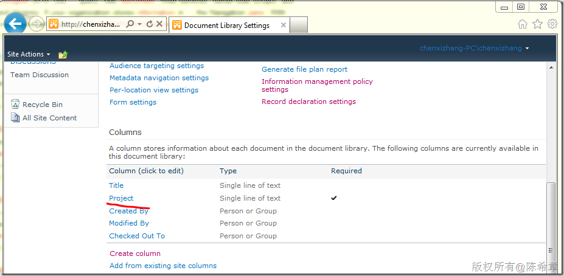
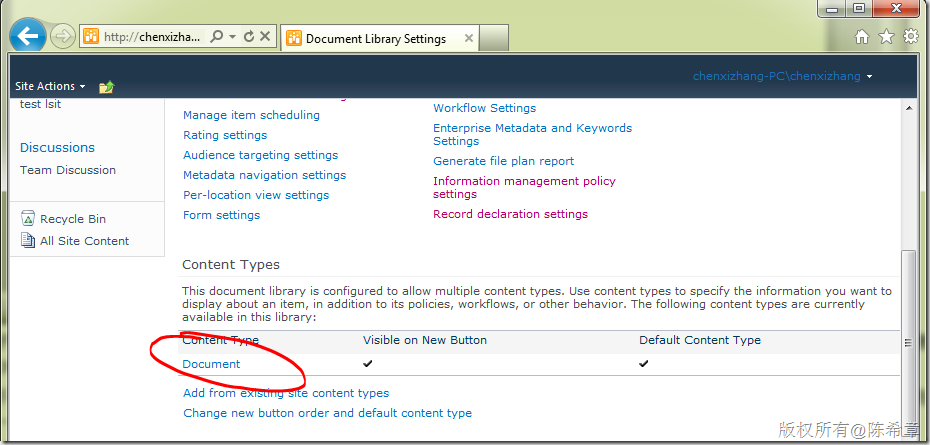
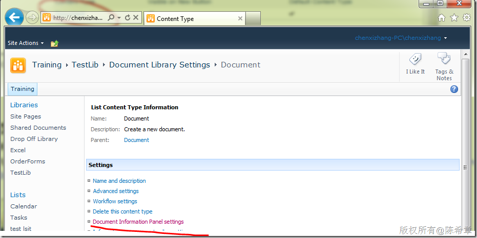
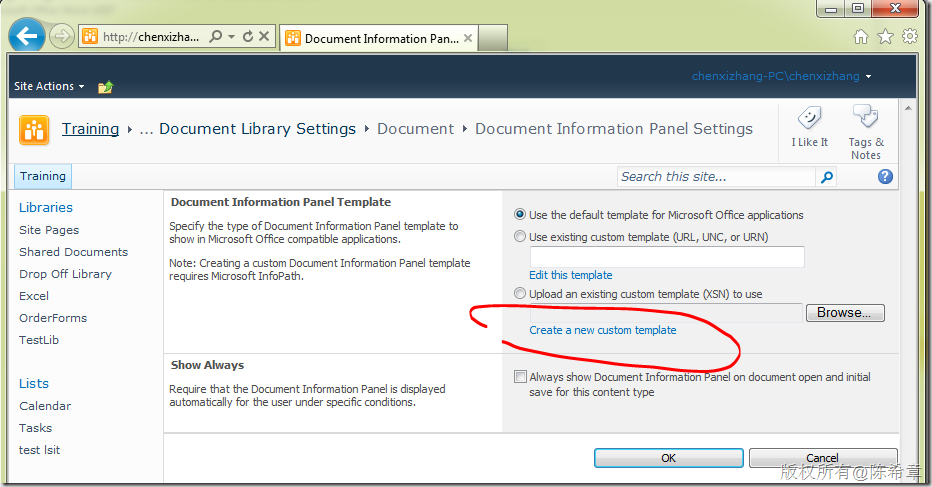
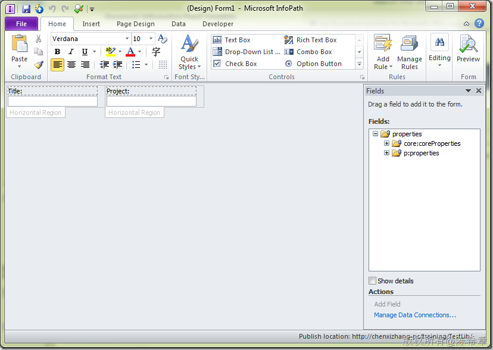
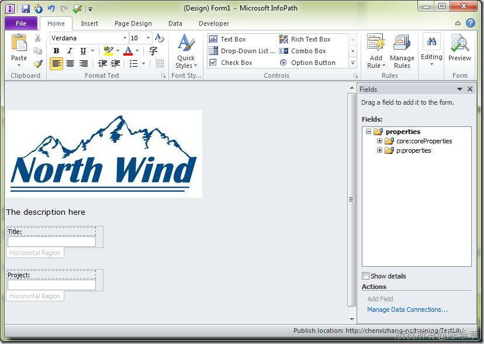
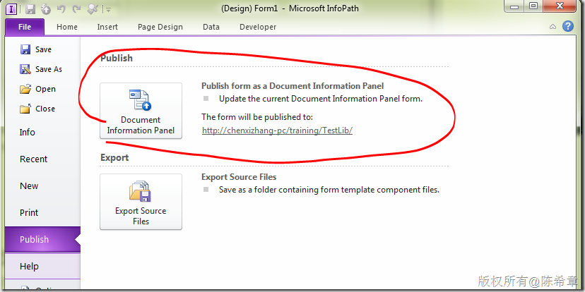
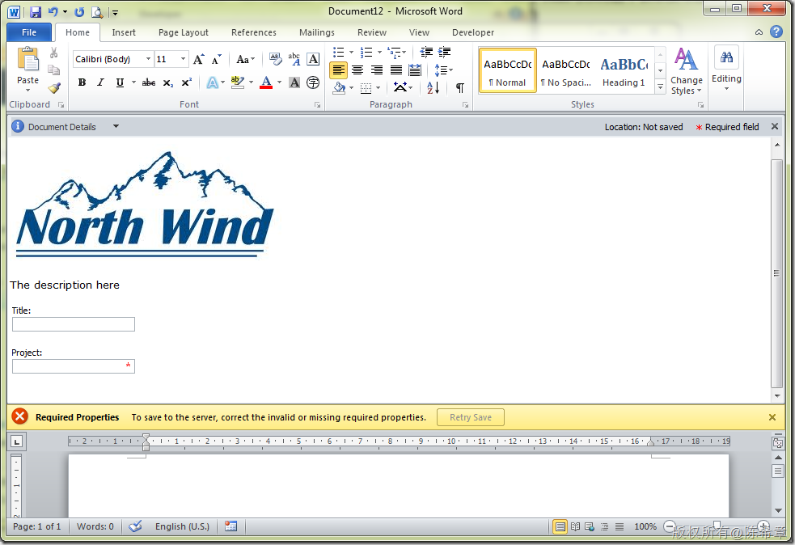

# 定制SharePoint文档信息面板 
> 原文发表于 2011-11-10, 地址: http://www.cnblogs.com/chenxizhang/archive/2011/11/10/2244985.html 

这也是课堂中的例子，分享给更多朋友参考学习吧

 概述
==

 作为SharePoint内容管理功能的一个具体表现，文档信息面板（Document Information Panel)的功能，使得我们在使用文档并且将其用于工作流程的时候，可以添加一些与业务相关的数据。

 文档信息面板，是SharePoint服务器结合Office 客户端软件共同实现的一个功能。

  

 默认的文档信息面板
=========

 只要在文档库中，添加至少一个自定义字段，然后通过Office客户端软件（例如Word)为该文档库添加新的文档的时候，就会自动显示出文档信息面板。

 下面的例子中，我有一个文档库，除了默认的字段之后，我添加了一个特殊的字段，“Project”，而且该字段我设置为了“Required”

 

 然后，我在Word中，就可以看到一个所谓的Document Properties-Server的特殊区域。这就是我们所谓的“文档信息面板”

 

 从这个例子可以看出，如果我们希望用户在上传文档的时候，提供一些额外的信息，那么有这样的一个信息面板，将是比较直观和方便的。当然，前提是，这是Office文档。

 默认情况下，并不需要特殊的设置，这个面板会根据文档库中的列的信息，自动生成出来。但如果我们希望这个面板更加漂亮，或者有自己特别的布局，则可以进一步定制。

 例如，我希望在这个面板上面添加更多的描述信息，以及公司的Logo。下面是一个例子

 转到文档库的设置页面，定位到“内容类型(Content Types）”这个节

 

 点击“Document”这个Content Type

 

 点击“Document Information Panel settings”

 

 点击“Create a new custom template”，此时会启动Infopath这个应用程序。前提是你已经安装。我们可以看到，它确实默认就显示了两个字段，是水平排列的

 

 我们完全可以对这个模板进行修改，添加我们需要的其他任何东西，例如

 

 作为演示目的，我添加一个图片，并且让两个字段进行竖排，而不是横排。然后，我还添加了一个说明。然后，我就可以将这个表单发布出来

 

  

 保存起来之后，以后添加文档，我们看到的信息面板就像下面这样

 

  

  

 总结：
===

 文档信息面板提供了一个特别的方式，让用户可以填写文档之外的一些信息，这些信息将被收集到服务器，并且将可以用于流程或者统计分析。

 文档信息面板本质上是一个Infopath表单，它提供了一个默认的视图，但还支持定制。

