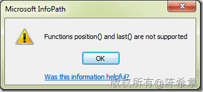

# 如何为Infopath重复表添加自动递增的行号 
> 原文发表于 2011-11-16, 地址: http://www.cnblogs.com/chenxizhang/archive/2011/11/16/2251527.html 

这是今天在讲表单设计和工作流时候的一个小问题，之前在Infopath 2007中很容易实现，因为有一个函数：position，可以自动获取当前行的编号。

 但是这个函数在Infopath 2010中已经删除了，尝试使用该函数会遇到如下的错误提示

 

 找了下资料，后来是这样解决的，使用下面的表达式

 count(../preceding-sibling::*[local-name() = "YourRepeatingGroupName"])+1 请注意，将红色字体的部分，替换为你的重复组的名称

 例如我的例子是：

 count(../preceding-sibling::*[local-name() = "订单明细"])+1  

 这里其实关键是xpath的语法，sibling是指找同级的元素，preceding是找之前的，所以preceding-silbing，就是找当前元素的所有之前的兄弟元素，理解这个，对这个表达式就能理解了

