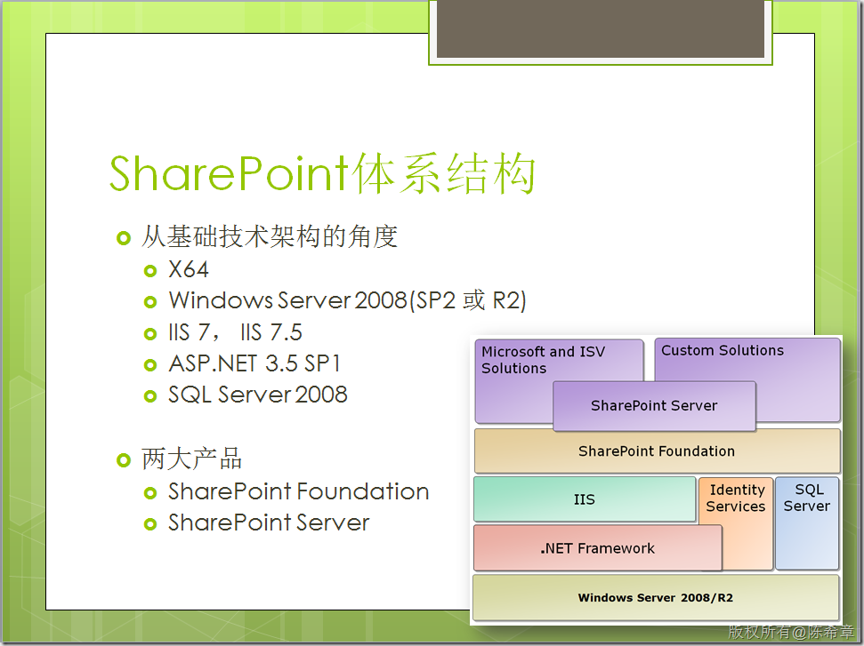
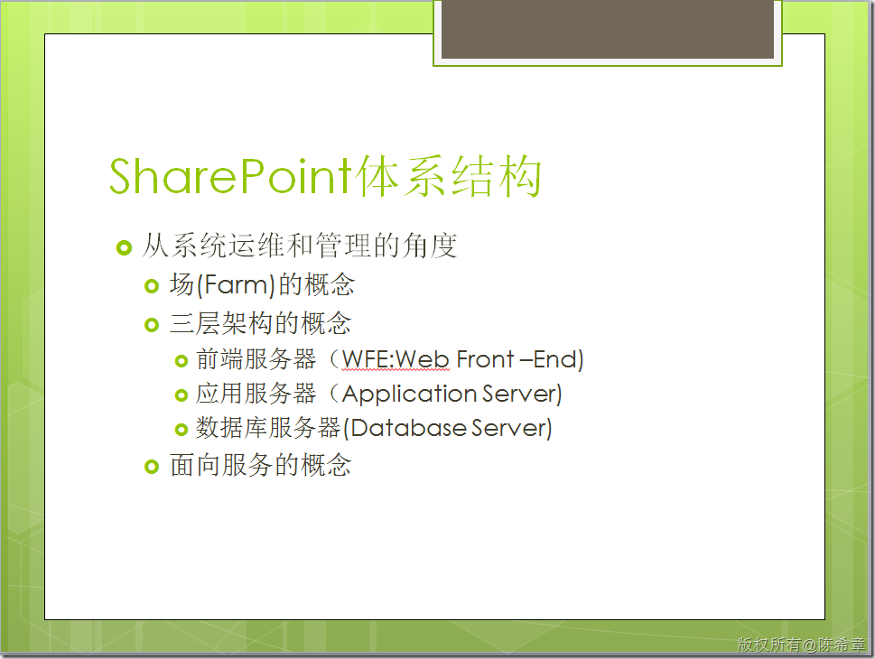
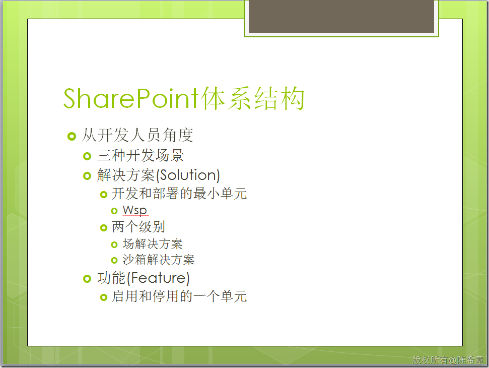
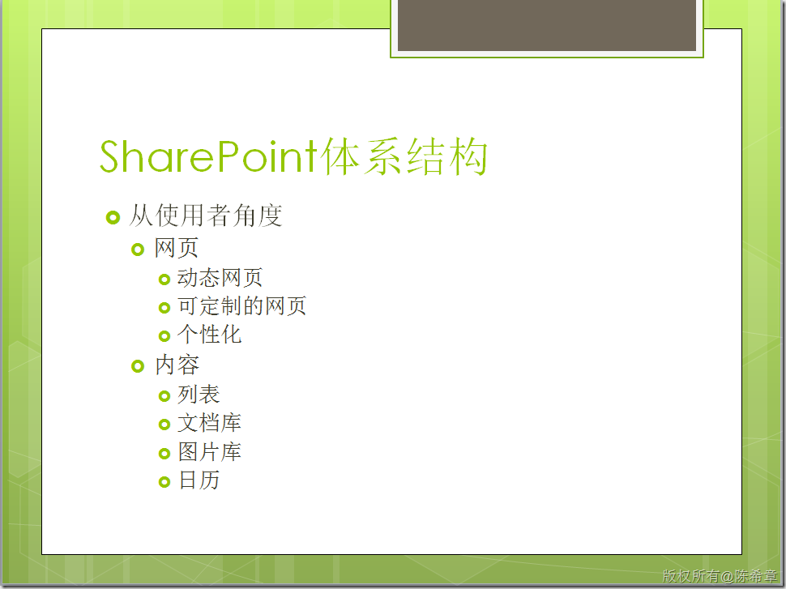
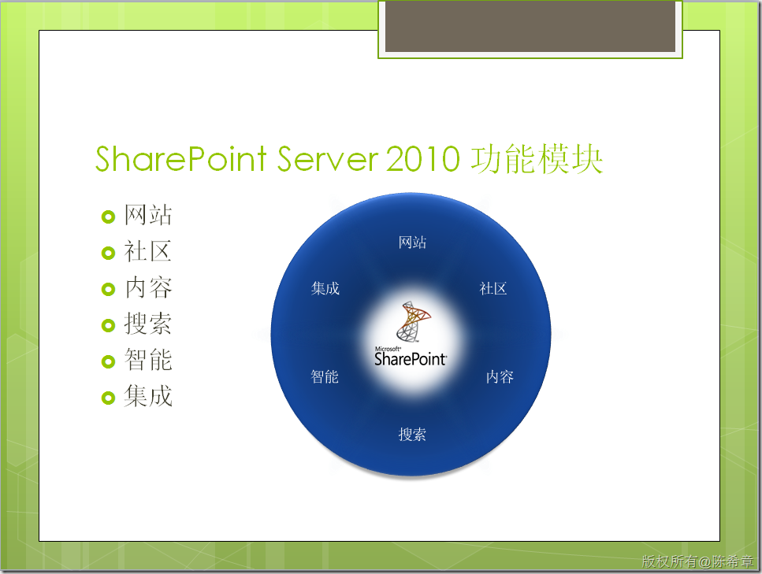
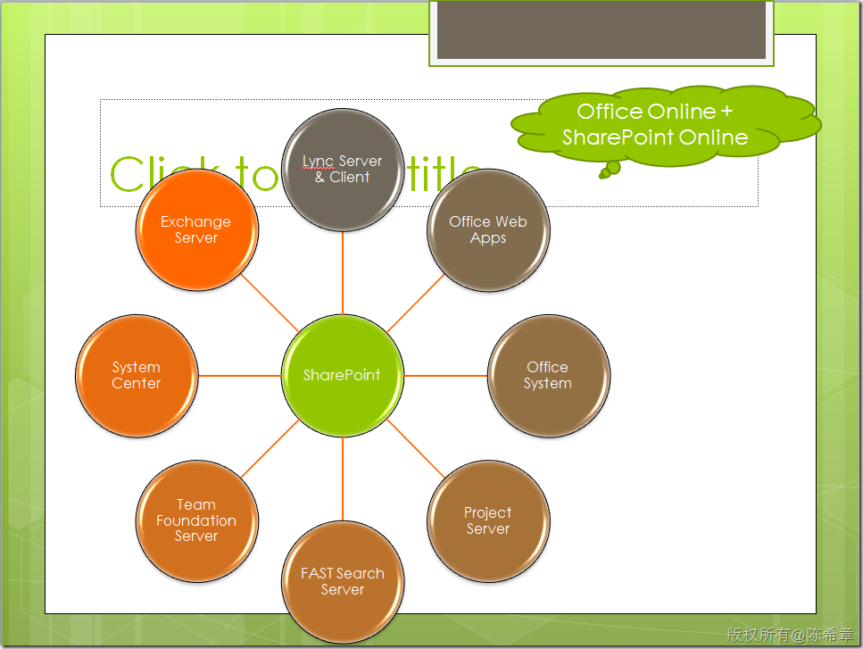

# 我们该用怎么样的系统思维来了解SharePoint及其价值 
> 原文发表于 2011-11-20, 地址: http://www.cnblogs.com/chenxizhang/archive/2011/11/20/2256344.html 

名词解释
====

 SharePoint，这里泛指微软的SharePoint Service , SharePoint Foundation, SharePoint Server ，这是微软针对互联互通，协作分享所推出的一系列技术、产品、解决方案。目前最新的版本是2010，分为两个产品：SharePoint Foundation 2010(免费), SharePoint Server 2010(收费）

 SharePoint 的官方主页在

 [http://sharepoint.microsoft.com/zh-cn/Pages/default.aspx](http://sharepoint.microsoft.com/zh-cn/Pages/default.aspx "http://sharepoint.microsoft.com/zh-cn/Pages/default.aspx")

  

 引子
==

 很多事情，是需要花了时间了解了，才可能会有更加恰当的评估。这句话用在很多地方都是适用的，例如用在SharePoint这个产品上面。我因为工作关系，接触到不少客户，也花了相当多的时间，在帮助这些客户了解，评估和实施SharePoint。你知道，有时候，这个过程并不太轻松，当然此间也有不少体会。我今天整理一些资料分享出来，我的中心思想（也是我跟很多客户的决策层强调最多的）是：**我们需要的是一个系统的思维，要有大局观**。

  

 一.用一句话概括SharePoint的核心价值
=======================

 我总结的最扼要的一句话就是：SharePoint是关于分享和协作的一个idea—— **Share is point**。作为一套服务和软件，它拥有一段不算短的历史了，但如果真的对其变迁加以了解，你会发现其内在的那个主题一直没有变。

 稍作展开，以SharePoint 2010为例，可以这样定义SharePoint：**它是一个可用户企业内部，也可以用于外部的信息协作平台**。

  

 二.用系统思维理解SharePoint
===================

 我一般会从四个角度来看SharePoint,并且谈论到SharePoint 的6大功能，以及它与其他外部系统的集成。

  

 首先，要看的是**基础技术架构**，这是为了能让**CTO(技术总监)**评估技术平台的成熟度和可靠性，和其他基础架构产品之间的关系，后期可持续扩展的能力，评估总体拥有成本（TCO)等等方面的问题

   
 然后,我会展开到**运维和管理**的层面,这主要是与**IT运维部门**讨论理解SharePoint的部署模型，三层架构，服务架构，负载均衡方面的可能性等等话题    第三个角度是，从**开发人员角度**，我会谈到开发模型、三种不同的开发方式，选择合适的开发策略是相当重要的  最后我还会谈谈，从**使用者角度**，SharePoint意味着什么。例如网页和内容的概念，页面个性化，列表和文档及其它功能的使用等等。   

 上面是四个看到SharePoint的视角，然后，大家还可以从功能性上面更好地理解，参照下图

 

  

 另外，SharePoint可以与其他很多产品相结合，例如

 

  

 上面的截图来自我的一个讲义，我稍做了整理，如果有需要的，可以通过下面地址下载

 [用系统思维理解SharePoint2010.pdf](http://files.cnblogs.com/chenxizhang/%E7%94%A8%E7%B3%BB%E7%BB%9F%E6%80%9D%E7%BB%B4%E7%90%86%E8%A7%A3SharePoint2010.pdf "用系统思维理解SharePoint2010.pdf")

  

 三.企业在引入SharePoint时的一些建议
=======================

 一般会强调和重点讨论如下几点

 1. 引入SharePoint是一个系统工程，不是简单地安装了软件就完事了，这不是IT一个部门的事情，要提升到信息化的高度。
2. SharePoint与Lotus的可比性不大。我对Lotus具体的功能以及近些年的发展不是很了解，但我知道的是，SharePoint从2007版本开始，受到了越来越多客户和用户的认可。
3. 必须要有专职并且是专业的SharePoint管理员，小型企业，可以设1人。中大型企业，还需要设置多人。
4. 使用习惯会有些要改变，使用了SharePoint，大致上的习惯应该是以SharePoint为中心去收集和发布信息，这与传统的使用客户端软件或者专用业务系统的方式可能有些小的不同。
5. 定制开发要适度评估，在了解现有功能的前提下，如果确实需要，才开发。
6. 与外界应用系统的集成应该尽可能都通过BCS（Business Connectivity Service)+SSS(Secure Store Service) 的服务架构来实现
7. 工作流方面的支持，SharePoint默认会有些模板，2010中已经有很大改进了。但对于复杂工作流或者工作流系统而言，这方面还有改进空间。但我觉得部门级别的工作流，默认的模板（或者配合SharePoint Designer加以一些设计）就能满足要求。
8. 目前在移动设备方面的支持还略显简单。
9. 权限这一块，粒度可能不是特别细。我知道很多企业也确实有些特殊的权限控制的策略，这里要评估一个度的问题。因为SharePoint本质上是为了共享和协作的。

 四.个人学习SharePoint的一些问题
=====================

 除了上面讨论到的话题，我其实平常也经常收到一些个人网友的咨询，主要有如下的问题

 1. **学习SharePoint是否有前途？**老实说，这个问题，就好比以前也经常有朋友问我说“学.NET是否有前途”一样，大家可以省略问了，因为我的答案基本上都是：有。这绝不是敷衍，其实潜台词是，不管什么技术，只要在恰当的时候，你掌握了，并且将其学以致用，就有前途。
2. **感觉要学的东西很多，不知道如何下手，该怎么办**？这倒是一个实际的问题，很多人都有这样的感觉。我觉得，如果你所在的公司也比较重视，你最好的方式是，找到就近的、专业的培训机构进行系统地学习，微软还有这方面的认证考试（[http://www.microsoft.com/learning/en/us/certification/cert-sharepoint-server.aspx#tab1](http://www.microsoft.com/learning/en/us/certification/cert-sharepoint-server.aspx#tab1 "http://www.microsoft.com/learning/en/us/certification/cert-sharepoint-server.aspx#tab1")），你可以通过考试来检验你的知识。当然，自我学习也是完全可以的，你可以自己买些书（国外，国内的书都有），然后微软也提供了一些官方的培训学习材料，例如（[http://blogs.technet.com/b/ldusolier/archive/2011/10/18/sharepoint-training-kits.aspx](http://blogs.technet.com/b/ldusolier/archive/2011/10/18/sharepoint-training-kits.aspx "http://blogs.technet.com/b/ldusolier/archive/2011/10/18/sharepoint-training-kits.aspx")）

  

 总结
==

 这一篇文章，我希望从系统的高度，帮助大家更好地理解SharePoint。我提供了一些素材，也针对企业和个人的一些相关顾虑和问题，做了一些展开。希望能给企业的决策层、管理和开发人员、用户，或者仅仅是SharePoint爱好者一个参考。

