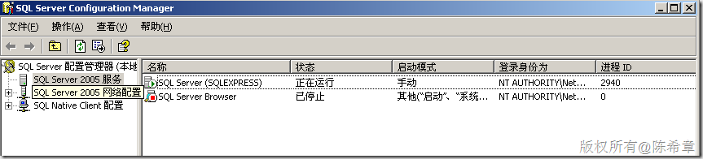
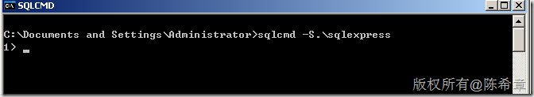
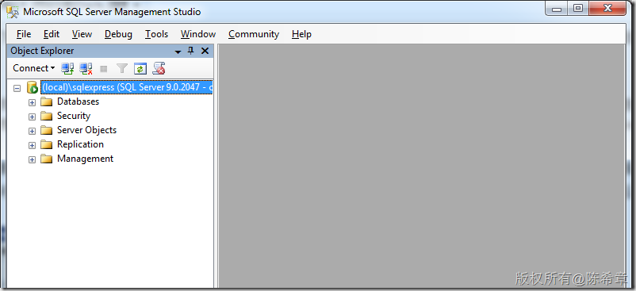
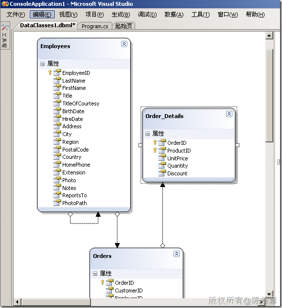
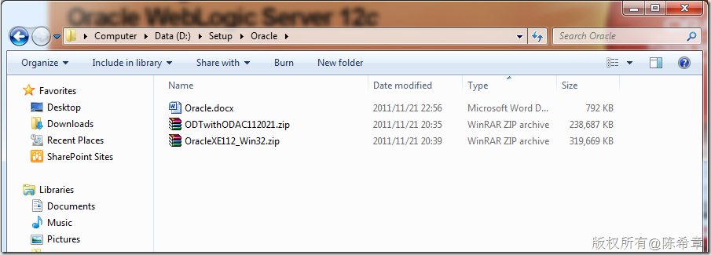
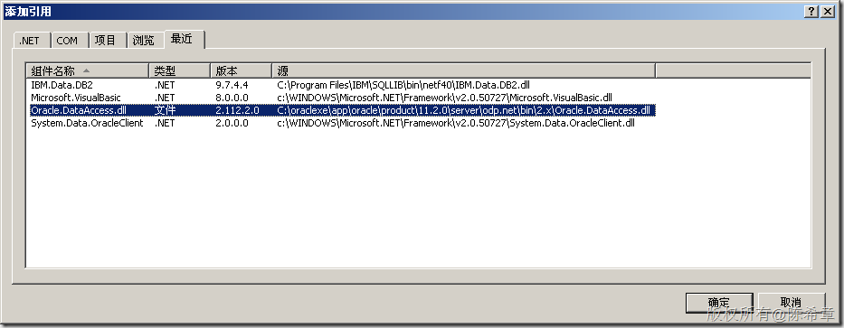
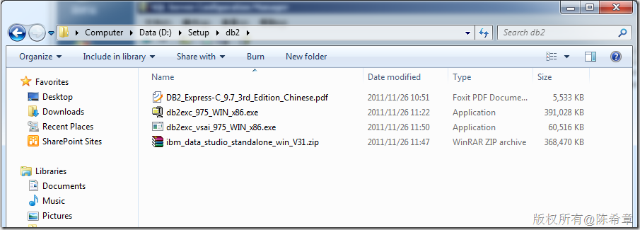
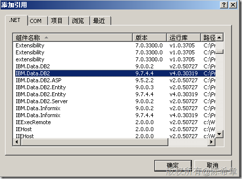

# SQL Server、Oracle、db2所提供的简装版(Express)比较 
> 原文发表于 2011-11-26, 地址: http://www.cnblogs.com/chenxizhang/archive/2011/11/26/2264558.html 


引子
==

 近日，给一个客户做一个定制内容的培训，他们目前用的开发环境是Visual Studio 2008，主要做的是Windows Forms开发，后台数据库之前用的是Oracle，现在用的是db2。所以我特别整了一个虚拟机，安装了这些需要的软件，并且也借此机会，对SQL Server，Oracle和db2所提供的简装版(Express Editio)做一个简要的比较，这篇文章是为记录

 前言
==

 目前数据库领域，三大厂商就是微软，Oracle和IBM，他们的拳头产品分别就是SQL Server，Oracle，db2。这种三足鼎立的局面，已经存在了一段时间，而且还将继续存在下去。这三个产品，我个人认为本质上的差异性并不大，用户在选择的时候，主要根据自己公司的平台基础架构和使用习惯，以及知识储备的情况决定。

 SQL Server Express
==================

 由于工作背景的关系，我主要是使用SQL Server，所以先从它说起吧。

 最早SQL Server 2000就提供了所谓的MSDE(Desktop Engine)，目的就是提供一个免费可以分发的小型数据库引擎，方便开发和部署。后来在SQL Server 2005中正式改名为SQL Server Express，这个名称沿用到了SQL Server 2008以及R2这个版本.

 SQL Server Express是免费的，它可以用于小型业务系统，或者一些实验性的开发场景。它有一个容量限制，就是数据库不能超过4GB。

 SQL Server Express可以[单独下载](http://www.microsoft.com/downloads/zh-cn/details.aspx?familyid=220549B5-0B07-4448-8848-DCC397514B41&displaylang=zh-cn)安装，也可以通过安装Visual Studio 的时候，勾选这个组件实现自动安装。一般安装好之后，会有两个服务组件，如下图所示

 [](http://images.cnblogs.com/cnblogs_com/chenxizhang/201111/201111261921063807.png)

 SQL Sever Express没有自带管理工具，一般可以通过命令行（sqlcmd)来实现一些管理

 [](http://images.cnblogs.com/cnblogs_com/chenxizhang/201111/201111261921085245.png)

 需要注意的是，这里的服务器名称要写.\sqlexpress，在SQL Server中，这表示的是一个命名实例的意思。

 如果不习惯用命令行，则还可以单独下载[SQL Server Express Management Studio](http://www.microsoft.com/downloads/zh-cn/details.aspx?FamilyID=C243A5AE-4BD1-4E3D-94B8-5A0F62BF7796)，这也是免费的

 [](http://images.cnblogs.com/cnblogs_com/chenxizhang/201111/201111261921105570.png)

 SQL Server与Visual Studio有天然的关系，在Visual Studio中可以很容易建立SQL Server 服务器连接，并且进行诸如创建数据库，表，视图，修改数据，新建查询等所有有关操作。即便你没有安装上面所提到的Management Studio，其实你需要做的事情都可以通过Visual Studio来完成

 [](http://images.cnblogs.com/cnblogs_com/chenxizhang/201111/201111261921131195.png)

 要访问SQL Server数据库的数据，是相当方便的。.NET Framework内置提供了System.Data.SqlClient的命名空间，可以很方便地完成数据库的访问。


```
using System;
using System.Collections.Generic;
using System.Linq;
using System.Text;
using System.Data.SqlClient;


namespace Sample
{
    class Program
    {
        static void Main(string[] args)
        {

            var conn = new SqlConnection("Database=Northwind;data source=(local)\\sqlexpress;integrated security=true");
            var cmd = conn.CreateCommand();
            cmd.CommandText = "SELECT * FROM Employees";
            conn.Open();

            var reader = cmd.ExecuteReader();
            while (reader.Read())
            {
                Console.WriteLine(reader[0].ToString());
            }

        }
    }
}

```


.csharpcode, .csharpcode pre
{
 font-size: small;
 color: black;
 font-family: consolas, "Courier New", courier, monospace;
 background-color: #ffffff;
 /*white-space: pre;*/
}
.csharpcode pre { margin: 0em; }
.csharpcode .rem { color: #008000; }
.csharpcode .kwrd { color: #0000ff; }
.csharpcode .str { color: #006080; }
.csharpcode .op { color: #0000c0; }
.csharpcode .preproc { color: #cc6633; }
.csharpcode .asp { background-color: #ffff00; }
.csharpcode .html { color: #800000; }
.csharpcode .attr { color: #ff0000; }
.csharpcode .alt 
{
 background-color: #f4f4f4;
 width: 100%;
 margin: 0em;
}
.csharpcode .lnum { color: #606060; }


同时，SQL Server Express还完全支持LINQ to SQL以及ADO.NET Entity Framework


[](http://images.cnblogs.com/cnblogs_com/chenxizhang/201111/201111261921159535.png)


 


Oracle Express
==============


接下来我们来看一下Oracle Express的情况,目前Oracle提供的最新版本是11g Express，可以通过下面的地址下载


[http://www.oracle.com/technetwork/database/express-edition/downloads/index.html](http://www.oracle.com/technetwork/database/express-edition/downloads/index.html "http://www.oracle.com/technetwork/database/express-edition/downloads/index.html")


我下载了两个安装程序，如下图


[](http://images.cnblogs.com/cnblogs_com/chenxizhang/201111/201111261921173731.png)


OracleXE112\_WIN32.zip是数据库主程序安装文件


ODTWithODAC112021.zip是所谓的开发工具包，也就是给Visual Studio配套的一些程序集和脚本等


安装好之后，大致有如下的几个服务


[](http://images.cnblogs.com/cnblogs_com/chenxizhang/201111/201111261921209040.png)


如果安装了ODT，就可以很方便地在Visual Studio中连接到Oracle数据库，进行操作


[](http://images.cnblogs.com/cnblogs_com/chenxizhang/201111/201111261921225254.png)


要通过编程访问Oracle数据库，也很简单，只要预先添加一个引用


[](http://images.cnblogs.com/cnblogs_com/chenxizhang/201111/201111261921243627.png)


需要注意的是，这个Assembly并没有安装在GAC，所以你可能需要通过“浏览”这个选项卡，直接找到它，而不是在".NET"这个选项卡里面去找。


具体的访问代码其实很类似，例如


```
using System;
using System.Collections.Generic;
using System.Linq;
using System.Text;
using Oracle.DataAccess.Client;


namespace Sample
{
    class Program
    {
        static void Main(string[] args)
        {

            var conn = new OracleConnection("data source=localhost;user id=ares;password=password");
            var cmd = conn.CreateCommand();
            cmd.CommandText = "SELECT * FROM SYS.Employees";
            conn.Open();

            var reader = cmd.ExecuteReader();
            while (reader.Read())
            {
                Console.WriteLine(reader[0].ToString());
            }

        }
    }
}

```

.csharpcode, .csharpcode pre
{
 font-size: small;
 color: black;
 font-family: consolas, "Courier New", courier, monospace;
 background-color: #ffffff;
 /*white-space: pre;*/
}
.csharpcode pre { margin: 0em; }
.csharpcode .rem { color: #008000; }
.csharpcode .kwrd { color: #0000ff; }
.csharpcode .str { color: #006080; }
.csharpcode .op { color: #0000c0; }
.csharpcode .preproc { color: #cc6633; }
.csharpcode .asp { background-color: #ffff00; }
.csharpcode .html { color: #800000; }
.csharpcode .attr { color: #ff0000; }
.csharpcode .alt 
{
 background-color: #f4f4f4;
 width: 100%;
 margin: 0em;
}
.csharpcode .lnum { color: #606060; }

 


 


IBM db2 Express-C
=================


IBM目前所提供的db2 Express 的名称叫Express-C, 版本号为9.7.4，可以通过下面的地址下载到


[http://www.ibm.com/developerworks/cn/downloads/im/udbexp/](http://www.ibm.com/developerworks/cn/downloads/im/udbexp/ "http://www.ibm.com/developerworks/cn/downloads/im/udbexp/")


我下载了几个组件，如下图所示


[](http://images.cnblogs.com/cnblogs_com/chenxizhang/201111/201111261921262283.png)


db2exec\_975\_win\_x86.exe是db2 express-C的安装程序


db2exec\_vsai\_975\_win\_x86.exe是给visual studio的一个插件


ibm\_data\_studio\_standalone\_win\_v31.zip是db2 express的一个管理工具


安装完之后，我大致看了一下有关的服务，有如下几个


[](http://images.cnblogs.com/cnblogs_com/chenxizhang/201111/201111261921285640.png)


在Visual Studio中，同样也可以方便地进行连接，和管理。这得益于Visual Studio所提供的良好的扩展机制


[](http://images.cnblogs.com/cnblogs_com/chenxizhang/201111/201111261921301854.png)


如果安装了那个管理工具，则有如下的画面


[](http://images.cnblogs.com/cnblogs_com/chenxizhang/201111/201111261921339638.png)


如果需要编程访问DB2 Express-C，则可以添加如下的引用


[](http://images.cnblogs.com/cnblogs_com/chenxizhang/201111/201111261921363452.png)


并且使用诸如下面这样的代码访问即可


```
using System;
using System.Collections.Generic;
using System.Linq;
using System.Text;
using IBM.Data.DB2;

namespace Sample
{
    class Program
    {
        static void Main(string[] args)
        {
            //创建数据库连接
            var conn = new DB2Connection("Database=SAMPLE;User ID=administrator;Server=localhost;password=password01!");
            //创建命令
            var cmd = conn.CreateCommand();
            cmd.CommandText = "SELECT * FROM Employee";
            //打开连接
            conn.Open();
            //读取数据
            var reader = cmd.ExecuteReader();
            while (reader.Read())
            {
                Console.WriteLine(reader[0].ToString());
            }
            //关闭连接
            conn.Close();

        }
    }
}

```

.csharpcode, .csharpcode pre
{
 font-size: small;
 color: black;
 font-family: consolas, "Courier New", courier, monospace;
 background-color: #ffffff;
 /*white-space: pre;*/
}
.csharpcode pre { margin: 0em; }
.csharpcode .rem { color: #008000; }
.csharpcode .kwrd { color: #0000ff; }
.csharpcode .str { color: #006080; }
.csharpcode .op { color: #0000c0; }
.csharpcode .preproc { color: #cc6633; }
.csharpcode .asp { background-color: #ffff00; }
.csharpcode .html { color: #800000; }
.csharpcode .attr { color: #ff0000; }
.csharpcode .alt 
{
 background-color: #f4f4f4;
 width: 100%;
 margin: 0em;
}
.csharpcode .lnum { color: #606060; }

我们会发现，这与之前的SQL Server Express和Oracle中访问数据库的方式，何其相似。


 


总结
==


从上面的例子和截图可以看出来，这三个产品，在我们作为开发人员具体来使用的时候，其实差别很小的。这也是一个好的框架所带来的优势。.NET支持灵活的数据访问框架，由此，我们可以专注于业务本身，而不需要为不同的数据源编写不同的代码。事实上，完全可以做到，一份代码复用于不同的数据源。而作为一个Express的产品，他们从能力上，没有本质上的差别。


 


针对他们的一些小的区别，我整理一个表格如下

[](http://images.cnblogs.com/cnblogs_com/chenxizhang/201111/20111126192139614.png)