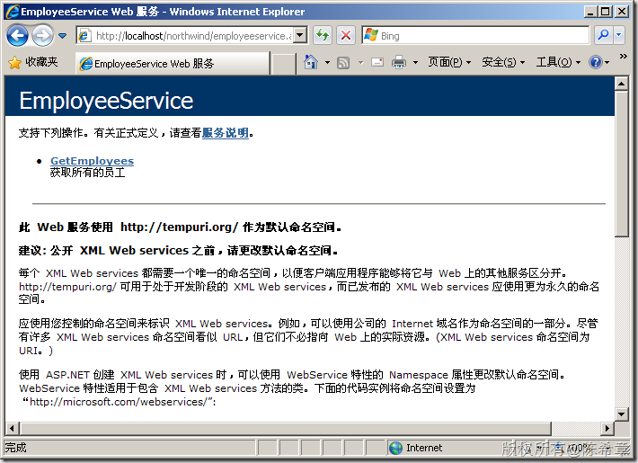

# 如何解决在Windows XP下的IIS 5.1经常出现编号为500的服务器错误 
> 原文发表于 2011-12-06, 地址: http://www.cnblogs.com/chenxizhang/archive/2011/12/06/2278457.html 

传说中，这是一个常见的问题。我自己多年前用Windows XP的时候，倒也没有怎么遇到过。今天因为在讲一个课程的时候，用到了Windows XP作为虚拟机系统，在进行一个Web 服务部署的时候，居然这么走运就遇到了这个问题，课堂上时间紧，一下子也没有排除这个问题。回来后稍微研究了一下，整理出来，给有需要的朋友也参考一下

 找问题的解决方案时，我参考了以下这个文章 [http://www.coogg.com/article.asp?id=494](http://www.coogg.com/article.asp?id=494 "http://www.coogg.com/article.asp?id=494")

 我自己总结下来两个步骤

 1.确认如下几个服务，都是设置为自动启动的，并且处于启动状态

 * COM+ Event System
* COM+ System Application
* Distributed Transaction Coordinator（DTC)

 为什么要开这几个服务呢？其实如果熟悉IIS的朋友一定知道，IIS5这个版本，其实是通过COM+实现的一个应用程序，所以自然是依赖COM+服务的，然后IIS可以参与分布式事务协调，所以需要开启DTC服务。

  

 2. 通过如下的命令对IIS 进行注册。我没有想明白为什么这个还需要手工来注册，可能是今天我们在安装IIS的介质有什么问题，或者说安装的时候，上述几个服务没有开起来导致的？（如果是这样，那也实在有点让人费解）。现在已经无从查证了，总之，这样做了就可以解决问题。

 cd c:\WINDOWS\system32\inetsrv

 rundll32 wamreg.dll, CreateIISPackage 

 regsvr32 asptxn.dll   

  

 经过上面两个步骤，终于可以如愿打开网站了。下面只是一个测试的例子。

 

  

 好长时间不用Windows XP了，也确实有点生疏了。这次是为了方便，做了一个虚拟机，里面安装了所需要的开发环境，采用XP的好处是占用内存稍小一点。

