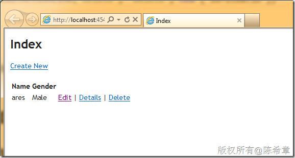
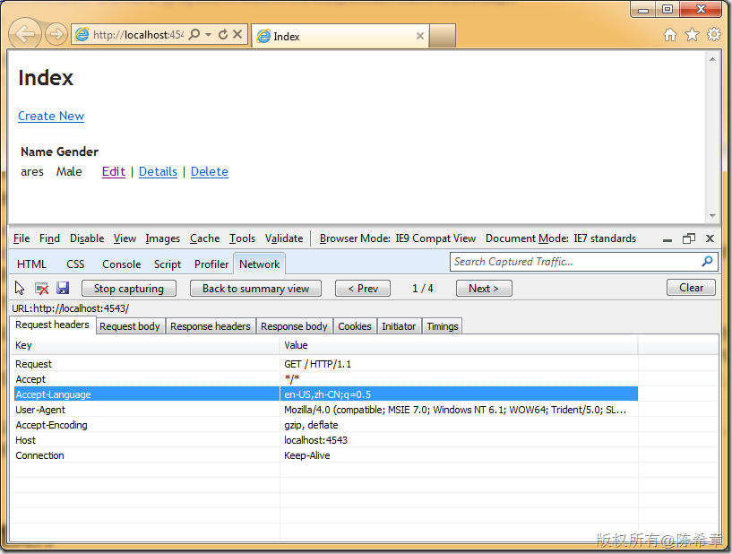
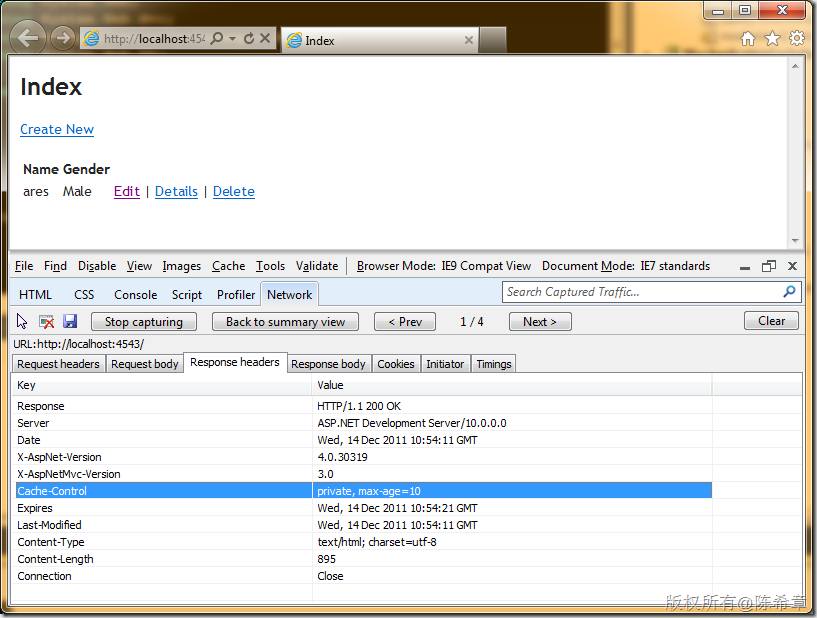
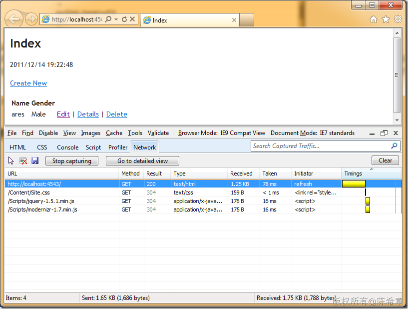
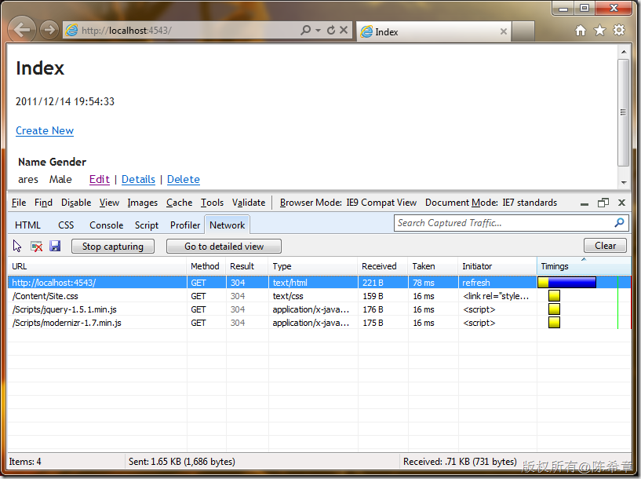

# 谈谈MVC项目中的缓存功能设计的相关问题 
> 原文发表于 2011-12-14, 地址: http://www.cnblogs.com/chenxizhang/archive/2011/12/14/2288062.html 


今天这一篇文章我来谈一谈在MVC 3项目中的缓存功能，以及针对缓存的一些设计上的考量，给大家参考参考

 前言
==

 为什么需要讨论缓存？缓存是一个中大型系统所必须考虑的问题。为了避免每次请求都去访问后台的资源（例如数据库），我们一般会考虑将一些更新不是很频繁的，可以重用的数据，通过一定的方式临时地保存起来，后续的请求根据情况可以直接访问这些保存起来的数据。这种机制就是所谓的缓存机制。

 根据缓存的位置不同，可以区分为：

 1. 客户端缓存（缓存在用户的客户端，例如浏览器中）
2. 服务器缓存（缓存在服务器中，可以缓存在内存中，也可以缓存在文件里，并且还可以进一步地区分为本地缓存和分布式缓存两种）

 应该说，缓存的设计是一门较为复杂的学问，主要考虑的问题包括

 1. 要不要缓存？
2. 要缓存哪些数据？
3. 要缓存多少数据？
4. 要缓存多久？
5. 如何更新缓存（手动还是自动）
6. 将缓存放在哪里？

 本文将以较为通俗易懂的方式，来看一看在MVC3的项目中，如何使用缓存功能。对于上述提到的一些具体业务问题，我这里不会进行太过深入地探讨。

  

 MVC3中的缓存功能
==========

 ASP.NET MVC3 继承了ASP.NET的优良传统，内置提供了缓存功能支持。主要表现为如下几个方面

 * 可以直接在Controller，Action或者ChildAction上面定义输出缓存（这个做法相当于原先的页面缓存和控件缓存功能）
* 支持通过CacheProfile的方式，灵活定义缓存的设置（新功能）
* 支持缓存依赖，以便当外部资源发生变化时得到通知，并且更新缓存
* 支持使用缓存API，还支持一些第三方的缓存方案（例如分布式缓存）

 那么，下面我们就逐一来了解一下吧

 0.范例准备
======

 我准备了一个空白的MVC 3项目，里面创建好了一个Model类型：Employee


```
using System;
using System.Collections.Generic;
using System.Linq;
using System.Web;

namespace MvcApplicationCacheSample.Models
{
    public class Employee
    {
        public int ID { get; set; }
        public string Name { get; set; }
        public string Gender { get; set; }
    }
}
```


.csharpcode, .csharpcode pre
{
 font-size: small;
 color: black;
 font-family: consolas, "Courier New", courier, monospace;
 background-color: #ffffff;
 /*white-space: pre;*/
}
.csharpcode pre { margin: 0em; }
.csharpcode .rem { color: #008000; }
.csharpcode .kwrd { color: #0000ff; }
.csharpcode .str { color: #006080; }
.csharpcode .op { color: #0000c0; }
.csharpcode .preproc { color: #cc6633; }
.csharpcode .asp { background-color: #ffff00; }
.csharpcode .html { color: #800000; }
.csharpcode .attr { color: #ff0000; }
.csharpcode .alt 
{
 background-color: #f4f4f4;
 width: 100%;
 margin: 0em;
}
.csharpcode .lnum { color: #606060; }


然后，我还准备了一个HomeController


```
using System;
using System.Collections.Generic;
using System.Linq;
using System.Web;
using System.Web.Mvc;
using MvcApplicationCacheSample.Models;

namespace MvcApplicationCacheSample.Controllers
{
    public class HomeController : Controller
    {
        //
        // GET: /Home/
        public ActionResult Index()
        {
            //这里目前作为演示，是直接硬编码，实际上可能是读取数据库的数据
            var employees = new[]{
                new Employee(){ID=1,Name="ares",Gender="Male"}
            };
            return View(employees);
        }

    }
}

```

.csharpcode, .csharpcode pre
{
 font-size: small;
 color: black;
 font-family: consolas, "Courier New", courier, monospace;
 background-color: #ffffff;
 /*white-space: pre;*/
}
.csharpcode pre { margin: 0em; }
.csharpcode .rem { color: #008000; }
.csharpcode .kwrd { color: #0000ff; }
.csharpcode .str { color: #006080; }
.csharpcode .op { color: #0000c0; }
.csharpcode .preproc { color: #cc6633; }
.csharpcode .asp { background-color: #ffff00; }
.csharpcode .html { color: #800000; }
.csharpcode .attr { color: #ff0000; }
.csharpcode .alt 
{
 background-color: #f4f4f4;
 width: 100%;
 margin: 0em;
}
.csharpcode .lnum { color: #606060; }

同时，为这个Action生成了一个View


```
@model IEnumerable<MvcApplicationCacheSample.Models.Employee>

@{
    ViewBag.Title = "Index";
}

<h2>Index</h2>

<p>
    @Html.ActionLink("Create New", "Create")
</p>
<table>
    <tr>
        <th>
            Name
        </th>
        <th>
            Gender
        </th>
        <th></th>
    </tr>

@foreach (var item in Model) {
    <tr>
        <td>
            @Html.DisplayFor(modelItem => item.Name)
        </td>
        <td>
            @Html.DisplayFor(modelItem => item.Gender)
        </td>
        <td>
            @Html.ActionLink("Edit", "Edit", new { id=item.ID }) |
            @Html.ActionLink("Details", "Details", new { id=item.ID }) |
            @Html.ActionLink("Delete", "Delete", new { id=item.ID })
        </td>
    </tr>
}

</table>

```


.csharpcode, .csharpcode pre
{
 font-size: small;
 color: black;
 font-family: consolas, "Courier New", courier, monospace;
 background-color: #ffffff;
 /*white-space: pre;*/
}
.csharpcode pre { margin: 0em; }
.csharpcode .rem { color: #008000; }
.csharpcode .kwrd { color: #0000ff; }
.csharpcode .str { color: #006080; }
.csharpcode .op { color: #0000c0; }
.csharpcode .preproc { color: #cc6633; }
.csharpcode .asp { background-color: #ffff00; }
.csharpcode .html { color: #800000; }
.csharpcode .attr { color: #ff0000; }
.csharpcode .alt 
{
 background-color: #f4f4f4;
 width: 100%;
 margin: 0em;
}
.csharpcode .lnum { color: #606060; }

所以，当前的应用程序运行起来看到的效果大致是下面这样的


[](http://images.cnblogs.com/cnblogs_com/chenxizhang/201112/201112142100599925.png)


这个例子很简单，没有太多需要解释的。


 


1.使用输出缓存
========


那么，现在我们假设这个读取员工的数据很频繁，但是数据又更新不是很频繁，我们就会想到，能不能对这部分数据进行缓存，以便减少每次执行的时间。


是的，我们可以这么做，而且也很容易做到这一点。MVC中内置了一个OutputCache的ActionFilter，我们可以将它应用在某个Action或者ChildAction上面


【备注】ChildAction是MVC3的一个新概念，本质上就是一个Action，但通常都是返回一个PartialView。通常这类Action，可以加上一个ChildActionOnly的ActionFilter以标识它只能作为Child被请求，而不能直接通过地址请求。


【备注】我们确实可以在Controller级别定义输出缓存，但我不建议这么做。缓存是要经过考虑的，而不是不管三七二十一就全部缓存起来。缓存不当所造成的问题可能比没有缓存还要大。


 


下面的代码启用了Index这个Action的缓存功能，我们让他缓存10秒钟。


```
using System;
using System.Collections.Generic;
using System.Linq;
using System.Web;
using System.Web.Mvc;
using MvcApplicationCacheSample.Models;

namespace MvcApplicationCacheSample.Controllers
{
    public class HomeController : Controller
    {
        //
        // GET: /Home/
  **[OutputCache(Duration=10)]**
        public ActionResult Index()
        {
            //这里目前作为演示，是直接硬编码，实际上可能是读取数据库的数据
            var employees = new[]{
                new Employee(){ID=1,Name="ares",Gender="Male"}
            };
            return View(employees);
        }

    }
}

```

.csharpcode, .csharpcode pre
{
 font-size: small;
 color: black;
 font-family: consolas, "Courier New", courier, monospace;
 background-color: #ffffff;
 /*white-space: pre;*/
}
.csharpcode pre { margin: 0em; }
.csharpcode .rem { color: #008000; }
.csharpcode .kwrd { color: #0000ff; }
.csharpcode .str { color: #006080; }
.csharpcode .op { color: #0000c0; }
.csharpcode .preproc { color: #cc6633; }
.csharpcode .asp { background-color: #ffff00; }
.csharpcode .html { color: #800000; }
.csharpcode .attr { color: #ff0000; }
.csharpcode .alt 
{
 background-color: #f4f4f4;
 width: 100%;
 margin: 0em;
}
.csharpcode .lnum { color: #606060; }

 


那么，也就是说，第一次请求这个Index的时候，里面的代码会执行，并且结果会被缓存起来，然后在10秒钟内，第二个或者后续的请求，就不需要再次执行，而是直接将结果返回给用户即可。


这个OutputCache的Attribute，实际上是一个ActionFilter，它有很多参数，具体的请参考


[http://msdn.microsoft.com/zh-cn/library/system.web.mvc.outputcacheattribute.aspx](http://msdn.microsoft.com/zh-cn/library/system.web.mvc.outputcacheattribute.aspx "http://msdn.microsoft.com/zh-cn/library/system.web.mvc.outputcacheattribute.aspx")


这些参数中，Duration是必须的，这是设置一个过期时间，以秒为单位，这个我想大家都很好理解。我重点要一下下面几个


* VaryByContentEncoding  
VaryByCustom  
VaryByHeader  
VaryByParam


这四个参数的意思是，决定缓存中如何区分不同请求，就是说，哪些因素将决定使用还是不使用缓存。默认情况下，如果不做任何设置，那么在规定的时间内（我们称为缓存期间），所有用户，不管用什么方式来访问，都是直接读取缓存。


VaryByParam，可以根据用户请求的参数来决定是否读取缓存。这个参数主要指的就是QueryString。例如


> 
> 如果我们缓存了<http://localhost/Home/Index>，那么用这个地址来访问的时候，规定时间内都是读取缓存。但如果用<http://localhost/Home/Index?name=chenxizhang>这样的地址过来访问，显然我们希望不要读取缓存，因为参数不一样了。要实现这样的需求，也就是说，希望根据name参数的不同缓存不同的数据。则可以设置VaryByParam=”name”。
> 
> 
> 如果有多个参数的话，可以用逗号分开他们。例如 VaryByParam=”name,Id”
> 
> 


    【备注】这里其实会有一个潜在的风险，由于针对不同的参数（以及他们的组合）需要缓存不同的数据版本，假设有一个恶意的程序，分别用不同的参数发起大量的请求，那么就会导致缓存爆炸的情况，极端情况下，会导致服务器出现问题。（当然，IIS里面，如果发现缓存的内容不够用了，会自动将一些数据清理掉，但这就同样导致了程序的不稳定性，因为某些正常需要用的缓存可能会被销毁掉）。这也就是我为什么强调说，缓存设计是一个比较复杂的事情。


VaryByHeader，可以根据用户请求中所提供的一些Header信息不同而决定是否读取缓存。我们可以看到在每个请求中都会包含一些Header信息，如下图所示


[](http://images.cnblogs.com/cnblogs_com/chenxizhang/201112/201112142100593022.png)


这个也很有用，例如根据不同的语言，我们显然是有不同的版本的。或者根据用户浏览器不同，也可以缓存不同的版本。可以通过这样设置


VaryByHeader=”Accept-Language,User-Agent”


上面两个是比较常用的。当然还有另外两个属性也可以设置


VaryByContentEncoding，一般设置为Accept-Encoding里面可能的Encoding名称，从上图也可以看出，Request里面是包含这个标头的。


VaryByCustom，则是一个完全可以定制的设置，例如我们可能需要根据用户角色来决定不同的缓存版本，或者根据浏览器的一些小版本号来区分不同的缓存版本，我们可以这样设置：VaryByCustom=”Role,BrowserVersion”,这些名称是你自己定义的，光这样写当然是没有用的，我们还需要在Global.asax文件中，添加一个特殊的方法，来针对这种特殊的需求进行处理。


```
using System;
using System.Collections.Generic;
using System.Linq;
using System.Web;
using System.Web.Mvc;
using System.Web.Routing;
**using System.Web.Security;**

namespace MvcApplicationCacheSample
{
    // Note: For instructions on enabling IIS6 or IIS7 classic mode, 
    // visit http://go.microsoft.com/?LinkId=9394801

    public class MvcApplication : System.Web.HttpApplication
    {
        public static void RegisterGlobalFilters(GlobalFilterCollection filters)
        {
            filters.Add(new HandleErrorAttribute());
        }

        public static void RegisterRoutes(RouteCollection routes)
        {
            routes.IgnoreRoute("{resource}.axd/{*pathInfo}");

            routes.MapRoute(
                "Default", // Route name
                "{controller}/{action}/{id}", // URL with parameters
                new { controller = "Home", action = "Index", id = UrlParameter.Optional } // Parameter defaults
            );

        }

        protected void Application\_Start()
        {
            AreaRegistration.RegisterAllAreas();

            RegisterGlobalFilters(GlobalFilters.Filters);
            RegisterRoutes(RouteTable.Routes);
        }

 **public override string GetVaryByCustomString(HttpContext context, string custom)
 {
 switch(custom)
 {
 case "Role":
 {
 return string.Join(",", Roles.GetRolesForUser());
 }
 case "BrowserVersion":
 {
 return context.Request.Browser.Type;
 }

 default:
 break;
 }

 return string.Empty;
 }**
    }
}
```

.csharpcode, .csharpcode pre
{
 font-size: small;
 color: black;
 font-family: consolas, "Courier New", courier, monospace;
 background-color: #ffffff;
 /*white-space: pre;*/
}
.csharpcode pre { margin: 0em; }
.csharpcode .rem { color: #008000; }
.csharpcode .kwrd { color: #0000ff; }
.csharpcode .str { color: #006080; }
.csharpcode .op { color: #0000c0; }
.csharpcode .preproc { color: #cc6633; }
.csharpcode .asp { background-color: #ffff00; }
.csharpcode .html { color: #800000; }
.csharpcode .attr { color: #ff0000; }
.csharpcode .alt 
{
 background-color: #f4f4f4;
 width: 100%;
 margin: 0em;
}
.csharpcode .lnum { color: #606060; }

 


上面四个属性，可以改变缓存使用的行为。另外还有一个重要属性将影响缓存保存的位置，这就是Location属性，这个属性有如下几个可选项，我从文档中摘录过来


| 成员名称 | 说明 |
| Any | 输出缓存可位于产生请求的浏览器客户端、参与请求的代理服务器（或任何其他服务器）或处理请求的服务器上。**（这是默认值）** |
| Client | 输出缓存位于产生请求的浏览器客户端上。 |
| Downstream | 输出缓存可存储在任何 HTTP 1.1 可缓存设备中，源服务器除外。这包括代理服务器和发出请求的客户端。 |
| Server | 输出缓存位于处理请求的 Web 服务器上。 |
| None | 对于请求的页，禁用输出缓存。 |
| ServerAndClient | 输出缓存只能存储在源服务器或发出请求的客户端中。代理服务器不能缓存响应。 |


这里要思考一个问题，设置为Client与设置为Server有哪些行为上面的不同


如果设置为Client，那么第一次请求的时候，得到的响应标头里面，会记录好这个页面应该是要缓存的，并且在10秒之后到期。如下图所示


[](http://images.cnblogs.com/cnblogs_com/chenxizhang/201112/201112142101008072.png)


而如果设置为Server的话，则会看到客户端是没有缓存的。


[](http://images.cnblogs.com/cnblogs_com/chenxizhang/201112/201112142101001726.png)


看起来不错，不是吗？如果你不加思索地就表示同意，我要告诉你，你错了。所以，不要着急就下结论，请再试一下设置为Client的情况，你会发现，如果你刷新页面，那么仍然会发出请求，而且Result也是返回200，这表示这是一个新的请求，确实也返回了结果。这显然是跟我们预期不一样的。


为了做测试，我特意加了一个时间输出，如果仅仅设置为Client的话，每次刷新这个时间都是不一样的。这说明，服务器端代码被执行了。


[](http://images.cnblogs.com/cnblogs_com/chenxizhang/201112/201112142101015139.png)


同样的问题也出现在，如果我们将Location设置为ServerAndClient的时候，其实你会发现Client的缓存好像并没有生效，每次都仍然是请求服务器，只不过这一种情况下，服务器端已经做了缓存，所以在规定时间内，服务器代码是不会执行的，所以结果也不会变。但是问题在于，既然设置了客户端缓存，那么理应就直接使用客户端的缓存版本，不应该去请求服务器才对。


这个问题，其实属于是ASP.NET本身的一个问题，这里有一篇文章介绍 [http://blog.miniasp.com/post/2010/03/30/OutputCacheLocation-ServerAndClient-problem-fixed.aspx](http://blog.miniasp.com/post/2010/03/30/OutputCacheLocation-ServerAndClient-problem-fixed.aspx "http://blog.miniasp.com/post/2010/03/30/OutputCacheLocation-ServerAndClient-problem-fixed.aspx")


我们可以看一下，将Location设置为ServerAndClient， 对代码稍作修改


```
using System;
using System.Collections.Generic;
using System.Linq;
using System.Web;
using System.Web.Mvc;
using MvcApplicationCacheSample.Models;
using System.Web.UI;

namespace MvcApplicationCacheSample.Controllers
{
    public class HomeController : Controller
    {
        //
        // GET: /Home/
        [OutputCache(Duration=10,Location=OutputCacheLocation.ServerAndClient)]
        public ActionResult Index()
        {

            **Response.Cache.SetOmitVaryStar(true);**
            ViewBag.CurrentTime = DateTime.Now.ToString();


            //这里目前作为演示，是直接硬编码，实际上可能是读取数据库的数据
            var employees = new[]{
                new Employee(){ID=1,Name="ares",Gender="Male"}
            };
            return View(employees);
        }

    }
}

```

.csharpcode, .csharpcode pre
{
 font-size: small;
 color: black;
 font-family: consolas, "Courier New", courier, monospace;
 background-color: #ffffff;
 /*white-space: pre;*/
}
.csharpcode pre { margin: 0em; }
.csharpcode .rem { color: #008000; }
.csharpcode .kwrd { color: #0000ff; }
.csharpcode .str { color: #006080; }
.csharpcode .op { color: #0000c0; }
.csharpcode .preproc { color: #cc6633; }
.csharpcode .asp { background-color: #ffff00; }
.csharpcode .html { color: #800000; }
.csharpcode .attr { color: #ff0000; }
.csharpcode .alt 
{
 background-color: #f4f4f4;
 width: 100%;
 margin: 0em;
}
.csharpcode .lnum { color: #606060; }

[](http://images.cnblogs.com/cnblogs_com/chenxizhang/201112/201112142101012381.png)


我们看到，从第二次请求开始，状态码是304，这表示该页被缓存了，所以浏览器并不需要请求服务器的数据。而且你可以看到Received的字节为221B，而不是原先的1.25KB。


但是，**如果仅仅设置为Client，则仍然无法真正实现客户端缓存（这个行为是有点奇怪的）**。这个问题我确实也一直没有找到办法，如果我们确实需要使用客户端缓存，索性我们还是设置为ServerAndClient吧。


使用客户端缓存，可以明显减少对服务器发出的请求数，这从一定意义上更加理想。


 


2.使用缓存配置文件
==========


第一节中，我们详细地了解了MVC中，如何通过OutputCache这个ActionFilter来设置缓存。但是，因为这些设置都是通过C#代码直接定义在Action上面的，所以未免不是很灵活，例如我们可能需要经常调整这些设置，该如何办呢？


ASP.NET 4.0中提供了一个新的机制，就是CacheProfile的功能，我们可以在配置文件中，定义所谓的Profile，然后在OutputCache这个Attribute里面可以直接使用。


通过下面的例子，可以很容易看到这种机制的好处。下面的节点定义在system.web中


```

    <caching>
      <outputCacheSettings>
        <outputCacheProfiles>
          <add name="employee" duration="10" enabled="true" location="ServerAndClient" varyByParam="none"/>
        </outputCacheProfiles>
      </outputCacheSettings>
    </caching>
```

.csharpcode, .csharpcode pre
{
 font-size: small;
 color: black;
 font-family: consolas, "Courier New", courier, monospace;
 background-color: #ffffff;
 /*white-space: pre;*/
}
.csharpcode pre { margin: 0em; }
.csharpcode .rem { color: #008000; }
.csharpcode .kwrd { color: #0000ff; }
.csharpcode .str { color: #006080; }
.csharpcode .op { color: #0000c0; }
.csharpcode .preproc { color: #cc6633; }
.csharpcode .asp { background-color: #ffff00; }
.csharpcode .html { color: #800000; }
.csharpcode .attr { color: #ff0000; }
.csharpcode .alt 
{
 background-color: #f4f4f4;
 width: 100%;
 margin: 0em;
}
.csharpcode .lnum { color: #606060; }

 


然后，代码中可以直接地使用这个Profile了


```
using System;
using System.Collections.Generic;
using System.Linq;
using System.Web;
using System.Web.Mvc;
using MvcApplicationCacheSample.Models;
using System.Web.UI;

namespace MvcApplicationCacheSample.Controllers
{
    public class HomeController : Controller
    {
        //
        // GET: /Home/
        [OutputCache(CacheProfile="employee")]
        public ActionResult Index()
        {

            //Response.Cache.SetOmitVaryStar(true);

            ViewBag.CurrentTime = DateTime.Now.ToString();


            //这里目前作为演示，是直接硬编码，实际上可能是读取数据库的数据
            var employees = new[]{
                new Employee(){ID=1,Name="ares",Gender="Male"}
            };
            return View(employees);
        }

    }
}

```

这个例子很直观，有了Profile，我们可以很轻松地在运行时配置缓存的一些关键值。


```
 
```

.csharpcode, .csharpcode pre
{
 font-size: small;
 color: black;
 font-family: consolas, "Courier New", courier, monospace;
 background-color: #ffffff;
 /*white-space: pre;*/
}
.csharpcode pre { margin: 0em; }
.csharpcode .rem { color: #008000; }
.csharpcode .kwrd { color: #0000ff; }
.csharpcode .str { color: #006080; }
.csharpcode .op { color: #0000c0; }
.csharpcode .preproc { color: #cc6633; }
.csharpcode .asp { background-color: #ffff00; }
.csharpcode .html { color: #800000; }
.csharpcode .attr { color: #ff0000; }
.csharpcode .alt 
{
 background-color: #f4f4f4;
 width: 100%;
 margin: 0em;
}
.csharpcode .lnum { color: #606060; }

3.使用缓存API
=========


通过上面的两步，我们了解到了使用OutputCache，并且结合CacheProfile，可以很好地实现灵活的缓存配置。但是有的时候，我们可能还希望对缓存控制得更加精细一些。因为OutputCache是对Action的缓存，不同的Action之间是不能共享数据的，假如某些数据，我们是在不同的Action之间共享的，那么，简单地采用OutputCache来做，就会导致对同一份数据，缓存多次的问题。


所以，ASP.NET除了提供OutputCache这种基于声明的输出缓存设置之外，还允许我们在代码中，自己控制要对哪些数据进行缓存，并且提供了更多的选项。


关于如何通过API的方式添加或者使用缓存，请参考


[http://msdn.microsoft.com/zh-cn/library/18c1wd61%28v=VS.80%29.aspx](http://msdn.microsoft.com/zh-cn/library/18c1wd61%28v=VS.80%29.aspx "http://msdn.microsoft.com/zh-cn/library/18c1wd61%28v=VS.80%29.aspx")


基本上就是使用HttpContext.Cache类型，可以完成所有的操作，而且足够灵活。


 


值得一提的是，我知道不少公司在项目中都会采用一些ORM框架，某些ORM框架中也允许实现缓存。例如NHibernate就提供了较为丰富的缓存功能，大致可以参考一下 [http://www.cnblogs.com/RicCC/archive/2009/12/28/nhibernate-cache-internals.html](http://www.cnblogs.com/RicCC/archive/2009/12/28/nhibernate-cache-internals.html "http://www.cnblogs.com/RicCC/archive/2009/12/28/nhibernate-cache-internals.html")


 


需要注意的是，微软自己提供的Entity Framework本身并没有包含缓存的功能。


这里仍然要特别提醒一下，使用这种基于API的缓存方案，需要仔细推敲每一层缓存的设置是否合理，以及更新等问题。


 


4.使用缓存依赖
========


很早之前，在ASP.NET中设计缓存的时候，我们就可以使用缓存依赖的技术。关于缓存依赖，详细的信息请参考 [http://msdn.microsoft.com/zh-cn/library/ms178604.aspx](http://msdn.microsoft.com/zh-cn/library/ms178604.aspx "http://msdn.microsoft.com/zh-cn/library/ms178604.aspx")


实际上，这个技术确实很有用，ASP.NET默认提供了一个[SqlCacheDependency](http://msdn.microsoft.com/zh-cn/library/system.web.caching.sqlcachedependency.aspx)，可以通过配置，连接SQL Server数据库，当数据库的表发生变化的时候，会通知到ASP.NET，该缓存就会失效。


值得一提的是，不管是采用OutputCache这样的声明式的缓存方式，还是采用缓存API的方式，都可以使用到缓存依赖。而且使用缓存API的话，除了使用SqlCacheDependency之外，还可以使用标准的CacheDependency对象，实现对文件的依赖。


[http://msdn.microsoft.com/zh-cn/library/system.web.caching.cachedependency%28v=VS.80%29.aspx](http://msdn.microsoft.com/zh-cn/library/system.web.caching.cachedependency%28v=VS.80%29.aspx "http://msdn.microsoft.com/zh-cn/library/system.web.caching.cachedependency%28v=VS.80%29.aspx")


 


5.分布式缓存
=======


上面提到的手段都很不错，如果应用系统不是很庞大的话，也够用了。需要注意的是，上面所提到的缓存手段，都是在Web服务器本地内存中进行缓存，这种做法的问题在于，如果我们需要做负载均衡（一般就会有多台服务器）的时候，就不可能在多台服务器之间共享到这些缓存。正因为如此，分布式缓存的概念就应运而生了。


谈到分布式缓存，目前比较受到大家认可的一个开源框架是 memcached。顾名思义，它仍然使用的是内存的缓存，只不过，它天生就是基于分布式的，它的访问都是直接通过tcp的方式，所以可以访问远程服务器，也可以多台Web服务器访问同一台缓存服务器。


关于memcached以及它在.NET中的使用，之前有一个朋友有写过一个介绍，可以参考使用一下


[http://www.cnblogs.com/zjneter/archive/2007/07/19/822780.html](http://www.cnblogs.com/zjneter/archive/2007/07/19/822780.html "http://www.cnblogs.com/zjneter/archive/2007/07/19/822780.html")


 


需要注意的是，**分布式缓存不是为了来提高性能的（这可能是一个误区）**，并且可以肯定的是，它的速度一定会被本地慢一些。如果你的应用只有一台服务器就能满足要求，你就没有必要使用memcached。它的最大好处就是跨服务器，跨应用共享缓存。

