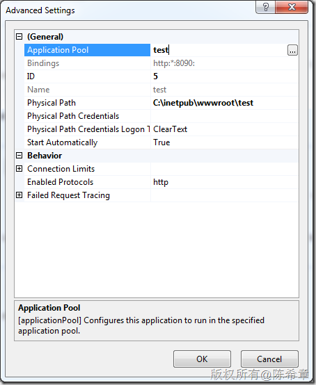
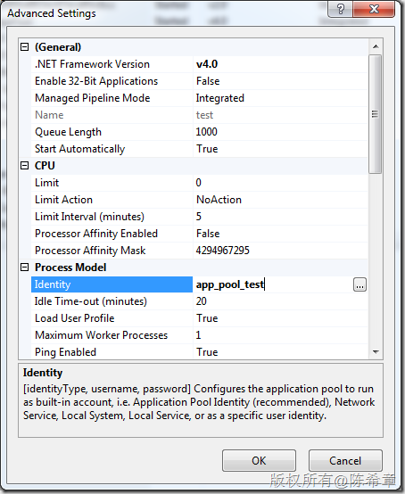
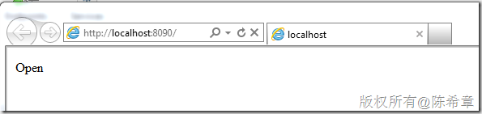
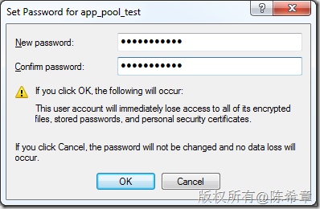
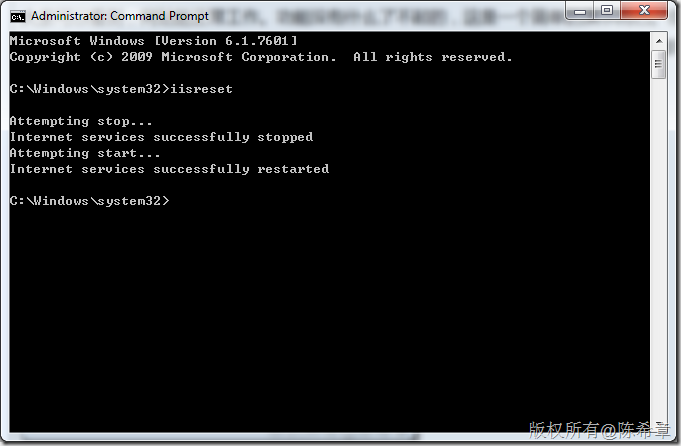
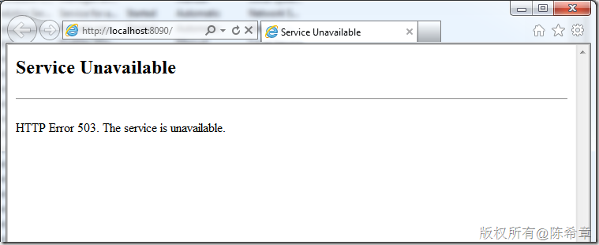
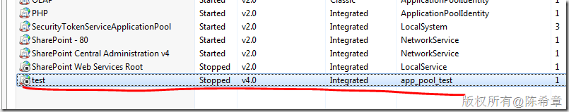
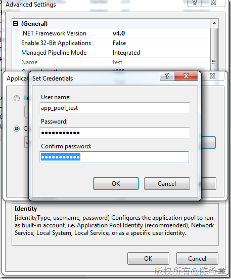

# 关于网站应用程序池的帐号密码更改及其影响的实例分析 
> 原文发表于 2011-12-20, 地址: http://www.cnblogs.com/chenxizhang/archive/2011/12/20/2295118.html 


这个标题看起来有点绕，但其实是一个常见的问题，而且很多朋友对此的理解都不深。我这里用一个例子来解释一下

 实例场景
====

 1. 我们有一个网站（名称为test),它使用了一个应用程序池(名称也为test)

 [](http://images.cnblogs.com/cnblogs_com/chenxizhang/201112/201112202030464929.png)

 1. 这个应用程序池所使用的用户帐号为app\_pool\_test

 [](http://images.cnblogs.com/cnblogs_com/chenxizhang/201112/201112202030507278.png)

 1. 这个帐号当前的密码,假设为 abc 。当我设置好之后，我可以正常打开网站

 [](http://images.cnblogs.com/cnblogs_com/chenxizhang/201112/201112202030559475.png)

 这个演示页面的功能很简单，我是使用下面的代码去访问了一下数据库


```
using System;
using System.Collections.Generic;
using System.Linq;
using System.Web;
using System.Web.UI;
using System.Web.UI.WebControls;
using System.Data.SqlClient;
namespace WebApplication1
{
    public partial class \_default : System.Web.UI.Page
    {
        protected void Page\_Load(object sender, EventArgs e)
        {
            using(var conn = new SqlConnection("server=(local)\\sqlexpress;database=northwind;integrated security=true"))
            {
                conn.Open();
                Response.Write(conn.State.ToString());
            }
        }
    }
}
```

.csharpcode, .csharpcode pre
{
 font-size: small;
 color: black;
 font-family: consolas, "Courier New", courier, monospace;
 background-color: #ffffff;
 /*white-space: pre;*/
}
.csharpcode pre { margin: 0em; }
.csharpcode .rem { color: #008000; }
.csharpcode .kwrd { color: #0000ff; }
.csharpcode .str { color: #006080; }
.csharpcode .op { color: #0000c0; }
.csharpcode .preproc { color: #cc6633; }
.csharpcode .asp { background-color: #ffff00; }
.csharpcode .html { color: #800000; }
.csharpcode .attr { color: #ff0000; }
.csharpcode .alt 
{
 background-color: #f4f4f4;
 width: 100%;
 margin: 0em;
}
.csharpcode .lnum { color: #606060; }

 


请注意，这里我并没有指定用户名和密码，而是使用了integrated security=true。这通常称为“信任连接”或者“集成验证”。这个问题，我下面还会解释。


 


大家可以看到，网站能正常工作。功能没有什么了不起的，这是一个简单的演示而已。但是下面大家思考一个问题：


假设app\_pool\_test 这个帐号的密码因为什么原因需要修改（这个很正常，很多公司都有密码修改策略的），那么


1.网站还是否能正常打开？


2.数据库还是否能访问？


 


我这里就做一个测试，我现在将帐号的密码修改掉


[](http://images.cnblogs.com/cnblogs_com/chenxizhang/201112/201112202030586675.png)


奇怪的是，我们会发现网站照样能打开，数据库居然也照样能访问得上。


[](http://images.cnblogs.com/cnblogs_com/chenxizhang/201112/201112202031006382.png)


首先，这里你应该会有一个疑问：这是为什么呢？难道改了密码没有生效吗？到底什么时候会生效呢？


我们接下去做实验。假使当前这个服务器，因为某种原因（例如安装补丁包），需要重新启动。或者你自己因为某个原因，需要对IIS进行重启，例如执行了下面的命令


[](http://images.cnblogs.com/cnblogs_com/chenxizhang/201112/201112202031038108.png)


然后，我们再次尝试打开刚才那个网页，就会发现如下的错误


[](http://images.cnblogs.com/cnblogs_com/chenxizhang/201112/201112202031067566.png)


一般而言，503错误都是表示后台的Application Pool存在问题，我们到IIS中查看，确实发现它被停止了


[](http://images.cnblogs.com/cnblogs_com/chenxizhang/201112/201112202031097830.png)


而且你还会发现，无论你如何启动，只要页面刷新一下，它就又停止了。


除非，你再次在它这里将正确的用户名和密码设置一次。


[](http://images.cnblogs.com/cnblogs_com/chenxizhang/201112/201112202031128227.png)


然后，你会发现网站能正常工作了


[](http://images.cnblogs.com/cnblogs_com/chenxizhang/201112/201112202031157934.png)


 


 


我希望你看懂了我想要描述的一个问题：**当网站的应用程序池帐号密码被修改之后，将如何影响到当前的网站。**


先将结论给大家说一下


1. 如果当前的网站，没有被重置。我测试下来是，只要IIS没有被重启过，或者应用程序池没有被停止过，就可以继续使用。


2. 否则，当前网站会无法正常工作，而且应用程序池再也无法启动，除非设置正确的密码。


 


那么，这是为什么呢？


1. IIS启动的时候，默认会启动所有的应用程序池，并且使用它们的标识和密码，去请求windows系统（可能是本机，也可能是AD)进行认证


2. 只要认证通过了，那么应用程序池将启动，而且这个身份会被缓存起来。


3. 一般的应用程序，要访问后台数据库的时候，如果选择了“集成验证(integrated security=true)”这种方式的话，那么就是使用应用程序池的这个身份。


4. “集成验证”有时候也称为信任连接，这是什么意思呢？就是说SQL Server其实不再对帐号和密码进行验证，它“信任”windows传递过来的身份，也就是说，只要上面的第2步通过了，确实帐号是app\_pool\_test，那么SQL Server就认为它是app\_pool\_test,而不再重复验证密码。


5. 当IIS被重启，或者应用程序池被重启，此时就需要再次验证身份。而如果此时发现密码不匹配了，就自然无法启动应用程序池，然后也自然无法启动网站，然后也不会发生访问数据库的行为。


 


总结
==


在做应用程序部署的时候，你会遇到很多复杂甚至棘手的情况，这篇文章就描述了其中一种常见的状况：


应用程序池的帐号密码修改之后（其实，很多时候，作为开发人员的角度，你可能不知道密码已经被修改了），所以你可能会发现一些“诡异”的现象，例如刚刚还能正常使用的程序，突然又不能使用了。理解本文，将有助于你解释这样的状况，以及了解如何解决。

