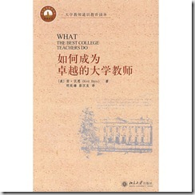

# 《如何成为卓越的大学教师》的阅读笔记及感想 （一） 
> 原文发表于 2012-01-01, 地址: http://www.cnblogs.com/chenxizhang/archive/2012/01/01/2309600.html 

 

 这本书是由哈佛大学出版的，然后北京大学出版社引进翻译了中文版，年前我听到介绍然后购买的。今天看了一部分，**总的评价是非常不错，很值得所有大学教师参考学习，当然也很适合于我等有志青年，作为研究学习之用。**

  

 ****  

  ###### 内容简介

 本书是对不同大学和各个学科近百位卓越教师长达15年观察研究的总结。透过一个个生动的故事，本书为我们描绘了精彩教学的典范，举出了学生展现创意和发掘自己潜能的实例，揭示了卓越教师对学生产生持久积极影响的秘密。作者强调：卓越的教学是可以学习的。  
本书不但是新、老教师增长见识和激发灵感的宝藏，而且对于有志成为大学教师的青年学生  
也是绝好的参考书，同时本书所得出的结论也应该是广大学生及其家长的兴趣所在。  ###### 作者简介

 肯·贝恩(Ken Bain)是美国影响较大的四个教学中心，即纽约大学优秀教学中心、西北大学瑟尔精英教学中心、范德比尔特大学教学中心和蒙特克莱尔新泽西州立大学教学资源中心的创始人，现为蒙特克莱尔新泽西州立大学教学资源中心主任，在教学研究方面有着丰富的理论和实践经验，曾获得多项全美教学奖，被誉为美国最好的老师之一。  值得推荐的是，来自微软亚洲研究院的邹欣老师，前两天发表了一篇读后感，总结得相当好， [http://www.cnblogs.com/xinz/archive/2011/12/29/2306652.html](http://www.cnblogs.com/xinz/archive/2011/12/29/2306652.html "http://www.cnblogs.com/xinz/archive/2011/12/29/2306652.html") ，邹老师从美国总部回来后，这几年在几所重点大学里面参与教育方面的实践，主要讲授软件工程方面的内容，有兴趣的朋友可以关注他的[博客](http://www.cnblogs.com/xinz/)。  本书的开篇第一章，谈到了为什么写这本书，以及如何定义“卓越”，并且高屋建瓴地给出了几个不算结论的结论。我这里做些笔记，并且在此基础上也谈谈我的一些感想。即便你没有时间看完整本书，我想通过下面几点，你也大致能对这本书要表达的主体思想略知一二了。

 一：最优秀的教师知道什么，了解什么？
==================

 毫无疑问，人们必须懂得所教的知识才有可能成为优秀的老师。但这还只是一个必要前提，优秀的老师还应该擅长应用自己的知识来开发各种技能，以掌握基本原理和组织各种概念，目的是为了使别人能够使用这些原理和概念去构筑他们自己的理解和能力。他们认为，如果学对人们的思想、行为和感觉方式不能产生持久的实质性的影响，那么学习将毫无意义可言。

 二：他们如何为教学做准备？
=============

 卓越的老师把讲课、讨论、解决问题和其他各种教学要素视作严肃的智力上的努力，这种努力如同他们做研究、搞学术所付出的努力一样要求苛刻和意义重大。为一堂课做准备，包括设计更有意义的提问，并且设计讲稿、讨论基于可能遭遇的问题。

 三：他们对学生的期望是什么？
==============

 总体而言，卓越的老师对学生的期望自然是更加高的。他们不会满足于学生仅仅是考试及格，或者哪怕是拿到了高分，而是喜欢那些贴近生活的思想和行为的目标。

 四：他们如何教学？
=========

 他们将试图营造一个“自然的批判性的学习环境”，这这样的环境中，学生解决有趣的、巧妙的或者重要的问题，完成激励他们去努力掌握概念的真实任务，通过这样的方式来学习，反思他们的假设，研究他们针对现实的思维模式。学习者对自己的学习有一种控制感，他们同别人协同工作，并且相信他们的努力会得到公正和诚实的评判；他们可以不断尝试、失败并且接受有经验的学习者的反馈意见，然后获得他们的努力所作出的累积性评价。

 五：他们如何对待学生？
===========

 他们通常认为学生渴望学习，而且，如果没有相反的证据，他们认为学生有能力学习。他们对学生坦诚以待，并且倾向于非常大方得体地对待学生。

 六：他们如何检查自己的进步和评价自己的努力？
======================

 他们不是完美的人，但他们的优秀在于他们能认识到自己的不完美，并且能有一套方法评估自己的努力并做出适当地调整。同时，他们从不因为自己所面对的困难而责备学生，最后，他们通常对学术界有一种强烈的责任感，而不只是关注于在课堂上的个人成功。  上面这些大多直接来自原文，我摘录整理了一下。但在此基础上，我也结合我的一些经历，谈谈一些个人的见解和感想  这是我读过的第一本专门地、系统地论述如何教学的书籍，而且本书可贵之处在于不是教条式地讲理论，花了15年时间时间观察研究才写出这样的书，其所传达的意义与本书所要倡议的精神是不谋而合的：教育是一个严肃的话题，而论述教育更为严肃。优秀是可以通过培养得到的，这需要时间，并且这份坚持需要深层次的文化思想的支撑。  我会读这本书虽然因为机缘巧合，但也却非纯属偶然。生活中总是这样的，你其实会不断地寻找一些东西，也许一下子没有寻找到，但因为你一直在寻找，然后在某个时候你就会遇到，然后你就会说：哦，原来在这里呀。这不仅仅是一个比喻，我的意思是说，人都会关注一些自己感兴趣的东西，而且这种关注将引导你朝着这个方向前进。从这个意义上说，我们每个人都需要时常思考，你关注什么，因为你很可能会决定你最终会成为什么。  我并不是大学教师，虽然从业以来有一段与大学的短暂的合作，但我这些年来主要工作还是直接服务于一些企业，我是从06年开始开始了我作为讲师的一段旅程吧。这些年以来，讲师都是我的身份之一。算起来，我也去过不少地方，接触过各类企业，总体而言，我虽然谈不上是最好的讲师，甚至连最好的之一都谈不上，但表现也算中规中矩吧。我给自己的评分是80分左右吧。  接触过我的朋友大致都知道，我自己对教育方面有些小小的想法。在这样的前提，以及我对自己也不十分满意的背景下，就不难理解我为什么会对这本书有相见恨晚的感慨了。我一直也在想，有没有办法学习到一些较为系统的教学方面的方法，或者如何改进自己的一些讲课方面的不足。  我08年～09年左右有一段与某软件学院的短暂合作，期间也体会到我们教育体制的一些常见问题。这方面，我想等后面我的看法更加成熟的时候，再谈谈吧。这是一个大的话题，这些年来我发现越来越多的人开始关注教育，这是一个可喜的事情，有人去努力，总是会有些积极变化的。我也由衷地希望更多的力量投入到教育事业上去，而且真的要有责任感和使命感，并且注意提高教学的水平。  我先谈谈我在企业做培训的一些感想。我这里只能称之为“培训”，因为在企业内部做的这种课程，与在大学里面讲课还是有很大区别的。

 首先，目的性不太一样。企业培训的目的性更加有针对性，我总结分析过一般是三大类的情况

 1. 新员工入职之后的培训（侧重于讲解核心的技术，帮助新员工快速开展工作） - 企业对于员工的梯队式培养（侧重于针对不同级别，设计不同的课程，单独学习） - 对于某些疑难问题的专题学习（例如性能调优，或者排错之类，往往是有些特定的问题）

 其次，受众的情况不太一样。一般而言，企业培训的受众都是有一定工作经验基础的，经验有时候是好事，有时候也是坏事。所以，针对企业员工的培训课程，有时候很好讲，但反之亦然。

 最后，授课的条件不太一样。企业的培训，通常时间是较为短期的，通常每次最多也就是2～3天，并且大家要知道，企业培训一般一讲就是一整天（6小时甚至以上），智力劳动之外，也是一个体力劳动。在这么一个短而且集中的时间内，首先相互也需要有一个熟悉的过程，并且最起码要完成一定的培训目标，如果能做到较为圆满，则是相对不易的。值得一提的是，有的企业在安排课程的时候，出于一些考虑，会要求压缩时间，这个时候，我也会提醒他们要根据自己的情况，不要盲目地压缩，效果肯定是不好的。

 我还要谈一谈，由于所处的行业，决定了我所做的培训在一般的企业培训的基础上，又有一些特殊性：我们所处的IT行业，或者有的人说的计算机行业，其实一般又分为两个领域：研究和应用。我们大部分人现在做的是应用方面这个领域。

 【备注】如何理解研究和应用，可以给大家举个形象一点的例子，以我对微软的粗浅了解，他们在亚洲有研究院和工程院，研究院就是倾向于研究的，他们目前所研究的技术，可能会在多年后有用（当然，也可能没有用），工程院则侧重于将现有技术转化为微软的一些具体的产品中。

 应用这个领域有什么特点呢？我想最简单的总结就是：技术繁多，而且更新换代很快。技术多，且更新快，这将对这个领域的讲师本身来说是一个很大的挑战，如果你不能将对有关的课题的理解提升到一定的高度，那么你自己要学会这些尚且不易，何况乎要去跟别人讲课呢？

 经常也有朋友对我提出这样的问题，如何成为一个合格的讲师？问我这话的朋友，大抵首先是对我讲课还比较满意，觉得这样讲一讲也挺轻松似的。我当然首先首先因为得到认可而感到很开心，但还是会实事求是地说，其实我每次讲课也是如履薄冰，生怕出洋相，往往准备也要很长时间。总体而言，我觉得首要的一点，就是还是要有这份心，并且以此要求自己做好这份工作。

 所以，由于这种工作的关系，加上我自己对教育比较兴趣。所以这些年的一些思考，虽然主要在于如何将企业培训的价值做得更加好一些，归根结底是想探索一些教育方面的方法。这本书所提到的一些大的方面的思想，有的我也想到一些，但没有具体化。我相信读这本书必然对我有所助益，并且也希望籍此推荐给更多的有兴趣的朋友。

 1. 教育是有意义的事情。
=============

 不管你是在学校，还是在其他相关的领域，如果你从事教学方面的工作，那么就尽量做好它，帮助到更多的人，同时也帮助你得到提升。我自己的最大收获，也就是在教学相长中有很大的进步。

 2. 要有恰当、并且行之有效的方法来提高教学质量
========================

 要做好这件事情，与其他任何事情一样，光有热情还是不够的，还得有方法。要了解受众的需要，但也不失正确的引导。了解受众的需要，称之为因材施教，因势利导；而所谓不失正确的引导，是因为身为教育者，需要有一定程度上的权威性和原则性，该要求就要求，这也是教育的意义所在。

 3. 培养思考的能力比传递具体的知识更重要
=====================

 古话说的好“授人以鱼，不若授之以渔”，我也很赞同这一点。我感觉这方面还需要多多实践。主体思想就是，不要照本宣科地讲，一定要有自己的见解，并且要提出问题，给予一些空间和时间，让学习者参与进来。

 以上算是我的一些笔记和感想，后续还会写一点

