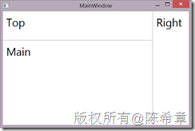
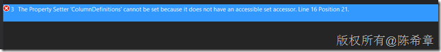
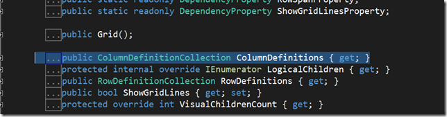
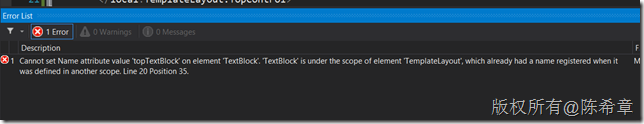
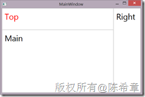
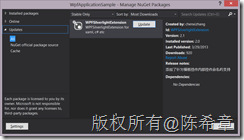

# 可复用的WPF或者Silverlight应用程序和组件设计(5)——布局重用 
> 原文发表于 2013-03-29, 地址: http://www.cnblogs.com/chenxizhang/archive/2013/03/29/2989593.html 


内容概述
----

 我去年写过几篇关于在WPF和Silverlight中实现可复用的设计的文章，分别如下，如果有兴趣地可以先参考一下

 * ##### [**可复用**的WPF或者Silverlight应用程序和组件设计(1)——应用程序级别](http://www.cnblogs.com/chenxizhang/archive/2012/04/18/2455393.html)

* ##### [**可复用**的WPF或者Silverlight应用程序和组件设计(2)——组件级别](http://www.cnblogs.com/chenxizhang/archive/2012/04/18/2455560.html)

* ##### [**可复用**的WPF或者Silverlight应用程序和组件设计(3)——控件级别](http://www.cnblogs.com/chenxizhang/archive/2012/04/23/2466957.html)

* ##### [**可复用**的WPF或者Silverlight应用程序和组件设计(4)——外观级别](http://www.cnblogs.com/chenxizhang/archive/2012/04/23/2466963.html)

 ##### 今天要继续写第五篇的原因在于最近的一些思考，也是我被问到的一个问题：我们知道WPF中的布局控件有很多，例如Grid,StackPanel,Canvas等等，利用他们，编写一定的XAML定义，就可以设计出来足够灵活多样的界面。但这里会有一个问题，如果我们很多界面都很类似，例如有某种固定格式的布局要求，那么是否在每个界面上都应该去定义一次呢？

 [备注]和前几篇文章不同的是，这一篇没有录制视频，因为我还是觉得文字的部分很重要。

 本文源代码可以通过 [http://files.cnblogs.com/chenxizhang/WpfApplicationSample.zip](http://files.cnblogs.com/chenxizhang/WpfApplicationSample.zip "http://files.cnblogs.com/chenxizhang/WpfApplicationSample.zip")  下载

  

 问题详细描述
------

 想象一下下面这样一个示意图

 [](http://images.cnitblog.com/blog/9072/201303/29204630-4c10c1d586d5405a933c65671a843522.png)

 如果只有一个界面的话，那么我们可以很简单地实现，如下面所示


```
<Window x:Class="WpfApplicationSample.MainWindow"
        xmlns="http://schemas.microsoft.com/winfx/2006/xaml/presentation"
        xmlns:x="http://schemas.microsoft.com/winfx/2006/xaml"
        **xmlns:extension="clr-namespace:System.Windows.Extensions;assembly=WPFExtension"**
        Title="MainWindow"
        Height="350"
        Width="525">
    
    <Window.Resources>
        <Style TargetType="TextBlock">
            <Setter Property="FontSize"
                    Value="30"></Setter>
        </Style>
    </Window.Resources>
    
    <Grid extension:GridHelper.ShowBorder="True">
        <Grid.RowDefinitions>
            <RowDefinition Height="80"></RowDefinition>
            <RowDefinition Height="*"></RowDefinition>
        </Grid.RowDefinitions>

        <Grid.ColumnDefinitions>
            <ColumnDefinition Width="*"></ColumnDefinition>
            <ColumnDefinition Width="100"></ColumnDefinition>
        </Grid.ColumnDefinitions>
        
        
        <!--顶部控件-->
        <ContentControl>
            <ContentControl.Content>
                <TextBlock Text="Top"></TextBlock>
            </ContentControl.Content>
        </ContentControl>
        
        
        <!--主体控件-->
        <ContentControl Grid.Row="1">
            <ContentControl.Content>
                <TextBlock Text="Main"></TextBlock>
            </ContentControl.Content>
        </ContentControl>
        
        <!--右侧控件-->
        <ContentControl Grid.Column="1"
                        Grid.RowSpan="2">
            <ContentControl.Content>
                <TextBlock Text="Right"></TextBlock>
            </ContentControl.Content>
        </ContentControl>
    </Grid>
</Window>

```

这个界面看起来是这样的：


[](http://images.cnitblog.com/blog/9072/201303/29204630-cd59e8aa678640849ec7c9aa744fd878.png)
.csharpcode, .csharpcode pre
{
 font-size: small;
 color: black;
 font-family: consolas, "Courier New", courier, monospace;
 background-color: #ffffff;
 /*white-space: pre;*/
}
.csharpcode pre { margin: 0em; }
.csharpcode .rem { color: #008000; }
.csharpcode .kwrd { color: #0000ff; }
.csharpcode .str { color: #006080; }
.csharpcode .op { color: #0000c0; }
.csharpcode .preproc { color: #cc6633; }
.csharpcode .asp { background-color: #ffff00; }
.csharpcode .html { color: #800000; }
.csharpcode .attr { color: #ff0000; }
.csharpcode .alt 
{
 background-color: #f4f4f4;
 width: 100%;
 margin: 0em;
}
.csharpcode .lnum { color: #606060; }


所以，我们完全可以做得出来。但是问题的关键在于，如果有很多窗口都是这样的布局，那么我们是否应该每个窗口都去这样定义？还是说能否从一定意义上实现布局重用：**能不能让这个Grid默认就有两行和两列呢？**


[备注] 上面的代码中，为了给Grid添加边框线，使用到了我以前写的一个扩展组件，可以通过这里了解如何使用：<http://nuget.org/packages/WPFSilverlightExtension/>


 


Windows Forms里面的做法
------------------


很久以前，那时候还没有WPF，我们都使用Windows Forms这个技术来做界面。那时候，对于上面提到的这种布局重用的问题，有一个很简单的解决方案：窗体继承。


对于这一种技术，本文并不打算对此进行展开讨论，有兴趣的朋友可以参考MSDN：<http://msdn.microsoft.com/en-us/library/aa983613(v=VS.71).aspx>


 


 


是否可以通过Style来实现对Grid行和列的定制
-------------------------


虽然确实有很多人怀念Windows Forms那种经典的界面开发，但时光之轮总是催我们向前。回到现在我们在用的WPF这个技术，对于控件和界面重用，WPF提供了很强大的Style功能。所以，基于上面这样的需求，我们会很自然地想到是否可以通过Style来实现。


```
        <Style TargetType="Grid">
            <Setter Property="ColumnDefinitions">
                <Setter.Value>
                    <ColumnDefinition Width="*"></ColumnDefinition>
                    <ColumnDefinition Width="100"></ColumnDefinition>
                </Setter.Value>
            </Setter>
            <Setter Property="RowDefinitions">
                <Setter.Value>
                    <RowDefinition Height="80"></RowDefinition>
                    <RowDefinition Height="*"></RowDefinition>
                </Setter.Value>
            </Setter>
        </Style>
```

如果能这样写，当然是很好的。但问题是，**你不能这样写**。错误如下


  
[](http://images.cnitblog.com/blog/9072/201303/29204631-1627cb10010348f6af7ee251738f9328.png)


如果去查看Grid的类型定义，会发现这个属性确实只有get方法器


.csharpcode, .csharpcode pre
{
 font-size: small;
 color: black;
 font-family: consolas, "Courier New", courier, monospace;
 background-color: #ffffff;
 /*white-space: pre;*/
}
.csharpcode pre { margin: 0em; }
.csharpcode .rem { color: #008000; }
.csharpcode .kwrd { color: #0000ff; }
.csharpcode .str { color: #006080; }
.csharpcode .op { color: #0000c0; }
.csharpcode .preproc { color: #cc6633; }
.csharpcode .asp { background-color: #ffff00; }
.csharpcode .html { color: #800000; }
.csharpcode .attr { color: #ff0000; }
.csharpcode .alt 
{
 background-color: #f4f4f4;
 width: 100%;
 margin: 0em;
}
.csharpcode .lnum { color: #606060; }

[](http://images.cnitblog.com/blog/9072/201303/29204632-be33a6c4dfce4eee88844e862c6a1fe4.png)


 


 


是否可以通过对Grid进行扩展来实现行和列的定制
------------------------


一计不成，我们可以继续想办法。有着良好的面向对象素养的同学一定可以想到，那么要不就对Grid做一个扩展，默认提供行和列的定义，这样行不行呢？例如


```
using System.Windows.Controls;

namespace WpfApplicationSample
{
    class LayoutGrid:Grid
    {


        protected override void OnInitialized(System.EventArgs e)
        {
            base.OnInitialized(e);

            //默认提供两行两列的实现
            base.ColumnDefinitions.Add(new ColumnDefinition());
            base.ColumnDefinitions.Add(new ColumnDefinition() { Width = new System.Windows.GridLength(100) });

            base.RowDefinitions.Add(new RowDefinition() { Height = new System.Windows.GridLength(80) });
            base.RowDefinitions.Add(new RowDefinition());
        }
    }
}

```

```
然后，我们在界面上可以像下面这样使用。很明显，这样可以简化很多了。
```

```
<Window x:Class="WpfApplicationSample.MainWindow"
        xmlns="http://schemas.microsoft.com/winfx/2006/xaml/presentation"
        xmlns:x="http://schemas.microsoft.com/winfx/2006/xaml"
        xmlns:extension="clr-namespace:System.Windows.Extensions;assembly=WPFExtension"
        xmlns:local="clr-namespace:WpfApplicationSample"
        Title="MainWindow"
        Height="350"
        Width="525">
    
    <Window.Resources>
        <Style TargetType="TextBlock">
            <Setter Property="FontSize"
                    Value="30"></Setter>
        </Style>
    </Window.Resources>
    
    
    <local:LayoutGrid extension:GridHelper.ShowBorder="true">
        <!--顶部控件-->
        <ContentControl>
            <ContentControl.Content>
                <TextBlock Text="Top"></TextBlock>
            </ContentControl.Content>
        </ContentControl>


        <!--主体控件-->
        <ContentControl Grid.Row="1">
            <ContentControl.Content>
                <TextBlock Text="Main"></TextBlock>
            </ContentControl.Content>
        </ContentControl>

        <!--右侧控件-->
        <ContentControl Grid.Column="1"
                        Grid.RowSpan="2">
            <ContentControl.Content>
                <TextBlock Text="Right"></TextBlock>
            </ContentControl.Content>
        </ContentControl>

    </local:LayoutGrid>

</Window>

```

.csharpcode, .csharpcode pre
{
 font-size: small;
 color: black;
 font-family: consolas, "Courier New", courier, monospace;
 background-color: #ffffff;
 /*white-space: pre;*/
}
.csharpcode pre { margin: 0em; }
.csharpcode .rem { color: #008000; }
.csharpcode .kwrd { color: #0000ff; }
.csharpcode .str { color: #006080; }
.csharpcode .op { color: #0000c0; }
.csharpcode .preproc { color: #cc6633; }
.csharpcode .asp { background-color: #ffff00; }
.csharpcode .html { color: #800000; }
.csharpcode .attr { color: #ff0000; }
.csharpcode .alt 
{
 background-color: #f4f4f4;
 width: 100%;
 margin: 0em;
}
.csharpcode .lnum { color: #606060; }

 


这个方案的美中不足，在于使用者还是需要记住要在具体的内容控件上面设置Grid.Row，Grid.Column等相关信息，而且，如果他忘记写，或者没有按照规范写，实际上就没有实现界面的统一，因为你没有办法强制他必须写，或者怎么写。


要想实现界面的统一，就必须把这种可能改变界面的属性，从使用者的身边移开。


 


使用用户控件实现PlaceHolder式的控件模板
-------------------------


既然直接扩展Grid并不能完整地实现我们的需求，我接下来想到是否可以使用用户控件来封装，而且为了让用户使用简单，同时也避免用户不按照规定使用，所以我借鉴了ASP.NET中的母版页([master page](http://www.asp.net/web-forms/tutorials/master-pages))这样的技术，使用类似PlaceHolder这样的方式来实现了一个控件模板。


```
<UserControl x:Class="WpfApplicationSample.TemplateLayout"
             xmlns="http://schemas.microsoft.com/winfx/2006/xaml/presentation"
             xmlns:x="http://schemas.microsoft.com/winfx/2006/xaml"
             xmlns:mc="http://schemas.openxmlformats.org/markup-compatibility/2006"
             xmlns:d="http://schemas.microsoft.com/expression/blend/2008"
             xmlns:extension="clr-namespace:System.Windows.Extensions;assembly=WPFExtension"
             mc:Ignorable="d"
             d:DesignHeight="300"
             d:DesignWidth="300"
             x:Name="root">
    <Grid extension:GridHelper.ShowBorder="True">
        <Grid.RowDefinitions>
            <RowDefinition Height="80"></RowDefinition>
            <RowDefinition Height="*"></RowDefinition>
        </Grid.RowDefinitions>

        <Grid.ColumnDefinitions>
            <ColumnDefinition Width="*"></ColumnDefinition>
            <ColumnDefinition Width="100"></ColumnDefinition>
        </Grid.ColumnDefinitions>

        <!--顶部控件-->
        <ContentControl Content="{Binding TopControl,ElementName=root}">
        </ContentControl>


        <!--主体控件-->
        <ContentControl Grid.Row="1"
                        Content="{Binding MainControl,ElementName=root}">
        </ContentControl>

        <!--右侧控件-->
        <ContentControl Grid.Column="1"
                        Grid.RowSpan="2"
                        Content="{Binding RightControl,ElementName=root}">
        </ContentControl>
    </Grid>
</UserControl>

```

.csharpcode, .csharpcode pre
{
 font-size: small;
 color: black;
 font-family: consolas, "Courier New", courier, monospace;
 background-color: #ffffff;
 /*white-space: pre;*/
}
.csharpcode pre { margin: 0em; }
.csharpcode .rem { color: #008000; }
.csharpcode .kwrd { color: #0000ff; }
.csharpcode .str { color: #006080; }
.csharpcode .op { color: #0000c0; }
.csharpcode .preproc { color: #cc6633; }
.csharpcode .asp { background-color: #ffff00; }
.csharpcode .html { color: #800000; }
.csharpcode .attr { color: #ff0000; }
.csharpcode .alt 
{
 background-color: #f4f4f4;
 width: 100%;
 margin: 0em;
}
.csharpcode .lnum { color: #606060; }


.csharpcode, .csharpcode pre
{
 font-size: small;
 color: black;
 font-family: consolas, "Courier New", courier, monospace;
 background-color: #ffffff;
 /*white-space: pre;*/
}
.csharpcode pre { margin: 0em; }
.csharpcode .rem { color: #008000; }
.csharpcode .kwrd { color: #0000ff; }
.csharpcode .str { color: #006080; }
.csharpcode .op { color: #0000c0; }
.csharpcode .preproc { color: #cc6633; }
.csharpcode .asp { background-color: #ffff00; }
.csharpcode .html { color: #800000; }
.csharpcode .attr { color: #ff0000; }
.csharpcode .alt 
{
 background-color: #f4f4f4;
 width: 100%;
 margin: 0em;
}
.csharpcode .lnum { color: #606060; }


需要注意的是，因为这里是定义一个控件模板，所以具体的内容控件是没有内容的，我们希望使用者可以后期再插入具体的内容。这里使用到了绑定的技术。为了支持绑定，我们在这个控件中添加了三个依赖属性，如下


```
using System.Windows;
using System.Windows.Controls;

namespace WpfApplicationSample
{
    /// <summary>
    /// Interaction logic for TemplateLayout.xaml
    /// </summary>
    public partial class TemplateLayout : UserControl
    {
        public TemplateLayout()
        {
            InitializeComponent();
        }


        public object TopControl
        {
            get { return (object)GetValue(TopControlProperty); }
            set { SetValue(TopControlProperty, value); }
        }

        // Using a DependencyProperty as the backing store for TopControl. This enables animation, styling, binding, etc...
        public static readonly DependencyProperty TopControlProperty =
            DependencyProperty.Register("TopControl", typeof(object), typeof(TemplateLayout), new PropertyMetadata(null));


        public object MainControl
        {
            get { return (object)GetValue(MainControlProperty); }
            set { SetValue(MainControlProperty, value); }
        }

        // Using a DependencyProperty as the backing store for MainControl. This enables animation, styling, binding, etc...
        public static readonly DependencyProperty MainControlProperty =
            DependencyProperty.Register("MainControl", typeof(object), typeof(TemplateLayout), new PropertyMetadata(null));


        public object RightControl
        {
            get { return (object)GetValue(RightControlProperty); }
            set { SetValue(RightControlProperty, value); }
        }

        // Using a DependencyProperty as the backing store for RightControl. This enables animation, styling, binding, etc...
        public static readonly DependencyProperty RightControlProperty =
            DependencyProperty.Register("RightControl", typeof(object), typeof(TemplateLayout), new PropertyMetadata(null));


    }
}

```

.csharpcode, .csharpcode pre
{
 font-size: small;
 color: black;
 font-family: consolas, "Courier New", courier, monospace;
 background-color: #ffffff;
 /*white-space: pre;*/
}
.csharpcode pre { margin: 0em; }
.csharpcode .rem { color: #008000; }
.csharpcode .kwrd { color: #0000ff; }
.csharpcode .str { color: #006080; }
.csharpcode .op { color: #0000c0; }
.csharpcode .preproc { color: #cc6633; }
.csharpcode .asp { background-color: #ffff00; }
.csharpcode .html { color: #800000; }
.csharpcode .attr { color: #ff0000; }
.csharpcode .alt 
{
 background-color: #f4f4f4;
 width: 100%;
 margin: 0em;
}
.csharpcode .lnum { color: #606060; }

 


那么，如何来使用这个模板控件呢？大致是下面这样的：


```
    <local:TemplateLayout>
        <local:TemplateLayout.TopControl>
            <TextBlock Text="Top"></TextBlock>
        </local:TemplateLayout.TopControl>
        <local:TemplateLayout.MainControl>
            <TextBlock Text="Main"></TextBlock>
        </local:TemplateLayout.MainControl>
        <local:TemplateLayout.RightControl>
            <TextBlock Text="Right"></TextBlock>
        </local:TemplateLayout.RightControl>
    </local:TemplateLayout>

```


.csharpcode, .csharpcode pre
{
 font-size: small;
 color: black;
 font-family: consolas, "Courier New", courier, monospace;
 background-color: #ffffff;
 /*white-space: pre;*/
}
.csharpcode pre { margin: 0em; }
.csharpcode .rem { color: #008000; }
.csharpcode .kwrd { color: #0000ff; }
.csharpcode .str { color: #006080; }
.csharpcode .op { color: #0000c0; }
.csharpcode .preproc { color: #cc6633; }
.csharpcode .asp { background-color: #ffff00; }
.csharpcode .html { color: #800000; }
.csharpcode .attr { color: #ff0000; }
.csharpcode .alt 
{
 background-color: #f4f4f4;
 width: 100%;
 margin: 0em;
}
.csharpcode .lnum { color: #606060; }


很显然，这样使用起来更加简洁方便，而且使用者只能往我们预先定义好的三个内容区域中去填充内容，而不可能因为错误的设置属性（或者忘记设置属性）而导致界面布局不一致。


[](http://images.cnitblog.com/blog/9072/201303/29204633-4c727be8279141b7b465b8e972fba67e.png)


 


看起来相当不错，几乎已经完全实现了我们的要求。我以前也就一直这样用，直到最近发现一个问题。


如果我们出于一些目的，希望给这些内容控件添加名称，以便在后台代码中访问到它。例如下面这样：


```
    <local:TemplateLayout>
        <local:TemplateLayout.TopControl>
            **<TextBlock Text="Top" x:Name="topTextBlock"></TextBlock>**
        </local:TemplateLayout.TopControl>
        <local:TemplateLayout.MainControl>
            <TextBlock Text="Main"></TextBlock>
        </local:TemplateLayout.MainControl>
        <local:TemplateLayout.RightControl>
            <TextBlock Text="Right"></TextBlock>
        </local:TemplateLayout.RightControl>
    </local:TemplateLayout>

```

.csharpcode, .csharpcode pre
{
 font-size: small;
 color: black;
 font-family: consolas, "Courier New", courier, monospace;
 background-color: #ffffff;
 /*white-space: pre;*/
}
.csharpcode pre { margin: 0em; }
.csharpcode .rem { color: #008000; }
.csharpcode .kwrd { color: #0000ff; }
.csharpcode .str { color: #006080; }
.csharpcode .op { color: #0000c0; }
.csharpcode .preproc { color: #cc6633; }
.csharpcode .asp { background-color: #ffff00; }
.csharpcode .html { color: #800000; }
.csharpcode .attr { color: #ff0000; }
.csharpcode .alt 
{
 background-color: #f4f4f4;
 width: 100%;
 margin: 0em;
}
.csharpcode .lnum { color: #606060; }

看起来是一个很平常的修改，但你立即会发现，这会导致无法编译通过。


[](http://images.cnitblog.com/blog/9072/201303/29204634-af9a7ddb5aab40718fd82d8441ed4c48.png)


Cannot set Name attribute value 'topTextBlock' on element 'TextBlock'. 'TextBlock' is under the scope of element 'TemplateLayout', which already had a name registered when it was defined in another scope.


这个错误实在是让人捉摸不透，目前也没有找到合理的解释。可能的解释是这样：因为我们的TextBlock其实是嵌入到TemplateLayout中，而TemplateLayout默认会为内部的控件生成一个名称，所以就不允许再定义名称。


为此，我也找了很多资料，一个最接近的讨论在这里


<http://stackoverflow.com/questions/5758342/how-to-create-wpf-usercontrol-which-contains-placeholders-for-later-usage>


这个问题描述到了和本文比较接近的情况，而且也提到了如果假如名称，会出现错误。但是该文也没有可用的解决方案。


 


针对这个问题，我做了不少研究，同时也找了一些朋友进行讨论。其中和[韦恩卑鄙](http://weibo.com/waynebabywang) 的讨论中，他给了我一个启发，打开了我另外一个思路：**如果说定义名称是必须的，那么既然WPF内部的命名规范无法通过，那么是否可以通过自己的一种什么机制来定义名称呢**？最终我确定使用[附加属性](http://msdn.microsoft.com/en-us/library/ms749011.aspx)来实现了该功能。**荣誉属于**[**韦恩卑鄙**](http://weibo.com/waynebabywang)**。**


 


通过附加属性来为控件添加名称
--------------


我创建了如下这样一个类型，添加了一个附加属性，并且为控件查找提供了一个方法。
.csharpcode, .csharpcode pre
{
 font-size: small;
 color: black;
 font-family: consolas, "Courier New", courier, monospace;
 background-color: #ffffff;
 /*white-space: pre;*/
}
.csharpcode pre { margin: 0em; }
.csharpcode .rem { color: #008000; }
.csharpcode .kwrd { color: #0000ff; }
.csharpcode .str { color: #006080; }
.csharpcode .op { color: #0000c0; }
.csharpcode .preproc { color: #cc6633; }
.csharpcode .asp { background-color: #ffff00; }
.csharpcode .html { color: #800000; }
.csharpcode .attr { color: #ff0000; }
.csharpcode .alt 
{
 background-color: #f4f4f4;
 width: 100%;
 margin: 0em;
}
.csharpcode .lnum { color: #606060; }

.csharpcode, .csharpcode pre
{
 font-size: small;
 color: black;
 font-family: consolas, "Courier New", courier, monospace;
 background-color: #ffffff;
 /*white-space: pre;*/
}
.csharpcode pre { margin: 0em; }
.csharpcode .rem { color: #008000; }
.csharpcode .kwrd { color: #0000ff; }
.csharpcode .str { color: #006080; }
.csharpcode .op { color: #0000c0; }
.csharpcode .preproc { color: #cc6633; }
.csharpcode .asp { background-color: #ffff00; }
.csharpcode .html { color: #800000; }
.csharpcode .attr { color: #ff0000; }
.csharpcode .alt 
{
 background-color: #f4f4f4;
 width: 100%;
 margin: 0em;
}
.csharpcode .lnum { color: #606060; }


```
using System.Collections.Generic;
using System.Linq;
using System.Windows;

namespace WpfApplicationSample
{
    public class LayoutExtension
    {
        /// <summary>
        /// 这个方法用来获取控件
        /// </summary>
        /// <typeparam name="T">指定控件类型，例如TextBlock</typeparam>
        /// <param name="name">指定控件名称</param>
        /// <returns></returns>
        public static T GetControl<T>(string name)
            where T : class
        {
            return controls.FirstOrDefault(t => t.Key == name).Value as T;
        }


        private static Dictionary<string, DependencyObject> controls;
        static LayoutExtension()
        {
            controls = new Dictionary<string, DependencyObject>();
        }

        public static string GetName(DependencyObject obj)
        {
            return (string)obj.GetValue(NameProperty);
        }

        public static void SetName(DependencyObject obj, string value)
        {
            obj.SetValue(NameProperty, value);

        }

        // Using a DependencyProperty as the backing store for Name. This enables animation, styling, binding, etc...
        public static readonly DependencyProperty NameProperty =
            DependencyProperty.RegisterAttached("Name", typeof(string), typeof(LayoutExtension), new PropertyMetadata(string.Empty, (d, e) =>
            {
                if (e.NewValue != null)
                {
                    var name = e.NewValue.ToString();

                    if (!controls.ContainsKey(name))
                        controls.Add(name, d);
                }
            }));

    }
}

```

.csharpcode, .csharpcode pre
{
 font-size: small;
 color: black;
 font-family: consolas, "Courier New", courier, monospace;
 background-color: #ffffff;
 /*white-space: pre;*/
}
.csharpcode pre { margin: 0em; }
.csharpcode .rem { color: #008000; }
.csharpcode .kwrd { color: #0000ff; }
.csharpcode .str { color: #006080; }
.csharpcode .op { color: #0000c0; }
.csharpcode .preproc { color: #cc6633; }
.csharpcode .asp { background-color: #ffff00; }
.csharpcode .html { color: #800000; }
.csharpcode .attr { color: #ff0000; }
.csharpcode .alt 
{
 background-color: #f4f4f4;
 width: 100%;
 margin: 0em;
}
.csharpcode .lnum { color: #606060; }

如何使用这个扩展呢？


```

    <local:TemplateLayout>
        <local:TemplateLayout.TopControl>
            <TextBlock Text="Top"
                       local:LayoutExtension.Name="topTextBlock"></TextBlock>
        </local:TemplateLayout.TopControl>
        <local:TemplateLayout.MainControl>
            <TextBlock Text="Main"></TextBlock>
        </local:TemplateLayout.MainControl>
        <local:TemplateLayout.RightControl>
            <TextBlock Text="Right"></TextBlock>
        </local:TemplateLayout.RightControl>
    </local:TemplateLayout>

```


.csharpcode, .csharpcode pre
{
 font-size: small;
 color: black;
 font-family: consolas, "Courier New", courier, monospace;
 background-color: #ffffff;
 /*white-space: pre;*/
}
.csharpcode pre { margin: 0em; }
.csharpcode .rem { color: #008000; }
.csharpcode .kwrd { color: #0000ff; }
.csharpcode .str { color: #006080; }
.csharpcode .op { color: #0000c0; }
.csharpcode .preproc { color: #cc6633; }
.csharpcode .asp { background-color: #ffff00; }
.csharpcode .html { color: #800000; }
.csharpcode .attr { color: #ff0000; }
.csharpcode .alt 
{
 background-color: #f4f4f4;
 width: 100%;
 margin: 0em;
}
.csharpcode .lnum { color: #606060; }


然后，如果需要在后台代码中访问这个控件，就可以大致像下面这样操作


```
using System.Windows;
using System.Windows.Controls;
using System.Windows.Media;

namespace WpfApplicationSample
{
    /// <summary>
    /// Interaction logic for MainWindow.xaml
    /// </summary>
    public partial class MainWindow : Window
    {
        public MainWindow()
        {
            InitializeComponent();

            Loaded += MainWindow\_Loaded;
        }

        void MainWindow\_Loaded(object sender, RoutedEventArgs e)
        {
            var txt = LayoutExtension.GetControl<TextBlock>("topTextBlock");
            txt.Foreground = new SolidColorBrush(Colors.Red);

        }
    }
}

```

.csharpcode, .csharpcode pre
{
 font-size: small;
 color: black;
 font-family: consolas, "Courier New", courier, monospace;
 background-color: #ffffff;
 /*white-space: pre;*/
}
.csharpcode pre { margin: 0em; }
.csharpcode .rem { color: #008000; }
.csharpcode .kwrd { color: #0000ff; }
.csharpcode .str { color: #006080; }
.csharpcode .op { color: #0000c0; }
.csharpcode .preproc { color: #cc6633; }
.csharpcode .asp { background-color: #ffff00; }
.csharpcode .html { color: #800000; }
.csharpcode .attr { color: #ff0000; }
.csharpcode .alt 
{
 background-color: #f4f4f4;
 width: 100%;
 margin: 0em;
}
.csharpcode .lnum { color: #606060; }

[](http://images.cnitblog.com/blog/9072/201303/29204635-3fdf7d412c904973b93801d44b40f28f.png)


 


如何更加方便地使用这个扩展？
--------------


为了使得大家更加方便地使用这个扩展，我将其合并到了我之前写过的针对WPF和Silverlight的扩展包中，大家可以通过nuget package manager搜索wpfsilverlightextension下载安装这个扩展包


[](http://images.cnitblog.com/blog/9072/201303/29204636-de8ecb49c55044be995663e7d77b2ccf.png)


目前这个扩展，既支持WPF，也支持Silverlight。可以免费使用。


如果是使用这个包的话，那么在导入名称空间的时候，我习惯用extension这个名称，所以在具体页面中用的时候，大致上是下面这样


```
    <local:TemplateLayout>
        <local:TemplateLayout.TopControl>
            <TextBlock Text="Top"
                       extension:LayoutExtension.Name="topTextBlock"></TextBlock>
        </local:TemplateLayout.TopControl>
        <local:TemplateLayout.MainControl>
            <TextBlock Text="Main"></TextBlock>
        </local:TemplateLayout.MainControl>
        <local:TemplateLayout.RightControl>
            <TextBlock Text="Right"></TextBlock>
        </local:TemplateLayout.RightControl>
    </local:TemplateLayout>
```

```
 
```

```
 
```

.csharpcode, .csharpcode pre
{
 font-size: small;
 color: black;
 font-family: consolas, "Courier New", courier, monospace;
 background-color: #ffffff;
 /*white-space: pre;*/
}
.csharpcode pre { margin: 0em; }
.csharpcode .rem { color: #008000; }
.csharpcode .kwrd { color: #0000ff; }
.csharpcode .str { color: #006080; }
.csharpcode .op { color: #0000c0; }
.csharpcode .preproc { color: #cc6633; }
.csharpcode .asp { background-color: #ffff00; }
.csharpcode .html { color: #800000; }
.csharpcode .attr { color: #ff0000; }
.csharpcode .alt 
{
 background-color: #f4f4f4;
 width: 100%;
 margin: 0em;
}
.csharpcode .lnum { color: #606060; }

是否一定要使用这个扩展？
------------


看起来还不错，但是是否一定要使用这个扩展呢？并不见得。因为我之前就说过，我以前没有意识到这个Name会出问题，是因为我几乎大部分时候都没有命名这种需要。为什么呢？因为我们大部分时候都会使用mvvm这种模式进行WPF应用程序的开发，在这种情况下，我们是不会在代码中去访问到控件的。例如下面是一个较为真实的例子：


```
<Page x:Class="EmployeePage"
      xmlns="http://schemas.microsoft.com/winfx/2006/xaml/presentation"
      xmlns:x="http://schemas.microsoft.com/winfx/2006/xaml"
      xmlns:mc="http://schemas.openxmlformats.org/markup-compatibility/2006"
      xmlns:d="http://schemas.microsoft.com/expression/blend/2008"
      xmlns:local="clr-namespace:SMSApplicationSample"
      xmlns:extension="clr-namespace:System.Windows.Extensions;assembly=WPFExtension"
      xmlns:tk="clr-namespace:Xceed.Wpf.Toolkit;assembly=WPFToolkit.Extended"
      mc:Ignorable="d"
      d:DesignHeight="300"
      d:DesignWidth="300"
      Title="EmployeePage">

    <Page.DataContext>
        <local:EmployeePageViewModel></local:EmployeePageViewModel>
    </Page.DataContext>

    <tk:BusyIndicator 
        IsBusy="{Binding IsBusy}"
        BusyContent="Data loading,pls wait...">
       
        <local:TemplateLayout>
            <local:TemplateLayout.Condition>
                <!--加载所有员工-->
                <DataGrid ItemsSource="{Binding Employees}"
                          SelectedItem="{Binding CurrentEmployee,Mode=TwoWay}">
                    <!--通过前台的选择，TwoWay的方式可以将CurrentEmployee的更新告诉后台，并且去更新绑定了该属性的元素，这个机制就是所谓的依赖属性的通知功能-->
                </DataGrid>
            </local:TemplateLayout.Condition>
            <local:TemplateLayout.Result>
                <!--显示一个员工-->
                <ContentControl Content="{Binding CurrentEmployee}">
                    <ContentControl.ContentTemplate>
                        <DataTemplate>
                            <Grid extension:GridHelper.ShowBorder="True">
                                <Grid.RowDefinitions>
                                    <RowDefinition Height="auto"></RowDefinition>
                                    <RowDefinition Height="auto"></RowDefinition>
                                    <RowDefinition Height="auto"></RowDefinition>
                                    <RowDefinition Height="auto"></RowDefinition>
                                </Grid.RowDefinitions>
                                <Grid.ColumnDefinitions>
                                    <ColumnDefinition Width="100"></ColumnDefinition>
                                    <ColumnDefinition Width="*"></ColumnDefinition>
                                    <ColumnDefinition Width="100"></ColumnDefinition>
                                </Grid.ColumnDefinitions>

                                <Image Source="{Binding Photo}"
                                       Grid.Column="2"
                                       Grid.RowSpan="4"></Image>

                                <TextBlock Text="FirstName:"></TextBlock>
                                <TextBlock Text="{Binding FirstName}"
                                           Grid.Column="1"></TextBlock>

                                <TextBlock Text="LastName:"
                                           Grid.Row="1"></TextBlock>
                                <TextBlock Text="{Binding LastName}"
                                           Grid.Row="1"
                                           Grid.Column="1"></TextBlock>

                                <TextBlock Text="Title:"
                                           Grid.Row="2"></TextBlock>
                                <TextBlock Text="{Binding Title}"
                                           Grid.Row="2"
                                           Grid.Column="1"></TextBlock>

                                <TextBlock Text="Address:"
                                           Grid.Row="3"></TextBlock>
                                <TextBlock Text="{Binding Address}"
                                           Grid.Row="3"
                                           Grid.Column="1"></TextBlock>

                            </Grid>
                        </DataTemplate>
                    </ContentControl.ContentTemplate>

                </ContentControl>
            </local:TemplateLayout.Result>
            <local:TemplateLayout.Action>
                <!--显示一些按钮，可以添加，删除，修改员工-->
                <StackPanel>
                    <Button Content="New..."
                            Command="{Binding NewCommand}"></Button>
                    <Button Content="Update..."
                            Command="{Binding UpdateCommand}"
                            CommandParameter="{Binding CurrentEmployee}"></Button>
                    <Button Content="Delete..."
                            Command="{Binding DeleteCommand}"></Button>

                    <Button Content="Show Report..."
                            Command="{Binding ReportCommand}"></Button>
                </StackPanel>
            </local:TemplateLayout.Action>
        </local:TemplateLayout>
    </tk:BusyIndicator>
        
</Page>

```

.csharpcode, .csharpcode pre
{
 font-size: small;
 color: black;
 font-family: consolas, "Courier New", courier, monospace;
 background-color: #ffffff;
 /*white-space: pre;*/
}
.csharpcode pre { margin: 0em; }
.csharpcode .rem { color: #008000; }
.csharpcode .kwrd { color: #0000ff; }
.csharpcode .str { color: #006080; }
.csharpcode .op { color: #0000c0; }
.csharpcode .preproc { color: #cc6633; }
.csharpcode .asp { background-color: #ffff00; }
.csharpcode .html { color: #800000; }
.csharpcode .attr { color: #ff0000; }
.csharpcode .alt 
{
 background-color: #f4f4f4;
 width: 100%;
 margin: 0em;
}
.csharpcode .lnum { color: #606060; }

 


 


本文源代码可以通过 [http://files.cnblogs.com/chenxizhang/WpfApplicationSample.zip](http://files.cnblogs.com/chenxizhang/WpfApplicationSample.zip "http://files.cnblogs.com/chenxizhang/WpfApplicationSample.zip")  下载

