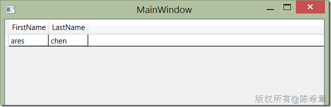
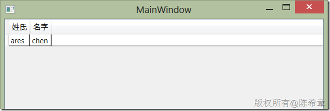

# 定制WPF中的DataGrid控件支持对不同的实体类实现中文标题显示 
> 原文发表于 2013-04-09, 地址: http://www.cnblogs.com/chenxizhang/archive/2013/04/09/3010972.html 


问题提出：
-----

 这是今天被问到的一个问题。情况是这样的：

 我们都知道WPF中有一个用来显示列表数据的DataGrid控件，而且该控件具有一个AutoGenerateColumns 属性（默认为true)，它可以根据给定的数据，自动地设置列的标题，也就是说，我们可以根据需要读取不同的实体数据，然后绑定到控件上去，它自己知道该如何创建列，以及显示数据。

 这里的问题在于，我们的实体类定义通常都是英文的，例如下面是一个最简单的例子


```
    public class Employee
    {
        public string FirstName { get; set; }
        public string LastName { get; set; }
    }
```


.csharpcode, .csharpcode pre
{
 font-size: small;
 color: black;
 font-family: consolas, "Courier New", courier, monospace;
 background-color: #ffffff;
 /*white-space: pre;*/
}
.csharpcode pre { margin: 0em; }
.csharpcode .rem { color: #008000; }
.csharpcode .kwrd { color: #0000ff; }
.csharpcode .str { color: #006080; }
.csharpcode .op { color: #0000c0; }
.csharpcode .preproc { color: #cc6633; }
.csharpcode .asp { background-color: #ffff00; }
.csharpcode .html { color: #800000; }
.csharpcode .attr { color: #ff0000; }
.csharpcode .alt 
{
 background-color: #f4f4f4;
 width: 100%;
 margin: 0em;
}
.csharpcode .lnum { color: #606060; }


DataGrid会自动为每个属性建立一个列，并且列标题设置为属性名称。例如下面这样：


[](http://images.cnitblog.com/blog/9072/201304/09204159-d0e6bd3ee3ff4462a2a50ca32578aa9b.png)


但是，美中不足的是，我们的用户更喜欢中文的标题。那么，我们是否能够以最小的代价，让这些标题能显示中文呢？


 


解决方案：
-----


首先，我联想到了MVC中的一个做法，就是需要给实体类添加属性描述，因为无论如何，我们需要有一个地方可以定义这些中文标题。幸运的是，我们可以直接使用内置的DataAnnotation的功能来实现，例如：


```
    public class Employee
    {
        [Display(Name="姓氏")]
        public string FirstName { get; set; }
        [Display(Name="名字")]
        public string LastName { get; set; }
    }
```


.csharpcode, .csharpcode pre
{
 font-size: small;
 color: black;
 font-family: consolas, "Courier New", courier, monospace;
 background-color: #ffffff;
 /*white-space: pre;*/
}
.csharpcode pre { margin: 0em; }
.csharpcode .rem { color: #008000; }
.csharpcode .kwrd { color: #0000ff; }
.csharpcode .str { color: #006080; }
.csharpcode .op { color: #0000c0; }
.csharpcode .preproc { color: #cc6633; }
.csharpcode .asp { background-color: #ffff00; }
.csharpcode .html { color: #800000; }
.csharpcode .attr { color: #ff0000; }
.csharpcode .alt 
{
 background-color: #f4f4f4;
 width: 100%;
 margin: 0em;
}
.csharpcode .lnum { color: #606060; }


备注：这里要先引用System.ComponentModel.DataAnnotations 这个程序集。


 


接下来，我们的问题就是，如何将这里定义好的Display的属性，读取到DataGrid的列标题处。我首先想到的是，能否通过定制ColumnHeaderStyle来实现，但经过一些努力，没有成功。如果有朋友对这个方案有补充，请不吝赐教。


我最后采用的方法是这样的，DataGrid有一个事件叫：AutoGeneratingColumn  ，顾名思义，这个事件就是在列被创建出来之前触发的。我通过下面的代码实现了我们想要的功能。


```
        private void DataGrid\_AutoGeneratingColumn\_1(object sender, DataGridAutoGeneratingColumnEventArgs e)
        {
            var result = e.PropertyName;
            var p = (e.PropertyDescriptor as PropertyDescriptor).ComponentType.GetProperties().FirstOrDefault(x => x.Name == e.PropertyName);

            if (p != null)
            {
                var found = p.GetCustomAttribute<DisplayAttribute>();
                if (found != null) result = found.Name;
            }

            e.Column.Header = result;
        }
```


.csharpcode, .csharpcode pre
{
 font-size: small;
 color: black;
 font-family: consolas, "Courier New", courier, monospace;
 background-color: #ffffff;
 /*white-space: pre;*/
}
.csharpcode pre { margin: 0em; }
.csharpcode .rem { color: #008000; }
.csharpcode .kwrd { color: #0000ff; }
.csharpcode .str { color: #006080; }
.csharpcode .op { color: #0000c0; }
.csharpcode .preproc { color: #cc6633; }
.csharpcode .asp { background-color: #ffff00; }
.csharpcode .html { color: #800000; }
.csharpcode .attr { color: #ff0000; }
.csharpcode .alt 
{
 background-color: #f4f4f4;
 width: 100%;
 margin: 0em;
}
.csharpcode .lnum { color: #606060; }


这样一来，我们看到的界面就是下面这样的啦


[](http://images.cnitblog.com/blog/9072/201304/09204159-5cb304f6fd7746bba4385efef9e8c8aa.png)


而且重要的，这个功能是完全通用的，不管日后想要换成什么样的实体类型，都可以通过定义Display这个Attributel来改变标题。


 


最后，我还这个功能封装了一下，以便更加好的使用.我做了一个扩展控件，如下所示


```
using System.ComponentModel;
using System.ComponentModel.DataAnnotations;
using System.Linq;
using System.Reflection;
using System.Windows.Controls;

namespace WpfApplication1
{
    class xGrid:DataGrid
    {
        public xGrid()
        {
            AutoGeneratingColumn += (o, e) =>
            {
                var result = e.PropertyName;
                var p = (e.PropertyDescriptor as PropertyDescriptor).ComponentType.GetProperties().FirstOrDefault(x => x.Name == e.PropertyName);

                if (p != null)
                {
                    var found = p.GetCustomAttribute<DisplayAttribute>();
                    if (found != null) result = found.Name;
                }

                e.Column.Header = result;
            };
        }
    }
}

```

.csharpcode, .csharpcode pre
{
 font-size: small;
 color: black;
 font-family: consolas, "Courier New", courier, monospace;
 background-color: #ffffff;
 /*white-space: pre;*/
}
.csharpcode pre { margin: 0em; }
.csharpcode .rem { color: #008000; }
.csharpcode .kwrd { color: #0000ff; }
.csharpcode .str { color: #006080; }
.csharpcode .op { color: #0000c0; }
.csharpcode .preproc { color: #cc6633; }
.csharpcode .asp { background-color: #ffff00; }
.csharpcode .html { color: #800000; }
.csharpcode .attr { color: #ff0000; }
.csharpcode .alt 
{
 background-color: #f4f4f4;
 width: 100%;
 margin: 0em;
}
.csharpcode .lnum { color: #606060; }

 


这样的话，在项目中任何页面上我都可以直接像下面这样使用这个控件了。


```
<Window x:Class="WpfApplication1.MainWindow"
        xmlns="http://schemas.microsoft.com/winfx/2006/xaml/presentation"
        xmlns:x="http://schemas.microsoft.com/winfx/2006/xaml"
        Title="MainWindow"
        xmlns:controls="clr-namespace:WpfApplication1"
        Height="350"
        Width="525">
    <Grid>
        **<controls:xGrid ItemsSource="{Binding}"></controls:xGrid>**
    </Grid>
</Window>

```

.csharpcode, .csharpcode pre
{
 font-size: small;
 color: black;
 font-family: consolas, "Courier New", courier, monospace;
 background-color: #ffffff;
 /*white-space: pre;*/
}
.csharpcode pre { margin: 0em; }
.csharpcode .rem { color: #008000; }
.csharpcode .kwrd { color: #0000ff; }
.csharpcode .str { color: #006080; }
.csharpcode .op { color: #0000c0; }
.csharpcode .preproc { color: #cc6633; }
.csharpcode .asp { background-color: #ffff00; }
.csharpcode .html { color: #800000; }
.csharpcode .attr { color: #ff0000; }
.csharpcode .alt 
{
 background-color: #f4f4f4;
 width: 100%;
 margin: 0em;
}
.csharpcode .lnum { color: #606060; }
