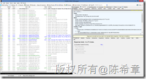

# 优化网站设计（九）：减少DNS查找的次数 
> 原文发表于 2013-05-02, 地址: http://www.cnblogs.com/chenxizhang/archive/2013/05/02/3053996.html 

前言
==

 网站设计的优化是一个很大的话题,有一些通用的原则,也有针对不同开发平台的一些建议。这方面的研究一直没有停止过，我在不同的场合也分享过这样的话题。 作为通用的原则，雅虎的工程师团队曾经给出过35个最佳实践。这个列表请参考 Best Practices for Speeding Up Your Web Site  <http://developer.yahoo.com/performance/rules.html> 同时，他们还发布了一个相应的测试工具Yslow <http://developer.yahoo.com/yslow/> 我强烈推荐所有的网站开发人员都应该学习这些最佳实践，并结合自己的实际项目情况进行应用。 接下来的一段时间，我将结合ASP.NET这个开发平台，针对这些原则，通过一个系列文章的形式，做些讲解和演绎，以帮助大家更好地理解这些原则，并且更好地使用他们。 准备工作
====

 为了跟随我进行后续的学习，你需要准备如下的开发环境和工具 1. Google Chrome 或者firefox ，并且安装 Yslow这个扩展组件.请注意，这个组件是雅虎提供的，但目前没有针对IE的版本。
	1. <https://chrome.google.com/webstore/detail/yslow/ninejjcohidippngpapiilnmkgllmakh> Technorati Tags: [Performance](http://technorati.com/tags/Performance),[Web design](http://technorati.com/tags/Web+design),[ASP.NET](http://technorati.com/tags/ASP.NET)
	
	- <https://addons.mozilla.org/en-US/firefox/addon/yslow/>- 你应该对这些浏览器的开发人员工具有所了解，你可以通过按下F12键调出这个工具。- Visaul Studio 2010 SP1 或更高版本，推荐使用Visual Studio 2012
	1. <http://www.microsoft.com/visualstudio/eng/downloads>- 你需要对ASP.NET的开发基本流程和核心技术有相当的了解，本系列文章很难对基础知识做普及。

 本文要讨论的话题
========

 这一篇我和大家讨论第九个原则：[Reduce DNS Lookups](http://developer.yahoo.com/performance/rules.html#dns_lookups)（减少DNS查找的次数）。 DNS查找是一个较为底层的行为，我们在浏览器中输入某个地址，例如<http://www.cnblogs.com> ，我们的浏览器要能正确地定位到博客园的服务器之前，就必须对这个域名进行解析，很显然它自己是无法解析的，所以它需要通过一定的机制进行查找，这就是为什么我们通常上网之前需要设置DNS服务器的原因。  查找DNS是需要花费时间的，经验的总结是至少需要20毫秒左右的时间。在此期间，浏览器是无法下载其他任何内容资源的。所以浏览器会想办法对DNS的查找结果进行缓存。而除了浏览器的缓存之外，操作系统（例如Windows)也会对DNS查询的结果做缓存。只不过，由于浏览器使用太过频繁，目前的**主流浏览器都使用自己独有的缓存，而不使用操作系统的缓存**。

 1. IE 中默认情况下对DNS的缓存时间为 30分钟。关于如何配置，可以通过阅读[这篇文章](http://support.microsoft.com/kb/263558)了解更多信息。
* 早期的版本设置为1天，与[Windows的设置](http://technet.microsoft.com/en-us/library/cc959517.aspx)一致。 * Windows的DNS缓存，可以通过ipconfig /displaydns 这个命令来查看。

3. Firefox默认的DNS缓存时间据说为1分钟，如果不满意这个选项，直接修改 network.dnsCacheExpiration 即可。 - Google Chrome默认的DNS缓存时间，据我观察也是1分钟，可以通过<chrome://net-internals/#dns> 这个地址查看。

  

 我们可以看到即便同样为浏览器，它们在缓存DNS的问题上也不尽相同（主要体现在时间上面），这个差异到底有什么考虑呢？

 1. 缓存时间较长，有利于重复利用DNS缓存，提高速度。
2. 缓存时间较短，有利于及时地检测到目标站点的IP地址更新，以进行正确的访问。

 所以，两者都有其优点和考虑。

 那么，讲了这么多，了解这个只是对于我们网站设计和优化有何启示呢？

 1. 由于DNS查找是需要时间的，而且它们通常都是只缓存一定的时间，所以应该尽可能地减少DNS查找的次数。
2. 减少DNS查找次数，最理想的方法就是将所有的内容资源都放在同一个域(Domain)下面，这样访问整个网站就只需要进行一次DNS查找，这样可以提高性能。
3. 但理想总归是理想，上面的理想做法会带来另外一个问题，就是由于这些资源都在同一个域，而HTTP /1.1 中推荐客户端针对每个域只有一定数量的并行度（它的建议是2），那么就会出现下载资源时的排队现象，这样就会降低性能。
4. 所以，折衷的做法是：建议在**一个网站里面使用至少2个域，但不多于4个域**来提供资源。我认为这条建议是很合理的，也值得我们在项目实践中去应用。

 我们最后可以来看看博客园主页在这方面的设计

 

 我们看到加载主页的时候，会有47个请求，这些请求分布在不同的主机（HOST），去除重复值之后，有如下11个主机。前5个是与博客园本身有关的，后6个是与广告有关的。

 
>  www.cnblogs.com  
> common.cnblogs.com  
> static.cnblogs.com  
> pic.cnitblog.com  
> passport.cnblogs.com  
> www.google-analytics.com  
> partner.googleadservices.com  
> pubads.g.doubleclick.net  
> static.googleadsserving.cn  
> csi.gstatic.com  
> p4-gg6ayhm2r5hvm-ukushuadvfiqpnzm-if-v6exp3-v4.metric.gstatic.com
> 
> 

