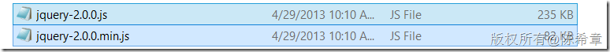
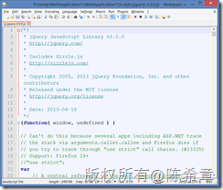
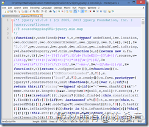
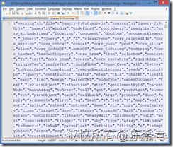
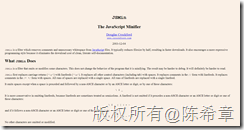
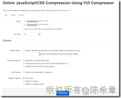
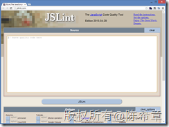
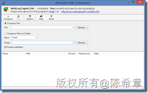

# 优化网站设计（十）：最小化JAVASCRIPT和CSS 
> 原文发表于 2013-05-02, 地址: http://www.cnblogs.com/chenxizhang/archive/2013/05/02/3054141.html 

前言
==

 网站设计的优化是一个很大的话题,有一些通用的原则,也有针对不同开发平台的一些建议。这方面的研究一直没有停止过，我在不同的场合也分享过这样的话题。 作为通用的原则，雅虎的工程师团队曾经给出过35个最佳实践。这个列表请参考**Best Practices for Speeding Up Your Web Site** <http://developer.yahoo.com/performance/rules.html> ，同时，他们还发布了一个相应的测试工具Yslow <http://developer.yahoo.com/yslow/> 我强烈推荐所有的网站开发人员都应该学习这些最佳实践，并结合自己的实际项目情况进行应用。 接下来的一段时间，我将结合ASP.NET这个开发平台，针对这些原则，通过一个系列文章的形式，做些讲解和演绎，以帮助大家更好地理解这些原则，并且更好地使用他们。 准备工作
====

 为了跟随我进行后续的学习，你需要准备如下的开发环境和工具 1. Google Chrome 或者firefox ，并且安装 Yslow这个扩展组件.请注意，这个组件是雅虎提供的，但目前没有针对IE的版本。
	1. <https://chrome.google.com/webstore/detail/yslow/ninejjcohidippngpapiilnmkgllmakh>- <https://addons.mozilla.org/en-US/firefox/addon/yslow/>- 你应该对这些浏览器的开发人员工具有所了解，你可以通过按下F12键调出这个工具。- Visaul Studio 2010 SP1 或更高版本，推荐使用Visual Studio 2012
	1. <http://www.microsoft.com/visualstudio/eng/downloads>- 你需要对ASP.NET的开发基本流程和核心技术有相当的了解，本系列文章很难对基础知识做普及。

 本文要讨论的话题
========

 这一篇我和大家讨论第十个原则：[Minify JavaScript and CSS](http://developer.yahoo.com/performance/rules.html#minify) （最小化JAVASCRIPT和CSS)。

 
>  在开始之前，我闲扯几句：不自觉地就写到了第十篇了，这个系列我觉得是很有必要的，虽然雅虎的这些最佳实践，我在很多年前就看过，也基本上在按照这些原则进行实践。但我观察下来有不少朋友还对此不了解，或者说即便知道这些原则，但具体在应用的时候也遇到些困惑（这些原则之间本身也可能存在“矛盾”）。所以我觉得利用一些时间，结合自己的实践经验，为大家讲解和演绎，文中提到了很多想法，更重要的是我会解释为什么这么做，为什么不那么做等等，希望大家能知其然，也知其所以然。最后我还会提供相应的工具、实践的例子。
> 
> 

 言归正传，"最小化JAVASCRIPT和CSS“ 这条原则主要讲的是，我们应该尽可能地减少这两种文件的体积，以便加快下载速度。

 1. 去除不必要的格式符、空白符、注释符。这个操作，其实可以理解为是一种**格式化**，虽然它操作的结果其实是去除掉原始文件的那些格式。
2. 模糊（Obfuscation）处理JAVASCRIP脚本源代码。

 要理解这个行为，我们可以来看两个文件

 

 这可能是我们最常用的两个脚本文件了。其实他们是同一个脚本文件，作为约定，带有min字样的脚本文件我们通常称为“压缩过的版本”——需要注意的是，这与“[优化网站设计（四）：对资源启用压缩](http://www.cnblogs.com/chenxizhang/archive/2013/05/01/3052881.html)”这篇文章中谈到的压缩不是同一个概念。从他们的体积上可以看出来，“压缩”比可以高达 65%，这可以节省很多的网络流量，以及宝贵的下载时间。

 那么这种“压缩”是如何做到的呢？我们通过查看两个文件就可了解

 

 原始文件，我们通常称为“格式良好”的脚本文件，里面包含了8756行，有着丰富的注释，换行符等，这种格式很易于阅读和理解，他同时也可以为开发工具（例如Visual Studio)提供智能感知方面的支持。我们再来看“压缩”过之后的文件。

 

 这个文件只包含6行，如果将顶部的几句注释也去除掉，实际上只有3行代码，并且我们可以看到这些代码是被处理过的，因为那些方法名，参数名都被处理成了尽可能简短的名称。很显然这样的代码不适合人类阅读，但对于计算机，具体来说是浏览器的JAVASCRIPT执行引擎来说是没有问题的。如果你有兴趣了解这些名称的映射关系，可以参考另外一个文件（jquery-2.0.0.min.map)

 

  

 看起来你理解了这样做的好处，也大致知道怎么做了吧。虽然如此，我们不可能人工去做这样的事情，这个挑战太高了。通常我们会借助一些工具来实现，例如文章中提到的两个工具

 1. [JSMin](http://crockford.com/javascript/jsmin) ： 这个工具的名气较大，可以对JAVASCRIPT进行最小化处理。

 

 1. [YUI Compressor](http://developer.yahoo.com/yui/compressor/)  ： 这个不仅仅可以对JAVASCRIPT进行压缩，也可以对CSS进行压缩。很遗憾，它是一个java工具，可能在使用上面会有些限制。但你可以通过另外一个地址使用在线的版本：<http://refresh-sf.com/yui/>

 

 值得一提的是，在进行JAVASCRIPT的最小化处理（尤其是要进行模糊处理）之前，需要确保脚本文件的语法合法性，并且强烈建议将该文件复制一份作为备用，因为通常这些操作都是不可逆的。

 为了检查脚本中的语法合法性，可以使用另外一个工具JSLint

 

 这个工具有针对Visual Studio 的插件，你可以通过扩展管理器进行安装。

 

  

 我最后要补充一下，除了对JAVASCRIPT和CSS做这种最小化之外，我们有时候可能也会对HTML标记文本做最小化处理（主要是格式化），此时可以使用下面这个工具：Absolute HTML Compressor

 

