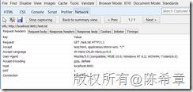
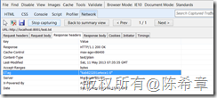
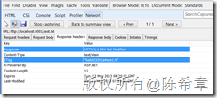
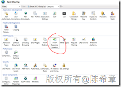
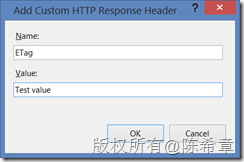
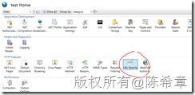
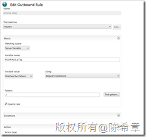

# 优化网站设计（十三）：配置ETags 
> 原文发表于 2013-05-11, 地址: http://www.cnblogs.com/chenxizhang/archive/2013/05/11/3072898.html 

前言
==

 网站设计的优化是一个很大的话题,有一些通用的原则,也有针对不同开发平台的一些建议。这方面的研究一直没有停止过，我在不同的场合也分享过这样的话题。 作为通用的原则，雅虎的工程师团队曾经给出过35个最佳实践。这个列表请参考**Best Practices for Speeding Up Your Web Site** <http://developer.yahoo.com/performance/rules.html>，同时，他们还发布了一个相应的测试工具Yslow <http://developer.yahoo.com/yslow/> 我强烈推荐所有的网站开发人员都应该学习这些最佳实践，并结合自己的实际项目情况进行应用。 接下来的一段时间，我将结合ASP.NET这个开发平台，针对这些原则，通过一个系列文章的形式，做些讲解和演绎，以帮助大家更好地理解这些原则，并且更好地使用他们。 准备工作
====

 为了跟随我进行后续的学习，你需要准备如下的开发环境和工具 1. Google Chrome 或者firefox ，并且安装 Yslow这个扩展组件.请注意，这个组件是雅虎提供的，但目前没有针对IE的版本。
	1. <https://chrome.google.com/webstore/detail/yslow/ninejjcohidippngpapiilnmkgllmakh>- <https://addons.mozilla.org/en-US/firefox/addon/yslow/>- 你应该对这些浏览器的开发人员工具有所了解，你可以通过按下F12键调出这个工具。- Visaul Studio 2010 SP1 或更高版本，推荐使用Visual Studio 2012
	1. <http://www.microsoft.com/visualstudio/eng/downloads>- 你需要对ASP.NET的开发基本流程和核心技术有相当的了解，本系列文章很难对基础知识做普及。

 本文要讨论的话题
========

 这一篇我和大家讨论的是第十三条原则：[Configure ETags](http://developer.yahoo.com/performance/rules.html#etags) （配置ETags）。 [ETag](http://en.wikipedia.org/wiki/HTTP_ETag)，全称为：Entity Tag，意思是实体标签，从名字上看，是对于某种实体的一个标识。它属于HTTP协议的一部分，也就是所有的Web服务器都应该（也确实能）支持这个特性。它的作用是用一个特殊的字符串来标识某个资源的“版本”，客户端（浏览器）来请求的时候，可以比较，如果ETag一致，则表示该资源并没有修改过，客户端（浏览器）可以使用自己缓存的版本。

 工作原理
----

 我们通过实例来了解ETag的工作原理，当用户第一次请求某个资源（通常为静态资源）的时候

 

 正常情况下，他将得到一个状态码为200的响应，并且在响应头部中会包含一个ETag的信息（ETag    "**6ab823201a4ece1:0**"）

 

 【备注】这个值是我本机的IIS 8.0提供，不同的服务器可能会有所不同。我后面会解释大致的含义。

  

 接下来，如果用户再次请求这个资源的话，浏览器会尝试在请求头部中包含这个信息，以便服务器可以比较，确定是要再次发送资源的内容。

 

 我们注意这一行 If-None-Match    "**6ab823201a4ece1:0**"

 然后，服务器会怎么样响应这个请求呢？

 

 服务器实际上是比较了ETag的值，它发现浏览器提供的值与该资源实际的值是一样的，所以它就返回了304的状态码，而且不需要在响应的正文里面包含任何实际内容。浏览器得到304这个状态码之后，就知道该资源并没有被修改，所以直接使用本地缓存的版本。

  

 ETag的配置
-------

 在IIS产品家族中，新的版本（例如IIS 7以后的版本）会自动配置一个ETag，这个ETag的值很类似于下面这样：

 **6ab823201a4ece1:0**

 它是由两个部分组成的

 1. 第一部分称为FileTimeStamp（时间戳），我们很容易联想到这可能是跟文档修改时间有关系，事实上确实是，但你无法将其直接还原为文档修改时间（微软并没有公开这部分的算法）。我确实对此做过一些研究，但最终还是没有办法解释这个值如何生成的，所以大家也只需要知道，这个是类似于一个时间戳的值就可以了。 - 第二部分为ChangeNumber（修改编号）。这个值在IIS 7.0以及后续的版本中，被统一设置为0。设置为一个统一值有利于解决一些问题（例如在服务器场模式下，该问题我后续也会讨论到）。事实上，保留这个ChangeNumber我觉得主要是历史遗留问题，因为早期版本是有这个值，而且可以不一样。既然如果这个值不一样的话，会给我们惹一些麻烦，那么其实最好的做法是干脆就不要这个字段了。但我想，为了保持格式上的一贯性，微软最终保留了这个字段。

  

 这个默认的ETag不需要任何的配置就会存在（反过来，你如果要删除它倒是很不容易，这个问题后续也会提到），但我们可以继续添加自己想要的特殊ETag。也就是说，对于一个资源，实际上是可以有多个ETag的。我们看看在IIS 中的设置。

 

 

 你可以在这里设置任意的值。

 我们可以预见到，如果这样设置的话，那么在响应的头部中应该就会有多个ETag了。如下图所示

 

  

 ETag与其他技术的比较
------------

 经过上面的介绍，大家应该知道ETag的功能，主要能提供对资源的版本标识，以避免无谓的重复下载。这从一定意义上，肯定是有利的，它可以提高性能。

 如果这样的话，那么它和“[优化网站设计（三）：对资源添加缓存控制](http://www.cnblogs.com/chenxizhang/archive/2013/04/30/3052440.html)” 中提到过的一些技术比较起来，有什么自己的特点呢？

 

| 响应标头 | 优势 和特点 | 劣势 和可能的问题 |
| Expires | * HTTP 1.0就有，简单易用。 * 服务器通过这个Header告诉浏览器，某资源直到某个时间才会过期，所以在没有过期之前，浏览器就直接使用本地的缓存了。
 | * 因为这是时间是由服务器发送的（UTC），但如果服务器时间和客户端事件存在不一致，可能会有些问题。 * 可能存在版本的问题，因为如果在到期之前修改过了，客户端是不会知道的。 * Cache-Control中的max-age可以实现类似的效果，但更加好，因为max-age是一个以秒为单位的时间数，而不是具体的时间，所以不存在上面提到的第一个问题。
 |
| Cache-Control | * 服务器通过一个Header（Last-Modified）告诉浏览器，某资源最后修改的时间 * 浏览器在请求的时候，包含一个Header（If-Modified-Since）,然后服务器可以进行比较，如果在该时间后没有修改过，则返回304 * 它比Expires多很多选项设置
 | * Last-Modified 也是一个时间，但该时间只能精确到秒，如果在同一个秒中有多次修改（这个在现在的环境下应该确实是可能的），则可能会发生问题。
 |
| ETag | * 可以更加精确地判断资源是否被修改，因为它不是一个时间值，而是对时间经过处理的一个长整型数值（当然具体算法我们目前还不得而知） * 浏览器发起新请求时需要包含 If-None-Match
 | * 如果部署在服务器场环境中，配置不当的话，可能每个服务器会对相同的资源生成不一样的ETag，这样就增加了重复下载的可能性。要理解这个问题的原因，以及如何解决，请参考这里的文档：<http://support.microsoft.com/kb/922703/en-us>* 该问题在IIS 7以及以后的版本中应该不存在了
 |

 这几个技术其实很多时候是会结合起来用的，而且优先级也有所不同。通常，ETag是优先于Cache-Control的，而Cache-Control又是优先于Expires的

 

  

  

 何时以及如何删除ETag的功能？
----------------

 由于之前谈到可能的一些问题，雅虎团队在当年写这个原则的时候，是建议在服务器场的环境下面禁用ETag的，在Apache中，可以通过修改配置文件来实现。而在IIS 中，如果你所使用的是7.0以及后续的版本，实际上应该可以不禁用，因为现在不会存在他们所提到的那个问题了。但如果你真的想要了解一下如何禁用，那么请参考下面的操作

 1. 安装这个扩展：<http://www.iis.net/downloads/microsoft/url-rewrite>
2. 创建一个地址重写规则

 
>  
> 
>  
> 
>  
> 
> 

 这样配置了之后，就不会再有ETag，整个世界清静了。

