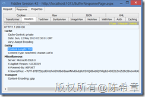
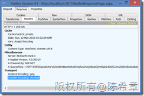

# 优化网站设计（十五）：尽可能早地发送缓冲区内容 
> 原文发表于 2013-05-12, 地址: http://www.cnblogs.com/chenxizhang/archive/2013/05/12/3073836.html 


前言
==

 网站设计的优化是一个很大的话题,有一些通用的原则,也有针对不同开发平台的一些建议。这方面的研究一直没有停止过，我在不同的场合也分享过这样的话题。 作为通用的原则，雅虎的工程师团队曾经给出过35个最佳实践。这个列表请参考**Best Practices for Speeding Up Your Web Site** <http://developer.yahoo.com/performance/rules.html>，同时，他们还发布了一个相应的测试工具Yslow <http://developer.yahoo.com/yslow/> 我强烈推荐所有的网站开发人员都应该学习这些最佳实践，并结合自己的实际项目情况进行应用。 接下来的一段时间，我将结合ASP.NET这个开发平台，针对这些原则，通过一个系列文章的形式，做些讲解和演绎，以帮助大家更好地理解这些原则，并且更好地使用他们。 准备工作
====

 为了跟随我进行后续的学习，你需要准备如下的开发环境和工具 1. Google Chrome 或者firefox ，并且安装 Yslow这个扩展组件.请注意，这个组件是雅虎提供的，但目前没有针对IE的版本。
	1. <https://chrome.google.com/webstore/detail/yslow/ninejjcohidippngpapiilnmkgllmakh>- <https://addons.mozilla.org/en-US/firefox/addon/yslow/>- 你应该对这些浏览器的开发人员工具有所了解，你可以通过按下F12键调出这个工具。- Visaul Studio 2010 SP1 或更高版本，推荐使用Visual Studio 2012
	1. <http://www.microsoft.com/visualstudio/eng/downloads>- 你需要对ASP.NET的开发基本流程和核心技术有相当的了解，本系列文章很难对基础知识做普及。

 本文要讨论的话题
========

 这一篇我和大家讨论的是第十五条原则：[Flush Buffer Early](http://developer.yahoo.com/performance/rules.html#flush) （尽可能早地发送缓冲区内容）。 这是一条相对简单的原则，它所涉及到的一个概念叫做缓冲区（Buffer）。我们首先来了解一下缓冲区的含义，以及相应的优点和缺点。   什么是缓冲？
------

 缓冲是伴随着HTTP技术发展的一个基础概念，当我们通过一个地址请求某个在远程服务器的资源的时候，默认情况下，服务器是需要先将所请求资源的内容全部读取到内存中（这个过程就叫做缓冲），然后再一次性地发送给浏览器。 在启用缓冲这个功能的情况下，因为内容是完全准备好了才发送的，所以在响应头部中，可以明确地记录内容长度(Content-Length) [](http://images.cnitblog.com/blog/9072/201305/12114439-67f6499ac3644c5ca383c35ccbf2f702.png) 而如果没有启用缓冲会怎么样呢？ [](http://images.cnitblog.com/blog/9072/201305/12114440-5ccbaaef4a214c2e88ad4c2fe9b8b0df.png) 我们看到，此时在头部中是没有内容长度（Content-Length）的信息的，因为没有缓冲，所以HTTP协议规定，传输是按照“块（chunk)”的方式来进行的。所以我们就可以看到在上图中会有一个Transfer-Encoding的信息。   如何启用或禁用缓冲？
----------

 在ASP.NET开发中，默认所有页面都是启用缓冲的，如果需要明确地禁用缓冲，则可以修改页面的定义如下


```
<%@ Page Language="C#" AutoEventWireup="true" CodeBehind="BufferResponsePage.aspx.cs" Inherits="WebApplication4.BufferResponsePage" **Buffer="false"** %>
```

.csharpcode, .csharpcode pre
{
 font-size: small;
 color: black;
 font-family: consolas, "Courier New", courier, monospace;
 background-color: #ffffff;
 /*white-space: pre;*/
}
.csharpcode pre { margin: 0em; }
.csharpcode .rem { color: #008000; }
.csharpcode .kwrd { color: #0000ff; }
.csharpcode .str { color: #006080; }
.csharpcode .op { color: #0000c0; }
.csharpcode .preproc { color: #cc6633; }
.csharpcode .asp { background-color: #ffff00; }
.csharpcode .html { color: #800000; }
.csharpcode .attr { color: #ff0000; }
.csharpcode .alt 
{
 background-color: #f4f4f4;
 width: 100%;
 margin: 0em;
}
.csharpcode .lnum { color: #606060; }

  如何在启用缓冲的前提下手工地分段发送缓冲区内容？
------------------------


缓冲的功能，是很有意思的，就是说即便我们启用了缓冲（默认就是这样的），也可以根据需要在页面或者代码中，明确地分段发送缓冲内容。例如下面这个做法
```
<%@ Page Language="C#" AutoEventWireup="true" CodeBehind="BufferResponsePage.aspx.cs" Inherits="WebApplication4.BufferResponsePage" **Buffer="true"** %>

<!DOCTYPE html>

<html xmlns="http://www.w3.org/1999/xhtml">
<head runat="server">
    <title></title>
</head>
    <!--明确地手工发送缓冲区内容，就是先将头部的内容先发送给浏览器-->
    **<% Response.Flush(); %>**
<body>这里是正文内容</body>
```

.csharpcode, .csharpcode pre
{
 font-size: small;
 color: black;
 font-family: consolas, "Courier New", courier, monospace;
 background-color: #ffffff;
 /*white-space: pre;*/
}
.csharpcode pre { margin: 0em; }
.csharpcode .rem { color: #008000; }
.csharpcode .kwrd { color: #0000ff; }
.csharpcode .str { color: #006080; }
.csharpcode .op { color: #0000c0; }
.csharpcode .preproc { color: #cc6633; }
.csharpcode .asp { background-color: #ffff00; }
.csharpcode .html { color: #800000; }
.csharpcode .attr { color: #ff0000; }
.csharpcode .alt 
{
 background-color: #f4f4f4;
 width: 100%;
 margin: 0em;
}
.csharpcode .lnum { color: #606060; }

  同理，既然上述做法行得通，那么在代码中也是可以调用Response.Flush方法来分段发送内容的。如果你要输出很大的一段内容的时候。
分段发送缓冲区内容的做法，可以尽量充分地利用浏览器的资源，减少闲置的时间。因为浏览器在请求页面的时候，如果页面的内容是需要完全缓冲后再返回（最起码也应该会有200毫秒左右），那么浏览器此时就会进行一个闲置状态，什么事情都不会做。
【备注】现在的浏览器已经越来越强大了，主流的几个浏览器，每个选项卡都会有独立的进程，这在性能和稳定性方面的提升也是明显的。


