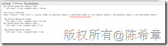

# 优化网站设计（十八）：预加载内容 
> 原文发表于 2013-05-16, 地址: http://www.cnblogs.com/chenxizhang/archive/2013/05/16/3082402.html 


前言
==

 网站设计的优化是一个很大的话题,有一些通用的原则,也有针对不同开发平台的一些建议。这方面的研究一直没有停止过，我在不同的场合也分享过这样的话题。 作为通用的原则，雅虎的工程师团队曾经给出过35个最佳实践。这个列表请参考**Best Practices for Speeding Up Your Web Site**<http://developer.yahoo.com/performance/rules.html>，同时，他们还发布了一个相应的测试工具Yslow <http://developer.yahoo.com/yslow/> 我强烈推荐所有的网站开发人员都应该学习这些最佳实践，并结合自己的实际项目情况进行应用。 接下来的一段时间，我将结合ASP.NET这个开发平台，针对这些原则，通过一个系列文章的形式，做些讲解和演绎，以帮助大家更好地理解这些原则，并且更好地使用他们。 准备工作
====

 为了跟随我进行后续的学习，你需要准备如下的开发环境和工具 1. Google Chrome 或者firefox ，并且安装 Yslow这个扩展组件.请注意，这个组件是雅虎提供的，但目前没有针对IE的版本。
	1. <https://chrome.google.com/webstore/detail/yslow/ninejjcohidippngpapiilnmkgllmakh>- <https://addons.mozilla.org/en-US/firefox/addon/yslow/>- 你应该对这些浏览器的开发人员工具有所了解，你可以通过按下F12键调出这个工具。- Visaul Studio 2010 SP1 或更高版本，推荐使用Visual Studio 2012
	1. <http://www.microsoft.com/visualstudio/eng/downloads>- 你需要对ASP.NET的开发基本流程和核心技术有相当的了解，本系列文章很难对基础知识做普及。

 本文要讨论的话题
========

 这一篇我和大家讨论的是第十六条原则：[Preload Components](http://developer.yahoo.com/performance/rules.html#preload) （预加载内容） 我在上一篇文章（[优化网站设计（十七）：延迟或按需加载内容](http://www.cnblogs.com/chenxizhang/archive/2013/05/16/3081941.html)）中谈到了如何设计延迟或者按需加载的策略（针对脚本，样式表，图片），来实现页面的快速加载。看起来，本文要讨论的原则与上一条原则是相悖的，但其实不然。它们并不冲突，而且是为了实现不同的目标。这条原则只要理解了，要做起来实际上是比较简单的。 其实**预加载**这样的策略，在很多地方都会用到。例如典型的数据库访问的情况，会有所谓的“预读”行为。我可以给大家以SQL Server为例，解释一下什么叫“预读（Read Ahead)”，然后以此类比到网页加载中，我相信大家就很容易理解了。 SQL Server为了提高数据读取效率，在第一次编译查询语句，并缓存执行计划的时候，会尝试读取一部分数据到缓存中，这样的话，如果该查询语句真的需要执行，因为有部分数据已经缓存起来了，则总的数据读取量就自然少了，以此可以提高性能。 关于Read Ahead，你可以参考这里的文档说明：<http://msdn.microsoft.com/en-us/library/ms191475(v=SQL.105).aspx> 下面这个截图就是我在执行某个查询的时候，从执行统计中看到的一些有意思的信息
```
[](http://images.cnitblog.com/blog/9072/201305/16183748-3476daec2fd1472392df79eb0778c5c2.png)
```

好的，回到我们今天的话题，为什么需要预先加载内容呢？想象一下我们使用搜索引擎的场景吧：


1. 我们通常会先登录到搜索引擎的主页
2. 搜索引擎的主页通常是比较简单的（Google开创了这样一个设计风格，整个页面只有一个搜索框）
3. 所以，主页加载应该是比较快的（因为东西很少）。而且，从用户进入主页，到输入关键字进行查询，会有一定点时间，期间浏览器其实是较为空闲的。
4. 当我们在搜索框中输入关键字之后，会被转到结果页面
5. 结果页面的内容通常是比较多的，如果全部要在结果页面显示的时候，才加载，可能会比较慢


既然如此，我们能不能将原先要在结果页面中加载的内容（如脚本，图片，样式等），通过某种方式，在用户请求主页的时候，就预先加载好。这样，当用户真的需要显示结果页面的时候，因为已经有了缓存，所以就不需要再加载了。


那么，你知道怎么做了吗？


 


还有一个可能与此原则相关的做法，我们知道通常ASP.NET的网站第一次加载都较慢，因为它需要进行编译。为了能优化这些网站的加载速度，我们有一种做法叫做“预热”，简单来说，模拟用户去预先请求每个页面，让服务器的编译尽可能早地发生，这样用户再来访问的时候，就不需要再编译了。


如果你使用了SharePoint，则可以下载下面的这个脚本


<http://gallery.technet.microsoft.com/office/SharePoint-2007-2010-or-d1884b4b>


实际上，上面的脚本，还可以再做修改。至少这个思路值得我们借鉴了。


 


同时 ，如果你使用了IIS 7.5，可以通过安装下面这个组件（**Application Initialization Module for IIS 7.5**），来提高网站第一次访问时的性能


<http://www.iis.net/downloads/microsoft/application-initialization>


 


 


 


  
 


.csharpcode, .csharpcode pre
{
 font-size: small;
 color: black;
 font-family: consolas, "Courier New", courier, monospace;
 background-color: #ffffff;
 /*white-space: pre;*/
}
.csharpcode pre { margin: 0em; }
.csharpcode .rem { color: #008000; }
.csharpcode .kwrd { color: #0000ff; }
.csharpcode .str { color: #006080; }
.csharpcode .op { color: #0000c0; }
.csharpcode .preproc { color: #cc6633; }
.csharpcode .asp { background-color: #ffff00; }
.csharpcode .html { color: #800000; }
.csharpcode .attr { color: #ff0000; }
.csharpcode .alt 
{
 background-color: #f4f4f4;
 width: 100%;
 margin: 0em;
}
.csharpcode .lnum { color: #606060; }


