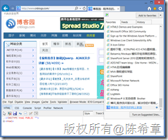
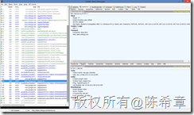

# 优化网站设计（三十二）：使favicon.ico文件尽可能小并且可以缓存 
> 原文发表于 2013-05-20, 地址: http://www.cnblogs.com/chenxizhang/archive/2013/05/20/3087965.html 

前言
==

 网站设计的优化是一个很大的话题,有一些通用的原则,也有针对不同开发平台的一些建议。这方面的研究一直没有停止过，我在不同的场合也分享过这样的话题。 作为通用的原则，雅虎的工程师团队曾经给出过35个最佳实践。这个列表请参考Best Practices for Speeding Up Your Web Site  （<http://developer.yahoo.com/performance/rules.html>），同时，他们还发布了一个相应的测试工具Yslow <http://developer.yahoo.com/yslow/> 我强烈推荐所有的网站开发人员都应该学习这些最佳实践，并结合自己的实际项目情况进行应用。 接下来的一段时间，我将结合ASP.NET这个开发平台，针对这些原则，通过一个系列文章的形式，做些讲解和演绎，以帮助大家更好地理解这些原则，并且更好地使用他们。 准备工作
====

 为了跟随我进行后续的学习，你需要准备如下的开发环境和工具 1. Google Chrome 或者firefox ，并且安装 [Yslow](http://yslow.org/ruleset-matrix/) 这个扩展组件.请注意，这个组件是雅虎提供的，但目前没有针对IE的版本。
	1. <https://chrome.google.com/webstore/detail/yslow/ninejjcohidippngpapiilnmkgllmakh>- <https://addons.mozilla.org/en-US/firefox/addon/yslow/>- 你应该对这些浏览器的开发人员工具有所了解，你可以通过按下F12键调出这个工具。- Visaul Studio 2010 SP1 或更高版本，推荐使用Visual Studio 2012
	1. <http://www.microsoft.com/visualstudio/eng/downloads>- 你需要对ASP.NET的开发基本流程和核心技术有相当的了解，本系列文章很难对基础知识做普及。

 本文要讨论的话题
========

 这一篇我和大家讨论的是第三十二条原则：[Make favicon.ico Small and Cacheable](http://developer.yahoo.com/performance/rules.html#favicon) （使favicon.ico文件尽可能小并且可以缓存）。 在“[优化网站设计（二十二）：避免404错误](http://www.cnblogs.com/chenxizhang/archive/2013/05/17/3084052.html)”文中，我提到了favicon.ico文件，但并没有更详细地展开。通常每个网站都应该有这个文件，这个文件主要用来显示在浏览器地址栏中,或者收藏之后的图标. 如下图所示  关于这个文件的详细信息，有兴趣的朋友可以参考<http://zh.wikipedia.org/zh-cn/Favicon>，我整理总结如下： 1. 每个网站都应该有该文件，浏览器在访问任何页面的时候，总是会尝试去请求这个文件（如果本地没有的话）。
2. 该文件通常应该命名为favicon.ico ，如果希望使用别的名称或者格式（例如PNG），则需要在页面的头部(Head)中定义引用（下面两句中的第一句是必须的）
* <link rel="shortcut icon" href="http://example.com/favicon.ico" type="image/vnd.microsoft.icon">
* <link rel="icon" href="http://example.com/favicon.ico" type="image/vnd.microsoft.icon">

4. 该文件可以直接放在网站根目录，但也可以放在其他的主机，或者你想要的任何位置。如果不在默认的根目录下面，也是需要通过上面所提到的引用方式定义。

  

 由于该文件的这些特性，所以我们有三条优化的建议

 1. 使它尽量在1KB左右。想比较其他的格式（PNG,GIF等），该文件默认的格式为ico，这种文件通常较小，强烈建议使用。要创建favicon.ico文件,我推荐大家使用 <http://www.favicon.cc/> 提供的在线免费服务.
2. 使它能够缓存. 由于该文件使用很频繁, 所以缓存显得很重要. 关于这一点,可以参考 [优化网站设计（三）：对资源添加缓存控制](http://www.cnblogs.com/chenxizhang/archive/2013/04/30/3052440.html) 的详细介绍. 对于这个文件而言,可以设置永不过期(或者过期时间长一些).
3. 将该文件放在单独的主机中,例如 images.mydomain.com . 这样可以避免在请求该文件时发送cookie. 关于这一点,请参考 [优化网站设计（二十四）：通过使用不同的主机减少对cookie的使用](http://www.cnblogs.com/chenxizhang/archive/2013/05/19/3086514.html)

 我们可以来看一个综合的例子,仍然以博客园为例.

 

 1. 他们采用的是favicon.ico这种文件格式, 目前的体积为:5430字节,相当于5KB左右。这一点是有优化空间的。
2. 他们为该文件设置了缓存策略：Cache-Control: max-age=2592000 ，这个相当于是30天（近似一个月）。这个文件其实更改的机会很小的，缓存时间应该可以更长。
3. 他们将该文件放在了static.cnblogs.com ，这样可以避免发送cookie。

