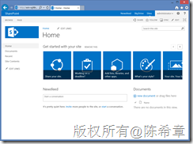

# SharePoint Server 2013发现之旅系列文章的概述和相关资源 
> 原文发表于 2013-05-26, 地址: http://www.cnblogs.com/chenxizhang/archive/2013/05/26/3100195.html 

SharePoint 2013这个新的版本推出也有一段时间了，期间我自己做了研究和学习，并且也给一些感兴趣的客户做了有关的培训。和之前的几次升级一样，这个版本毫无疑问也带来了不少令人眼前一亮、赏心悦目的新功能，目前已经有部分客户已经在进行升级工作（从SharePoint 2010），总体来说，这个升级过程还是比较平稳的。

 我计划花一些时间写这个系列文章，以便更多的朋友作为参考。这些文章虽然不可能面面俱到，但至少能给出一些框架，以及相关的资源，当然同时也有我的一些经验和见解。

 需要说明的是，微软官方也提供了很多学习资源，无需避讳，我们自己也是通过这些资源进行了学习和研究。我推荐给大家两个很好的资源：

 1. 针对IT 专业人士的视频 <http://technet.microsoft.com/en-US/sharepoint/fp123606>
2. 针对开发人员的视频 <http://msdn.microsoft.com/en-US/office/apps/fp123626>

 这个系列文章也将主要从管理运维角度以及解决方案开发这两个角度（但是内容并不是完全和官方的视频一样），带领大家对这个新版本的基础架构、管理维护、开发、部署等方面做些讲解。

 为了跟随这个系列文章的学习，也为了你能够亲自体验这个新版本的特性，你可能需要安装一个自己的实验环境，你可以参考下面的资源

 1. 安装程序 <http://technet.microsoft.com/en-us/evalcenter/hh973397.aspx> （180天试用版，含密钥）
2. 软硬件要求 <http://technet.microsoft.com/library/cc262485(office.15).aspx>

 SharePoint 2013的安装过程与2010基本类似（但是进度更简单，时间更短），首先需要安装一些基础组件，然后会有一个安装向导，作为实验学习的目的，你可以将所有组件都安装在一个机器上。

 为了较为全面地使用SharePoint，你可能还需要安装如下的一些软件或者工具

 1. SharePoint Designer 2013 <http://www.microsoft.com/en-us/download/details.aspx?id=35491>
2. Visual Studio 2012 <http://www.microsoft.com/visualstudio/chs/downloads#d-2012-editions>
3. Office 2013 Plus <http://technet.microsoft.com/en-us/evalcenter/jj192782.aspx>

 【备注】值得一说的是，在我们自己以及帮助我们的客户实施这个新版本的时候，和其他一些客户一样，我们也发现它存在一些细节方面的小问题。微软已经提供了这方面的问题列表，并且给出了一些相应的解决方案，请参考 

 1. SharePoint Server 2013 已知问题列表 <http://office.microsoft.com/zh-cn/sharepoint-server-help/HA102919021.aspx>
2. SharePoint Foundation 2013 已知问题列表 <http://office.microsoft.com/zh-cn/help/HA102919008.aspx?CTT=5&origin=HA102919021>

 最后，访问SharePoint 网站虽然对浏览器的兼容性已经越来越好了，但如果你能安装IE 9或更高版本，我相信将获得更加好的浏览体验。

 那么，就让我们开始吧，下面这个截图是安装配置好之后，建立的默认网站界面。祝你好运，希望你也看到了这个页面。

 

