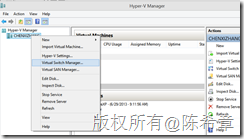
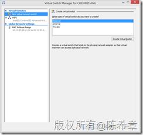
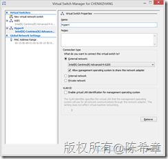
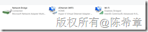
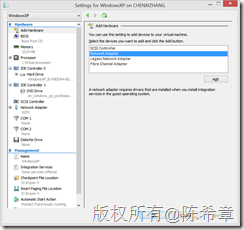
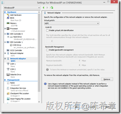
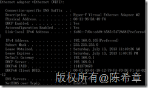

# 如何配置Hyper-V的虚拟机通过主机网络上网 (NAT) 
> 原文发表于 2013-07-13, 地址: http://www.cnblogs.com/chenxizhang/archive/2013/07/13/3188005.html 

前言
==

 最近开始在Windows 8 上面直接使用Hyper-V的技术来建立虚拟环境进行开发和测试，这样免去了再安装额外软件的需要。在实际使用的时候，尤其是配置网络共享的时候，遇到些问题，与其他一些虚拟机软件不同。特此记录一下这个典型的配置场景（虚拟机通过主机网络上网，类似于NAT的一种做法）

 【备注】NAT是在其他的虚拟机软件中的说法，Hyper-V中没有这个说法

 关于Windows 8中的Hyper-V的功能，以及如何启用此功能，如果不清楚，请参考 <http://technet.microsoft.com/en-us/library/hh857623.aspx>

  

 配置步骤
====

 第一步：添加一个虚拟交换机（Virtual Switch )
------------------------------

 【备注】其实我觉得这里翻译为虚拟交换机可能并不恰当，但是在中文版中的菜单确实是这样称呼的，所以我就不另外翻译，以免产生歧义。

 

 在接下来出来的对话框中，选择“New virtual network switch”,并且选择 “Extenal” 这种类型

 ，然后点击“Create Virtual Switch”

 

 在接下来的对话框中，设置Extenal network连接到主机的某个网卡

 

 【注意】请选择你当前正在用于上网的网卡名称（可能是有线网卡，也可能是无线网卡）

 点击“Apply”之后，会有一个处理过程，而且你当前主机的网络会暂时断开。实际上，Hyper-V会建立一个虚拟网卡，并且让它与你现有的上网的那个网卡做一个桥接。

 

  

 第二步：在虚拟机中使用该虚拟网卡
----------------

 在虚拟机的属性中，选择添加硬件

 

 接着在界面中选择你之前添加到虚拟网卡即可

 

  

 通常这样做了就可以了。但也许你运行起来虚拟机之后发现网络还是不通，具体症状就是可能会收到一个IP地址冲突的错误。这个时候，你可以手工地设置IP地址来解决。

 在设置之前，你可以先在主机上面，通过ipconfig /all 这个命令，查看一下虚拟网卡的地址（因为你要设置一个与它不同的地址），Subset mask 和 Default Gateway、DNS Servers 要设置成一样。

 

  

 希望对大家有些帮助

