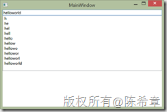
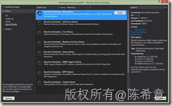
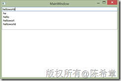

# 牛刀小试：使用Reactive Extensions（Rx），对短时间内多次发生的事件限流 
> 原文发表于 2013-08-25, 地址: http://www.cnblogs.com/chenxizhang/archive/2013/08/25/3280459.html 


我之前有一篇文章介绍到了Reactive Extension这个组件，请参考下面的文章，其中有一些基本的概念和相关的链接 

 #### [牛刀小试：使用Reactive Extensions（Rx），一行代码实现多线程任务执行规定时间后自动停止](http://www.cnblogs.com/chenxizhang/archive/2012/09/19/2694062.html)

  

 Rx 目前还没有直接整合到.NET Framework 中，仍然是作为单独的组件存在。至于以后会不会，谁知道呢？我个人希望是可以整合进去。

 不管怎么样，我今天还是以实例来讲解这个组件的使用，如果以后有更多有意思的场景，我也会用文章分享出来。

 我们要解决的问题
--------

 在.NET应用程序开发期间，我们会大量地使用到事件，而且很多事件可能会不止一次地发生，例如TextChanged事件，KeyPress事件，MouseDown事件等等。

 由于这些事件会多次发生，在某些场景下，如果每次都进行响应可能有负面的一些问题，例如性能问题。一个典型的案例是：假如我们需要根据TextChanged的事件去调用一个外部的服务，我们知道用户可以在一个很短的时间内（例如1秒内）快速输入很多的字符，同时还可能会删除字符，该事件会在每次发生更改的时候触发，如果按照传统的做法，每次都去调用服务，显然是不合适的，这样会有很多的服务请求。所以，我们可能希望，在某个时间范围内（例如1秒），只触发一次。

 为了做这个演示，我做了如下的一个界面（WPF）


```
<Window x:Class="WpfApplicationSample.MainWindow"
        xmlns="http://schemas.microsoft.com/winfx/2006/xaml/presentation"
        xmlns:x="http://schemas.microsoft.com/winfx/2006/xaml"
        Title="MainWindow"
        Height="350"
        Width="525">
    <StackPanel>
        <TextBox Name="txtInput"
                 TextChanged="txtInput\_TextChanged"></TextBox>

        <RichTextBox Name="txtOutput">

        </RichTextBox>

    </StackPanel>
</Window>

```

后台代码我简单地做了一个处理（我并没有真的去调用服务，而是做一个结果打印）


```
using System.Windows;
using System.Windows.Controls;

namespace WpfApplicationSample
{
    /// <summary>
    /// Interaction logic for MainWindow.xaml
    /// </summary>
    public partial class MainWindow : Window
    {
        public MainWindow()
        {
            InitializeComponent();
        }

        private void txtInput\_TextChanged(object sender, TextChangedEventArgs e)
        {
            txtOutput.AppendText(txtInput.Text+"\r");
        }
    }
}

```

运行起来可以看到如下的效果
.csharpcode, .csharpcode pre
{
 font-size: small;
 color: black;
 font-family: consolas, "Courier New", courier, monospace;
 background-color: #ffffff;
 /*white-space: pre;*/
}
.csharpcode pre { margin: 0em; }
.csharpcode .rem { color: #008000; }
.csharpcode .kwrd { color: #0000ff; }
.csharpcode .str { color: #006080; }
.csharpcode .op { color: #0000c0; }
.csharpcode .preproc { color: #cc6633; }
.csharpcode .asp { background-color: #ffff00; }
.csharpcode .html { color: #800000; }
.csharpcode .attr { color: #ff0000; }
.csharpcode .alt 
{
 background-color: #f4f4f4;
 width: 100%;
 margin: 0em;
}
.csharpcode .lnum { color: #606060; }


[](http://images.cnitblog.com/blog/9072/201308/25095359-2d7a0748fb48452699838316fc9ee523.png)


 


传统的方案
-----


针对这样的一种需求，我们按照传统的思路该如何实现呢？说实在的，很难做到。这里面有一个比较复杂的逻辑，也就是说，当一个事件发生了，我们不能马上处理，而是要等待一点时间看看（例如1秒），如果还有新的事件发生（可能会多个），则以1秒内最后那个事件为准。但是，这里还有一个例外情况，如果在1秒内没有其他事件发生，则这个唯一的事件就要被处理。


大家可以自己尝试想想看，要做到这样的逻辑判断实在不那么容易。


 


使用Rx的方案
-------


而使用Rx的方案，则相对来说很简单，或者可以说是很直白。


首先，我们可以安装Reactive Extensions


[](http://images.cnitblog.com/blog/9072/201308/25095403-9085d9c3180f4c69aa176b1c7321dc2f.png)


然后，我们通过如下的方式来监听这个事件，而不是在xaml中直接定义。


```
using System;
using System.Reactive.Linq;
using System.Windows;
using System.Windows.Controls;


namespace WpfApplicationSample
{
    /// <summary>
    /// Interaction logic for MainWindow.xaml
    /// </summary>
    public partial class MainWindow : Window
    {
        public MainWindow()
        {
            InitializeComponent();

            Loaded += MainWindow\_Loaded;
        }


        void MainWindow\_Loaded(object sender, RoutedEventArgs e)
        {
            Observable.FromEventPattern<TextChangedEventArgs>(this.txtInput, "TextChanged").Throttle(TimeSpan.FromSeconds(1)).Subscribe(x =>
                this.Dispatcher.Invoke(() =>
                {
                    txtOutput.AppendText(txtInput.Text + "\r");
                }));
        }

    }
}

```

.csharpcode, .csharpcode pre
{
 font-size: small;
 color: black;
 font-family: consolas, "Courier New", courier, monospace;
 background-color: #ffffff;
 /*white-space: pre;*/
}
.csharpcode pre { margin: 0em; }
.csharpcode .rem { color: #008000; }
.csharpcode .kwrd { color: #0000ff; }
.csharpcode .str { color: #006080; }
.csharpcode .op { color: #0000c0; }
.csharpcode .preproc { color: #cc6633; }
.csharpcode .asp { background-color: #ffff00; }
.csharpcode .html { color: #800000; }
.csharpcode .attr { color: #ff0000; }
.csharpcode .alt 
{
 background-color: #f4f4f4;
 width: 100%;
 margin: 0em;
}
.csharpcode .lnum { color: #606060; }

 


注意，我们在这里用了一个Throttle的方法，它可以设置一个时间间隔，在这个时间间隔里面发生的事件，应该只处理一次（最后一个为准），所以运行起来看的效果如下


[](http://images.cnitblog.com/blog/9072/201308/25095405-f373d9000a7a44fd98d1a5d751b5319a.png)


这里显示的结果取决于你输入的速度。


 


值得一提的是，在WPF中如果应用双向绑定的技术，结合MVVM来做开发的话，对于此类事情的处理，可能会有一个简单的做法（不需要用到额外的组件），这是由于在WPF 4.5中，对于绑定数据的更新，有多了一个选项：Delay


有兴趣的朋友可以参考<http://msdn.microsoft.com/zh-cn/library/vstudio/system.windows.data.bindingbase.delay.aspx>


