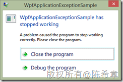
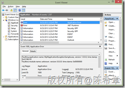
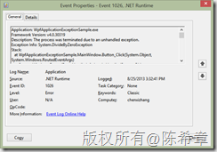
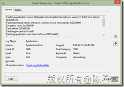
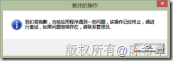

# 关于未捕获异常的处理(WPF) 
> 原文发表于 2013-08-25, 地址: http://www.cnblogs.com/chenxizhang/archive/2013/08/25/3280947.html 


这一篇文章来谈谈对于WPF应用程序开发中的未捕获异常的处理。

 首先，我们当然是要求应用程序开发人员，尽可能地在程序可能出现异常的地方都去捕捉异常，使用try…catch的方式。但是总是有一些意外的情况可能会发生，这就导致会出现所谓的“未捕获异常（UnhandledException）”。对于这一类异常，如果我们没有一个合适的策略进行处理，则当其发生的时候，会给用户带来不太好的使用体验。例如下面这样

 [](http://images.cnitblog.com/blog/9072/201308/25163859-e0afb8d3ceb64592b8c666af97942f8d.png)

 备注：这个截图是在Windows 8上面做的，其他操作系统看到的界面可能略有不同。

 用户看到这个窗口的时候，其实一般只能点击Close the prograrm按钮。也就是说，这种情况下会导致用户无法继续使用这个程序，而且他们还得不到任何具体的消息：到底发生了什么事情了？除非他们去查看Windows的事件日志。（但一般的用户是不太会这个操作的）

 [](http://images.cnitblog.com/blog/9072/201308/25163902-6e54b952bfd54e79836b9229b05f7b4c.png)

 我们可以看到在Windows事件日志中，会有两个具体的事件。首先是一个.NET Runtime的事件

 [](http://images.cnitblog.com/blog/9072/201308/25163905-d6733c3ac8fa4f658c4e7184e0646c7f.png)

 然后是一个Application Error的事件

 [](http://images.cnitblog.com/blog/9072/201308/25163911-1f6b90c53069450d9609935a4e1382be.png)

 通常来说，这样的用户体验有值得改进的地方。我们虽然不能防止异常的产生，但是当意外发生的时候，我们应该要以更好地方式地通知到用户，或者尽可能地不要影响用户当前的操作。

  

 在WPF这种应用程序中，会有两大类未处理异常：一类是在UI线程抛出来的，例如点击了用户界面上面的某个控件，然后执行某个代码的时候，遇到了异常；另一类是非UI线程跑出来的，例如在一个多线程的程序里面，工作线程的代码遇到了异常。

 对于UI线程的未处理异常，我们可以通过监控下面这个事件来处理

 Application.Current.DispatcherUnhandledException   <http://msdn.microsoft.com/en-us/library/system.windows.application.dispatcherunhandledexception.aspx>

 一个参考代码如下：


```
using System;
using System.Windows;

namespace WpfApplicationExceptionSample
{
    /// <summary>
    /// Interaction logic for App.xaml
    /// </summary>
    public partial class App : Application
    {
        public App()
        {
            Application.Current.DispatcherUnhandledException += Current\_DispatcherUnhandledException;
        }


        void Current\_DispatcherUnhandledException(object sender, System.Windows.Threading.DispatcherUnhandledExceptionEventArgs e)
        {
            MessageBox.Show("我们很抱歉，当前应用程序遇到一些问题，该操作已经终止，请进行重试，如果问题继续存在，请联系管理员.", "意外的操作", MessageBoxButton.OK, MessageBoxImage.Information);//这里通常需要给用户一些较为友好的提示，并且后续可能的操作

            e.Handled = true;//使用这一行代码告诉运行时，该异常被处理了，不再作为UnhandledException抛出了。
        }
    }
}

```


.csharpcode, .csharpcode pre
{
 font-size: small;
 color: black;
 font-family: consolas, "Courier New", courier, monospace;
 background-color: #ffffff;
 /*white-space: pre;*/
}
.csharpcode pre { margin: 0em; }
.csharpcode .rem { color: #008000; }
.csharpcode .kwrd { color: #0000ff; }
.csharpcode .str { color: #006080; }
.csharpcode .op { color: #0000c0; }
.csharpcode .preproc { color: #cc6633; }
.csharpcode .asp { background-color: #ffff00; }
.csharpcode .html { color: #800000; }
.csharpcode .attr { color: #ff0000; }
.csharpcode .alt 
{
 background-color: #f4f4f4;
 width: 100%;
 margin: 0em;
}
.csharpcode .lnum { color: #606060; }


运行的效果大致如下


[](http://images.cnitblog.com/blog/9072/201308/25163912-3504c9a8d4b8468c9755ed55303c1a91.png)


 


对于非UI线程抛出的未处理异常，我们需要监控另外一个事件来处理


AppDomain.CurrentDomain.UnhandledException  <http://msdn.microsoft.com/en-us/library/system.appdomain.unhandledexception.aspx> 


一个参考代码如下


```
using System;
using System.Windows;

namespace WpfApplicationExceptionSample
{
    /// <summary>
    /// Interaction logic for App.xaml
    /// </summary>
    public partial class App : Application
    {
        public App()
        {
            AppDomain.CurrentDomain.UnhandledException += CurrentDomain\_UnhandledException;
        }

        void CurrentDomain\_UnhandledException(object sender, UnhandledExceptionEventArgs e)
        {
            MessageBox.Show("我们很抱歉，当前应用程序遇到一些问题，该操作已经终止，请进行重试，如果问题继续存在，请联系管理员.", "意外的操作", MessageBoxButton.OK, MessageBoxImage.Information);
        }


    }
}

```

.csharpcode, .csharpcode pre
{
 font-size: small;
 color: black;
 font-family: consolas, "Courier New", courier, monospace;
 background-color: #ffffff;
 /*white-space: pre;*/
}
.csharpcode pre { margin: 0em; }
.csharpcode .rem { color: #008000; }
.csharpcode .kwrd { color: #0000ff; }
.csharpcode .str { color: #006080; }
.csharpcode .op { color: #0000c0; }
.csharpcode .preproc { color: #cc6633; }
.csharpcode .asp { background-color: #ffff00; }
.csharpcode .html { color: #800000; }
.csharpcode .attr { color: #ff0000; }
.csharpcode .alt 
{
 background-color: #f4f4f4;
 width: 100%;
 margin: 0em;
}
.csharpcode .lnum { color: #606060; }

 


令人不解的是，这个事件中没有和前面那个事件一样的e.Handled参数，就是说，虽然这样是可以捕捉到非UI线程的异常，而且也可以进行相应的处理，但是应用程序还是会退出，也就是说这个异常还是被当作是未处理异常继续汇报给Runtime。


为了改进这一点，我们可以通过修改配置文件来实现。


```
<?xml version="1.0" encoding="utf-8" ?>
<configuration>
 **<runtime>
 <legacyUnhandledExceptionPolicy enabled="1"/>
 </runtime>**
  <startup>
    <supportedRuntime version="v4.0" sku=".NETFramework,Version=v4.5" />
  </startup>
</configuration>
```

.csharpcode, .csharpcode pre
{
 font-size: small;
 color: black;
 font-family: consolas, "Courier New", courier, monospace;
 background-color: #ffffff;
 /*white-space: pre;*/
}
.csharpcode pre { margin: 0em; }
.csharpcode .rem { color: #008000; }
.csharpcode .kwrd { color: #0000ff; }
.csharpcode .str { color: #006080; }
.csharpcode .op { color: #0000c0; }
.csharpcode .preproc { color: #cc6633; }
.csharpcode .asp { background-color: #ffff00; }
.csharpcode .html { color: #800000; }
.csharpcode .attr { color: #ff0000; }
.csharpcode .alt 
{
 background-color: #f4f4f4;
 width: 100%;
 margin: 0em;
}
.csharpcode .lnum { color: #606060; }

 


这里的legacyUnhandledExceptionPolicy，如果enabled=1的话，用意是使用早期版本的异常处理策略。


