# SharePoint Server 2013开发之旅（二）：使用在线的开发人员网站进行SharePoint App开发 
> 原文发表于 2013-10-29, 地址: http://www.cnblogs.com/chenxizhang/archive/2013/10/29/3395046.html 

[上一篇](http://www.cnblogs.com/chenxizhang/p/3394652.html)我已经介绍了新版本的SharePoint Server提供了四种主要的开发场景，其中一个全新的App开发模型让我们眼前一亮。这一篇我将介绍如何在线进行SharePoint App开发。

 谈到SharePoint开发，有些经验的开发人员都会感慨要搭建一个开发环境并非易事，因为以前我们如果需要做这方面的开发，不仅仅需要安装专业的开发工具（主要是指Visual Studio），而且还必须安装SharePoint Server。结果嘛，你懂的。

 现在针对App的开发，可能将改变这个状况。也就是说，如果你仅仅需要做App的开发，那么你根本就不需要在开发环境中安装SharePoint，你只需要安装Visual Studio 2012以及一个小插件即可，甚至连这些都不要，完全在线开发。

 下面我还是分步骤地来说明一下这个环境如何配置吧

  

 第一步（必须）：你需要申请Office 365开发人员账号
=============================

 既然不想自己安装和部署完整的SharePoint环境，现在可以使用微软提供的office 365开发人员网站来进行App的开发（包括SharePoint App,也包括Office App），所以首先你必须申请一个Office 365账号。微软官方的文档请参考这里:[http://msdn.microsoft.com/en-us/library/fp179924.aspx](http://msdn.microsoft.com/en-us/library/fp179924.aspx "http://msdn.microsoft.com/en-us/library/fp179924.aspx") 

 很高兴地给大家介绍，微软为所有的开发人员都提供免费的试用版（为期1个月），而且申请试用版没有任何的条件，也无需提供信用卡等信息。如果想一直使用，则可以以$99/年的费用购买。开发人员网站是只能用于自己开发的

 [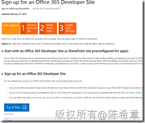](http://images.cnitblog.com/blog/9072/201310/29201147-e9fd9f104d6c42bf849954cf3d7502c7.png)

 

 账号申请之后，你会进入一个管理页面

 [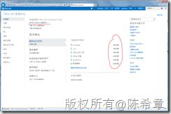](http://images.cnitblog.com/blog/9072/201310/29201154-b208c033fa8f4be8a10b4e1c44b39b4f.png)

 在确认所有服务的状态都是“没有问题”的前提下，可以点击顶部的“构建应用”链接，进入专门提供的“开发人员网站”

 [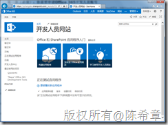](http://images.cnitblog.com/blog/9072/201310/29201159-6b2a50a0d27848539ddd5f90e9781f74.png)

 这样的话，服务端的SharePoint Online就准备好了。

  

 第二步（可选）：安装Visual Studio 2012和有关的插件
==================================

 Visual Studio一直是作为SharePoint的专业开发工具。针对SharePoint Server 2013，必须使用Visual Studio 2012专业版或者更高版本进行开发。

 默认情况下，Visual Studio 2012在安装的时候，并没有针对SharePoint Server 2013的有关模板，而是仅仅包含SharePoint Server 2010的有关模板（仅针对解决方案开发）。你需要安装下面这个插件，以便进行SharePoint Server 2013开发（包括App开发和传统的解决方案开发）

 <http://aka.ms/OfficeDevToolsForVS2012> 安装好之后，就可以看到有关SharePoint Server 2013的一些模板 [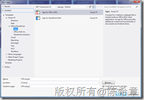](http://images.cnitblog.com/blog/9072/201310/29201201-8431881e5d5c4dc08d01adb278a48bc6.png) [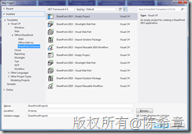](http://images.cnitblog.com/blog/9072/201310/29201204-c000d274e67247d5b85e1c7a0bba2de5.png) 下面我演示一个最简单的App开发和部署的过程（关于App开发的细节，典型的场景等等以后会有专门的文章介绍） 首先，创建一个新的项目 [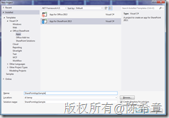](http://images.cnitblog.com/blog/9072/201310/29201208-4442f19da88b4cc798fee73f1309a398.png) 在接下来的窗口中输入你申请到的Office 365开发人员网站的地址，托管类型选择“SharePoint-host”，并且点击Validate，此时会有一个登录的页面，请输入你的账号和密码 [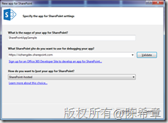](http://images.cnitblog.com/blog/9072/201310/29201209-782506e6191f49da97a322bcbec2bfff.png) 验证成功后，点击“Finish” 按钮，在Visual Studio中会得到下面这样一个项目结构 [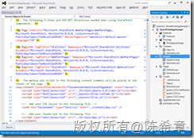](http://images.cnitblog.com/blog/9072/201310/29201212-4dd8b96596d747c39e44a00e3d84e3ab.png) App开发的典型场景之一就是以页面形式进行开发，结合了HTML5和Javascript的技术，实现与SharePoint Server和内容的交互。（具体功能以后我们会讨论）。 我们先不对这个项目做任何的修改，直接部署起来看看效果如何。选中解决方案，然后在右键菜单中选择“Deploy Solution”菜单，如果不出意外的话，很快就能部署成功。（这方面Visual Studio做得很到位） 然后我们回到开发人员网站，会看到一个新部署的App [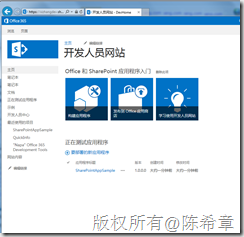](http://images.cnitblog.com/blog/9072/201310/29201216-be3622c641a8417486fd2f8ed797eb16.png) 如果我们去点击这个App，就会打开一个新的页面，如下图所示  这样我们的App就运行起来了。 【注意】这里我们可以留意一下地址栏中的那个地址，是很特殊的格式，大家先有一个印象，下一篇我们在配置自己的App服务器的时候，有一步是跟这个地址有关系。 [https://**xizhangdev**-ece5e3f97ecd25.**sharepoint.com**/**SharePointAppSample**/Pages/Default.aspx?SPHostUrl=https%3A%2F%2Fxizhangdev%2Esharepoint%2Ecom&SPLanguage=zh%2DCN&SPClientTag=0&SPProductNumber=16%2E0%2E2120%2E1226&SPAppWebUrl=https%3A%2F%2Fxizhangdev%2Dece5e3f97ecd25%2Esharepoint%2Ecom%2FSharePointAppSample](https://xizhangdev-ece5e3f97ecd25.sharepoint.com/SharePointAppSample/Pages/Default.aspx?SPHostUrl=https%3A%2F%2Fxizhangdev%2Esharepoint%2Ecom&SPLanguage=zh%2DCN&SPClientTag=0&SPProductNumber=16%2E0%2E2120%2E1226&SPAppWebUrl=https%3A%2F%2Fxizhangdev%2Dece5e3f97ecd25%2Esharepoint%2Ecom%2FSharePointAppSample "https://xizhangdev-ece5e3f97ecd25.sharepoint.com/SharePointAppSample/Pages/Default.aspx?SPHostUrl=https%3A%2F%2Fxizhangdev%2Esharepoint%2Ecom&SPLanguage=zh%2DCN&SPClientTag=0&SPProductNumber=16%2E0%2E2120%2E1226&SPAppWebUrl=https%3A%2F%2Fxizhangdev%2Dece5e3f97ecd25%2Esharepoint%2Ecom%2FSharePointAppSample") 也就是说，所有的App，其实都是共用了一个域名 sharepoint.com。但有一个特殊的前缀（你的站点标识，一个App序列号），并且有一个特殊的后缀（App的名称）。     第三步（可选）：在开发网站中启用Napa这个工具进行在线的开发
===============================

 我们已经看到在Visual Studio中可以很方便地进行开发和部署，但如果你不想安装这个工具，现在也有一个更加简单的选择。你可以直接使用开发网站中集成的一个Napa的工具进行在线的开发。

 首先，在开发网站中，选择“添加应用程序”

 [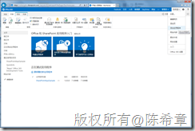](http://images.cnitblog.com/blog/9072/201310/29201223-0d952c7af0a64438bb1b392c63bfa154.png)

 在接下来的页面中选择“SharePoint 应用商店”

 [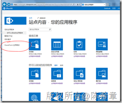](http://images.cnitblog.com/blog/9072/201310/29201228-c7b5fe1a10f743ceae53dbc472b90beb.png)

 请注意选择一个语言，然后点击“Napa” Office 365 Development Tools…”这个App

 [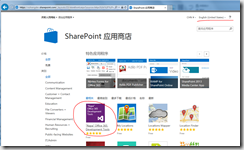](http://images.cnitblog.com/blog/9072/201310/29201234-063a92b7d0094b8d8cc064b96655bfd3.png)

 然后就可以添加这个App了

 [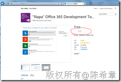](http://images.cnitblog.com/blog/9072/201310/29201238-7f6f652e72104346a81352ca946b1ca1.png)

 接下来我们看看如何利用Napa进行简单的App开发和部署。（同样的，一些技术细节并不会出现在这里，以后会有专门的文章）

 我们回到开发人员网站的首页，刚才添加的Napa开发工具会出现在导航区域中

 [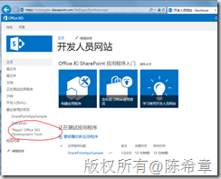](http://images.cnitblog.com/blog/9072/201310/29201241-43bced56bfcc4b0dbd8d8f92d9bbc648.png)

 点击这个链接，就可以打开Napa开发的页面

 [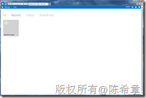](http://images.cnitblog.com/blog/9072/201310/29201244-ce41785c5ef14c79b5592ae30ef32d92.png)

 添加新项目

 [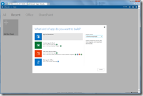](http://images.cnitblog.com/blog/9072/201310/29201247-48452c83cf7b4f7eae99e03a68b29535.png)

 我们可以看到和Visual Studio中差不多的一个项目结构，以及一个在线的编辑器

 [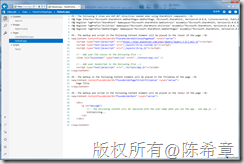](http://images.cnitblog.com/blog/9072/201310/29201253-e7112ecdc8da411692ca2d45342ce65a.png)

 Napa项目会默认提供对jquery的支持，而且有智能感知

 [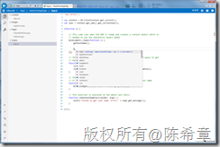](http://images.cnitblog.com/blog/9072/201310/29201257-859fe39229574d48951de731825f6acd.png)

 在这里我不准备对网页内容进行任何的修改，直接点击左侧的Run Project按钮

 [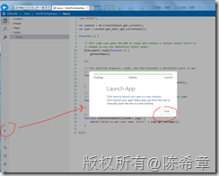](http://images.cnitblog.com/blog/9072/201310/29201303-3b82bd3dfecf42749891e21b62f7d574.png)

 部署成功之后，会自动打开这个App，如下图所示

 [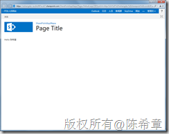](http://images.cnitblog.com/blog/9072/201310/29201306-75c88bf5421f416d99a2bf4958b748dd.png)

  

  

 到这里为止，我介绍了如何结合Office 365开发人员网站进行SharePoint App开发的步骤和简单效果。细节的功能开发后续我们再讨论。下一篇将介绍如何在企业内部的SharePoint服务器配置App开发环境。

