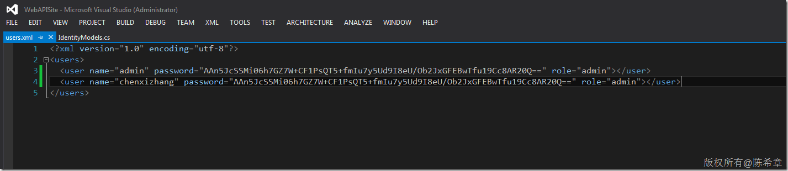
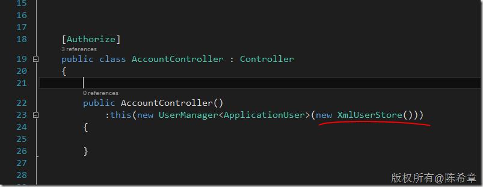

# WebAPI 2.x中如何扩展Identity Store 
> 原文发表于 2014-03-16, 地址: http://www.cnblogs.com/chenxizhang/archive/2014/03/16/3603011.html 


ASP.NET WebAPI 中引入了新的一套身份验证和授权的机制，官方的叫法是ASP.NET Identity，有关这个概念的细节，感兴趣的同学可以参考 [http://www.asp.net/identity](http://www.asp.net/identity "http://www.asp.net/identity")

 这套新的机制，默认还是使用SQL Server来做身份保存的，但更多的是提供了灵活性，包括与外部验证系统（OAuth）的整合。但在一些较为简单的场合下，我们可能希望简化这个部分，例如我们不需要外部整合，而且我们的用户数也相对有限，不希望用数据库来实现。

 本文提供了一个实例，我是使用XML文件的方式来保存用户信息的，该文件的格式大致如下

 [](http://images.cnitblog.com/blog/9072/201403/160900217938368.png)

  

 然后，我编写了一个自定义的类型，实现了一些主要的方法


```
    public class XmlUserStore : IUserStore<ApplicationUser>,IUserPasswordStore<ApplicationUser>,IRoleStore<IdentityRole>
    {

        private string filePath = HttpContext.Current.Server.MapPath("~/app\_data/users.xml");


        public Task CreateAsync(ApplicationUser user)
        {
            throw new System.NotImplementedException();
        }

        public Task DeleteAsync(ApplicationUser user)
        {
            throw new System.NotImplementedException();
        }

        public Task<ApplicationUser> FindByIdAsync(string userId)
        {
            return FindByNameAsync(userId);
        }

        public Task<ApplicationUser> FindByNameAsync(string userName)
        {

            var doc = XDocument.Load(filePath);
            var found = doc.Root.Elements("user").FirstOrDefault(x => x.Attribute("name").Value == userName);
            ApplicationUser user = null;
            if (found != null)
            {
                user = new ApplicationUser()
                {
                    UserName = userName,
                    Id = userName,
                    PasswordHash = found.Attribute("password").Value
                };
            }

            return Task<ApplicationUser>.FromResult(user);
        }

        public Task UpdateAsync(ApplicationUser user)
        {
            return Task.FromResult(0);
        }

        public void Dispose()
        {
        }

        public Task<string> GetPasswordHashAsync(ApplicationUser user)
        {
            var result = string.Empty;
            if (user != null)
                result = user.PasswordHash;

            return Task<string>.FromResult(result);
        }

        public Task<bool> HasPasswordAsync(ApplicationUser user)
        {
            throw new System.NotImplementedException();
        }

        public Task SetPasswordHashAsync(ApplicationUser user, string passwordHash)
        {
            var doc = XDocument.Load(filePath);
            var found = doc.Root.Elements("user").FirstOrDefault(x => x.Attribute("name").Value ==user.UserName);

            if(found!=null)
            {
                found.Attribute("password").Value = passwordHash;
                doc.Save(filePath);

                return Task.FromResult(1);
            }

            return Task.FromResult(0);
        }


        public Task CreateAsync(IdentityRole role)
        {
            throw new System.NotImplementedException();
        }

        public Task DeleteAsync(IdentityRole role)
        {
            throw new System.NotImplementedException();
        }

        Task<IdentityRole> IRoleStore<IdentityRole>.FindByIdAsync(string roleId)
        {
            throw new System.NotImplementedException();
        }

        Task<IdentityRole> IRoleStore<IdentityRole>.FindByNameAsync(string roleName)
        {
            throw new System.NotImplementedException();
        }

        public Task UpdateAsync(IdentityRole role)
        {
            throw new System.NotImplementedException();
        }
    }
```

.csharpcode, .csharpcode pre
{
 font-size: small;
 color: black;
 font-family: consolas, "Courier New", courier, monospace;
 background-color: #ffffff;
 /*white-space: pre;*/
}
.csharpcode pre { margin: 0em; }
.csharpcode .rem { color: #008000; }
.csharpcode .kwrd { color: #0000ff; }
.csharpcode .str { color: #006080; }
.csharpcode .op { color: #0000c0; }
.csharpcode .preproc { color: #cc6633; }
.csharpcode .asp { background-color: #ffff00; }
.csharpcode .html { color: #800000; }
.csharpcode .attr { color: #ff0000; }
.csharpcode .alt 
{
 background-color: #f4f4f4;
 width: 100%;
 margin: 0em;
}
.csharpcode .lnum { color: #606060; }

 


接下来，我们要在AccountController中使用这个新的UserStore的类型。


[](http://images.cnitblog.com/blog/9072/201403/160900233405394.png)

