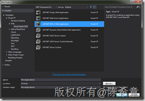
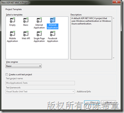
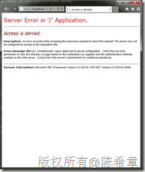
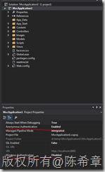
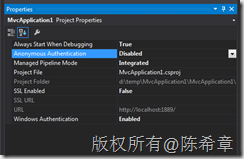
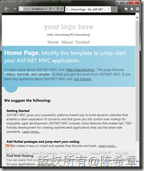

# ASP.NET MVC 4.0中选择Windows 验证默认出错拒绝访问的原因和解决方案 
> 原文发表于 2014-04-21, 地址: http://www.cnblogs.com/chenxizhang/archive/2014/04/21/3679059.html 

在VS 2012或者2013 中，根据模板创建一个ASP.NET MVC 4.0的应用程序，选择下面的模板

 

 然后选择Intranet Application

 

 不对源代码做任何修改，直接按下F5调试，会遇到如下的错误

 

 这个问题的原因是在于Visual Studio自带的Web Server或者IIS Express没有配置支持Windows验证。选中项目，然后按下F4，查看属性

 

 所以解决方案就是启用Windows验证，禁用匿名登陆，如下

 

 然后，整个世界就清静了

 

